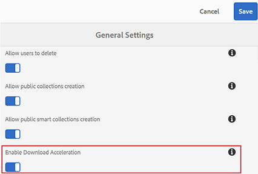
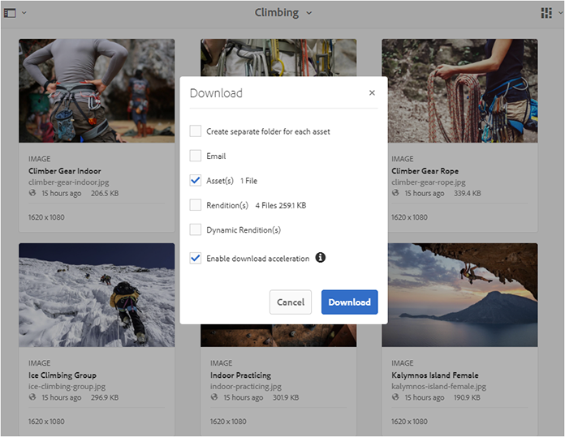
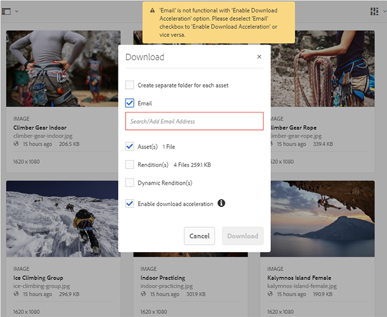
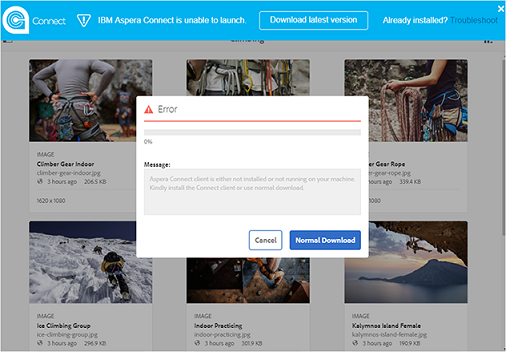
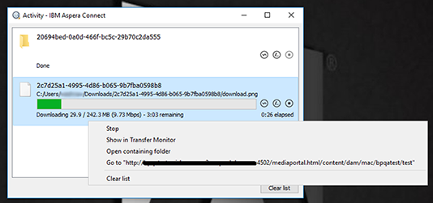
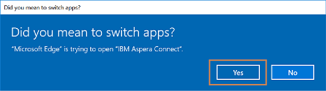
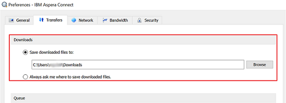
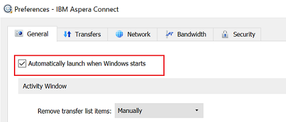

# ブランドポータルのダウンロードの高速化 {#guide-to-accelerate-downloads-from-brand-portal}

Brand Portal allows enhancing the download performance of large asset files by integrating with IBM Aspera Connect, which is an install-on-demand application. The application uses proprietary technology to remove TCP overheads and helps improve transfer speed of the asset files. This integration ensures enhanced download experience.

>[!NOTE]
>
>ダウンロード速度は、ネットワーク帯域幅、サーバーの遅延、クライアントの地理的な場所などの要因によって異なるので、ユーザーによって異なります。

この設定が有効化されている場合、Brand Portal ユーザーは、Aspera Connect クライアントをインストールして、Brand Portal または共有リンクから希望するアセットファイルをダウンロードするのにかかる時間を大幅に短縮できます。

## ファイルのダウンロードを高加速化するための前提条件 {#prerequisites-to-accelerate-file-download}

ファイルのダウンロードを高速化するには、次の点を確認します。

* **[!UICONTROL 管理ツールパネルの]** 「一般設定」から「アクセラレーションをダ [!UICONTROL ウンロード] 」（デフォルトで無効）を有効にします。
* ポート33001 （TCPとUDPの両方）がファイアウォールで開いています。 前提条件について詳しくは、Aspera Connect clientのドキュメント [を参照してください](https://downloads.asperasoft.com/en/documentation/8)。
* 管理者権限を使用してAspera Connectをインストールします。
* For platform support of Aspera transfer client, see [Aspera Connect platform support matrix](https://www.asperasoft.com/company/support/transfer-clients/).

## ドメインのダウンロード {#download-domains}

様々な地域で利用できるダウンロードドメインを以下に示します。

| 地域コード | ドメイン |
|---|---|
| NA OR1 | downloads-na1.brand-portal.adobe.com |
| NA VA5 | downloads-na2.brand-portal.adobe.com |
| EMEA LON5 | downloads-emea1.brand-portal.adobe.com |
| APAC SIN2 | downloads-apac1.brand-portal.adobe.com |

## Sample download performance using file accelerator {#expected-download-performance-using-file-accelerator}

次の表に、Aspera Connectファイルダウンロードアクセラレータを使用した2 GBファイルのダウンロードパフォーマンスを示します。

*ブ&#x200B;*ランドポータルサーバがオレゴン（米国）にあることを考慮すると、ネットワーク帯域幅、サーバの遅延、クライアントの場所などの要因によって、観測される結果は異なります。*

| クライアントの場所 | クライアントとサーバーの間のレイテンシ (ミリ秒) | Speed with Aspera Connect File Transfer Accelerator (MBps) | Aspera File Transfer Acceleratorを使用した2 GBのファイルのダウンロードに要する時間（秒） |
|---------------------------|-----------------------------------|---------------------------------------------|-------------------------------------------------------------------------|
| 米国西部（北カリフォルニア） | 18 | 36 | 57 |
| 米国西部（オレゴン） | 42 | 36 | 57 |
| 米国東部（北バージニア） | 85 | 35 | 58 |
| APAC（東京） | 124 | 36 | 57 |
| 野井田（インド） | 275 | 13.36 | 153 |
| シドニー | 175 | 29 | 70 |
| ロンドン | 179 | 35 | 58 |
| シンガポール | 196 | 34 | 60 |

## ファイルアクセラレーターを使用したダウンロードワークフロー {#download-workflow-using-file-accelerator}

Brand Portal より早くアセットをダウンロードするには：

1. サポートされているブラウザーを使用してBrand portalにログインします。
1. ダウンロードする目的のアセットファイル、フォルダー、またはコレクションを参照および選択します。ダウンロードオプションをタップまたはクリックします。「[ダウンロードアクセラレーションを有効化]」オプションが選択されたダウンロードダイアログが表示されます。
   

   >[!NOTE]
   >
   >高速ダウンロードが有効になっているときに、アセットをダウンロードするためのリンクが入った電子メールを送信する機能は、現在サポートされていません。

   

1. Tap/click the **[!UICONTROL Download]** option.
Brand Portal テナントアカウントでのダウンロードエクスペリエンスを高速化するには、お使いのシステムに Aspera Connect クライアントアプリケーションをインストールする必要があります。

1. **Aspera Connect クライアントをダウンロードします。**

If Aspera Connect client is not installed on your system or the existing installed Aspera Connect client is out of date, a prompt is displayed on browser page from where you can download the system-specific Aspera Connect client by selecting **[!UICONTROL Download Latest Version]**.

   

   To download the latest version of Aspera Connect from [https://downloads.asperasoft.com/connect2/](https://downloads.asperasoft.com/connect2/), select **[!UICONTROL Download Now]** and follow the instructions.

1. **Aspera Connect クライアントのインストール**
IBM Aspera Connect クライアントセットアップをインストールするには、IBM Aspera Connect クライアントアプリケーションの .msi ファイルからセットアップを実行し、インストールウィザードに従います。

1. クライアントを正常にインストールしたら、ブラウザーページを更新してダウンロード手順を再開開始するか、アセットの&#x200B;**[!UICONTROL ダウンロード]**&#x200B;ダイアログボックスの「**再起動]」を選択します（手順 2）。[!UICONTROL ** When using Aspera Connect for the first time, the browser prompts to open the link using **[!UICONTROL IBM Aspera Connect]**. To skip this dialog in future, enable **[!UICONTROL Remember my choice for FASP links]**.

   >[!NOTE]
   >
   >実際のメッセージは、ブラウザーによって異なります。

1. 転送を続けるかどうかを確認するダイアログボックスが表示されます。「**[!UICONTROL Allow]」を選択して開始します。** To skip this dialog in future, enable **[!UICONTROL Use my choice for all connections with this host]**.
ダウンロードが開始します。ダイアログボックスに、ダウンロードの進行状況が表示されます。Use the dialog box to **[!UICONTROL pause]**, **[!UICONTROL resume]**, or **[!UICONTROL cancel]** the download.
Aspera Connect アプリケーションは、システム上にアクティビティウィンドウを提供します。ユーザーはこのウィンドウからすべての転送セッションを表示および管理することができます。詳しくは、[Aspera Connect Client のドキュメント](https://downloads.asperasoft.com/en/documentation/8)を参照してください。

ダウンロードが正常に完了すると、ユーザーのシステム上にある、アセットのダウンロード先がダイアログボックスに表示されます。問題が発生した場合は、エラーが表示されます。

>[!NOTE]
>
>There is a known limitation in Aspera Connect client application that no prompt to select download location appears if **[!UICONTROL Always ask me where to save downloaded files]** is enabled under the tab [!UICONTROL Transfers] within [!UICONTROL Preferences]. Before any download begins, provide the location in the text box **[!UICONTROL Save downloaded files to]**.

## Microsoft Edge ブラウザーでのファイルアクセラレーターの使用 {#using-file-accelerator-on-microsoft-edge-browser}

Microsoft Edge は拡張保護モード（EPM）で実行され、同じプライベートネットワーク上にあるとき、または信頼済みサイトとの通信時に、Aspera Connect サーバーとの通信を防ぎます。そのため、サーバーとの接続を確立するたびにポップアップが表示されます。

Microsoft Edge で高速ダウンロード機能を使用するには、信頼済みサイトのリストゾーンから Brand Portal サイトを削除します。

1. Open the Control Panel (press **[!UICONTROL Window key + X]**, then select **[!UICONTROL Control Panel]**).
1. Go to **[!UICONTROL Network and Internet &gt; Internet Options]**. 「**[!UICONTROL セキュリティ]」タブをクリックします。**
1. Click the **[!UICONTROL Trusted sites zone]**, then click **[!UICONTROL Sites]**.
1. リストから Brand Portal サイトを削除します。

## Aspera Connect クライアントの環境設定 {#aspera-connect-client-preferences}

There are a few useful preferences which can be set in IBM Aspera Connect Client preference by right clicking the icon and selecting **[!UICONTROL Preferences]**.

デフォルトのダウンロード場所を設定できます。

また、接続クライアントを実行して素早くダウンロードを始められるよう、システム起動時に Aspera Connect クライアントを自動的に開始するようマークすることもできます。

## ダウンロードアクセラレーションに関する問題のトラブルシューティング {#troubleshoot-issues-with-download-acceleration}

ダウンロードアクセラレーションが機能しない場合は、次の手順に従ってトラブルシューティングをおこなってください。

1. Check that ports are not blocked, by visiting [https://test-connect.asperasoft.com](https://test-connect.asperasoft.com/) from your machine.

   ポートに問題がある場合は、ネットワークチームに連絡して、ポート 33001（TCP と UDP の両方）がファイアウォールでブロックされていないことを確認します。

1. ポートに問題がない場合は、[/](https://www.speedtest.net/)https://www.speedtest.net/ を使用して使用可能な帯域幅を測定し、ネットワークが低速になっていないかどうかを確認します。

   帯域幅が少ない（1～10 Mbps）または Kbps 単位の場合、Aspera の環境設定を使用して、利用可能な帯域幅と同じ帯域幅に制限してみてください。

1. Aspera デモサーバーからのダウンロードが機能しているかどうかを確認するには、https://demo.asperasoft.com/aspera/user を使用します。\
   （ログイン名：asperaweb、パスワード：demoaspera）

1. 上記のトラブルシューティング手順がいずれも機能しない場合は、「ダウンロードアクセラレーションを有効化」オプションの選択を解除して、通常のダウンロードを使用します。
