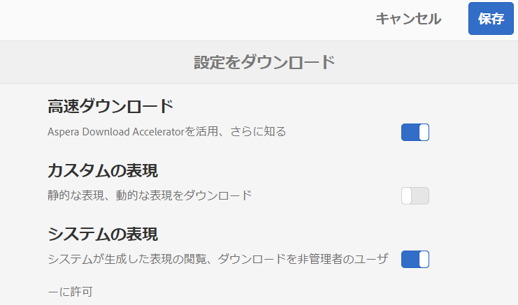

# Brand Portal のダウンロードの高速化 {#guide-to-accelerate-downloads-from-brand-portal}

Brand Portal では、インストールオンデマンドアプリケーションである IBM Aspera Connect との連携により、大きなアセットファイルのダウンロードパフォーマンスを強化できます。このアプリケーションは、TCP オーバーヘッドをなくす独自のテクノロジーを使用し、アセットファイルの転送速度を向上させます。この連携により、ダウンロードエクスペリエンスを確実に強化できます。

>[!NOTE]
>
>ダウンロード速度は、ネットワーク帯域幅、サーバーのレイテンシ、クライアントの所在地などの要因によって異なるので、ユーザーごとに異なります。

「 **[!UICONTROL 高速ダウンロード]** 」設定はデフォルトで有効になっているので、Brand Portalから目的のアセットファイルをダウンロードするのにかかる時間が大幅に短縮されます。

## ファイルのダウンロードを高加速化するための前提条件 {#prerequisites-to-accelerate-file-download}

ファイルのダウンロードを高速化するには、必ず以下をおこないます。

* **[!UICONTROL ツール]** / **[!UICONTROL ダウンロードに移動し]** 、Download Settingsダウンロード設定で ********&#x200B;高速ダウンロード設定が有効になっていることを確認します。
* ファイアウォールのポート 33001（TCP と UDP の両方）を開きます。前提条件について詳しくは、[Aspera Connect Client のドキュメント](https://downloads.asperasoft.com/en/documentation/8)を参照してください。
* 管理者権限を使用して Aspera Connect をインストールします。
* Aspera 転送クライアントのプラットフォームサポートについては、[Aspera Connect プラットフォームサポート一覧表](https://www.asperasoft.com/company/support/transfer-clients/)を参照してください。

## ダウンロードドメイン {#download-domains}

様々な地域で利用できるダウンロードドメインを以下に示します。

| 地域コード | ドメイン |
|---|---|
| NA OR1 | downloads-na1.brand-portal.adobe.com |
| NA VA5 | downloads-na2.brand-portal.adobe.com |
| EMEA LON5 | downloads-emea1.brand-portal.adobe.com |
| APAC SIN2 | downloads-apac1.brand-portal.adobe.com |

## ファイルアクセラレーターを使用した場合のダウンロードパフォーマンス例 {#expected-download-performance-using-file-accelerator}

ファイルダウンロードアクセラレーター Aspera Connect を使用した場合の 2 GB ファイルのダウンロードパフォーマンスを次の表に示します。

*Brand Portal サーバーがオレゴン州（米国）にあることを考慮すると、ネットワーク帯域幅、サーバーのレイテンシ、クライアントの所在地などの要因によって測定結果は異なります。*

| クライアントの場所 | クライアントとサーバーの間のレイテンシ（ミリ秒） | Aspera Connect ファイル転送アクセラレーターを使用した場合の速度（MBps） | Aspera ファイル転送アクセラレーターを使用した場合の 2 GB ファイルのダウンロード所要時間（秒） |
|---------------------------|-----------------------------------|---------------------------------------------|-------------------------------------------------------------------------|
| 米国西部（北カリフォルニア） | 18 | 36 | 57 |
| 米国西部（オレゴン） | 42 | 36 | 57 |
| 米国東部（北バージニア） | 85 | 35 | 58 |
| APAC（東京） | 124 | 36 | 57 |
| ノイダ（インド） | 275 | 13.36 | 153 |
| シドニー | 175 | 29 | 70 |
| ロンドン | 179 | 35 | 58 |
| シンガポール | 196 | 34 | 60 |

## ファイルアクセラレーターを使用したダウンロードワークフロー {#download-workflow-using-file-accelerator}

Brand Portal より早くアセットをダウンロードするには：

1. サポートされているブラウザーを使用して Brand Portal にログインします。
1. ダウンロードするフォルダーまたはアセットを参照して選択します。 上部のツールバーで「**[!UICONTROL ダウンロード]**」アイコンをクリックします。**[!UICONTROL ダウンロード]** ダイアログが表示され、デフォルトでは、「 **[!UICONTROL アセット]** 」チェックボックスと「ダウンロードの加速を **[!UICONTROL 有効にする]** 」チェックボックスがオンになっています。

   

   >[!NOTE]
   >
   >高速ダウンロードが有効になっているときに、アセットをダウンロードするためのリンクが入った電子メールを送信する機能は、現在サポートされていません。

   

1. 「**[!UICONTROL ダウンロード]**」をクリックします。

   Brand Portalテナントアカウントでのダウンロードを高速化するには、ブラウザーの拡張機能にAspera Connectクライアントアプリケーションをインストールする必要があります。

1. **Aspera Connect クライアントをダウンロードします。**

   If Aspera Connect client is not installed on your system or the existing Aspera Connect client is out of date, a prompt is displayed on the browser page from where you can download the system-specific Aspera Connect client by selecting **[!UICONTROL Download Latest Version]**.

   

   最新バージョンの Aspera Connect を [https://downloads.asperasoft.com/connect2/](https://downloads.asperasoft.com/connect2/) からダウンロードするには、「**[!UICONTROL 今すぐダウンロード]**」をクリックして画面の指示に従います。

1. **Aspera Connect Clientのインストール**

   IBM Aspera Connectクライアントセットアップをインストールするには、IBM Aspera Connectクライアントアプリケーションの.msiファイルからセットアップを実行し、インストールウィザードに従います。

1. クライアントが正常にインストールされたら、ブラウザーページを更新し、ダウンロード手順を再開します。

   Aspera Connect を初めて使用する場合、ブラウザーには、**[!UICONTROL IBM Aspera Connect]** を使用してリンクを開くように促すメッセージが表示されます。今後このダイアログをスキップするには、「**[!UICONTROL Remember my choice for FASP links]**」を有効にします。

   >[!NOTE]
   >
   >実際のメッセージは、ブラウザーによって異なります。

1. 転送を続けるかどうかを確認するダイアログボックスが表示されます。「**[!UICONTROL Allow]**」を選択して開始します。
今後このダイアログを表示しない場合は、「**[!UICONTROL Use my choice for all connections with this host]**」を有効にします。ダウンロードが開始します。ダイアログボックスに、ダウンロードの進行状況が表示されます。このダイアログボックスを使用すると、ダウンロードの&#x200B;**[!UICONTROL 一時停止]**、**[!UICONTROL 再開]**、**[!UICONTROL キャンセル]**をおこなえます。
Aspera Connect アプリケーションは、システム上にアクティビティウィンドウを提供します。ユーザーはこのウィンドウからすべての転送セッションを表示および管理することができます。詳しくは、[Aspera Connect Client のドキュメント](https://downloads.asperasoft.com/en/documentation/8)を参照してください。

ダウンロードが正常に完了すると、ユーザーのシステム上にある、アセットのダウンロード先がダイアログボックスに表示されます。問題が発生した場合は、エラーが表示されます。

>[!NOTE]
>
>Aspera Connect クライアントアプリケーションには、**[!UICONTROL 環境設定]**&#x200B;の「**[!UICONTROL 転送]**」タブで「**[!UICONTROL ダウンロードしたファイルの保存先を毎回確認する]**」が有効になっている場合、ダウンロード場所を選択するプロンプトが表示されないという既知の制限があります。ダウンロードを開始する前に、「**[!UICONTROL Save downloaded files to]**」テキストボックスに場所を指定してください。

## Microsoft Edge ブラウザーでのファイルアクセラレーターの使用 {#using-file-accelerator-on-microsoft-edge-browser}

Microsoft Edge は拡張保護モード（EPM）で実行され、同じプライベートネットワーク上にあるとき、または信頼済みサイトとの通信時に、Aspera Connect サーバーとの通信を防ぎます。そのため、サーバーとの接続を確立するたびにポップアップが表示されます。

Microsoft Edge で高速ダウンロード機能を使用するには、信頼済みサイトのリストゾーンから Brand Portal サイトを削除します。

1. Open the Control Panel (**[!UICONTROL Window key + X]**, then select **[!UICONTROL Control Panel]**).
1. Go to **[!UICONTROL Network and Internet]** > **[!UICONTROL Internet Options]**. 「**[!UICONTROL セキュリティ]**」タブをクリックします。
1. 「**[!UICONTROL 信頼済みサイトゾーン]**」、「**[!UICONTROL サイト]**」の順にクリックします。
1. リストから Brand Portal サイトを削除します。

## Aspera Connect クライアントの環境設定 {#aspera-connect-client-preferences}

アイコンを右クリックし、「**[!UICONTROL 環境設定]**」を選択して IBM Aspara Connect クライアント環境設定で指定できる、便利な環境設定がいくつかあります。

デフォルトのダウンロード場所を設定できます。

また、接続クライアントを実行して素早くダウンロードを始められるよう、システム起動時に Aspera Connect クライアントを自動的に開始するようマークすることもできます。

## ダウンロードアクセラレーションに関する問題のトラブルシューティング {#troubleshoot-issues-with-download-acceleration}

ダウンロードアクセラレーションが機能しない場合は、次の手順に従ってトラブルシューティングをおこなってください。

1. お使いのコンピューターから [https://test-connect.asperasoft.com/](https://test-connect.asperasoft.com/) にアクセスして、そのポートがブロックされていないことを確認します。

   ポートに問題がある場合は、ネットワークチームに連絡して、ポート 33001（TCP と UDP の両方）がファイアウォールでブロックされていないことを確認します。

1. ポートに問題がない場合は、[https://www.speedtest.net/](https://www.speedtest.net/) を使用して使用可能な帯域幅を測定し、ネットワークが低速になっていないかどうかを確認します。

   帯域幅が少ない（1～10 Mbps）または Kbps 単位の場合、Aspera の環境設定を使用して、利用可能な帯域幅と同じ帯域幅に制限してみてください。

1. Aspera デモサーバーからのダウンロードが機能しているかどうかを確認するには、[https://demo.asperasoft.com/aspera/user](https://demo.asperasoft.com/aspera/user) を使用します。\
   （ログイン名：asperaweb、パスワード：demoaspera）

1. 上記のトラブルシューティング手順がいずれも機能しない場合は、「ダウンロードアクセラレーションを有効化」オプションの選択を解除して、通常のダウンロードを使用します。
