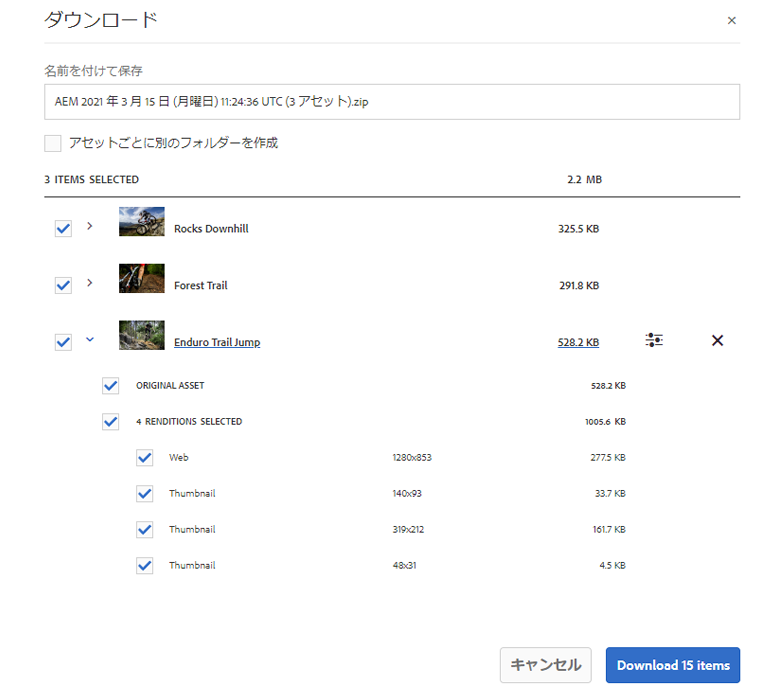
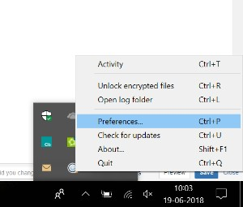

# Brand Portal のダウンロードの高速化 {#guide-to-accelerate-downloads-from-brand-portal}

Adobe Experience Manager Assets Brand Portal では、インストールオンデマンドアプリケーションである IBM Aspera Connect との連携により、大きなアセットファイルのダウンロードパフォーマンスを強化できます。このアプリケーションは、TCP オーバーヘッドをなくす独自のテクノロジーを使用し、アセットファイルの転送速度を向上させます。この連携により、ダウンロードエクスペリエンスを確実に強化できます。

>[!NOTE]
>
>ダウンロード速度は、ネットワーク帯域幅、サーバーのレイテンシ、クライアントの所在地などの要因によって異なるので、ユーザーごとに異なります。

「**[!UICONTROL 高速ダウンロード]**」設定はデフォルトで有効になっているので、Brand Portal から目的のアセットファイルをダウンロードするのにかかる時間が大幅に短縮されます。

## ファイルのダウンロードを高加速化するための前提条件 {#prerequisites-to-accelerate-file-download}

ファイルのダウンロードを高速化するには、必ず以下をおこないます。

* **[!UICONTROL ツール]**／**[!UICONTROL ダウンロード]**&#x200B;に移動し、**[!UICONTROL ダウンロード設定]**&#x200B;で、「**[!UICONTROL 高速ダウンロード]**」設定が有効になっていることを確認します。
* ファイアウォールのポート 33001（TCP と UDP の両方）が開いていることを確認します。前提条件について詳しくは、[IBM Aspera Connect Client のドキュメント](https://downloads.asperasoft.com/en/documentation/8)を参照してください。
* 管理者権限を使用して、ブラウザーの拡張機能に [IBM Aspera Connect 3.9.9 をインストール](https://www.ibm.com/support/knowledgecenter/SSXMX3_3.9.9/kc/connect_welcome.html)します。
* Aspera 転送クライアントのプラットフォームサポートについては、[IBM Aspera Connect プラットフォームサポート一覧表](https://www.asperasoft.com/company/support/transfer-clients/)を参照してください。

## ダウンロードドメイン {#download-domains}

様々な地域で利用できるダウンロードドメインを以下に示します。

| 地域コード | ドメイン |
|---|---|
| NA OR1 | downloads-na1.brand-portal.adobe.com |
| NA VA5 | downloads-na2.brand-portal.adobe.com |
| EMEA LON5 | downloads-emea1.brand-portal.adobe.com |
| APAC SIN2 | downloads-apac1.brand-portal.adobe.com |

## ファイルアクセラレーターを使用した場合のダウンロードパフォーマンス例 {#expected-download-performance-using-file-accelerator}

ファイルダウンロードアクセラレーター Aspera Connect を使用した場合の 2 GB ファイルのダウンロードパフォーマンスを次の表に示します。

*Brand Portal サーバーがオレゴン州（米国）にあることを考慮すると、ネットワーク帯域幅、サーバーのレイテンシ、クライアントの所在地などの要因によって測定結果は異なります。*

| クライアントの場所 | クライアントとサーバーの間のレイテンシ（ミリ秒） | Aspera Connect ファイル転送アクセラレーターを使用した場合の速度（MBps） | Aspera ファイル転送アクセラレーターを使用した場合の 2 GB ファイルのダウンロード所要時間（秒） |
|---------------------------|-----------------------------------|---------------------------------------------|-------------------------------------------------------------------------|
| 米国西部（北カリフォルニア） | 18 | 36 | 57 |
| 米国西部（オレゴン） | 42 | 36 | 57 |
| 米国東部（北バージニア） | 85 | 35 | 58 |
| APAC（東京） | 124 | 36 | 57 |
| ノイダ（インド） | 275 | 13.36 | 153 |
| シドニー | 175 | 29 | 70 |
| ロンドン | 179 | 35 | 58 |
| シンガポール | 196 | 34 | 60 |

## ファイルアクセラレーターを使用したダウンロードワークフロー {#download-workflow-using-file-accelerator}

Brand Portal より早くアセットをダウンロードするには：

1. Brand Portal テナントにログインします。デフォルトで「**[!UICONTROL ファイル]**」ビューが開き、公開中のアセットとフォルダーがすべて表示されます。

   次のいずれかの操作をおこないます。

   * ダウンロードするアセットまたはフォルダーを選択します。上部のツールバーで「**[!UICONTROL ダウンロード]**」アイコンをクリックします。

      

   * アセットの特定のアセットレンディションをダウンロードするには、該当するアセットにポインターを置き、クイックアクションサムネールに表示される「**[!UICONTROL ダウンロード]**」アイコンをクリックします。

      

1. 選択したすべてのアセットが一覧表示される&#x200B;**[!UICONTROL ダウンロード]**&#x200B;ダイアログが開きます。

   アセットをダウンロードする際に Brand Portal のフォルダー階層を保持するには、「**[!UICONTROL アセットごとに別のフォルダーを作成]**」チェックボックスをオンにします。

   ダウンロードボタンは、選択した項目の数を反映しています。ルールの適用が完了したら、「**[!UICONTROL 項目をダウンロード]**」をクリックします。ルールの適用方法について詳しくは、[アセットのダウンロード](../using/brand-portal-download-assets.md#download-assets)を参照してください。

   

1. デフォルトでは「**[!UICONTROL ダウンロード設定]**」の「**[!UICONTROL 高速ダウンロード]**」設定が有効になっています。したがって、IBM Aspera Connect を使用してアセットをダウンロードするための確認ボックスが表示されます。

   初めてアセットをダウンロードするときに、IBM Aspera Connect がブラウザーにインストールされていない場合や既存のバージョンが古い場合は、[Aspera ダウンロードアクセラレーターをインストール](https://www.ibm.com/support/knowledgecenter/SSXMX3_3.9.9/kc/connect_welcome.html)するように求めるプロンプトが表示されます。

   

1. **Aspera Connect クライアントをインストールします**

   IBM Aspera Connect クライアントセットアップをインストールするには、IBM Aspera Connect クライアントアプリケーションの .msi ファイルからセットアップを実行し、インストールウィザードに従います。

   

1. クライアントが正常にインストールされたら、ブラウザーページを更新し、ダウンロード手順を再開します。

1. 「**[!UICONTROL 高速ダウンロード]**」を引き続き使用するには、「**[!UICONTROL 許可]**」をクリックします。選択したすべてのレンディションが、IBM Aspera Connect を使用して zip フォルダーにダウンロードされます。

   ダウンロードが正常に完了すると、ユーザーのシステム上にある、アセットのダウンロード先がダイアログボックスに表示されます。

   

   IBM Aspera Connect を使用しない場合は、「**[!UICONTROL 拒否]**」をクリックします。「**[!UICONTROL 高速ダウンロード]**」が拒否された場合や失敗した場合は、エラーメッセージが表示されます。「**[!UICONTROL 通常のダウンロード]**」ボタンをクリックして、アセットのダウンロードを続行します。

>[!NOTE]
>
>管理者が「**[!UICONTROL 高速ダウンロード]**」設定をオフにした場合、選択したレンディションは、IBM Aspera Connect を使用せずに、zip フォルダーに直接ダウンロードされます。

<!-- 
On successful completion of the download, a dialog box shows the location where assets are downloaded onto the user's system. If there is a failure, it shows error.

   >[!NOTE]
   >
   >There is a known limitation in Aspera Connect client application that no prompt to select download location appears if **[!UICONTROL Always ask me where to save downloaded files]** is enabled under the tab **[!UICONTROL Transfers]** within **[!UICONTROL Preferences]**. Before any download begins, provide the location in the text box **[!UICONTROL Save downloaded files to]**.

1. Log in to Brand Portal using a supported browser.
1. Browse and select the folders or assets you want to download. From the toolbar at the top, click the **[!UICONTROL Download]** icon. the **[!UICONTROL Download]** dialog appears with the **[!UICONTROL Asset(s)]** and **[!UICONTROL Enable download acceleration]** check boxes selected by default. 

   

   >[!NOTE]
   >
   >The functionality to send email notification with the link to download assets is presently not supported while faster downloads are enabled.

   

1. Click **[!UICONTROL Download]**.

   To speed up the download experience on your Brand Portal tenant account, you need to have Aspera Connect client application installed in your browser's extension.

1. **Download Aspera Connect Client**

   If Aspera Connect client is not installed on your system or the existing Aspera Connect client is out of date, a prompt is displayed on the browser page from where you can download the system-specific Aspera Connect client by selecting **[!UICONTROL Download Latest Version]**.

   

   To download the latest version of Aspera Connect from [https://downloads.asperasoft.com/connect2/](https://downloads.asperasoft.com/connect2/), select **[!UICONTROL Download Now]** and follow the instructions.

1. **Install Aspera Connect Client**

   To install IBM Aspera Connect client setup, run the setup from  .msi  file of IBM Aspera Connect client application and follow the installation wizard.

1. Once the client is successfully installed, refresh the browser page and initiate the download steps again.

   When using Aspera Connect for the first time, the browser prompts to open the link using **[!UICONTROL IBM Aspera Connect]**. To skip this dialog in future, enable **[!UICONTROL Remember my choice for FASP links]**.

   >[!NOTE]
   >
   >This message is different on the different browsers.

1. A dialog box confirms whether to proceed the transfer or not. Select **[!UICONTROL Allow]** to begin.
To skip this dialog in future, enable **[!UICONTROL Use my choice for all connections with this host]**.
Download begins. A dialog box shows the progress of the download. Use the dialog box to **[!UICONTROL pause]**, **[!UICONTROL resume]**, or **[!UICONTROL cancel]** the download.
Aspera Connect application provides an Activity Window on the system where user can view and manage all transfer sessions. For more information, refer [Aspera Connect Client documentation](https://downloads.asperasoft.com/en/documentation/8).

On successful completion of the download, a dialog box shows the location where assets are downloaded onto the user's system. If there is a failure, it shows error.

   >[!NOTE]
   >
   >There is a known limitation in Aspera Connect client application that no prompt to select download location appears if **[!UICONTROL Always ask me where to save downloaded files]** is enabled under the tab **[!UICONTROL Transfers]** within **[!UICONTROL Preferences]**. Before any download begins, provide the location in the text box **[!UICONTROL Save downloaded files to]**.
-->

## Microsoft Edge ブラウザーでのファイルアクセラレーターの使用 {#using-file-accelerator-on-microsoft-edge-browser}

Microsoft Edge は拡張保護モード（EPM）で実行され、同じプライベートネットワーク上にあるとき、または信頼済みサイトとの通信時に、Aspera Connect サーバーとの通信を防ぎます。そのため、サーバーとの接続を確立するたびにポップアップが表示されます。

Microsoft Edge で高速ダウンロード機能を使用するには、信頼済みサイトのリストゾーンから Brand Portal サイトを削除します。

1. コントロールパネルを開きます（**[!UICONTROL Windows キー + X]** を押し、「**[!UICONTROL コントロールパネル]**」を選択します）。
1. **[!UICONTROL ネットワークとインターネット]**／**[!UICONTROL インターネットオプション]**&#x200B;に移動します。「**[!UICONTROL セキュリティ]**」タブをクリックします。
1. 「**[!UICONTROL 信頼済みサイトゾーン]**」、「**[!UICONTROL サイト]**」の順にクリックします。
1. リストから Brand Portal サイトを削除します。

## Aspera Connect クライアントの環境設定  {#aspera-connect-client-preferences}

アイコンを右クリックし、「**[!UICONTROL 環境設定]**」を選択して IBM Aspara Connect クライアント環境設定で指定できる、便利な環境設定がいくつかあります。

デフォルトのダウンロード場所を設定できます。

また、接続クライアントを実行して素早くダウンロードを始められるよう、システム起動時に Aspera Connect クライアントを自動的に開始するようマークすることもできます。

## ダウンロードアクセラレーションに関する問題のトラブルシューティング  {#troubleshoot-issues-with-download-acceleration}

ダウンロードアクセラレーションが機能しない場合は、次の手順に従ってトラブルシューティングをおこなってください。

1. お使いのコンピューターから [https://test-connect.asperasoft.com/](https://test-connect.asperasoft.com/) にアクセスして、そのポートがブロックされていないことを確認します。

   ポートに問題がある場合は、ネットワークチームに連絡して、ポート 33001（TCP と UDP の両方）がファイアウォールでブロックされていないことを確認します。

1. ポートに問題がない場合は、[https://www.speedtest.net/](https://www.speedtest.net/) を使用して使用可能な帯域幅を測定し、ネットワークが低速になっていないかどうかを確認します。

   帯域幅が少ない（1～10 Mbps）または Kbps 単位の場合、Aspera の環境設定を使用して、利用可能な帯域幅と同じ帯域幅に制限してみてください。

1. Aspera デモサーバーからのダウンロードが機能しているかどうかを確認するには、[https://demo.asperasoft.com/aspera/user](https://demo.asperasoft.com/aspera/user) を使用します。\
   （ログイン名：asperaweb、パスワード：demoaspera）

1. 上記のトラブルシューティング手順がいずれも機能しない場合は、「ダウンロードアクセラレーションを有効化」オプションの選択を解除して、通常のダウンロードを使用します。
