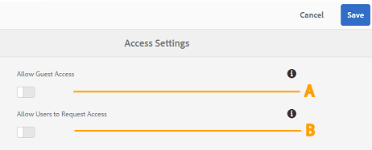
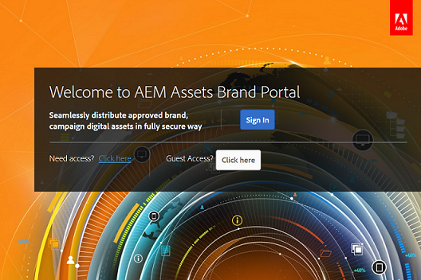

# Brand Portal でのユーザーアクセスの管理 {#administer-user-access-on-brand-portal}

AEM Assets Brand Portal 6.4.2 onwards authorizes administrators to configure guest access and enable users to request access on Brand Portal of their organization. これらの設定は、管理パネルで[!UICONTROL アクセス設定]として提供されています。これらの設定は両方とも、デフォルトでは無効になっています。

**A** Brand Portal ようこそ画面の[!UICONTROL ゲストとしてアクセスしますか？]リンクを使用して、Brand Portal でゲストによるアクセスを許可する設定。（デフォルトでは無効になっています）。

**B** Brand Portal ようこそ画面の [!UICONTROL アクセスが必要ですか？]リンクを使用して、Brand Portal でゲストによるアクセスを許可する設定。（デフォルトでは無効になっています）。

## ゲストによるアクセスを許可 {#allow-guest-access}

Brand portalでのゲストアクセスを許可し、ユーザーが公開アセットにアクセスする際にログインする必要がないようにするには、管理者は次の操作を行う必要があります。

1. 管理ツールにアクセスするには、上部のツールバーにある AEM ロゴを選択します。
2. 管理ツールパネルで、**[!UICONTROL アクセス]**&#x200B;を選択して&#x200B;**アクセス設定]ページを開きます。[!UICONTROL **
3. 「**[!UICONTROL ゲストによるアクセスを許可]」設定を有効にします。**
4. **[!UICONTROL 変更内容を保存します。]**
5. ログアウトして変更を有効にします。

## ユーザーのアクセス要求を許可 {#allow-users-to-request-access}

管理者は、組織ユーザーに対し、ようこそ画面から Brand Portal へのアクセスを要求することを許可できます。ただし、管理者は「**[!UICONTROL ユーザーのアクセス要求を許可]」設定を有効にして、ようこそ画面にアクセス要求用のリンクが表示されるようにする必要があります。**

組織のユーザーがBrand portalでのアクセスをリクエストできるようにするには、管理者は次の操作を行う必要があります。

1. 管理ツールにアクセスするには、上部のツールバーにある AEM ロゴを選択します。
2. 管理ツールパネルで、**[!UICONTROL アクセス]**&#x200B;を選択して&#x200B;**アクセス設定]ページを開きます。[!UICONTROL **
3. 「**[!UICONTROL ユーザーのアクセス要求を許可]」設定を有効にします。**
4. **[!UICONTROL 変更内容を保存します。]**
5. ログアウトして変更を有効にします。
