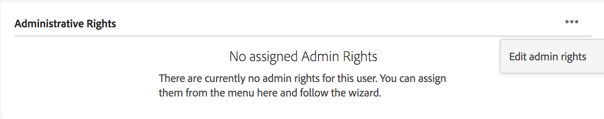

# ユーザー、グループ、ユーザーの役割の管理 {#manage-users-groups-and-user-roles}

管理者は、Adobe Admin Console を使用して AEM Assets Brand Portal のユーザーおよび製品プロファイルを作成でき、それらのユーザーの役割を Brand Portal ユーザーインターフェイスで管理できます。これは閲覧者と編集者にはない権限です。

[[!UICONTROL Admin Console]](http://adminconsole.adobe.com/enterprise/overview) には、組織に関連するあらゆる製品が表示されます。これには、例えば Adobe Analytics や Adobe Target、AEM Brand Portal など、様々な Adobe Experience Cloud ソリューションが含まれます。AEM Brand Portal 製品を選択し、製品プロファイルを作成する必要があります。

<!--
Comment Type: draft

<note type="note">

Product Profiles (formerly known as product configurations*). 

* The nomenclature has changed from product configurations to product profiles in the new Adobe Admin Console.

</note>
-->

製品プロファイルは、8 時間おきに Brand Portal ユーザーインターフェイスと同期され、Brand Portal にグループとして表示されます。ユーザーを追加して製品プロファイルを作成し、それらの製品プロファイルにユーザーを追加したら、Brand Portal でユーザーとグループに役割を割り当てることができます。

>[!NOTE]
>
>Brand Portal でグループを作成するには、Adobe [!UICONTROL Admin Console] から、**[!UICONTROL ユーザー／ユーザーグループ]**&#x200B;ではなく、**[!UICONTROL 製品／製品プロファイル]**&#x200B;を使用します。Adobe [!UICONTROL Admin Console] の製品プロファイルは、Brand Portal でグループを作成するために使用されます。

## ユーザーの追加 {#add-a-user}

製品管理者は、Adobe [[!UICONTROL Admin Console]](http://adminconsole.adobe.com/enterprise/overview) を使用してユーザーを作成し、それらのユーザーを製品プロファイル（*旧称：製品設定*）に割り当てることができます。製品プロファイルは Brand Portal にグループとして表示されます。これにより、グループを使用して役割の管理やアセットの共有などの操作を一括して実行できます。

>[!NOTE]
>
>Brand Portal へのアクセス権がない新しいユーザーは、Brand Portal のログイン画面からアクセス権を申請できます。詳しくは、[Brand Portal へのアクセス権の申請](../using/brand-portal.md#request-access-to-brand-portal)を参照してください。管理者は、通知領域にアクセス権申請の通知が届いたら、関連する通知をクリックして「**[!UICONTROL アクセス権を付与]**」をクリックします。または、アクセス権申請の電子メールが届いたら、そこに記載されているリンクをクリックします。その後、[Adobe [!UICONTROL Admin Console]](http://adminconsole.adobe.com/enterprise/overview) からユーザーを追加するには、以下の手順 4～7 をおこないます。

>[!NOTE]
>
>[Adobe [!UICONTROL Admin Console]](http://adminconsole.adobe.com/enterprise/overview) には、直接または Brand Portal からログインできます。直接ログインした場合は、以下の手順 4～7 に従って、ユーザーを追加します。

1. 上部の AEM ツールバーでアドビのロゴをクリックして、管理ツールにアクセスします。

   

1. 管理ツールパネルの「**[!UICONTROL ユーザー]**」をクリックします。

   

1. [!UICONTROL ユーザーの役割]ページで、「**[!UICONTROL 管理]**」タブをクリックし、「**[!UICONTROL Admin Console を起動]**」をクリックします。

   

1. Admin Console で、以下のいずれかの手順を実行して、新しいユーザーを作成します。

   * 上部のツールバーの「**[!UICONTROL 概要]**」をクリックします。[!UICONTROL 概要]ページで、「Brand Portal」製品カードの「**[!UICONTROL ユーザーを割り当て]**」をクリックします。

   

   * 上部のツールバーの「**[!UICONTROL ユーザー]**」をクリックします。[!UICONTROL ユーザー]ページでは、左パネルの「[!UICONTROL ユーザー]」がデフォルトで選択されています。「**[!UICONTROL ユーザーを追加]**」をクリックします。

   

1. ユーザーを追加ダイアログで、追加するユーザーの電子メール ID を入力するか、入力中に表示される候補リストからユーザーを選択します。

   

1. 1 つ以上の製品プロファイル（旧称：製品設定）にユーザーを割り当てます。製品プロファイルに割り当てられたユーザーは、Brand Portal にアクセスできます。「**[!UICONTROL この製品のプロファイルを選択してください]**」フィールドから、適切な製品プロファイルを選択します。
1. 「**[!UICONTROL 保存]**」をクリックします。追加したユーザー宛に「ようこそ」の電子メールが送信されます。招待されたユーザーは、「ようこそ」の電子メールに記載されているリンクをクリックし、[!UICONTROL Adobe ID] を使用してサインインすることで、Brand Portal にアクセスできます。詳しくは、[初回のログイン操作](../using/brand-portal-onboarding.md)を参照してください。

   >[!NOTE]
   >
   >ユーザーが Brand Portal にログオンできない場合は、組織の管理者が Adobe [!UICONTROL Admin Console] にアクセスして、そのユーザーが存在しており、1 つ以上の製品プロファイルに追加されていることを確認してください。

   管理者権限の付与について詳しくは、[ユーザーへの管理者権限の付与](../using/brand-portal-adding-users.md#provideadministratorprivilegestousers)を参照してください。

## 製品プロファイルの追加  {#add-a-product-profile}

[!UICONTROL Admin Console] の製品プロファイル（旧称：製品設定）は、Brand Portal でグループを作成するために使用されます。これにより、Brand Portal 内で役割の管理やアセットの共有などを一括して実行できます。**Brand Portal** は、デフォルトで使用可能な製品プロファイルです。これとは別の製品プロファイルを作成し、その新しい製品プロファイルにユーザーを追加することもできます。

>[!NOTE]
>
>[[!UICONTROL Admin Console]](http://adminconsole.adobe.com/enterprise/overview) には、直接または Brand Portal からログインできます。[!UICONTROL Admin Console] に直接ログインした場合は、以下の手順 4～7 に従って、製品プロファイルを追加します。

1. 上部の AEM ツールバーでアドビのロゴをクリックして、管理ツールにアクセスします。

   

1. 管理ツールパネルの「**[!UICONTROL ユーザー]**」をクリックします。

   

1. [!UICONTROL ユーザーの役割]ページで、「**[!UICONTROL 管理]**」タブをクリックし、「**[!UICONTROL Admin Console を起動]**」をクリックします。

   

1. 上部のツールバーの「**[!UICONTROL 製品]**」をクリックします。
1. [!UICONTROL 製品]ページでは、「[!UICONTROL 製品プロファイル]」がデフォルトで選択されています。「**[!UICONTROL 新しいプロファイル]**」をクリックします。

   

1. [!UICONTROL 新しいプロファイルを作成]ページで、プロファイル名、表示名およびプロファイルの説明を入力します。また、ユーザーがプロファイルに追加された場合やプロファイルから削除された場合に電子メールで通知するかどうかも選択します。

   

1. 「**[!UICONTROL 完了]**」をクリックします。例えば、次の例では、製品設定グループ「**[!UICONTROL Sales group]**」が Brand Portal に追加されています。

   

## 製品プロファイルへのユーザーの追加 {#add-users-to-a-product-profile}

Brand Portal グループにユーザーを追加するには、[!UICONTROL Admin Console] で、対応する製品プロファイル（旧称：製品設定）にユーザーを追加します。ユーザーは個別に追加することも、一括で追加することもできます。

>[!NOTE]
>
>[[!UICONTROL Admin Console]](http://adminconsole.adobe.com/enterprise/overview) には、直接または Brand Portal からログインできます。Admin Console に直接ログインした場合は、以下の手順 4～7 に従って、製品プロファイルにユーザーを追加します。

1. 上部の AEM ツールバーでアドビのロゴをクリックして、管理ツールにアクセスします。

   

1. 管理ツールパネルの「**[!UICONTROL ユーザー]**」をクリックします。

   

1. [!UICONTROL ユーザーの役割]ページで、「**[!UICONTROL 管理]**」タブをクリックし、「**[!UICONTROL Admin Console を起動]**」をクリックします。

   ![[!DNL Admin Console]](assets/launch_admin_console.png) の起動

1. 上部のツールバーの「**[!UICONTROL 製品]**」をクリックします。
1. [!UICONTROL 製品]ページでは、「[!UICONTROL 製品プロファイル]」がデフォルトで選択されています。ユーザーを追加する製品プロファイル（例：[!UICONTROL Sales group]）を開きます。

   

1. 製品プロファイルにユーザーを個別に追加するには、以下の手順を実行します。

   * 「**[!UICONTROL ユーザーを追加]**」をクリックします。

   

   * [!UICONTROL Sales group にユーザーを追加]ページで、追加するユーザーの電子メール ID を入力するか、入力中に表示される候補リストからユーザーを選択します。

   

   * 「**[!UICONTROL 保存]**」をクリックします。

1. 製品プロファイルにユーザーを一括で追加するには、以下の手順を実行します。

   * **[!UICONTROL 省略記号（...）／CSV を利用してユーザーを一括追加]**&#x200B;を選択します。

   

   * **[!UICONTROL CSV を利用してユーザーを一括追加]**&#x200B;ページで、CSV テンプレートをダウンロードするか、CSV ファイルをドラッグ＆ドロップします。

   

   * 「**[!UICONTROL アップロード]**」をクリックします。
   デフォルトの製品プロファイル Brand Portal にユーザーを追加した場合は、追加したユーザーの電子メール ID 宛に、「ようこそ」の電子メールが送信されます。招待されたユーザーは、「ようこそ」の電子メールに記載されているリンクをクリックし、[!UICONTROL Adobe ID] を使用してサインインすることで、Brand Portal にアクセスできます。詳しくは、[初回のログイン操作](../using/brand-portal-onboarding.md)を参照してください。

   ユーザーをカスタム製品プロファイルや新しい製品プロファイルに追加したときに、そのユーザーに電子メール通知が送信されることはありません。

## ユーザーへの管理者権限の付与  {#provide-administrator-privileges-to-users}

システム管理者または製品管理者の権限を Brand Portal ユーザーに付与することができます。[!UICONTROL Admin Console] で使用可能なその他の管理権限（製品プロファイル管理者、ユーザーグループ管理者、サポート管理者などの権限）は付与しないでください。これらの役割について詳しくは、[管理ロール](https://helpx.adobe.com/jp/enterprise/using/admin-roles.html)を参照してください。

>[!NOTE]
>
>[[!UICONTROL Admin Console]](https://adminconsole.adobe.com/enterprise/overview) には、直接または Brand Portal からログインできます。[!UICONTROL Admin Console] に直接ログインした場合は、以下の手順 4～8 に従って、製品プロファイルにユーザーを追加します。

1. 上部の AEM ツールバーでアドビのロゴをクリックして、管理ツールにアクセスします。

   

1. 管理ツールパネルの「**[!UICONTROL ユーザー]**」をクリックします。

   

1. [!UICONTROL ユーザーの役割]ページで、「**[!UICONTROL 管理]**」タブをクリックし、「**[!UICONTROL Admin Console を起動]**」をクリックします。

   

1. 上部のツールバーの「**[!UICONTROL ユーザー]**」をクリックします。
1. [!UICONTROL ユーザー]ページでは、左パネルの「[!UICONTROL ユーザー]」がデフォルトで選択されています。管理者権限を付与するユーザーの名前をクリックします。

   

1. ユーザープロファイルページ下部の「**[!UICONTROL 管理権限]**」セクションで、**[!UICONTROL 省略記号（...）／管理者権限を編集]** を選択します。
   

1. [!UICONTROL 管理者を編集]ページで、「システム管理者」または「製品管理者」を選択します。

   

   >[!NOTE]
   >
   >Brand Portal では、システム管理者と製品管理者の役割のみをサポートしています。
   >
   >システム管理者の役割は使用しないことをお勧めします。なぜなら、システム管理者の役割は、組織のすべての製品に対する組織レベルの管理者権限を付与することになるからです。例えば、3 つのマーケティングクラウド製品を扱う組織のシステム管理者は、これら 3 つの製品に対するすべての権限を保有します。AEM Assets から Brand Portal にアセットを公開できるように AEM Assets を設定できるのは、システム管理者だけです。詳しくは、[AEM Assets と Brand Portal の連携の設定](../using/configure-aem-assets-with-brand-portal.md)を参照してください。
   >
   >それに対して、製品管理者の役割は、特定の製品に対する管理者権限のみを付与します。Brand Portal 内で、より詳細なアクセス制御を適用する場合は、製品管理者の役割を使用して、製品を「Brand Portal」として選択します。

   >[!NOTE]
   >
   >Brand Portal は、製品プロファイル管理者（旧称：設定管理者）の権限をサポートしていません。ユーザーに製品プロファイル管理者の権限を割り当てることは避けてください。

1. 管理者タイプの選択を確認し、「**[!UICONTROL 保存]**」をクリックします。

   >[!NOTE]
   >
   >ユーザーの管理者権限を失効するには、**[!UICONTROL 管理者を編集]**&#x200B;ページで適切な変更をおこない、「**[!UICONTROL 保存]**」をクリックします。

## ユーザーの役割の管理 {#manage-user-roles}

管理者は、Brand Portal でユーザーの役割を変更できます。

管理者の役割以外にも、Brand Portal は、次の役割をサポートしています。

* [!UICONTROL 閲覧者]：この役割を持つユーザーは、管理者から共有されたファイルやフォルダーを表示できます。また、アセットの検索とダウンロードも可能です。ただし、他のユーザーとコンテンツ（ファイル、フォルダー、[!UICONTROL コレクション]）を共有することはできません。
* [!UICONTROL エディター]：この役割を持つユーザーは、閲覧者の権限をすべて保有します。さらに、他のユーザーとコンテンツ（フォルダー、[!UICONTROL コレクション]、リンク）を共有できます。

1. 上部の AEM ツールバーでアドビのロゴをクリックして、管理ツールにアクセスします。

   

1. 管理ツールパネルの「**[!UICONTROL ユーザー]**」をクリックします。

   

1. [!UICONTROL ユーザー役割]ページでは、「[!UICONTROL ユーザー]」タブがデフォルトで選択されています。役割を変更するユーザーの&#x200B;**[!UICONTROL 役割]**&#x200B;ドロップダウンから、「**[!UICONTROL エディター]**」または「**[!UICONTROL 閲覧者]**」を選択します。

   

   複数のユーザーの役割を同時に変更するには、ユーザーを選択し、**[!UICONTROL 役割]**&#x200B;ドロップダウンから適切な役割を選択します。

   >[!NOTE]
   >
   >管理者ユーザーの[!UICONTROL 役割]リストは無効になっています。管理者ユーザーを選択して、役割を変更することはできません。

   >[!NOTE]
   >
   >ユーザーがエディターグループのメンバーの場合は、ユーザーの役割も無効になっています。ユーザーの編集権限を失効するには、エディターグループからそのユーザーを削除するか、グループ全体の役割を「閲覧者」に変更します。

1. 「**[!UICONTROL 保存]**」をクリックします。対応するユーザーの役割が変更されます。複数のユーザーを選択している場合は、すべてのユーザーの役割が同時に変更されます。

   >[!NOTE]
   >
   >ユーザー権限の変更は、ユーザーが Brand Portal に再ログインするまで、**[!UICONTROL ユーザー役割]**&#x200B;ページに反映されません。

## グループの役割および権限の管理 {#manage-group-roles-and-privileges}

管理者は、Brand Portal で特定の権限をユーザー[グループ](../using/brand-portal-adding-users.md#main-pars-title-278567577)に関連付けることができます。**[!UICONTROL ユーザーの役割]**&#x200B;ページの「**[!UICONTROL グループ]**」タブでは、管理者は次の操作をおこなうことができます。

* ユーザーグループに役割を割り当てる
* ユーザーグループが Brand Portal から画像ファイル（.jpeg、.tiff、.png、.bmp、.gif、.pjpeg、x-portable-anymap、x-portable-bitmap、x-portable-graymap、x-portable-pixmap、x-rgb、x-xbitmap、x-xpixmap、x-icon、image/photoshop、image/x-photoshop、.psd、image/vnd.adobe.photoshop）のオリジナルのレンディションをダウンロードすることを制限する

>[!NOTE]
>
>リンクとして共有されたアセットの場合、画像ファイルのオリジナルのレンディションへのアクセス権限は、アセットを共有しているユーザーの権限に基づいて適用されます。

特定のグループメンバーがオリジナルのレンディションにアクセスするための役割および権限を変更するには、次の手順に従います。

1. **[!UICONTROL ユーザーの役割]**&#x200B;ページで、「**[!UICONTROL グループ]**」タブに移動します。
1. 役割を変更するグループを選択します。
1. **[!UICONTROL 役割]**&#x200B;ドロップダウンリストから、適切な役割を選択します。

   グループのメンバーに対し、ポータルまたは共有リンクからダウンロードした画像ファイル（.jpeg、.tiff、.png、.bmp、.gif、.pjpeg、x-portable-anymap、x-portable-bitmap、x-portable-graymap、x-portable-pixmap、x-rgb、x-xbitmap、x-xpixmap、x-icon、image/photoshop、image/x-photoshop、.psd、image/vnd.adobe.photoshop）のオリジナルレンディションへのアクセスを許可するには、そのグループの「**[!UICONTROL オリジナルへのアクセス]**」オプションを選択したままにします。デフォルトでは、「**[!UICONTROL オリジナルへのアクセス]**」オプションはすべてのユーザーで選択されています。ユーザーグループがオリジナルのレンディションにアクセスできないようにするには、そのグループに対応するオプションの選択を解除します。

   

   >[!NOTE]
   >
   >ユーザーが複数のグループに追加されていて、そのいずれかのグループが制約を受ける場合、そのユーザーにはこの制約が適用されます。
   >
   >また、管理者は、画像ファイルのオリジナルのレンディションへのアクセスに関する制約を受けません（その管理者が制約対象となるグループのメンバーである場合も、制約は適用されません）。

1. 「**[!UICONTROL 保存]**」をクリックします。対応するグループの役割が変更されます。

   >[!NOTE]
   >
   >ユーザーとグループの関連付け、またはユーザーのグループメンバーシップは、8 時間おきに Brand Portal と同期されます。ユーザーまたはグループの役割の変更は、次回の同期ジョブの実行後に反映されます。

