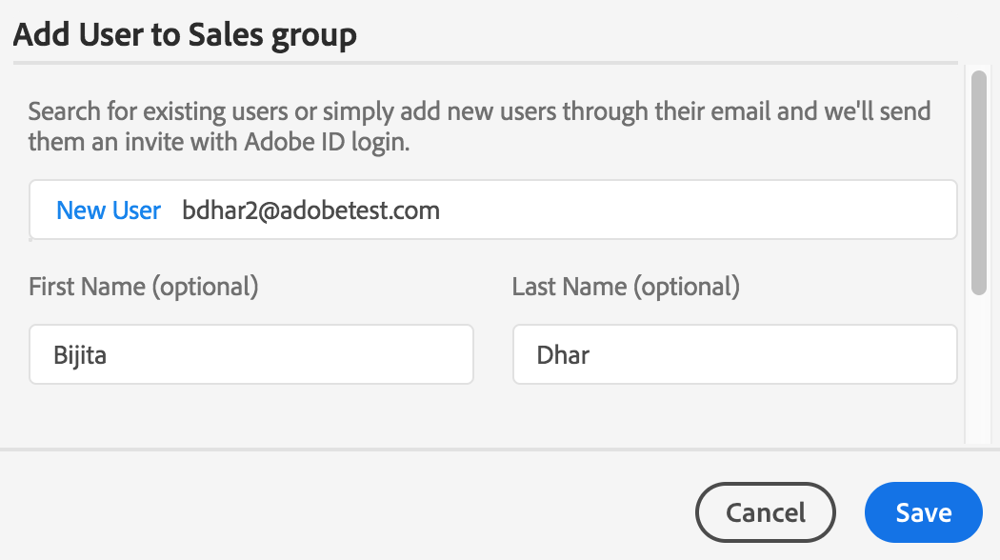

# ユーザー、グループ、ユーザーの役割の管理 {#manage-users-groups-and-user-roles}

管理者は、Adobe Admin Console を使用して AEM Assets Brand Portal のユーザーおよび製品プロファイルを作成でき、それらのユーザーの役割を Brand Portal ユーザーインターフェイスで管理できます。これは閲覧者とエディターにはない権限です。

In [[!UICONTROL Admin Console]](http://adminconsole.adobe.com/enterprise/overview), you can view all the products associated with your organization. これには、例えば Adobe Analytics や Adobe Target、AEM Brand Portal など、様々な Adobe Experience Cloud ソリューションが含まれます。AEM Brand Portal 製品を選択し、製品プロファイルを作成する必要があります。

<!--
Comment Type: draft

<note type="note">

Product Profiles (formerly known as product configurations*). 

* The nomenclature has changed from product configurations to product profiles in the new Adobe Admin Console.

</note>
-->

These product profiles are synced with the Brand Portal user interface every 8 hours and visible as groups in Brand Portal. Once you add users and create product profiles, and add users to those product profiles, you can assign roles to users and groups in Brand Portal.

>[!NOTE]
>
>To create groups in Brand Portal, from Adobe [!UICONTROL Admin Console], use **[!UICONTROL Products &gt; Product Profiles]**, instead of **[!UICONTROL User page &gt; User Groups]**. Product profiles in Adobe [!UICONTROL Admin Console] are used to create groups in Brand Portal.

## ユーザーの追加 {#add-a-user}

If you are a product administrator, use Adobe [[!UICONTROL Admin Console]](http://adminconsole.adobe.com/enterprise/overview) to create users and assign them to product profiles (*formerly known as product configurations*), which show as groups in Brand Portal. これにより、グループを使用して役割の管理やアセットの共有などの操作を一括して実行できます。

>[!NOTE]
Brand Portal へのアクセス権がない新しいユーザーは、Brand Portal のログイン画面からアクセス権を申請できます。詳しくは、[Brand Portal へのアクセス権の申請](../using/brand-portal.md#request-access-to-brand-portal)を参照してください。After you receive access request notifications in your notification area, click the relevant notification and then click **[!UICONTROL Grant Access]**. または、アクセス権申請の電子メールが届いたら、そこに記載されているリンクをクリックします。Next, to add a user through [Adobe [!UICONTROL Admin Console]](http://adminconsole.adobe.com/enterprise/overview), follow Steps 4-7 in the procedure below.

>[!NOTE]
You can login to [Adobe [!UICONTROL Admin Console]](http://adminconsole.adobe.com/enterprise/overview) directly or from Brand Portal. 直接ログインした場合は、以下の手順 4 ～ 7 に従って、ユーザーを追加します。

1. 上部の AEM ツールバーでアドビのロゴをクリックして、管理ツールにアクセスします。

   

1. From the administrative tools panel, click **[!UICONTROL Users]**.

   

1. In the [!UICONTROL User Roles] page, click the **[!UICONTROL Management]** tab, then click **[!UICONTROL Launch Admin Console]**.

   

1. Admin Console で、以下のいずれかの手順を実行して、新しいユーザーを作成します。

   * From the toolbar at the top, click **[!UICONTROL Overview]**. In the [!UICONTROL Overview] page, click **[!UICONTROL Assign Users]** from the Brand Portal product card.
   

   * From the toolbar at the top, click **[!UICONTROL Users]**. [!UICONTROL ユーザー]ページでは、左レールの「[!UICONTROL ユーザー]」がデフォルトで選択されています。Click **[!UICONTROL Add User]**.
   

1. ユーザーを追加ダイアログで、追加するユーザーの電子メール ID を入力するか、入力中に表示される候補リストからユーザーを選択します。

   

1. 1 つ以上の製品プロファイル（旧称：製品設定）にユーザーを割り当てます。製品プロファイルに割り当てられたユーザーは、Brand Portal にアクセスできます。「**[!UICONTROL この製品のプロファイルを選択してください]」フィールドから、適切な製品プロファイルを選択します。**
1. Click **[!UICONTROL Save]**. 追加したユーザー宛に「ようこそ」の電子メールが送信されます。The invited user can access Brand Portal by clicking the link in the welcome email and signing in using an [!UICONTROL Adobe ID]. 詳しくは、[初回のログイン操作](../using/brand-portal-onboarding.md)を参照してください。

   >[!NOTE]
   If a user is unable to log on to Brand Portal, the Administrator of the organization should visit Adobe [!UICONTROL Admin Console] and check whether the user is present and has been added to at least one product profile.

   管理者権限の付与について詳しくは、[ユーザーへの管理者権限の付与](../using/brand-portal-adding-users.md#provideadministratorprivilegestousers)を参照してください。

## 製品プロファイルの追加 {#add-a-product-profile}

Product profiles (formerly known as product configurations) in [!UICONTROL Admin Console] are used to create groups in Brand Portal so that you can perform bulk operations such as role management and asset sharing in Brand Portal. **Brand Portal** は、デフォルトで使用可能な製品プロファイルです。これとは別の製品プロファイルを作成し、その新しい製品プロファイルにユーザーを追加することもできます。

>[!NOTE]
You can login to [[!UICONTROL Admin Console]](http://adminconsole.adobe.com/enterprise/overview) directly or from Brand Portal. [!UICONTROL Admin Console] に直接ログインした場合は、以下の手順 4 ～ 7 に従って、製品プロファイルを追加します。

1. 上部の AEM ツールバーでアドビのロゴをクリックして、管理ツールにアクセスします。

   

1. From the administrative tools panel, click **[!UICONTROL Users]**.

   

1. In the [!UICONTROL User Roles] page, click the **[!UICONTROL Management]** tab, then click **[!UICONTROL Launch Admin Console]**.

   

1. From the toolbar at the top, click **[!UICONTROL Products]**.
1. [!UICONTROL 製品]ページでは、「[!UICONTROL 製品プロファイル]」がデフォルトで選択されています。Click **[!UICONTROL New Profile]**.

   

1. [!UICONTROL 新しいプロファイルを作成]ページで、プロファイル名、表示名およびプロファイルの説明を入力します。また、ユーザーがプロファイルに追加された場合やプロファイルから削除された場合に電子メールで通知するかどうかも選択します。

   

1. Click **[!UICONTROL Done]**. The product configuration group, for example **[!UICONTROL Sales group]**, is added to Brand Portal.

   

## 製品プロファイルへのユーザーの追加 {#add-users-to-a-product-profile}

To add users to a Brand Portal group, add them to the corresponding product profile (formerly known as product configurations) in [!UICONTROL Admin Console]. ユーザーは個別に追加することも、一括で追加することもできます。

>[!NOTE]
You can login to [[!UICONTROL Admin Console]](http://adminconsole.adobe.com/enterprise/overview) directly or from Brand Portal. Admin Console に直接ログインした場合は、以下の手順 4 ～ 7 に従って、製品プロファイルにユーザーを追加します。

1. 上部の AEM ツールバーでアドビのロゴをクリックして、管理ツールにアクセスします。

   

1. From the administrative tools panel, click **[!UICONTROL Users]**.

   

1. In the [!UICONTROL User Roles] page, click the **[!UICONTROL Management]** tab, then click **[!UICONTROL Launch Admin Console]**.

   ![[!DNL Admin Console] の起動](assets/launch_admin_console.png)

1. From the toolbar at the top, click **[!UICONTROL Products]**.
1. [!UICONTROL 製品]ページでは、「[!UICONTROL 製品プロファイル]」がデフォルトで選択されています。ユーザーを追加する製品プロファイル（例：[!UICONTROL Sales group]）を開きます。

   

1. 製品プロファイルにユーザーを個別に追加するには、以下の手順を実行します。

   * Click **[!UICONTROL Add User]**.
   

   * [!UICONTROL Sales group にユーザーを追加]ページで、追加するユーザーの電子メール ID を入力するか、入力中に表示される候補リストからユーザーを選択します。
   

   * Click **[!UICONTROL Save]**.

1. 製品プロファイルにユーザーを一括で追加するには、以下の手順を実行します。

   * Choose ellipsis (**[!UICONTROL ...) &gt; Add users by CSV]**.
   

   * **[!UICONTROL CSV を利用してユーザーを一括追加]ページで、CSV テンプレートをダウンロードするか、CSV ファイルをドラッグ＆ドロップします。**
   

   * Click **[!UICONTROL Upload]**.
   If you added users to the default product profile, that is, Brand Portal, a welcome email is sent to the email ID of the users you added. The invited users can access Brand Portal by clicking the link in the welcome email and signing in using an [!UICONTROL Adobe ID]. 詳しくは、[初回のログイン操作](../using/brand-portal-onboarding.md)を参照してください。

   ユーザーをカスタム製品プロファイルや新しい製品プロファイルに追加したときに、そのユーザーに電子メール通知が送信されることはありません。

## ユーザーへの管理者権限の付与 {#provide-administrator-privileges-to-users}

システム管理者または製品管理者の権限を Brand Portal ユーザーに付与することができます。[!UICONTROL Admin Console] で使用可能なその他の管理権限（製品プロファイル管理者、ユーザーグループ管理者、サポート管理者などの権限）は付与しないでください。これらの役割について詳しくは、[管理ロール](https://helpx.adobe.com/enterprise/using/admin-roles.html)を参照してください。

>[!NOTE]
You can login to [[!UICONTROL Admin Console]](https://adminconsole.adobe.com/enterprise/overview) directly or from Brand Portal. [!UICONTROL Admin Console] に直接ログインした場合は、以下の手順 4 ～ 8 に従って、製品プロファイルにユーザーを追加します。

1. 上部の AEM ツールバーでアドビのロゴをクリックして、管理ツールにアクセスします。

   

1. From the administrative tools panel, click **[!UICONTROL Users]**.

   

1. In the [!UICONTROL User Roles] page, click the **[!UICONTROL Management]** tab, then click **[!UICONTROL Launch Admin Console]**.

   

1. From the toolbar at the top, click **[!UICONTROL Users]**.
1. [!UICONTROL ユーザー]ページでは、左レールの「[!UICONTROL ユーザー]」がデフォルトで選択されています。管理者権限を付与するユーザーの名前をクリックします。

   

1. In the user profile page, locate the **[!UICONTROL Administrative Rights]** section at the bottom, and choose ellipsis (**[!UICONTROL ... &gt; Edit admin rights]**.
   

1. [!UICONTROL 管理者を編集]ページで、「システム管理者」または「製品管理者」を選択します。

   

   >[!NOTE]
   ブランドポータルは、システム管理者と製品管理者の役割のみをサポートします。
   システム管理者の役割は使用しないことをお勧めします。なぜなら、システム管理者の役割は、組織のすべての製品に対する組織レベルの管理者権限を付与することになるからです。例えば、3 つのマーケティングクラウド製品を扱う組織のシステム管理者は、これら 3 つの製品に対するすべての権限を保有します。AEM AssetsからBrand Portalにアセットを公開できるように、AEM Assetsを設定できるのはシステム管理者だけです。 For more information, see [Configure AEM Assets integration with Brand Portal](https://helpx.adobe.com/experience-manager/6-5/assets/using/brand-portal-configuring-integration.html).
   それに対して、製品管理者の役割は、特定の製品に対する管理者権限のみを付与します。Brand portal内でより詳細なアクセス制御を実施する場合は、製品管理者ロールを使用し、製品をブランドポータルとして選択します。

   >[!NOTE]
   Brand Portal は、製品プロファイル管理者（旧称：設定管理者）の権限をサポートしていません。ユーザーに製品プロファイル管理者の権限を割り当てることは避けてください。

1. Review the admin type selection and click **[!UICONTROL Save]**.

   >[!NOTE]
   To revoke administrator privileges for a user, make the appropriate changes in the [!UICONTROL Edit Admin] page, and then click **[!UICONTROL Save]**.

## ユーザーの役割の管理 {#manage-user-roles}

管理者は、Brand Portal でユーザーの役割を変更できます。

管理者の役割以外にも、Brand Portal は、次の役割をサポートしています。

* [!UICONTROL 閲覧者]：この役割を持つユーザーは、管理者から共有されたファイルやフォルダーを表示できます。また、アセットの検索とダウンロードも可能です。ただし、他のユーザーとコンテンツ（ファイル、フォルダー、[!UICONTROL コレクション]）を共有することはできません。
* [!UICONTROL エディター]：この役割を持つユーザーは、閲覧者の権限をすべて保有します。さらに、他のユーザーとコンテンツ（フォルダー、[!UICONTROL コレクション]、リンク）を共有できます。

1. 上部の AEM ツールバーでアドビのロゴをクリックして、管理ツールにアクセスします。

   

1. From the administrative tools panel, click **[!UICONTROL Users]**.

   

1. [!UICONTROL ユーザー役割]ページでは、「[!UICONTROL ユーザー]」タブがデフォルトで選択されています。役割を変更するユーザーの&#x200B;**[!UICONTROL 役割]ドロップダウンから、「**[!UICONTROL エディター]**」または「**&#x200B;閲覧者]」を選択します。**[!UICONTROL **

   

   複数のユーザーの役割を同時に変更するには、ユーザーを選択し、**[!UICONTROL 役割]ドロップダウンから適切な役割を選択します。**

   >[!NOTE]
   管理者ユーザーの[!UICONTROL 役割]リストは無効になっています。管理者ユーザーを選択して、役割を変更することはできません。

   >[!NOTE]
   ユーザーがエディターグループのメンバーの場合は、ユーザーの役割も無効になっています。ユーザーの編集権限を失効するには、エディターグループからそのユーザーを削除するか、グループ全体の役割を「閲覧者」に変更します。

1. Click **[!UICONTROL Save]**. 対応するユーザーの役割が変更されます。複数のユーザーを選択している場合は、すべてのユーザーの役割が同時に変更されます。

   >[!NOTE]
   ユーザー権限の変更は、ユーザーが Brand Portal に再ログインするまで、[!UICONTROL ユーザー役割]ページに反映されません。

## グループの役割および権限の管理 {#manage-group-roles-and-privileges}

管理者は、Brand Portal で特定の権限をユーザー[グループ](../using/brand-portal-adding-users.md#main-pars-title-278567577)に関連付けることができます。[!UICONTROL ユーザーの役割]ページの「[!UICONTROL グループ]」タブでは、管理者は次の操作をおこなうことができます。

* ユーザーグループに役割を割り当てる
* ユーザーグループが Brand Portal から画像ファイル（.jpeg、.tiff、.png、.bmp、.gif、.pjpeg、x-portable-anymap、x-portable-bitmap、x-portable-graymap、x-portable-pixmap、x-rgb、x-xbitmap、x-xpixmap、x-icon、image/photoshop、image/x-photoshop、.psd、image/vnd.adobe.photoshop）のオリジナルのレンディションをダウンロードすることを制限する

>[!NOTE]
リンクとして共有されたアセットの場合、画像ファイルのオリジナルのレンディションへのアクセス権限は、アセットを共有しているユーザーの権限に基づいて適用されます。

特定のグループメンバーがオリジナルのレンディションにアクセスするための役割および権限を変更するには、次の手順に従います。

1. [!UICONTROL ユーザーの役割]ページで、「**[!UICONTROL グループ]」タブに移動します。**
1. 役割を変更するグループを選択します。
1. [!UICONTROL 役割]ドロップダウンリストから、適切な役割を選択します。

   グループのメンバーに対し、ポータルまたは共有リンクからダウンロードした画像ファイル（.jpeg、.tiff、.png、.bmp、.gif、.pjpeg、x-portable-anymap、x-portable-bitmap、x-portable-graymap、x-portable-pixmap、x-rgb、x-xbitmap、x-xpixmap、x-icon、image/photoshop、image/x-photoshop、.psd、image/vnd.adobe.photoshop）のオリジナルレンディションへのアクセスを許可するには、そのグループの「[!UICONTROL オリジナルへのアクセス]」オプションを選択したままにします。デフォルトでは、「[!UICONTROL オリジナルへのアクセス]」オプションはすべてのユーザーで選択されています。ユーザーグループがオリジナルのレンディションにアクセスできないようにするには、そのグループに対応するオプションの選択を解除します。

   

   >[!NOTE]
   ユーザーが複数のグループに追加されていて、そのいずれかのグループが制約を受ける場合、そのユーザーにはこの制約が適用されます。
   また、管理者は、画像ファイルのオリジナルのレンディションへのアクセスに関する制約を受けません（その管理者が制約対象となるグループのメンバーである場合も、制約は適用されません）。

1. Click **[!UICONTROL Save]**. 対応するグループの役割が変更されます。

   >[!NOTE]
   ユーザーとグループの関連付け、またはユーザーのグループメンバーシップは、8 時間おきに Brand Portal と同期されます。ユーザーまたはグループの役割の変更は、次回の同期ジョブの実行後に反映されます。
