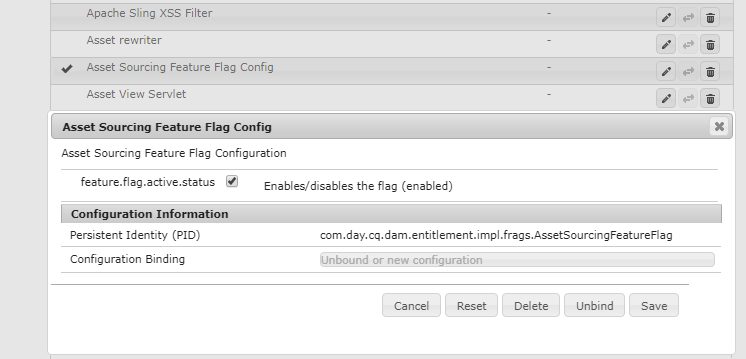

# アセットソーシングの概要 {#overview-asset-sourcing-in-bp}

**アセットソーシング**&#x200B;を使用すると、追加の&#x200B;**アセット投稿**&#x200B;プロパティを持つ新しいフォルダーを AEM ユーザー（管理者／管理者以外のユーザー）が作成できるので、この新規作成フォルダーを Brand Portal ユーザーによるアセット送信に利用することができます。これにより、新しく作成された&#x200B;**投稿**&#x200B;フォルダー内に **SHARED** および **NEW** という 2 つのサブフォルダーを追加作成するワークフローが自動的にトリガーされます。次に、AEM 管理者はプロジェクトの要件を定義します。それには、投稿フォルダーに追加する必要があるアセットのタイプの簡単な説明と一連のベースラインアセットを **SHARED** フォルダーにアップロードして、BP ユーザーが必要な参照情報を確実に入手できるようにします。その後、管理者は、アクティブな Brand Portal ユーザーに投稿フォルダーへのアクセスを許可してから、新しく作成した&#x200B;**投稿**&#x200B;フォルダーを Brand Portal に公開することができます。**NEW** フォルダーへのコンテンツの追加を完了したら、ユーザーは、投稿フォルダーを AEM オーサー環境に公開できます。なお、読み込みが完了し、新しく公開したコンテンツが AEM Assets 内に反映されるまでに数分かかる場合があります。

また、既存の機能はすべてそのままで変わりません。Brand Portal ユーザーは、投稿フォルダーおよび許可された他のフォルダーからアセットを表示、検索およびダウンロードできます。さらに、管理者は投稿フォルダーの共有、プロパティの変更、コレクションへのアセットの追加をおこなうことができます。

## 前提条件 {#prerequisites}

* AEM Assets as a Cloud Service インスタンス、AEM Assets 6.5.2 以降。
* AEM Assets インスタンスと Brand Portal の連携が設定されていることを確認します。[AEM Assets と Brand Portal の連携の設定](../using/configure-aem-assets-with-brand-portal.md)を参照してください。
* Brand Portal テナントが 1 つの AEM Assets オーサーインスタンスで構成されていることを確認します。

>[!VIDEO](https://video.tv.adobe.com/v/29365/?quality=12)

>[!NOTE]
>
>AEM Assets 6.5.4 には既知の問題があります。Adobe 開発者コンソールにアップグレードすると、Brand Portal ユーザーが投稿フォルダーのアセットを AEM Assets に公開できなくなります。
>
>この問題は AEM 6.5.5 で修正されました。お使いの AEM Assets インスタンスを最新のサービスパック AEM 6.5.5 にアップグレードし、Adobe 開発者コンソールで[設定をアップグレード](https://docs.adobe.com/content/help/ja-JP/experience-manager-65/assets/brandportal/configure-aem-assets-with-brand-portal.html#upgrade-integration-65)してください。
>
>AEM 6.5.4 の即時修正をおこなうには、[ホットフィックスをダウンロード](https://www.adobeaemcloud.com/content/marketplace/marketplaceProxy.html?packagePath=/content/companies/public/adobe/packages/cq650/hotfix/cq-6.5.0-hotfix-33041)して、オーサーインスタンスにインストールすることをお勧めします。

## アセットソーシングの設定 {#configure-asset-sourcing}

**アセットソーシング**&#x200B;は、AEM Assets オーサーインスタンス内から設定します。管理者は、**AEM Web コンソール設定**&#x200B;からアセットソーシング機能のフラグ設定を有効にし、アクティブな Brand Portal ユーザーリストを **AEM Assets** にアップロードできます。

>[!NOTE]
>
>AEM Assets as a Cloud Service では、アセットソーシングはデフォルトで有効になっています。AEM 管理者は、アクティブな Brand Portal ユーザーを直接アップロードして、これらのユーザーにアセットソーシング機能へのアクセスを許可することができます。

>[!NOTE]
>
>設定を開始する前に、AEM Assets インスタンスと Brand Portal の連携が設定されていることを確認します。[AEM Assets と Brand Portal の連携の設定](../using/configure-aem-assets-with-brand-portal.md)を参照してください。

次のビデオでは、AEM Assets オーサーインスタンスでアセットソーシングを設定する方法について説明します。

>[!VIDEO](https://video.tv.adobe.com/v/29771)

### アセットソーシングの有効化 {#enable-asset-sourcing}

AEM 管理者は、AEM Web コンソール設定（Configuration Manager）内からアセットソーシング機能のフラグを有効にすることができます。

>[!NOTE]
>
>この手順は、AEM Assets as a Cloud Service には適用されません。

**アセットソーシングを有効にするには：**
1. AEM Assets オーサーインスタンスにログインして、Configuration Manager を開きます。
デフォルトの URL は http://localhost:4502/system/console/configMgr です。
1. キーワード「**Asset Sourcing**」を使用して検索し、**[!UICONTROL Asset Sourcing Feature Flag Config]** を探します。
1. 「**[!UICONTROL Asset Sourcing Feature Flag Config]**」をクリックして、設定ウィンドウを開きます。
1. 「**[!UICONTROL feature.flag.active.status]**」チェックボックスをオンにします。
1. 「**[!UICONTROL 保存]**」をクリックします。

### Brand Portal ユーザーリストのアップロード {#upload-bp-user-list}

AEM 管理者は、AEM Assets のアクティブな Brand Portal ユーザーリストを含む Brand Portal ユーザー設定（.csv）ファイルをアップロードできます。投稿フォルダーは、ユーザーリストで定義されたアクティブな Brand Portal ユーザーのみ共有できます。また、管理者は、設定ファイルに新規ユーザーを追加して、変更したユーザーリストをアップロードできます。

>[!NOTE]
>
>CSV ファイルの形式は、Admin Console で一括ユーザー読み込み用にサポートされている形式と同じです。電子メールと氏名は必須です。

管理者は、AEM Admin Console で新規ユーザーを追加できます。詳しくは、[ユーザーの管理](brand-portal-adding-users.md)を参照してください。Admin Console でユーザーを追加したら、これらのユーザーを Brand Portal ユーザー設定ファイルに追加して、投稿フォルダーへのアクセス権を割り当てることができます。

**Brand Portal ユーザーリストをアップロードするには：**
1. AEM Assets インスタンスにログインします。
1. **ツール**&#x200B;パネルで、**[!UICONTROL アセット]**／**[!UICONTROL Brand Portal ユーザー]**&#x200B;に移動します。

1. Brand Portal 投稿者をアップロードウィンドウが開きます。
ローカルマシンから参照して、アクティブな Brand Portal ユーザーリストを含む**設定（.csv）ファイル**&#x200B;をアップロードします。
1. 「**[!UICONTROL 保存]**」をクリックします。

   

管理者は、投稿フォルダーを設定する際に、このユーザーリスト内の特定のユーザーにアクセス権を付与できます。投稿フォルダーにアクセスし Brand Portal から AEM Assets にアセットを公開できるのは、投稿フォルダーに割り当てられたユーザーのみです。

## 関連トピック {#reference-articles}

* [AEM Assets での投稿フォルダーの設定と Brand Portal への公開](brand-portal-publish-contribution-folder-to-brand-portal.md)

* [AEM Assets への投稿フォルダーの公開](brand-portal-publish-contribution-folder-to-aem-assets.md)
