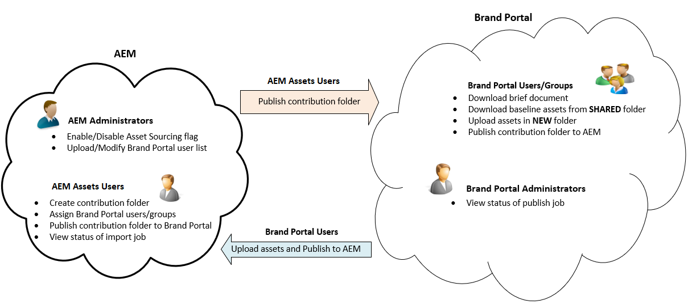

# アセットソーシングの概要 {#overview-asset-sourcing-in-bp}

**Asset Sourcing** を使用すると、AEMユーザー（管理者/非管理者ユーザー）は追加の **アセット貢献度** (Asset Contribution)プロパティを使用して新しいフォルダーを作成でき、Brand Portalユーザーがアセット送信を開くように作成した新しいフォルダーを確実に作成できます。 これにより、新しく作成された&#x200B;**投稿**&#x200B;フォルダー内に **SHARED** および **NEW** という 2 つのサブフォルダーを追加作成するワークフローが自動的にトリガーされます。The AEM administrator then defines the requirement by uploading a brief about the types of assets that should be added to the contribution folder, as well as a set of baseline assets, to the **SHARED** folder to ensure BP users have the reference information they need. その後、管理者は、アクティブな Brand Portal ユーザーに投稿フォルダーへのアクセスを許可してから、新しく作成した&#x200B;**投稿**&#x200B;フォルダーを Brand Portal に公開することができます。**NEW** フォルダーへのコンテンツの追加を完了したら、ユーザーは、投稿フォルダーを AEM オーサー環境に公開できます。なお、読み込みが完了し、新しく公開したコンテンツが AEM Assets 内に反映されるまでに数分かかる場合があります。

また、既存の機能はすべてそのままで変わりません。Brand Portal ユーザーは、投稿フォルダーおよび許可された他のフォルダーからアセットを表示、検索およびダウンロードできます。さらに、管理者は投稿フォルダーの共有、プロパティの変更、コレクションへのアセットの追加をおこなうことができます。

## 前提条件 {#prerequisites}

* AEM 6.5.2 以降。
* AEM Assets インスタンスと Brand Portal の連携が設定されていることを確認します。[AEM Assets と Brand Portal の連携の設定](../using/configure-aem-assets-with-brand-portal.md)を参照してください。
* Brand Portal テナントが 1 つのAEM Assets オーサーインスタンスで構成されていることを確認します。

>[!NOTE]
>
>資産調達は、Cloud ServiceとしてAEM Assetsではサポートされていません。

>[!VIDEO](https://video.tv.adobe.com/v/29365/?quality=12)

>[!NOTE]
>
>AEM 6.5.4 には既知の問題があります。Brand Portal ユーザーは、Adobe 開発者コンソールにアップグレードすると、投稿フォルダーのアセットを AEM Assets に公開できません。
>
>この問題は AEM 6.5.5 で修正されました。お使いの AEM Assets インスタンスを最新のサービスパック AEM 6.5.5 にアップグレードし、Adobe 開発者コンソールで[設定をアップグレード](https://docs.adobe.com/content/help/ja-JP/experience-manager-65/assets/brandportal/configure-aem-assets-with-brand-portal.html#upgrade-integration-65)してください。
>
>AEM 6.5.4 の即時修正をおこなうには、[ホットフィックスをダウンロード](https://www.adobeaemcloud.com/content/marketplace/marketplaceProxy.html?packagePath=/content/companies/public/adobe/packages/cq650/hotfix/cq-6.5.0-hotfix-33041)して、オーサーインスタンスにインストールすることをお勧めします。

## 関連トピック {#reference-articles}

**管理者向け**

* [AEM でのアセットソーシングの設定](brand-portal-configure-asset-sourcing.md)
* [Brand Portal ユーザーリストのアップロード](brand-portal-configure-asset-sourcing.md)
* [投稿フォルダーの設定](brand-portal-contribution-folder.md)
* [投稿フォルダーへのベースラインアセットのアップロード](brand-portal-upload-baseline-assets.md)
* [Brand Portal への投稿フォルダーの公開](brand-portal-publish-contribution-folder-to-brand-portal.md)

**Brand Portal ユーザー向け**

* [アセット要件のダウンロード](brand-portal-download-asset-requirements.md)
* [投稿フォルダーへの新しいアセットのアップロード](brand-portal-upload-assets-to-contribution-folder.md)
* [AEM Assets への投稿フォルダーの公開](brand-portal-publish-contribution-folder-to-aem-assets.md)
