# 壁紙、ヘッダーおよび電子メールメッセージのカスタマイズ {#customize-wallpaper-header-and-email-message}

Brand Portal 管理者は、ユーザーに表示されるインターフェイスをカスタマイズできます。Brand Portal ログインページのために固有の背景画像（壁紙）を選択できます。顧客のブランドに合わせてヘッダー画像を追加したり、アセット共有の電子メールをカスタマイズしたりできます。

## ログイン画面の壁紙のカスタマイズ {#customize-the-login-screen-wallpaper}

カスタムブランドの壁紙画像がない場合、ログインページにはデフォルトの壁紙が表示されます。

1. 上部の AEM ツールバーでアドビのロゴをクリックして、管理ツールにアクセスします。

   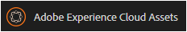

1. 管理ツールパネルの「**[!UICONTROL ブランディング]**」をクリックします。

   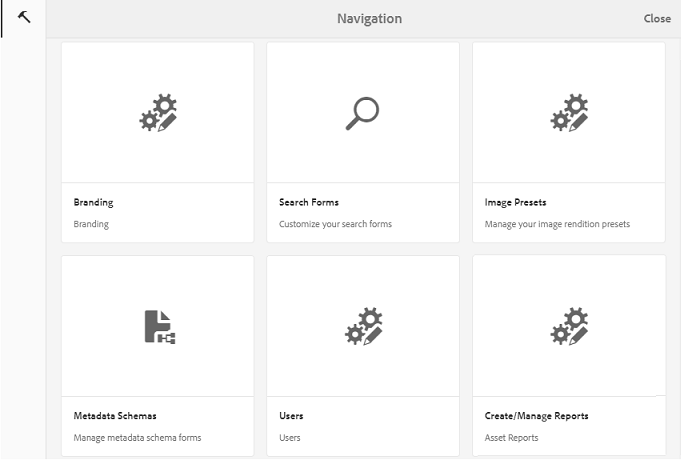

1. [!UICONTROL ブランディングの設定]ページの左レールでは、「[!UICONTROL 壁紙]」がデフォルトで選択されています。ログインページに表示されるデフォルトの背景画像が表示されています。

   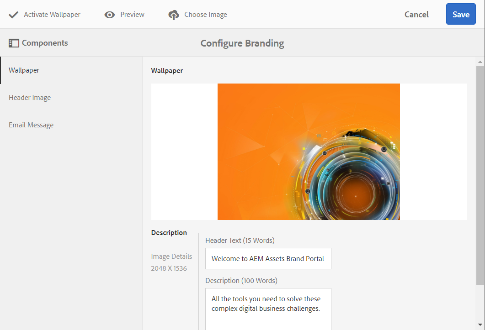

1. 新しい背景画像を追加するには、上部のツールバーの「**[!UICONTROL 画像を選択]**」をクリックします。

   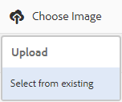

   次のいずれかの操作をおこないます。

   * お使いのコンピューターから画像をアップロードするには、「**[!UICONTROL アップロード]**」をクリックします。必要な画像に移動してアップロードします。
   * Brand Portal の既存の画像を使用するには、「**[!UICONTROL 既存から選択]**」をクリックします。アセットピッカーを使用して画像を選択します。
   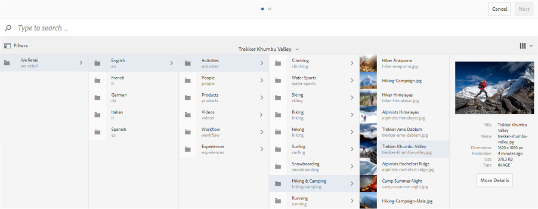

1. 背景画像のヘッダーテキストと説明を指定します。変更内容を保存するには、上部のツールバーの「**[!UICONTROL 保存]**」をクリックします。

1. 上部のツールバーの「**[!UICONTROL プレビュー]**」アイコンをクリックして、画像を含む Brand Portal インターフェイスのプレビューを生成します。

   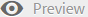

   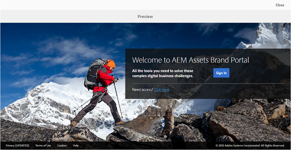

1. デフォルトの壁紙をアクティベートまたはアクティベート解除するには、**[!UICONTROL ブランディングを設定／壁紙]**&#x200B;ページで、以下の操作を実行します。

   * Brand Portal ログインページにデフォルトの壁紙画像を表示するには、上部のツールバーの「**[!UICONTROL 壁紙のアクティベートを解除]**」をクリックします。カスタム画像のアクティベート解除を確認するメッセージが表示されます。
   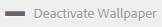

   * Brand Portal ログインページにカスタム画像を再度表示するには、ツールバーの「**[!UICONTROL 壁紙をアクティベート]**」をクリックします。カスタム画像の再度表示を確認するメッセージが表示されます。
   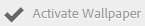

   * 「**[!UICONTROL 保存]**」をクリックして、変更を保存します。

## ヘッダーのカスタマイズ {#customize-the-header}

Brand Portal にログインすると、ヘッダーが様々な Brand Portal ページに表示されます。

1. 上部の AEM ツールバーでアドビのロゴをクリックして、管理ツールにアクセスします。

   

1. 管理ツールパネルの「**[!UICONTROL ブランディング]**」をクリックします。

   

1. Brand Portal インターフェイスのページヘッダーをカスタマイズするには、[!UICONTROL ブランディングを設定]ページの左レールから「**[!UICONTROL ヘッダーの画像]**」を選択します。デフォルトのヘッダー画像が表示されています。

   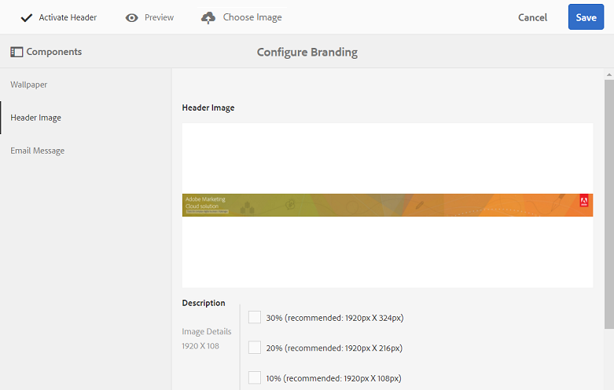

1. ヘッダー画像をアップロードするには、「**[!UICONTROL 画像を選択]**」アイコンをクリックし、「**[!UICONTROL アップロード]**」を選択します。

   Brand Portal の既存の画像を使用するには、「**[!UICONTROL 既存から選択]**」を選択します。

   

   アセットピッカーを使用して画像を選択します。

   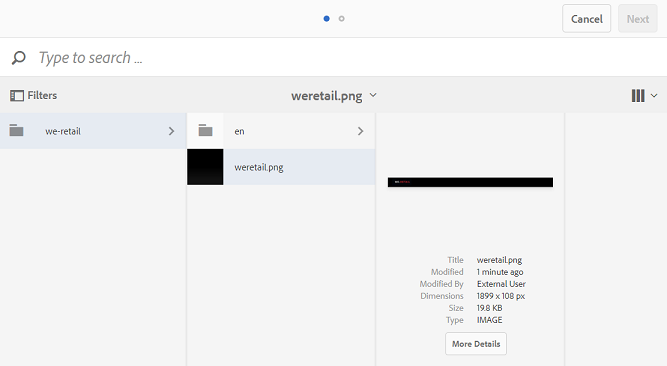

1. ヘッダー画像に URL を含めるには、「[!UICONTROL 画像 URL]」ボックスに URL を指定します。外部または内部 URL を指定できます。内部リンクの場合は、
   例えば [!UICONTROL `/mediaportal.html/content/dam/mac/tenant_id/tags`] のように、相対リンクにすることもできます。
このリンクをクリックすると、tags フォルダーに移動します。変更内容を保存するには、上部のツールバーの「**[!UICONTROL 保存]**」をクリックします。

   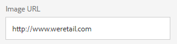

1. 上部のツールバーの「**[!UICONTROL プレビュー]**」アイコンをクリックして、ヘッダー画像を含む Brand Portal インターフェイスをプレビューします。

   
   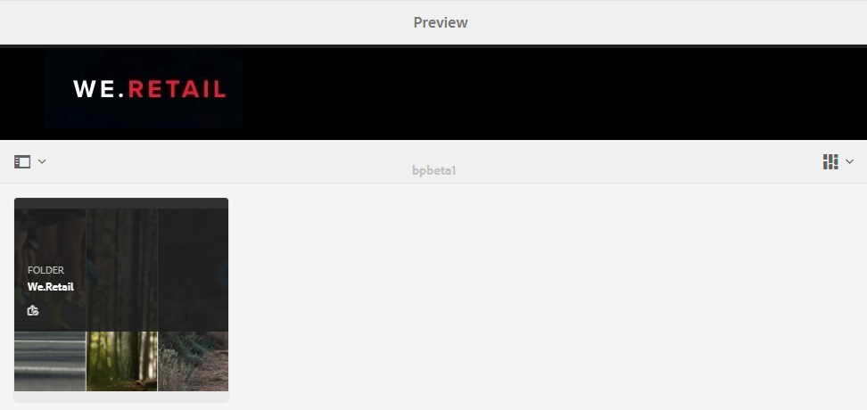

1. ヘッダー画像をアクティベートまたはアクティベート解除するには、**[!UICONTROL ブランディングを設定／ヘッダーの画像]**&#x200B;ページで、以下の操作を実行します。

   * Brand Portal ページにヘッダー画像を表示しない場合は、上部のツールバーの「**[!UICONTROL ヘッダーのアクティベートを解除]**」をクリックします。ヘッダー画像のアクティベート解除を確認するメッセージが表示されます。
   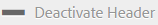

   * Brand Portal ページにヘッダー画像を再度表示するには、上部のツールバーの「**[!UICONTROL ヘッダーをアクティベート]**」をクリックします。ヘッダー画像のアクティベートを確認するメッセージが表示されます。
   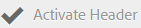

   * 「**[!UICONTROL 保存]**」をクリックして、変更を保存します。

## 電子メールメッセージのカスタマイズ {#customize-the-email-messaging}

アセットをリンクとして共有すると、そのリンクを含む電子メールがユーザーに届きます。管理者は、これらの電子メールのメッセージ内容、つまりロゴ、説明およびフッターをカスタマイズできます。

1. 上部の AEM ツールバーでアドビのロゴをクリックして、管理ツールにアクセスします。

   

1. 管理ツールパネルの「**[!UICONTROL ブランディング]**」をクリックします。

   

1. アセットをリンクとして共有したり電子メールを介してダウンロードしたりする場合や[!UICONTROL コレクション]を共有する場合は、ユーザーに電子メール通知が送信されます。電子メールメッセージをカスタマイズするには、[!UICONTROL ブランディングを設定]ページの左レールから「**[!UICONTROL 電子メールメッセージ]**」を選択します。

   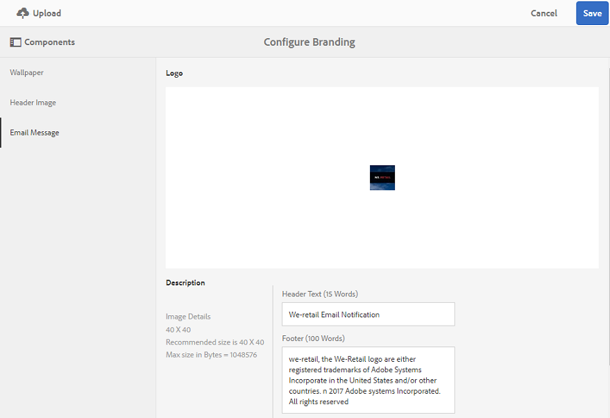

1. 送信する電子メールにロゴを追加するには、上部のツールバーの「**[!UICONTROL アップロード]**」をクリックします。

1. 「[!UICONTROL 説明]」セクションで、電子メールのヘッダーとフッターのテキストを指定します。変更内容を保存するには、上部のツールバーの「**[!UICONTROL 保存]**」をクリックします。

   >[!NOTE]
   >
   >ロゴを推奨サイズで使用していない場合や、ヘッダーやフッターのテキストが推奨単語数を超えている場合は、電子メールメッセージのコンテンツが判読できなくなる場合があります。
