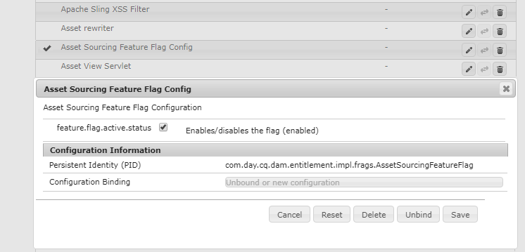
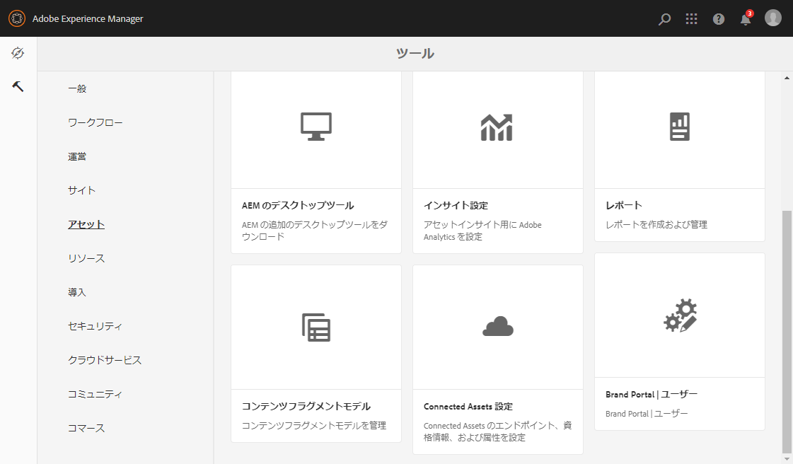
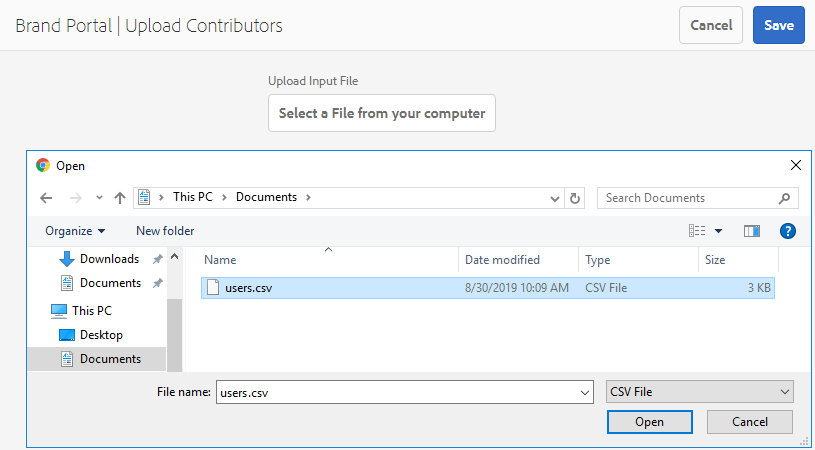

# アセットソーシングの設定 {#configure-asset-sourcing}

AEM 管理者は、AEM オーサーインスタンス内から&#x200B;**アセットソーシング**&#x200B;を設定できます。管理者は、**AEM Web コンソール設定**&#x200B;からアセットソーシング機能のフラグ設定を有効にし、アクティブな Brand Portal ユーザーリストを **AEM Assets** にアップロードします。

>[!NOTE]
>
>設定を開始する前に、AEM Assets インスタンスと Brand Portal の連携が設定されていることを確認します。[AEM Assets と Brand Portal の連携の設定](../using/configure-aem-assets-with-brand-portal.md)を参照してください。

次のビデオでは、AEM オーサーインスタンスでアセットソーシングを設定する方法について説明します。

>[!VIDEO](https://video.tv.adobe.com/v/29771?captions=jpn)

## アセットソーシングの有効化 {#enable-asset-sourcing}

AEM 管理者は、AEM Web コンソール設定（Configuration Manager）内からアセットソーシングを有効にできます。

**アセットソーシングを有効にするには：**
1. AEM オーサーインスタンスにログインして、Configuration Manager（デフォルト URL：http:// localhost:4502/system/console/configMgr）を開きます。
1. キーワード「**Asset Sourcing**」を使用して検索し、**[!UICONTROL Asset Sourcing Feature Flag Config]** を探します。
1. 「**[!UICONTROL Asset Sourcing Feature Flag Config]**」をクリックして、設定ウィンドウを開きます。
1. 「**[!UICONTROL feature.flag.active.status]**」チェックボックスを有効にします。
1. 「**[!UICONTROL 保存]**」をクリックします。

## Brand Portal ユーザーリストのアップロード {#upload-bp-user-list}

AEM 管理者は、AEM Assets のアクティブな Brand Portal ユーザーリストを含む Brand Portal ユーザー 設定（.csv）ファイルをアップロードできます。投稿フォルダーは、ユーザーリストで定義されたアクティブな Brand Portal ユーザーのみ共有できます。また、管理者は、設定ファイルに新規ユーザーを追加して、変更したユーザーリストをアップロードできます。

>[!NOTE]
>
>CSV ファイルの形式は、Admin Console での一括ユーザー読み込みでサポートされている形式と同じです。電子メールと氏名は必須です。

管理者は、AEM Admin Console で新規ユーザーを追加できます。詳しくは、[ユーザーの管理](brand-portal-adding-users.md)を参照してください。Admin Console でユーザーを追加したら、これらのユーザーを Brand Portal ユーザー設定ファイルに追加して、投稿フォルダーへのアクセス権を割り当てることができます。

**Brand Portal ユーザーリストをアップロードするには：**
1. AEM オーサーインスタンス（デフォルト URL：http:// localhost:4502/aem/start.html）にログインします。
1. **ツール**（）パネルで、**[!UICONTROL アセット／Brand Portal ユーザー]**に移動します。
   
1. Brand Portal 寄稿者をアップロードウィンドウが開きます。ローカルマシンから参照して、アクティブな Brand Portal ユーザーリストを含む&#x200B;**設定（.csv）ファイル**&#x200B;をアップロードします。
1. 「**[!UICONTROL 保存]**」をクリックします。
   

管理者は、投稿フォルダーを設定する際に、このユーザーリストから特定のユーザー／グループに対してアクセス権を付与できます。

詳しくは、[投稿フォルダーの設定](brand-portal-contribution-folder.md)を参照してください。
