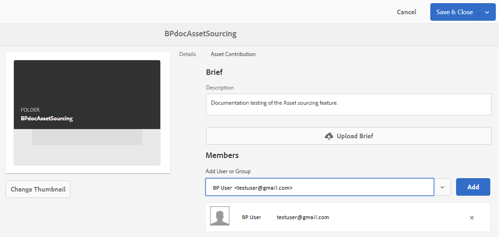

# コントリビューションフォルダーのプロパティの設定 {#configure-contribution-folder-properties}

AEM 管理者は、コントリビューションフォルダーのプロパティを設定する際に、次のアクティビティを実行します。

* **説明を追加**：コントリビューションフォルダーの大まかな説明を提供します。
* **概要をアップロード**：アセット関連情報を含むアセット要件ドキュメントをアップロードします。
* **寄稿者を追加**：コントリビューションフォルダーへのアクセス権を付与するために Brand Portal ユーザーまたはグループを追加します。

アセット要件は、管理者によって提供された詳細を参照して、寄稿者（Brand Portal ユーザー）がコントリビューションフォルダーのニーズおよび要件を理解できるようにします。管理者は、コントリビューションフォルダーに追加する必要があるアセットのタイプおよびアセット関連情報（目的、画像のタイプ、最大サイズなど）に関する概要を含むアセット要件ドキュメントをアップロードします。

その後、管理者は、Brand Portal ユーザー／グループに投稿フォルダーへのアクセス権を付与してから、新しく作成した投稿フォルダーを Brand Portal に公開できます。

**コントリビューションフォルダーのプロパティを設定するには：**
1. AEM オーサーインスタンス（デフォルト URL：http:// localhost:4502/aem/start.html）にログインします。
1. **[!UICONTROL アセット／ファイル]**&#x200B;に移動して、コントリビューションフォルダーを探します。
1. コントリビューションフォルダー を選択して、「**[!UICONTROL プロパティ]**」（）をクリックします。フォルダーのプロパティウィンドウが開きます。
   
1. 「**[!UICONTROL アセットコントリビューション]**」タブに移動します。
1. コントリビューションフォルダーの大まかな&#x200B;**[!UICONTROL 説明]**&#x200B;を入力します。
1. **[!UICONTROL 概要をアップロード]**  をクリックし、ローカルマシンから参照して&#x200B;**アセット要件ドキュメント**&#x200B;をアップロードします。
1. 「**[!UICONTROL ユーザーまたはグループを追加]**」で、コントリビューションフォルダーを共有したい Brand Portal ユーザーまたはグループを検索して「**[!UICONTROL 追加]**」します。これらの Brand Portal ユーザー／グループには、コントリビューションフォルダーにアクセスしたり、AEM オーサーインスタンスにアクセスすることなく Brand Portal インターフェイスからコンテンツをアップロードしたりする権限があります。
1. 「**[!UICONTROL 保存]**」をクリックします。
   

>[!NOTE]
>
>検索結果は、AEM Assets に設定された Brand Portal ユーザーリストに基づきます。Brand Portal ユーザーリストを更新しておくようにします。[Brand Portal ユーザーリストのアップロード](brand-portal-upload-user-list.md)を参照してください。