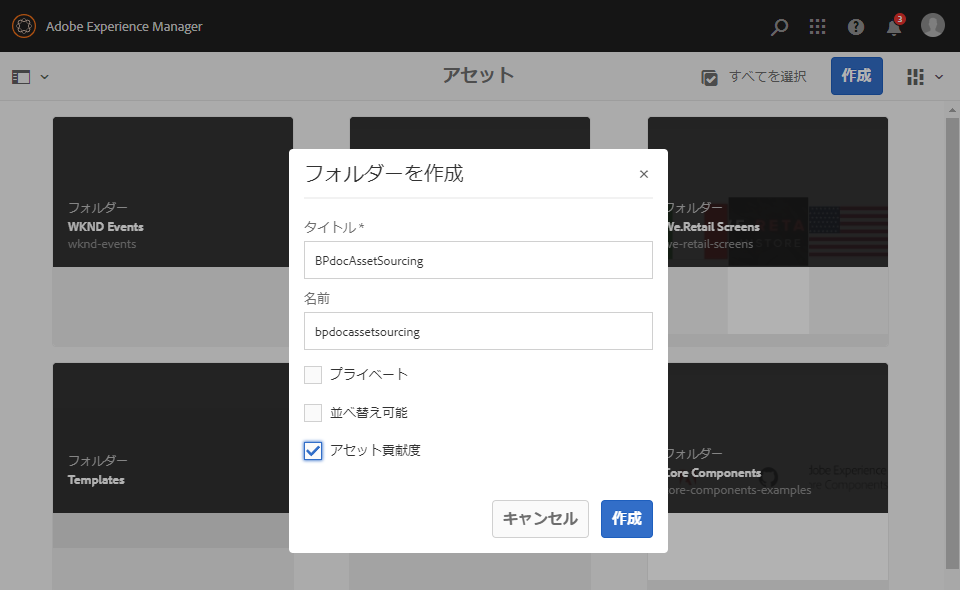
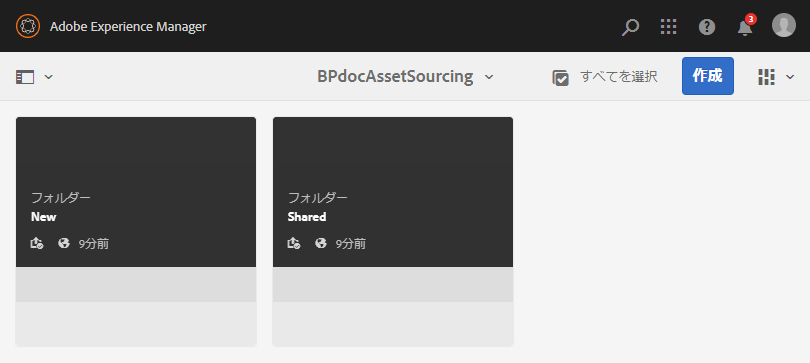

# 投稿フォルダーの作成 {#create-contribution-folder}

AEM 管理者と、新しいフォルダーを作成する権限を持つ非管理者ユーザーは、AEM Assets に投稿フォルダーを作成できます。投稿フォルダーを作成するには、アセット投稿タイプの新しいフォルダーを作成します。作成した新しいフォルダーは Brand Portal ユーザーによるアセット送信に利用できるようになります。これにより、投稿フォルダー内に SHARED および NEW という 2 つのサブフォルダーを追加作成するワークフローが自動的にトリガーされます。

>[!NOTE]
>
>1 つのフォルダー内に複数の投稿フォルダーを作成できますが、投稿フォルダー内に別の投稿フォルダーは作成できません。

投稿フォルダーを作成するには：
1. AEM オーサーインスタンスにログインします。

   デフォルト URL は http:// localhost:4502/aem/start.html です。

1. **[!UICONTROL Assets]**／**[!UICONTROL ファイル]**&#x200B;に移動します。AEM Assets リポジトリの既存のすべてのフォルダーがリストされます。

1. 「**[!UICONTROL 作成]**」をクリックして、新規フォルダーを作成します。「**[!UICONTROL フォルダーを作成]**」ダイアログが開きます。

1. フォルダーの「**[!UICONTROL タイトル]**」および「**[!UICONTROL 名前]**」を入力し、「**[!UICONTROL アセット投稿]**」チェックボックスをオンにします。フォルダーの名前には、スペースを含まない小文字のアルファベットを使用することをお勧めします。

1. 「**[!UICONTROL 作成]**」をクリックします。AEM Assets リポジトリに、投稿フォルダーがリストされます。

   >[!NOTE]
   >
   >管理者以外のユーザーは、アセット投稿フォルダーを作成および共有できますが、変更または削除することはできません。

   

1. クリックして投稿フォルダーを開くと、投稿フォルダー内に **[!UICONTROL SHARED]** と **[!UICONTROL NEW]** の 2 つのサブフォルダーが自動的に作成されているのがわかります。

   

これで、[投稿フォルダーのプロパティを設定](brand-portal-configure-contribution-folder-properties.md)できるようになりました。

