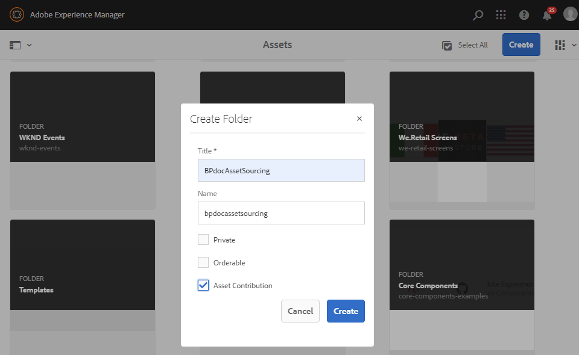

# 投稿フォルダーの作成 {#create-contribution-folder}

AEM 管理者と、新しいフォルダーを作成する権限を持つ非管理者ユーザーは、AEM Assets に&#x200B;**投稿**&#x200B;フォルダーを作成できます。**投稿**&#x200B;フォルダーを作成するには、**アセット投稿**&#x200B;タイプの新しいフォルダーを作成します。作成した新しいフォルダーは Brand Portal ユーザーによるアセット送信に利用できるようになります。これにより、新しく作成された&#x200B;**投稿**&#x200B;フォルダー内に **SHARED** および **NEW** という 2 つのサブフォルダーを追加作成するワークフローが自動的にトリガーされます。

**新しい投稿フォルダーを作成するには：**
1. AEM オーサーインスタンス（デフォルト URL：http:// localhost:4502/aem/start.html）にログインします。
1. **[!UICONTROL アセット／ファイル]**&#x200B;に移動します。AEM Assets リポジトリの既存のすべてのフォルダーがリストされます。
1. 「**[!UICONTROL 作成]**」をクリックして、新規フォルダーを作成します。フォルダーを作成ポップアップウィンドウが開きます。
1. フォルダーの「**[!UICONTROL タイトル]**」および「**[!UICONTROL 名前]**」を入力し、「**[!UICONTROL アセット投稿]**」チェックボックスをオンにします。フォルダーの名前には、スペースを含まない小文字のアルファベットを使用することをお勧めします。
1. 「**[!UICONTROL 作成]**」をクリックします。
   
1. AEM Assets リポジトリに、新しく作成した投稿フォルダーがリストされます。
1. クリックして投稿フォルダーを開くと、投稿フォルダー内に **[!UICONTROL SHARED]** と **[!UICONTROL NEW]** の 2 つのサブフォルダーが自動的に作成されているのがわかります。\
   

これで、投稿フォルダーのプロパティを設定できるようになりました。[投稿フォルダーのプロパティの設定](brand-portal-configure-contribution-folder-properties.md)を参照してください。

>[!NOTE]
>
>作成後にフォルダー名を変更できないので、投稿フォルダーには適切な名前を付けてください。