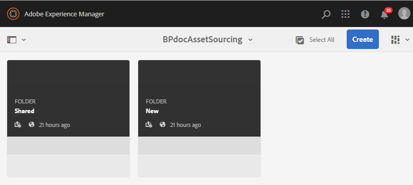

# コントリビューションフォルダーの作成 {#create-contribution-folder}

AEM管理者および管理者以外のユーザーは、新しいフォルダーを作成する権限を持ち、AEM Assetsで **Contribution** （貢献度）フォルダーを作成できます。
貢献度フォルダーを作 **成するには******、作成した新しいフォルダーがBrand portalユーザーがアセット送信用に開いていることを確認し、アセット貢献度タイプの新しいフォルダーを作成します。  これにより、新しく作成された&#x200B;**コントリビューション**&#x200B;フォルダー内に **SHARED** および **NEW** という 2 つのサブフォルダーを追加作成するワークフローが自動的にトリガーされます。

**新しいコントリビューションフォルダーを作成するには：**
1. AEM オーサーインスタンス（デフォルト URL：http:// localhost:4502/aem/start.html）にログインします。
1. **[!UICONTROL アセット／ファイル]**に移動します。AEM Assets リポジトリの既存のすべてのフォルダーがリストされます。
1. 「**[!UICONTROL 作成]**」をクリックして、新規フォルダーを作成します。フォルダーを作成ポップアップウィンドウが開きます。
1. フォルダーの「**[!UICONTROL タイトル]**」および「**[!UICONTROL &#x200B;名前]**」を入力し、「**[!UICONTROL アセットコントリビューション]**」チェックボックスをオンにします。フォルダーの名前には、スペースを含まない小文字のアルファベットを使用することをお勧めします。
1. 「**[!UICONTROL 作成]**」をクリックします。   
1. AEM Assets リポジトリに、新しく作成したコントリビューションフォルダーがリストされます。
1. クリックしてコントリビューションフォルダーを開くと、コントリビューションフォルダー内に **[!UICONTROL SHARED]**と**[!UICONTROL  NEW]** の 2 つのサブフォルダーが自動的に作成されているのがわかります。\
   

貢献度フォルダーのプロパティを設定できるようになりました。 [コントリビューションフォルダーのプロパティの設定](brand-portal-configure-contribution-folder-properties.md)を参照してください。

>[!NOTE]
>
>作成後にフォルダー名を変更できないので、貢献度フォルダーに適切な名前を指定してください。