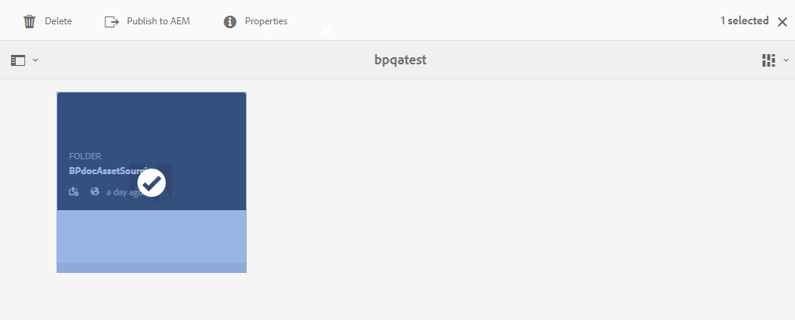
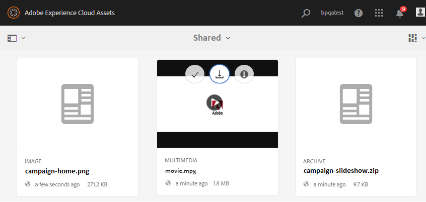

# アセット要件のダウンロード {#using-asset-souring-in-bp}

Brand Portal ユーザーは、コントリビューションフォルダーが AEM ユーザーによって共有されるたびに、電子メール／パルス通知を自動的に受け取ります。これにより、アセット要件を確実に理解するための概要（アセット要件）ドキュメントおよびベースラインアセット（参照用コンテンツ）を **SHARED** フォルダーからダウンロードできます。

Brand Portal ユーザーは、アセット要件をダウンロードするために、次のアクティビティを実行します。

* **概要をダウンロード**：コントリビューションフォルダーに添付されている概要（アセット要件ドキュメント）をダウンロードします。アセットのタイプ、目的、サポートする形式、最大アセットサイズなどのアセット関連情報が含まれます。
* **ベースラインアセットをダウンロード**：必要なアセットのタイプを理解するために使用できるベースラインアセットをダウンロードします。Brand Portal ユーザーは、これらのアセットを参照用に使用して、コントリビューション用の新しいアセットを作成します。

新しく共有されたコントリビューションフォルダーと共に、Brand Portal ユーザーに対して許可された既存のすべてのフォルダーが Brand Portal ダッシュボードに反映されます。この例では、Brand Portal ユーザーのみが新しく作成されたコントリビューションフォルダーへのアクセス権を持ち、他の既存のフォルダーはユーザーと共有されていません。

**アセット要件をダウンロードするには：**

1. Brand Portal インスタンスにログインします。
1. Brand Portal ダッシュボードからコントリビューションフォルダーを選択します。
1. 「**[!UICONTROL プロパティ]**」（）をクリックします。プロパティウィンドウが開き、アセットコントリビューションフォルダーの詳細が表示されます。
   
1. 「**[!UICONTROL 概要をダウンロード]**」（）をクリックして、アセット要件ドキュメントをローカルマシンにダウンロードします。
   
1. Brand Portal ダッシュボードに戻ります。
1. クリックしてコントリビューションフォルダーを開くと、コントリビューションフォルダー内に **[!UICONTROL SHARED]** と **[!UICONTROL NEW]** の 2 つのサブフォルダーが表示されます。SHARED フォルダーには、管理者によって共有されたすべてのベースラインアセット（参照用コンテンツ）が含まれます。
1. すべてのベースラインアセットを含む **[!UICONTROL SHARED]** フォルダーをローカルマシンにダウンロードできます。または、**[!UICONTROL SHARED]** フォルダーを開き、**ダウンロード** アイコン（）をクリックして、個別のファイル／フォルダーをダウンロードできます。
   

概要（アセット要件ドキュメント）を確認し、ベースラインアセットを参照して、アセット要件を理解します。これで、コントリビューション用の新しいアセットを作成して、コントリビューションフォルダーにアップロードできます。[コントリビューションフォルダーへのアセットのアップロード](brand-portal-upload-assets-to-contribution-folder.md)を参照してください。

