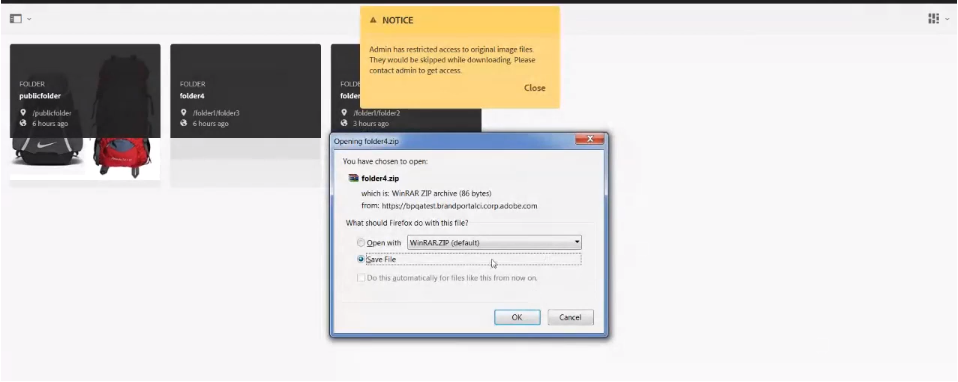

# アセットのダウンロード {#download-assets}

<!-- Before update in Download experience - 26th Aug 2020 by Vishabh.
 All users can simultaneously download multiple assets and folders accessible to them from Brand Portal. This way, approved brand assets can be securely distributed for offline use. Read on to know how to download approved assets from Brand Portal, and what to expect from the [download performance](../using/brand-portal-download-assets.md#main-pars-header).
-->

Adobe Experience Manager Assets Brand Portal は、Brand Portal から複数のアセットやフォルダーに同時にアクセスできるようにすることで、ダウンロード体験を強化します。これにより、承認されたブランドアセットを安全に配布して、オフラインで使用できます。Brand Portal から承認済みアセットをダウンロードする方法や、[ダウンロードパフォーマンス](../using/brand-portal-download-assets.md#expected-download-performance)から期待されることについてお読みください。

>[!NOTE]
>
>Brand Portal からアセットをダウンロードする前に、ブラウザーの拡張機能に IBM Aspera Connect 3.9.9 をインストールします。

<!--
**Types of renditions in Brand Portal:**

* Original asset rendition

  It is the original binary of the asset uploaded in AEM Assets. 
  
  
* System renditions

  These are the thumbnail renditions which are automatically generated in AEM Assets based on the "DAM update asset" workflow. 
  
* Custom renditions

  These are the additional renditions that an asset might have and its dynamic renditions. Any user can create additional custom renditions, whereas, only the AEM administrator can create dynamic renditions of an image in AEM Assets. To know more, see [how to apply image presets or dynamic renditions](../using/brand-portal-image-presets.md).     
-->

## アセットのダウンロード設定 {#configure-download}

ダウンロード設定を使用すると、Brand Portal 管理者は、Brand Portal ユーザーがアセットをダウンロードするために使用できるレンディションのセットを定義できます。管理者は、Brand Portal インターフェイスからアセットの&#x200B;**[!UICONTROL ダウンロード]**&#x200B;設定がおこなえます。

利用可能な設定は以下の通りです。

* **[!UICONTROL 高速ダウンロード]**

   アセットの高速ダウンロードを有効にします。詳しくは、[Brand Portal からのダウンロードを高速化するためのガイド](../using/accelerated-download.md)を参照してください。

* **[!UICONTROL カスタムレンディション]**

   アセットのカスタムレンディションおよび（または）動的レンディションをダウンロードします。
元のアセットおよびシステム生成レンディション以外のすべてのアセットレンディションは、カスタムレンディションと呼ばれます。これには、アセットに使用できる静的レンディションと動的レンディションが含まれます。どのユーザーも AEM Assets でカスタムの静的レンディションを作成できますが、カスタムの動的レンディションを作成できるのは AEM 管理者のみです。詳しくは、[画像プリセットまたは動的レンディションの適用方法](../using/brand-portal-image-presets.md)を参照してください

* **[!UICONTROL システムレンディション]**

   アセットのシステム生成されたレンディションをダウンロードします。これらは、「DAM アセットの更新」ワークフローに基づいて、AEM Assets で自動的に生成されるサムネールです。

Brand Portal テナントに管理者としてログインし、**[!UICONTROL ツール]**／**[!UICONTROL ダウンロード]**&#x200B;に移動します。デフォルトでは、**[!UICONTROL 高速ダウンロード]**&#x200B;設定は&#x200B;**[!UICONTROL ダウンロード設定]**&#x200B;で有効になっています。

管理者は任意の組み合わせを有効にして、アセットのダウンロードプロセスを設定できます。

設定に基づき、ダウンロードワークフローは、スタンドアロンのアセット、複数のアセット、アセットを含むフォルダー、ライセンス取得済みアセットまたはライセンスを取得していないアセット、共有リンクを使用してダウンロードするアセットに対して一定に保たれます。

* **[!UICONTROL カスタムレンディション]**&#x200B;と&#x200B;**[!UICONTROL システムレンディション]**&#x200B;の両方の設定をオフにした場合、アセットの元のレンディションがダウンロードされますが、追加のダイアログは表示されません。

<!--
If all the three download configurations are turned-off, or only the **[!UICONTROL Fast Download]** configuration is enabled, the original assets are directly downloaded on your local system with no additional step required.
Test.. 
-->

* **[!UICONTROL カスタムレンディション]**&#x200B;または&#x200B;**[!UICONTROL システムレンディション]**&#x200B;の設定が有効になっている場合、追加の&#x200B;**[!UICONTROL ダウンロード]**&#x200B;ダイアログボックスが表示され、元のアセットとレンディションをダウンロードするか、特定のレンディションのみをダウンロードするかを選択できます。

>[!NOTE]
>
>管理者のみが、期限切れのアセットをダウンロードできます。有効期限が切れたアセットについて詳しくは、[アセットのデジタル著作権の管理](../using/manage-digital-rights-of-assets.md)を参照してください。

## アセットのダウンロード手順 {#steps-to-download-assets}

Brand Portal からアセットまたはアセットを含むフォルダーをダウンロードする手順は次のとおりです。

1. Brand Portal コンソールで、以下のいずれかの手順を実行します。

   * ダウンロードするフォルダーまたはアセットを選択します。上部のツールバーで「**[!UICONTROL ダウンロード]**」アイコンをクリックします。

      

   * 特定のアセットまたはフォルダーをダウンロードするには、アセットまたはフォルダーにポインターを置き、クイックアクションのサムネールに表示される&#x200B;**[!UICONTROL ダウンロード]**&#x200B;アイコンをクリックします。

      

      >[!NOTE]
      >
      >初めてアセットをダウンロードするときに、ブラウザーに IBM Aspera Connect がインストールされていない場合は、Aspera ダウンロードアクセラレーターをインストールするように求めるプロンプトが表示されます。

      >[!NOTE]
      >
      >ダウンロードするアセットに、ライセンスが必要なアセットが含まれている場合は、**[!UICONTROL 著作権管理]**&#x200B;ページにリダイレクトされます。このページで、アセットを選択し、「**[!UICONTROL 同意する]**」をクリックし、「**[!UICONTROL ダウンロード]**」をクリックします。「同意しない」を選択した場合は、ライセンスが必要なアセットはダウンロードされません。
      > 
      >ライセンスで保護されているアセットには、[使用許諾契約が添付](https://helpx.adobe.com/jp/experience-manager/6-5/assets/using/drm.html#DigitalRightsManagementinAssets)されています。この処理は、Experience Manager Assets でアセットの[メタデータプロパティ](https://helpx.adobe.com/jp/experience-manager/6-5/assets/using/drm.html#DigitalRightsManagementinAssets)を設定することでおこなわれます。

      

      **[!UICONTROL ダウンロード設定]**&#x200B;で、**[!UICONTROL カスタムレンディション]**&#x200B;または&#x200B;**[!UICONTROL システムレンディション]**&#x200B;の設定が有効になっている場合、デフォルトで「**[!UICONTROL アセット]**」チェックボックスが選択された状態で&#x200B;**[!UICONTROL ダウンロード]**&#x200B;ダイアログが表示されます。「**[!UICONTROL 高速ダウンロード]**」設定が有効の場合、デフォルトで「**[!UICONTROL ダウンロードアクセラレーションを有効化]**」チェックボックスがオンになっています。

      

      >[!NOTE]
      >
      >ダウンロードするアセットが画像ファイルで、**[!UICONTROL ダウンロード]**&#x200B;ダイアログで「**[!UICONTROL アセット]**」チェックボックスのみを選択しているが、[画像ファイルのオリジナルのレンディションへのアクセス権が管理者によって許可](../using/brand-portal-adding-users.md#main-pars-procedure-202029708)されていない場合は、画像ファイルはダウンロードされず、オリジナルのレンディションへのアクセスが管理者によって制限されていることを示す通知が表示されます。

      

1. 元のアセットに加えてレンディションをダウンロードするには、「**[!UICONTROL レンディション]**」チェックボックスをオンにします。ただし、システム生成レンディションとカスタムレンディションをダウンロードする場合は、「**[!UICONTROL システムレンディションを除外]**」チェックボックスをオフにします。

   

   * レンディションのみをダウンロードするには、「**[!UICONTROL アセット]**」チェックボックスをオフにします。

      >[!NOTE]
      >
      >デフォルトでは、アセットのみがダウンロードされます。ただし、[画像ファイルのオリジナルのレンディションへのアクセスが管理者によって許可](../using/brand-portal-adding-users.md#main-pars-procedure-202029708)されていない場合は、画像ファイルのオリジナルのレンディションはダウンロードされません。

   * 選択したアセットをリンク経由で他のユーザーと共有するには、「**[!UICONTROL 電子メール]**」チェックボックスをオンにします。ダウンロードリンクを含むユーザーに電子メール通知が送信されます。共有リンクからアセットをダウンロードする方法については、[共有リンクからアセットをダウンロードする](../using/brand-portal-link-share.md#main-pars-header-1703469193)を参照してください。

      

      >[!NOTE]
      >
      >電子メール通知に含まれるダウンロードリンクの有効期限は 45 日間です。
      >
      >管理者は、電子メールのメッセージ内容、つまりロゴ、説明およびフッターを、[ブランディング](../using/brand-portal-branding.md)機能を使用してカスタマイズできます。

   * 定義済みの画像プリセットを選択するか、**[!UICONTROL ダウンロード]**&#x200B;ダイアログボックスから、カスタム動的レンディションを作成できます。

      [アセットとそのレンディションにカスタムの画像プリセット](../using/brand-portal-image-presets.md#applyimagepresetswhendownloadingimages)を適用するには、「**[!UICONTROL 動的レンディション]**」チェックボックスをオンにします。カスタムの画像プロパティ（サイズ、フォーマット、カラースペース、解像度、画像の修飾子など）を指定して、アセットとそのレンディションをダウンロードするときにカスタムの画像プリセットを適用します。動的レンディションのみをダウンロードするには、「**[!UICONTROL アセット]**」チェックボックスをオフにします。

      

      >[!NOTE]
      >
      >Brand Portal では、ハイブリッドモードと Scene 7 モードの両方の Dynamic Media 設定をサポートしています。
      >
      >（*AEM オーサーインスタンスが&#x200B;**Dynamic Media ハイブリッドモード***で動作している場合）      >アセットの動的レンディションをプレビューまたはダウンロードするには、ダイナミックメディアが有効になっていて、アセットのピラミッド TIFF レンディションがアセットの公開元の AEM Assets オーサーインスタンスに存在している必要があります。Brand Portal にアセットを公開すると、そのピラミッド TIFF レンディションも公開されます。

   * アセットをダウンロードする際に Brand Portal のフォルダー階層を保持するには、「**[!UICONTROL アセットごとに別のフォルダーを作成]**」チェックボックスをオンにします。デフォルトでは、Brand Portal のフォルダー階層は無視され、すべてのアセットがローカルシステムの 1 つのフォルダーにダウンロードされます。

1. 「**[!UICONTROL ダウンロード]**」をクリックします。

   アセット（および選択されている場合はレンディション）が ZIP ファイルとしてローカルフォルダーにダウンロードされます。ただし、レンディションなしで 1 つのアセットをダウンロードした場合、zip ファイルは作成されません。

   管理者が、[元のレンディションへのアクセスを許可](../using/brand-portal-adding-users.md#main-pars-procedure-202029708)していない場合、選択したアセットの元のレンディションはダウンロードされません。

   >[!NOTE]
   >
   >個別にダウンロードしたアセットは、アセットダウンロードレポートに表示されます。ただし、アセットを含んだフォルダーをダウンロードした場合は、そのフォルダーもアセットも、アセットダウンロードレポートに表示されません。

## 期待されるダウンロードパフォーマンス {#expected-download-performance}

ユーザーのクライアントが様々な場所にある場合、ファイルのダウンロードエクスペリエンスは、ローカルのインターネット接続やサーバーのレイテンシなどの要因によって異なります。2 GB のファイルを様々なクライアントの場所でダウンロードする際に期待されるパフォーマンスは次のとおりです（Brand Portal のサーバーは米国オレゴン州にあるものとします）。

| クライアントの場所 | クライアントとサーバーの間のレイテンシ | 予想されるダウンロード速度 | 2 GB ファイルのダウンロード所要時間 |
|-------------------------|-----------------------------------|-------------------------|------------------------------------|
| 米国西部（北カリフォルニア） | 18 ミリ秒 | 7.68 MB/秒 | 4 分 |
| 米国西部（オレゴン） | 42 ミリ秒 | 3.84 MB/秒 | 9 分 |
| 米国東部（北バージニア） | 85 ミリ秒 | 1.61 MB/秒 | 21 分 |
| APAC（東京） | 124 ミリ秒 | 1.13 MB/秒 | 30 分 |
| ノイダ | 275 ミリ秒 | 0.5 MB/秒 | 68 分 |
| シドニー | 175 ミリ秒 | 0.49 MB/秒 | 69 分 |
| ロンドン | 179 ミリ秒 | 0.32 MB/秒 | 106 分 |
| シンガポール | 196 ミリ秒 | 0.5 MB/秒 | 68 分 |

>[!NOTE]
>
>引用したデータは、テスト条件下において確認されたものであり、レイテンシや帯域幅の異なる場所にいるユーザーの場合は結果が異なる可能性があります。

