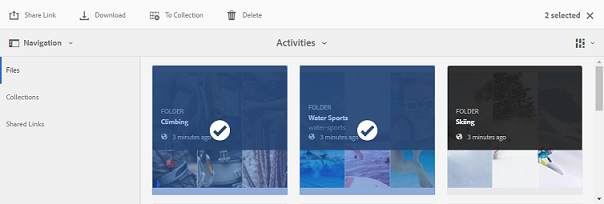
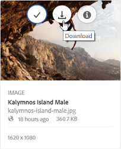

# Brand Portalからアセットをダウンロード{#download-assets-from-bp}

<!-- Before update in Download experience - 26th Aug 2020 comment by Vishabh.
 All users can simultaneously download multiple assets and folders accessible to them from Brand Portal. This way, approved brand assets can be securely distributed for offline use. Read on to know how to download approved assets from Brand Portal, and what to expect from the [download performance](../using/brand-portal-download-assets.md#main-pars-header).
-->

Adobe Experience Manager Assets Brand Portal は、Brand Portal から複数のアセットやフォルダーに同時にアクセスできるようにすることで、ダウンロード体験を強化します。これにより、承認されたブランドアセットを安全に配布して、オフラインで使用できます。Brand Portal から承認済みアセットをダウンロードする方法や、[ダウンロードパフォーマンス](../using/brand-portal-download-assets.md#expected-download-performance)から期待されることについてお読みください。

>[!NOTE]
>
>Brand Portal 2020.10.0（およびそれ以降）では、**[!UICONTROL 高速ダウンロード]**&#x200B;設定がデフォルトで有効になっています。この設定は、IBM Aspera Connectを使用してアセットのダウンロードを高速化します。 [Brand Portal からアセットをダウンロードする前に、ブラウザーの拡張機能に IBM Aspera Connect 3.9.9 をインストールします。](https://www.ibm.com/support/knowledgecenter/SSXMX3_3.9.9/kc/connect_welcome.html)詳しくは、[Brand Portal](../using/accelerated-download.md)からのダウンロードを高速化するガイドを参照してください。
>
>IBM Aspera Connectを使用せず、通常のダウンロード処理を続行する場合は、Brand Portal管理者に連絡して、**[!UICONTROL 高速ダウンロード]**&#x200B;の設定をオフにしてください。

## アセットのダウンロード設定 {#configure-download}

Brand Portal管理者は、Brand Portalユーザーのアセットのダウンロードとユーザーグループの設定を構成できます。これにより、Brand Portalインターフェイスからアセットのレンディションにアクセスしてダウンロードできます。

>[!NOTE]
>
>ユーザーインターフェイスに適用されるダウンロード設定を使用すると、Brand Portalユーザーに対するセルフサービス体験が容易になり、アセットレンディションを簡単に設定およびダウンロードできます。 アプリケーションレイヤーでのアセットのダウンロードは制限されません。例えば、完全なURLパスを使用してアセットレンディションにアクセスしたり、アセットレンディションをダウンロードしたりできます。

Brand Portalインターフェイスからアセットレンディションにアクセスしてダウンロードする方法は、次の設定で定義されます。

* ダウンロード設定を有効にする
* ユーザーグループの設定

### ダウンロード設定を有効にする{#enable-download-settings}

管理者は、アセット&#x200B;**[!UICONTROL 設定をダウンロード]**&#x200B;を有効にして、Brand Portalユーザーがダウンロードできる一連のレンディションを定義できます。

次の設定を使用できます。

* **[!UICONTROL 高速ダウンロード]**

   IBM Aspera Connectを使用して、アセットのダウンロードを高速化します。 デフォルトでは、**[!UICONTROL 高速ダウンロード]**&#x200B;設定は、**[!UICONTROL ダウンロード設定]**&#x200B;で有効になっています。

* **[!UICONTROL カスタムレンディション]**

   アセットのカスタムレンディションおよび（または）動的レンディションのダウンロードを有効にします。

   元のアセットおよびシステム生成レンディション以外のすべてのアセットレンディションは、カスタムレンディションと呼ばれます。 これには、アセットに使用できる静的レンディションと動的レンディションが含まれます。どのユーザーも AEM Assets でカスタムの静的レンディションを作成できますが、カスタムの動的レンディションを作成できるのは AEM 管理者のみです。詳しくは、[画像プリセットまたはダイナミックレンディションの適用方法](../using/brand-portal-image-presets.md)を参照してください。

* **[!UICONTROL システムレンディション]**

   システム生成のアセットレンディションのダウンロードを有効にします。

   これらは、「DAM アセットの更新」ワークフローに基づいて、AEM Assets で自動的に生成されるサムネールです。

Brand Portal テナントに管理者としてログインし、**[!UICONTROL ツール]**／**[!UICONTROL ダウンロード]**&#x200B;に移動します。

管理者は、Brand Portalユーザがレンディションにアクセスしてダウンロードするための設定を任意に組み合わせることができます。

>[!NOTE]
>
>管理者のみが、期限切れのアセットをダウンロードできます。有効期限が切れたアセットについて詳しくは、[アセットのデジタル著作権の管理](../using/manage-digital-rights-of-assets.md)を参照してください。

### ユーザーグループ設定を構成{#configure-user-group-settings}

**[!UICONTROL ダウンロード設定]**&#x200B;に加えて、Brand Portal管理者は、様々なユーザーグループの設定を表示に対してさらに構成し、元のアセットとそのレンディションを（または）ダウンロードできます。

Brand Portalテナントに管理者としてログインし、**[!UICONTROL ツール]**/**[!UICONTROL ユーザー]**&#x200B;に移動します。 **[!UICONTROL ユーザーの役割]**&#x200B;ページで、**[!UICONTROL グループ]**&#x200B;タブに移動し、ユーザーグループの表示および（または）ダウンロード設定を構成します。

>[!NOTE]
>
>ユーザーが複数のグループに追加されていて、そのいずれかのグループが制約を受ける場合、そのユーザーにはこの制約が適用されます。

設定に基づき、ダウンロードワークフローは、スタンドアロンのアセット、複数のアセット、アセットを含むフォルダー、ライセンス取得済みアセットまたはライセンスを取得していないアセット、共有リンクを使用してダウンロードするアセットに対して一定に保たれます。

次のマトリックスは、[ダウンロードの設定](#configure-download)に応じて、ユーザーがレンディションにアクセスできるかどうかを定義します。

| **ダウンロード設定：カスタムレンディション** | **ダウンロード設定：システムレンディション** | **ユーザーグループの設定：オリジナルをダウンロード** | **ユーザーグループの設定：レンディションをダウンロード** | **結果** |
|---|---|---|---|---|
| オン | オン | オン | オン | すべてのレンディションを表示してダウンロードする |
| オン | オン | OFF | オフ | 表示の元のアセット |
| オフ | オフ | オン | オン | 元のアセットの表示とダウンロード |
| オン | オフ | オン | オン | 元のアセットとカスタムレンディションの表示とダウンロード |
| オフ | オン | オン | オン | 元のアセットとシステムレンディションの表示とダウンロード |
| オン | オフ | オフ | オフ | 表示の元のアセット |
| オフ | オン | オフ | オフ | 表示の元のアセット |
| オフ | オフ | オフ | オン | 表示の元のアセット |
| オフ | オフ | オン | オフ | 元のアセットの表示とダウンロード |
| オフ | オフ | オフ | オフ | 表示の元のアセット |

## アセットのダウンロード {#download-assets}

Brand Portalのユーザーは、Brand Portalインターフェイスから複数のアセット、アセットを含むフォルダー、コレクションをダウンロードできます。

>[!NOTE]
>
>アセットレンディションにアクセスまたはダウンロードする権限がない場合は、Brand Portal管理者に問い合わせてください。

ユーザーがレンディションにアクセスできる場合は、次の機能を備えた拡張&#x200B;**[!UICONTROL ダウンロード]**&#x200B;ダイアログが提供されます。
* ダウンロードリストで任意のアセットの使用可能なすべてのレンディションを表示する。
* ダウンロードに必要でないアセットのレンディションを除外する。
* 1回のクリックで、同じレンディションのセットを類似するすべてのアセットタイプに適用できます。
* アセットタイプごとに異なるレンディションのセットを適用します。
* アセットレンディションごとに個別のフォルダーを作成します。
* 選択したアセットとレンディションをダウンロードする。

>[!NOTE]
>
>**[!UICONTROL ダウンロード]**&#x200B;ダイアログは、アセットをダウンロード用に選択し、**[!UICONTROL ダウンロード設定]**&#x200B;で&#x200B;**[!UICONTROL カスタムレンディション]**&#x200B;または&#x200B;**[!UICONTROL システムレンディション]**&#x200B;が有効な場合にのみ表示されます。

### アセットのダウンロード手順 {#bulk-download}

ブランドポータルインターフェイスからアセットを含むアセットまたはフォルダーをダウンロードする手順は次のとおりです。

1. Brand Portalテナントにログインします。 デフォルトでは、**[!UICONTROL ファイル]**&#x200B;表示が開き、発行済みのすべてのアセットとフォルダーが含まれます。

   次のいずれかの操作をおこないます。

   * ダウンロードするアセットまたはフォルダーを選択します。 上部のツールバーで「**[!UICONTROL ダウンロード]**」アイコンをクリックします。

      

   * アセットの特定のアセットレンディションをダウンロードするには、アセットの上にポインターを置き、クイックアクションサムネールに表示される&#x200B;**[!UICONTROL ダウンロード]**&#x200B;アイコンをクリックします。

      

      >[!NOTE]
      >
      >初めてアセットをダウンロードするときに、ブラウザーに IBM Aspera Connect がインストールされていない場合は、Aspera ダウンロードアクセラレーターをインストールするように求めるプロンプトが表示されます。

      >[!NOTE]
      >
      >ダウンロードするアセットに、ライセンスが必要なアセットが含まれている場合は、**[!UICONTROL 著作権管理]**&#x200B;ページにリダイレクトされます。このページで、アセットを選択し、「**[!UICONTROL 同意する]**」をクリックし、「**[!UICONTROL ダウンロード]**」をクリックします。「同意しない」を選択した場合は、ライセンスが必要なアセットはダウンロードされません。
      > 
      >ライセンスで保護されているアセットには、[使用許諾契約が添付](https://helpx.adobe.com/jp/experience-manager/6-5/assets/using/drm.html#DigitalRightsManagementinAssets)されています。この処理は、Experience Manager Assets でアセットの[メタデータプロパティ](https://helpx.adobe.com/experience-manager/6-5/assets/using/drm.html#DigitalRightsManagementinAssets)を設定することでおこなわれます。

      

1. **[!UICONTROL ダウンロード]**&#x200B;ダイアログが開き、選択したすべてのアセットが表示されます。

   使用可能なレンディションを表示するアセットをクリックし、ダウンロードするレンディションに対応するチェックボックスを選択します。

   個々のアセットのレンディションを手動で選択または除外するか、**適用**&#x200B;アイコンをクリックして同じレンディションのセットを選択し、類似のアセットタイプ（この例のすべての画像ファイル）をダウンロードできます。 **[!UICONTROL すべてを適用]**&#x200B;ダイアログで、**[!UICONTROL 完了]**&#x200B;をクリックして、類似するすべてのアセットにルールを適用します。

   

   **削除**&#x200B;アイコンをクリックして、ダウンロードリストからアセットを削除することもできます（必要な場合）。

   

   アセットをダウンロードする際に Brand Portal のフォルダー階層を保持するには、「**[!UICONTROL アセットごとに別のフォルダーを作成]**」チェックボックスをオンにします。デフォルトでは、Brand Portalのフォルダ階層は無視され、すべてのアセットがzipフォルダーにダウンロードされます。

   ダウンロードボタンは、選択した項目の数を反映します。 ルールの適用が完了したら、[**[!UICONTROL アイテムのダウンロード]**]をクリックします。

   

1. デフォルトでは、**[!UICONTROL 高速ダウンロード]**&#x200B;設定は、**[!UICONTROL ダウンロード設定]**&#x200B;で有効になっています。 したがって、IBM Aspera Connectを使用した高速ダウンロードを許可する確認ボックスが表示されます。

   **[!UICONTROL 高速ダウンロード]**&#x200B;を使用し続けるには、**[!UICONTROL 許可]**&#x200B;をクリックします。 選択したすべてのレンディションが、IBM Aspera Connectを使用してzipフォルダーにダウンロードされます。

   IBM Aspera Connectを使用しない場合は、**[!UICONTROL 拒否]**&#x200B;をクリックします。 **[!UICONTROL 高速ダウンロード]**&#x200B;が拒否された場合や失敗した場合は、エラーメッセージが表示されます。 「**[!UICONTROL 通常のダウンロード]**」ボタンをクリックして、アセットのダウンロードを続行します。 選択したレンディションが、IBM Aspera Connectを使用せずにzipフォルダーにダウンロードされます。

>[!NOTE]
>
>管理者が「**[!UICONTROL 高速ダウンロード]**」設定をオフにした場合、選択したレンディションは、IBM Aspera Connectを使用せずに、直接zipフォルダーにダウンロードされます。

>[!NOTE]
>
>フォルダー、コレクション、または20個を超えるアセットをダウンロード用に選択した場合、**[!UICONTROL ダウンロード]**&#x200B;ダイアログはスキップされ、動的レンディションを除くユーザーがアクセスできるすべてのアセットレンディションがzipフォルダーにダウンロードされます。 アセットレンディションは、zipフォルダー内の各アセットごとに別々のフォルダーにダウンロードされます。

>[!NOTE]
>
>Brand Portalは、ハイブリッドモードとScene 7モードの両方でのDynamic Mediaの設定をサポートしています。
>
>（*AEM オーサーインスタンスが **Dynamic Media ハイブリッドモード***で動作している場合）
>
>アセットの動的レンディションをプレビューまたはダウンロードするには、ダイナミックメディアが有効になっていて、アセットのピラミッド TIFF レンディションがアセットの公開元の AEM Assets オーサーインスタンスに存在している必要があります。アセットがAEMからBrand Portalに公開されると、ピラミッドTIFFレンディションも公開されます。

管理者が、[元のレンディションへのアクセスを許可](../using/brand-portal-adding-users.md#main-pars-procedure-202029708)していない場合、選択したアセットの元のレンディションはダウンロードされません。

<!-- This issue has been resolved, check with engineering.
>[!NOTE]
>
>Once you have downloaded the asset renditions, the **[!UICONTROL Download]** button is disabled to avoid creating duplicate copies of the renditions. To download more (missing or another copy of renditions), refresh the browser to re-enable the download button.
-->

### アセットの詳細ページ{#download-assets-from-asset-details-page}からアセットをダウンロード

ダウンロードワークフローに加えて、個々のアセットのレンディションをアセットの詳細ページから直接ダウンロードする方法もあります。

ユーザーは、**[!UICONTROL ダウンロード]**&#x200B;ダイアログを開くことなく、様々なレンディションをプレビューし、特定のレンディションを選択し、アセットの詳細ページの&#x200B;**[!UICONTROL レンディション]**&#x200B;パネルから直接ダウンロードできます。

アセットの詳細ページからアセットレンディションをダウンロードする手順は、次のとおりです。

1. Brand Portalテナントにログインし、アセットをクリックしてアセットの詳細ページを開きます。
1. 左側のオーバーレイアイコンをクリックし、「**[!UICONTROL レンディション]**」をクリックします。

   

1. **[!UICONTROL レンディション]**&#x200B;パネルには、アセット[ダウンロード構成](#configure-download)に基づいて、アクセス可能なすべてのアセットレンディションがリストされます。

   ダウンロードする特定のレンディションを選択し、「**[!UICONTROL アイテムをダウンロード]**」をクリックします。

   

1. デフォルトでは、**[!UICONTROL 高速ダウンロード]**&#x200B;設定は、**[!UICONTROL ダウンロード設定]**&#x200B;で有効になっています。 したがって、IBM Aspera Connectを使用した高速ダウンロードを許可する確認ボックスが表示されます。

   **[!UICONTROL 高速ダウンロード]**&#x200B;を使用し続けるには、**[!UICONTROL 許可]**&#x200B;をクリックします。 選択したすべてのレンディションが、IBM Aspera Connectを使用してzipフォルダーにダウンロードされます。

   **[!UICONTROL 高速ダウンロード]**&#x200B;の使用を拒否すると、エラーメッセージが表示されます。 「**[!UICONTROL 通常のダウンロード]**」ボタンをクリックして、ダウンロードを続行します。 選択したレンディションが、IBM Aspera Connectを使用せずにzipフォルダーにダウンロードされます。

>[!NOTE]
>
>管理者が「**[!UICONTROL 高速ダウンロード]**」設定をオフにした場合、選択したレンディションは、IBM Aspera Connectを使用せずに、直接zipフォルダーにダウンロードされます。

>[!NOTE]
>
>個別にダウンロードしたアセットは、アセットダウンロードレポートに表示されます。ただし、アセットを含んだフォルダーをダウンロードした場合は、そのフォルダーもアセットも、アセットダウンロードレポートに表示されません。

<!--
>[!NOTE]
>
>Assets that are individually downloaded are visible in the assets download report. However, if a folder containing assets is downloaded, the folder and assets are not displayed in the assets download report.
-->

<!-- Backup of content before updating the new feature docs.
## Configure asset download {#configure-download}

The download configuration allows the Brand Portal administrators to define the set of renditions available to the Brand Portal users for downloading the assets. The administrator can configure the asset **[!UICONTROL Download]** settings from the Brand Portal interface. 

The available configurations are:

* **[!UICONTROL Fast Download]** 

  Enables high-speed download of the assets. To know more, see [guide to accelerate downloads from Brand Portal](../using/accelerated-download.md).

* **[!UICONTROL Custom Renditions]** 
  
  Download custom and (or) dynamic renditions of the assets. 
  All the asset renditions other than the original asset and system-generated renditions are called as custom renditions. It includes static as well as dynamic renditions available for the asset. Any user can create a custom static rendition in AEM Assets, whereas, only the AEM administrator can create custom dynamic renditions. To know more, see [how to apply image presets or dynamic renditions](../using/brand-portal-image-presets.md)

* **[!UICONTROL System Renditions]** 

  Download system-generated renditions of the assets. These are the thumbnails which are automatically generated in AEM Assets based on the "DAM update asset" workflow. 

Log in to your Brand Portal tenant as an administrator and navigate to **[!UICONTROL Tools]** > **[!UICONTROL Download]**. By default, the **[!UICONTROL Fast Download]** configuration is enabled in the **[!UICONTROL Download Settings]**. 

The administrators can enable any combination to configure the asset download process.

Based on the configuration, the download workflow remains constant for stand-alone assets, multiple assets, folders containing assets, licensed or unlicensed assets, and downloading assets using share link. 

* If both **[!UICONTROL Custom Renditions]** and **[!UICONTROL System Renditions]** configurations are turned-off, the original renditions of the assets are downloaded without any additional dialog being presented to the users.    

* If any of the **[!UICONTROL Custom Renditions]** or **[!UICONTROL System Renditions]** configuration is enabled, an additional **[!UICONTROL Download]** dialog box appears wherein you can choose whether to download the original asset along with its renditions, or download only specific renditions. 

>[!NOTE]
>
>Only the administrators can download the expired assets. For more information about expired assets, see [manage digital rights of assets](../using/manage-digital-rights-of-assets.md).

## Steps to download assets {#steps-to-download-assets}

Following are the steps to download assets or folders containing assets from Brand Portal:

1. From the Brand Portal interface, do one of the following:

   * Select the folders or assets you want to download. From the toolbar at the top, click the **[!UICONTROL Download]** icon.

     

   * To download a specific asset or folder, hover the pointer over the asset or folder and click the **[!UICONTROL Download]** icon available in the quick action thumbnails.

     

     >[!NOTE]
     >
     >If you are downloading the assets for the first time and do not have IBM Aspera Connect installed in your browser, it will prompt you to install the Aspera download accelerator. 

     >[!NOTE]
     >
     >If the assets you are downloading also include licensed assets, you are redirected to the **[!UICONTROL Copyright Management]** page. In this page, select the assets, click **[!UICONTROL Agree]**, and then click **[!UICONTROL Download]**. If you choose to disagree, licensed assets are not downloaded. 
     > 
     >License-protected assets have [license agreement attached](https://helpx.adobe.com/experience-manager/6-5/assets/using/drm.html#DigitalRightsManagementinAssets) to them, which is done by setting asset's [metadata property](https://helpx.adobe.com/experience-manager/6-5/assets/using/drm.html#DigitalRightsManagementinAssets) in Experience Manager Assets.

     

     
     >[!NOTE]
     >
     >Ensure to select all the required asset renditions while downloading them from the asset details page, and click **[!UICONTROL Download]**. The selected renditions are downloaded to your local machine.
     > 
     >Once you download, the **[!UICONTROL Download]** button is disabled to avoid creating duplicate copies of the downloaded renditions. To download more (missing or another copy of renditions), refresh the browser to re-enable the download button.

     If any of the **[!UICONTROL Custom Renditions]** or **[!UICONTROL System Renditions]** configuration is enabled in the **[!UICONTROL Download Settings]**, the **[!UICONTROL Download]** dialog appears with the **[!UICONTROL Asset(s)]** check box selected by default. If the **[!UICONTROL Fast Download]** configuration is enabled, the **[!UICONTROL Enable download acceleration]** check box is selected by default.

     

     >[!NOTE]
     >
     >If the downloading assets are image files, and you select only the **[!UICONTROL Asset(s)]** check box in the **[!UICONTROL Download]** dialog but are not [authorized by the administrator to have access to the original renditions of image files](../using/brand-portal-adding-users.md#main-pars-procedure-202029708) then no image files are downloaded and a notification appears, stating that you have been restricted by the administrator to access original renditions.

     

1. To download the renditions in addition to the original assets, select the **[!UICONTROL Rendition(s)]** check box. However, if you want to download the system-generated renditions along with the custom renditions, clear the **[!UICONTROL Exclude System Renditions]** check box.

   

   * To download only the renditions, clear the **[!UICONTROL Asset(s)]** check box.

     >[!NOTE]
     >
     >By default, only the assets are downloaded. However, original renditions of image files are not downloaded if you are not [authorized by the administrator to have access to the original renditions of image files](../using/brand-portal-adding-users.md#main-pars-procedure-202029708).

    * To share the selected assets with other users through a link, select the **[!UICONTROL Email]** check box. An email notification is sent to the users with the download link. To know how to download assets from shared links, see [downloading assets from shared links](../using/brand-portal-link-share.md#main-pars-header-1703469193).  

      

      >[!NOTE]
      >
      >The download link on email notification expires after 45 days.
      >
      >The administrators can customize email messages, that is, logo, description, and footer, using the [Branding](../using/brand-portal-branding.md) feature.

    * You can select a predefined image preset or create a custom dynamic rendition from the **[!UICONTROL Download]** dialog box. 

      To apply a [custom image preset to the asset and its renditions](../using/brand-portal-image-presets.md#applyimagepresetswhendownloadingimages), select the **[!UICONTROL Dynamic Rendition(s)]** check box. Specify the image preset properties (such as size, format, color space, resolution, and image modifier) to apply the custom image preset while downloading the asset and its renditions. To download only the dynamic renditions, clear the **[!UICONTROL Asset(s)]** check box.

      

      >[!NOTE]
      >
      >Brand Portal supports configuring Dynamic Media in both - Hybird and Scene 7 mode. 
      >
      >(*If AEM author instance is running on **Dynamic Media Hybrid mode***)
      >
      >To preview or download dynamic renditions of an asset, ensure that the dynamic media is enabled and the asset's Pyramid tiff rendition exists at the AEM Assets author instance from where the assets have been published. When an asset is published to Brand Portal, its Pyramid tiff rendition is also published.
      
  
    * To preserve the Brand Portal folder hierarchy while downloading assets, select the **[!UICONTROL Create separate folder for each asset]** check box. By default, the Brand Portal folder hierarchy is ignored and all the assets are downloaded in one folder in your local system.

1. Click **[!UICONTROL Download]**.

   The assets (and renditions if selected) are downloaded as a zip file to your local folder. However, no zip file is created if a single asset is downloaded without any of the renditions. 

   If you are not [authorized by the administrator to have access to the original renditions](../using/brand-portal-adding-users.md#main-pars-procedure-202029708), the original renditions of the selected assets are not downloaded. 

   >[!NOTE]
   >
   >Assets that are individually downloaded are visible in the assets download report. However, if a folder containing assets is downloaded, the folder and assets are not displayed in the assets download report.
-->

## 期待されるダウンロードパフォーマンス {#expected-download-performance}

ユーザーのクライアントが様々な場所にある場合、ファイルのダウンロードエクスペリエンスは、ローカルのインターネット接続やサーバーのレイテンシなどの要因によって異なります。2 GB のファイルを様々なクライアントの場所でダウンロードする際に期待されるパフォーマンスは次のとおりです（Brand Portal のサーバーは米国オレゴン州にあるものとします）。

| クライアントの場所 | クライアントとサーバーの間のレイテンシ | 予想されるダウンロード速度 | 2 GB ファイルのダウンロード所要時間 |
|-------------------------|-----------------------------------|-------------------------|------------------------------------|
| 米国西部（北カリフォルニア） | 18 ミリ秒 | 7.68 MB/秒 | 4 分 |
| 米国西部（オレゴン） | 42 ミリ秒 | 3.84 MB/秒 | 9 分 |
| 米国東部（北バージニア） | 85 ミリ秒 | 1.61 MB/秒 | 21 分 |
| APAC（東京） | 124 ミリ秒 | 1.13 MB/秒 | 30 分 |
| ノイダ | 275 ミリ秒 | 0.5 MB/秒 | 68 分 |
| シドニー | 175 ミリ秒 | 0.49 MB/秒 | 69 分 |
| ロンドン | 179 ミリ秒 | 0.32 MB/秒 | 106 分 |
| シンガポール | 196 ミリ秒 | 0.5 MB/秒 | 68 分 |

>[!NOTE]
>
>引用したデータは、テスト条件下において確認されたものであり、レイテンシや帯域幅の異なる場所にいるユーザーの場合は結果が異なる可能性があります。

