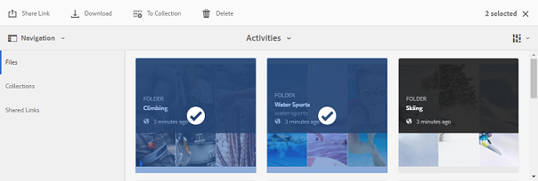
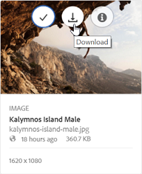
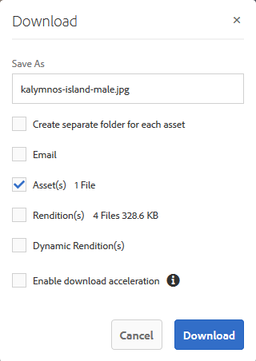
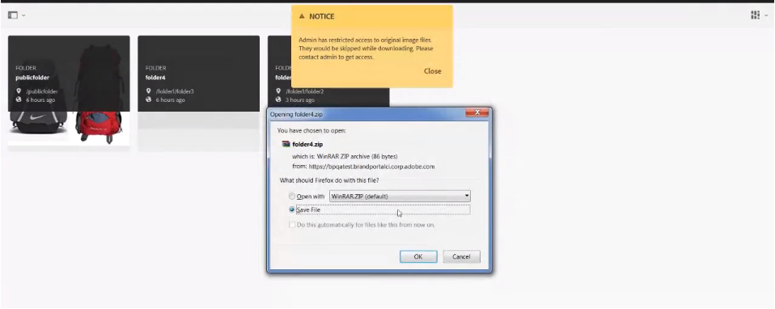
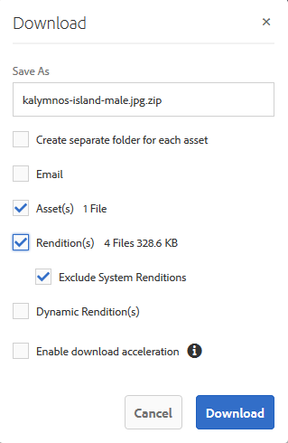

# アセットのダウンロード {#download-assets}

すべてのユーザーが、Brand Portal から複数のアセットやフォルダーを同時にダウンロードできます。これにより、承認されたブランドアセットを安全に配布して、オフラインで使用できます。Brand Portal から承認済みアセットをダウンロードする方法や、[ダウンロードパフォーマンス](../using/brand-portal-download-users.md#main-pars-header)から期待されることについてお読みください。

>[!NOTE]
>
>有効期限が切れたアセットをダウンロードできるのは、管理者のみです。有効期限が切れたアセットについて詳しくは、[アセットのデジタル著作権の管理](../using/manage-digital-rights-of-assets.md)を参照してください。

## アセットのダウンロード手順 {#steps-to-download-assets}

Brand Portal のアセット、またはアセットを含むフォルダーをダウンロードするには、次の手順に従います。

1. Brand Portal コンソールで、以下のいずれかの手順を実行します。

   * ダウンロードするフォルダーまたはアセットを選択します。上部のツールバーで「**[!UICONTROL ダウンロード]**」アイコンをクリックします。
   

   * 1 つのフォルダーまたはアセットをダウンロードするには、そのフォルダーまたはアセットの上にマウスポインターを置きます。使用できるクイックアクションサムネールから、**[!UICONTROL ダウンロード]**&#x200B;アイコンをクリックします。
   

   >[!NOTE]
   >
   >ダウンロードするアセットに、ライセンスが必要なアセットが含まれている場合は、**[!UICONTROL 著作権管理]**&#x200B;ページにリダイレクトされます。このページで、アセットを選択し、「**[!UICONTROL 同意する]**」をクリックし、「**[!UICONTROL ダウンロード]**」をクリックします。「同意しない」を選択した場合は、ライセンスが必要なアセットはダウンロードされません。\
   >ライセンスで保護されているアセットには、[使用許諾契約が添付](https://helpx.adobe.com/jp/experience-manager/6-5/assets/using/drm.html#DigitalRightsManagementinAssets)されています。この処理は、AEM Assets でアセットの[メタデータプロパティ](https://helpx.adobe.com/jp/experience-manager/6-5/assets/using/drm.html#DigitalRightsManagementinAssets)を設定することでおこなわれます。

   

   **[!UICONTROL ダウンロード]**&#x200B;ダイアログボックスが表示されます。デフォルトで「**[!UICONTROL アセット]**」チェックボックスがオンになっています。

   

   >[!NOTE]
   >
   >ダウンロードしようとするアセットが画像ファイルで、ダウンロードダイアログで「**[!UICONTROL アセット]**」オプションのみを選択しているが、[画像ファイルのオリジナルのレンディションへのアクセス権が管理者によって許可](../using/brand-portal-adding-users.md#main-pars-procedure-202029708)されていない場合は、画像ファイルはダウンロードされず、オリジナルのレンディションへのアクセスが管理者によって制限されていることを示す通知が表示されます。

   

1. アセットに加えて、アセットのレンディションもダウンロードするには、「**[!UICONTROL レンディション]**」チェックボックスをオンにします。ただし、自動生成されたレンディションを、カスタムレンディションと一緒にダウンロードできるようにするには、デフォルトでオンになっている「**[!UICONTROL システムレンディションを除く自動生成されたレンディション]**」チェックボックスをオフにします。

   

   レンディションのみをダウンロードするには、「**[!UICONTROL アセット]**」チェックボックスをオフにします。

   >[!NOTE]
   >
   >デフォルトでは、アセットのみがダウンロードされます。ただし、[画像ファイルのオリジナルのレンディションへのアクセスが管理者によって許可](../using/brand-portal-adding-users.md#main-pars-procedure-202029708)されていない場合は、画像ファイルのオリジナルのレンディションはダウンロードされません。

   * Brand Portal からのアセットファイルのダウンロードをスピードアップさせるには、「**[!UICONTROL ダウンロードアクセラレーションの有効化]**」オプションを選択し、[ウィザードに従います](../using/accelerated-download.md#main-pars-header-405749062)。アセットの高速ダウンロードについて詳しくは、[Brand Portal からのダウンロードを高速化するためのガイド](../using/accelerated-download.md)を参照してください。

   * [アセットとそのレンディションにカスタムの画像プリセット](../using/brand-portal-image-presets.md#applyimagepresetswhendownloadingimages)を適用するには、「**[!UICONTROL 動的レンディション]**」チェックボックスをオンにします。カスタムの画像プロパティ（サイズ、フォーマット、カラースペース、解像度および画像の修飾子）を指定して、アセットとそのレンディションをダウンロードするときにカスタムの画像プリセットを適用します。動的レンディションのみをダウンロードするには、「**[!UICONTROL アセット]**」チェックボックスをオフにします。
   

   >[!NOTE]
   >
   >アセットの動的レンディションをプレビュー（またはダウンロード）するには、ダイナミックメディアが有効になっていて、アセットのピラミッド TIFF レンディションがアセットの公開元の AEM オーサーインスタンスに存在している必要があります。Brand Portal にアセットを公開すると、そのピラミッド TIFF レンディションも公開されます。Brand Portal からピラミッド TIFF レンディションを生成する方法はありません。

   * アセットをダウンロードする際に Brand Portal のフォルダー階層を保持するには、「**[!UICONTROL アセットごとに別のフォルダーを作成]**」チェックボックスをオンにします。デフォルトでは、Brand Portal のフォルダー階層は無視され、すべてのアセットがローカルシステムの 1 つのフォルダーにダウンロードされます。

   * アセットのダウンロード用リンクを記載した電子メール通知をユーザーに送信するには、「**[!UICONTROL 電子メール]**」チェックボックスをオンにします。
   

   >[!NOTE]
   >
   >電子メール通知に含まれるダウンロードリンクの有効期限は 45 日間です。
   >
   >管理者は、電子メールのメッセージ内容、つまりロゴ、説明およびフッターを、[ブランディング](../using/brand-portal-branding.md)機能を使用してカスタマイズできます。

1. 「**[!UICONTROL ダウンロード]**」をクリックします。

   アセット（および選択されている場合はレンディション）が ZIP ファイルとしてローカルフォルダーにダウンロードされます。ただし、レンディションなしで 1 つのアセットをダウンロードした場合、zip ファイルは作成されないので、すばやくダウンロードをおこなうことができます。

   [オリジナルのレンディションへのアクセスを管理者によって許可](../using/brand-portal-adding-users.md#main-pars-procedure-202029708)されていない場合、選択したアセットのオリジナルのレンディションはダウンロードされません。

   >[!NOTE]
   >
   >個別に選択してダウンロードしたアセットは、ダウンロードされたアセットレポートに表示されます。ただし、アセットを含んだフォルダーをダウンロードした場合は、そのフォルダーもアセットも、ダウンロード済みアセットのレポートには表示されません。

   共有リンクからアセットをダウンロードする方法については、[共有リンクからアセットをダウンロードする](../using/brand-portal-link-share.md#main-pars-header-1703469193)を参照してください。

## 期待されるダウンロードパフォーマンス {#expected-download-performance}

ユーザーのクライアントが様々な場所にある場合、ファイルのダウンロードエクスペリエンスは、ローカルのインターネット接続やサーバーのレイテンシなどの要因によって異なります。2 GB のファイルを様々なクライアントの場所でダウンロードする際に期待されるパフォーマンスは次のとおりです（Brand Portal のサーバーは米国オレゴン州にあるものとします）。

| クライアントの場所 | クライアントとサーバーの間のレイテンシ | 予想されるダウンロード速度 | 2 GB ファイルのダウンロード所要時間 |
|-------------------------|-----------------------------------|-------------------------|------------------------------------|
| 米国西部（北カリフォルニア） | 18 ミリ秒 | 7.68 MB/秒 | 4 分 |
| 米国西部（オレゴン） | 42 ミリ秒 | 3.84 MB/秒 | 9 分 |
| 米国東部（北バージニア） | 85 ミリ秒 | 1.61 MB/秒 | 21 分 |
| APAC（東京） | 124 ミリ秒 | 1.13 MB/秒 | 30 分 |
| ノイダ | 275 ミリ秒 | 0.5 MB/秒 | 68 分 |
| シドニー | 175 ミリ秒 | 0.49 MB/秒 | 69 分 |
| ロンドン | 179 ミリ秒 | 0.32 MB/秒 | 106 分 |
| シンガポール | 196 ミリ秒 | 0.5 MB/秒 | 68 分 |

**注意**：引用したデータは、テスト条件下において確認されたものであり、レイテンシや帯域幅の異なる場所にいるユーザーの場合は結果が異なる可能性があります。
