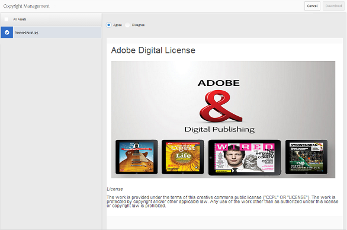

# アセットのダウンロード {#download-assets}

すべてのユーザーが、Brand Portal から複数のアセットやフォルダーを同時にダウンロードできます。これにより、承認されたブランドアセットを安全に配布して、オフラインで使用できます。Brand Portal から承認済みアセットをダウンロードする方法や、[ダウンロードパフォーマンス](../using/brand-portal-download-users.md#main-pars-header)から期待されることについてお読みください。

>[!NOTE]
>
>有効期限が切れたアセットをダウンロードできるのは、管理者のみです。有効期限が切れたアセットについて詳しくは、[アセットのデジタル著作権の管理](../using/manage-digital-rights-of-assets.md)を参照してください。

## アセットのダウンロード手順 {#steps-to-download-assets}

Brand Portal のアセット、またはアセットを含むフォルダーをダウンロードするには、次の手順に従います。

1. ブランドポータルインターフェイスから、次のいずれかの操作を行います。

   * ダウンロードするフォルダーまたはアセットを選択します。From the toolbar at the top, click the **[!UICONTROL Download]** icon.
   

   * 1 つのフォルダーまたはアセットをダウンロードするには、そのフォルダーまたはアセットの上にマウスポインターを置きます。From the quick action thumbnails available, click the **[!UICONTROL Download]** icon.
   

   >[!NOTE]
   >
   >ダウンロードするアセットに、ライセンスが必要なアセットが含まれている場合は、**[!UICONTROL 著作権管理]ページにリダイレクトされます。** In this page, select the assets, click **[!UICONTROL Agree]**, and then click **[!UICONTROL Download]**. 「同意しない」を選択した場合は、ライセンスが必要なアセットはダウンロードされません。\
   >License-protected assets have [license agreement attached](https://helpx.adobe.com/experience-manager/6-5/assets/using/drm.html#DigitalRightsManagementinAssets) to them, which is done by setting asset's [metadata property](https://helpx.adobe.com/experience-manager/6-5/assets/using/drm.html#DigitalRightsManagementinAssets) in AEM Assets.

   

   **[!UICONTROL ダウンロード]** ダイアログボックスがデフォルトで選択されている **[!UICONTROL 状態で、ダウンロード]** ダイアログボックスが表示されます。

   

   >[!NOTE]
   >
   >If the assets you are downloading are image files, and you select only the **[!UICONTROL Asset(s)]** option in Download dialog but are not [authorized by the administrator to have access to the original renditions of image files](../using/brand-portal-adding-users.md#main-pars-procedure-202029708) then no image files are downloaded and a Notice prompts, stating that you have been restricted by administrator to access original renditions.

   

2. To download the renditions of assets in addition to the assets, select **[!UICONTROL Rendition(s)]**. However, to allow auto-generated renditions to download along with custom renditions, deselect **[!UICONTROL Exclude Auto Generated Renditions]**, which is selected by default.

   

   To download only the renditions, deselect **[!UICONTROL Asset(s)]**.

   >[!NOTE]
   >
   >デフォルトでは、アセットのみがダウンロードされます。However, original renditions of image files are not downloaded if you are not [authorized by the administrator to have access to the original renditions of image files](../using/brand-portal-adding-users.md#main-pars-procedure-202029708).

   * Brand Portal からのアセットファイルのダウンロードをスピードアップさせるには、「**[!UICONTROL ダウンロードアクセラレーションの有効化]**」オプションを選択し、[ウィザードに従います](../using/accelerated-download.md#main-pars-header-405749062)。To know more about faster download of assets refer [guide to accelerate downloads from Brand Portal](../using/accelerated-download.md).

   * To apply a [custom image preset to the asset and its renditions](../using/brand-portal-image-presets.md#applyimagepresetswhendownloadingimages), select **[!UICONTROL Dynamic Rendition(s)]**. カスタムの画像プロパティ（サイズ、フォーマット、カラースペース、解像度および画像の修飾子）を指定して、アセットとそのレンディションをダウンロードするときにカスタムの画像プリセットを適用します。動的なレンディションのみをダウンロードするには、アセットを削除 ****&#x200B;します。
   

   >[!NOTE]
   >
   >任意のアセットの動的レンディションをプレビュー（またはダウンロード）するには、動的メディアが有効になっていること、およびアセットが公開された場所からアセットのピラミッドTIFFレンディションがAEM作成者インスタンスに存在することを確認します。アセットがブランドポータルに公開されると、そのピラミッドTIFFレンディションも公開されます。ブランドポータルからピラミッドTIFFレンディションを生成する方法はありません。

   * To preserve the Brand Portal folder hierarchy while downloading assets, select **[!UICONTROL Create separate folder for each asset]**. デフォルトでは、ブランドポータルフォルダ階層は無視され、すべてのアセットがローカルシステムの1つのフォルダーにダウンロードされます。

   * To send an email notification to users with a link for downloading the assets, select **[!UICONTROL Email]**.
   

   >[!NOTE]
   >
   >電子メール通知に含まれるダウンロードリンクの有効期限は 45 日間です。
   >
   >Administrators can customize email messages, that is, logo, description, and footer, using the [Branding](../using/brand-portal-branding.md) feature.

3. Click **[!UICONTROL Download]**.

   アセット（および選択されている場合はレンディション）が ZIP ファイルとしてローカルフォルダーにダウンロードされます。ただし、レンディションなしで 1 つのアセットをダウンロードした場合、zip ファイルは作成されないので、すばやくダウンロードを行うことができます。

   [オリジナルのレンディションへのアクセスを管理者によって許可](../using/brand-portal-adding-users.md#main-pars-procedure-202029708)されていない場合、選択したアセットのオリジナルのレンディションはダウンロードされません。

   >[!NOTE]
   >
   >個別に選択してダウンロードしたアセットは、ダウンロードされたアセットレポートに表示されます。ただし、アセットを含むフォルダがダウンロードされている場合、ダウンロードされたアセットには、フォルダとアセットのどちらも表示されません。

   To know how to download assets from shared links, refer [downloading assets from shared links](../using/brand-portal-link-share.md#main-pars-header-1703469193).

## 期待されるダウンロードパフォーマンス {#expected-download-performance}

ファイルのダウンロードエクスペリエンスは、ローカルインターネット接続やサーバー遅延などの要因によって異なります。2 GB のファイルを様々なクライアントの場所でダウンロードする際に期待されるパフォーマンスは次のとおりです（Brand Portal のサーバーは米国オレゴン州にあるものとします）。

| クライアントの場所 | クライアントとサーバーの間のレイテンシ | 予想されるダウンロード速度 | 2GBのファイルのダウンロードにかかる時間 |
|-------------------------|-----------------------------------|-------------------------|------------------------------------|
| 米国西部（北カリフォルニア） | 18 ミリ秒 | 7.68 MB/秒 | 4 分 |
| 米国西部（オレゴン） | 42 ミリ秒 | 3.84 MB/秒 | 9 分 |
| 米国東部（北バージニア） | 85 ミリ秒 | 1.61 MB/秒 | 21 分 |
| APAC（東京） | 124 ミリ秒 | 1.13 MB/秒 | 30 分 |
| ノイダ | 275 ミリ秒 | 0.5 MB/秒 | 68 分 |
| シドニー | 175 ミリ秒 | 0.49 MB/秒 | 69 分 |
| ロンドン | 179 ミリ秒 | 0.32 MB/秒 | 106 分 |
| シンガポール | 196 ミリ秒 | 0.5 MB/秒 | 68 分 |

**注意**:参照データはテスト条件で観察されます。これは、異なる場所のユーザーによって異なる待ち時間や帯域幅が表示される場合があります。
