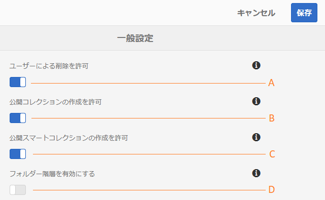

# 一般的なテナント設定の管理 {#administer-general-tenant-configurations}

AEM Assets Brand Portal では、各組織が特定のテナントについて以下の機能を設定することができます。

* 管理者によるアセットの削除
* 管理者以外のユーザーによる公開コレクションの作成
* 管理者以外のユーザーによる公開スマートコレクションの作成
* 管理者以外のユーザーに表示される共有フォルダーの親階層

これらの設定は、管理ツールパネルで&#x200B;**[!UICONTROL 一般設定]**&#x200B;として提供されています。

**A**：管理者に対し、Brand Portal からアセットを削除することを許可する設定（デフォルトでは有効になっています）

**B**：管理者以外のユーザーに対し、公開コレクションを作成することを許可する設定（デフォルトでは有効になっています）

**C**：管理者以外のユーザーに対し、公開スマートコレクションを作成することを許可する設定（デフォルトでは有効になっています）

**D**：共有フォルダーの（ルートからの）フォルダー階層を管理者以外のユーザー（編集者、閲覧者、ゲストユーザー）に表示する設定（デフォルトでは無効になっています）

## 一般設定の有効化／無効化 {#enable-disable-general-configurations}

これらの設定を有効化／無効化するには、次のようにします。

1. 管理者権限でログインします。
1. 管理ツールにアクセスするには、上部のツールバーにある AEM ロゴを選択します。
1. 管理ツールパネルから、**[!UICONTROL 一般]**&#x200B;を選択して&#x200B;**[!UICONTROL 一般設定]**&#x200B;ページを開きます。
1. それぞれの切り替えスイッチを使用して一般設定を有効化／無効化します。
1. **[!UICONTROL 変更内容を保存します。]**
1. ログアウトして変更を有効にします。

## 管理者が Brand Portal からアセットを削除することを許可 {#allow-admin-users-to-delete-assets-from-brand-portal}

「**[!UICONTROL ユーザーによる削除を許可]**」設定では、管理者権限を持つユーザーがアセットやフォルダーを Brand Portal から削除することを許可（または禁止）できます。

## 管理者以外による公開コレクションの作成を許可 {#allow-public-collections-creation-by-non-admins}

「[[!UICONTROL 公開コレクションの作成を許可]](../using/brand-portal-share-collection.md#main-pars-text-1915052376)」設定では、管理者以外のユーザーが Brand Portal 上に公開コレクションを作成することを許可するかどうかを制御できます。この設定はデフォルトで有効です。この設定を無効にすると、ポータル上に多数の公開コレクションが作成されることを防止できるので、システム領域を節約できます。

## 管理者以外による公開スマートコレクションの作成を許可 {#allow-public-smart-collections-creation-by-non-admins}

「[[!UICONTROL 公開スマートコレクションの作成を許可]](../using/brand-portal-searching.md#main-pars-header-500620467)」設定では、管理者以外のユーザーが検索をスマートコレクションとして保存して、そのテナントの公開スマートコレクションにすることを許可するかどうかを制御できます。この設定はデフォルトで有効です。この設定を無効にすると、管理者以外のユーザーが組織の Brand Portal 上に多数の公開スマートコレクションを作成することを防止できます。

<!-- 
## Allow download acceleration {#allow-download-acceleration}

[[!UICONTROL Allow download acceleration]](../using/accelerated-download.md) configuration lets the organizations to allow accelerated downloads of assets from Brand Portal and shared links, by integrating with IBM Aspera Connect that is an install-on-demand application. The application uses proprietary technology to remove TCP overheads.
-->

## フォルダー階層の有効化 {#enable-folder-hierarchy}

「[[!UICONTROL フォルダー階層を有効化]](../using/brand-portal-sharing-folders.md#non-admin-user-access-to-shared-folders)」設定では、管理者以外のユーザー（エディター、閲覧者、ゲストユーザー）がログイン後に目にする共有フォルダーの表示を管理者が制御できます。
