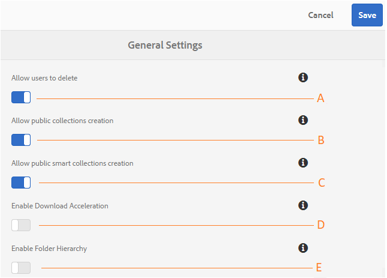

# 一般的なテナント設定の管理 {#administer-general-tenant-configurations}

AEM Assets Brand Portal では、各組織が特定のテナントについて以下の機能を設定することができます。

* 管理者によるアセットの削除
* 管理者以外のユーザーによる公開コレクションの作成
* 管理者以外のユーザーによる公開スマートコレクションの作成
* ダウンロードアクセラレーション
* 管理者以外のユーザーが見られる共有フォルダーの親階層

これらの設定は、管理ツールパネルで&#x200B;**[!UICONTROL 一般設定]として提供されています。**

**管理者が** 、Brand portalからアセットを削除できるようにする設定。 （デフォルトでは有効になっています）。

**B   Configuration to allow the non-admin users to create public collections.**（デフォルトでは有効になっています）。

**C** 管理者以外のユーザーに対し、公開スマートコレクションを作成することを許可する設定。（デフォルトでは有効になっています）。

**D**：ポータルや共有リンクからダウンロードしたアセットのダウンロードアクセラレーションを許可する設定（デフォルトでは無効になっています）。

**E**：共有フォルダーの（ルートからの）フォルダー階層を管理者以外のユーザー（エディター、閲覧者、ゲストユーザー）に表示する設定（デフォルトでは無効になっています）

## 一般設定の有効化／無効化 {#enable-disable-general-configurations}

これらの設定を有効化／無効化するには、次のようにします。

1. 管理者権限でログインします。
2. 管理ツールにアクセスするには、上部のツールバーにある AEM ロゴを選択します。
3. 管理ツールパネルから、**[!UICONTROL 一般]**&#x200B;を選択して&#x200B;**一般設定]ページを開きます。[!UICONTROL **
4. それぞれの切り替えスイッチを使用して一般設定を有効化／無効化します。
5. **[!UICONTROL 変更内容を保存します。]**
6. ログアウトして変更を有効にします。

## 管理者が Brand Portal からアセットを削除することを許可 {#allow-admin-users-to-delete-assets-from-brand-portal}

**[!UICONTROL ユーザーが設定を削除できるようにすると]** 、組織は管理者権限を持つユーザーに対して、Brand portalからアセットやフォルダーを削除することを許可（または制限）できます。

## 管理者以外による公開コレクションの作成を許可 {#allow-public-collections-creation-by-non-admins}

[[!UICONTROL Allow public collections creation] configuration controls whether non-administrators can create public collections on Brand Portal. ](../using/brand-portal-share-collection.md#main-pars-text-1915052376)この設定はデフォルトで有効です。この設定を無効にすると、ポータル上に多数の公開コレクションが作成されることを防止できるので、システム領域を節約できます。

## 管理者以外による公開スマートコレクションの作成を許可 {#allow-public-smart-collections-creation-by-non-admins}

[[!UICONTROL公開スマートコレクションの作成を許可]](../using/brand-portal-searching.md#main-pars-header-500620467) 構成は、管理者以外が検索をスマートコレクションとして保存し、そのテナントに対して公開するかどうかを制御します。 この設定はデフォルトで有効です。この設定を無効にすると、管理者以外のユーザーが組織の Brand Portal 上に多数の公開スマートコレクションを作成することを防止できます。

## ダウンロードアクセラレーションを許可 {#allow-download-acceleration}

[[!UICONTROL Allow download acceleration]](../using/accelerated-download.md) 構成を使用すると、インストールオンデマンドアプリケーションであるIBM Aspera Connectとの統合により、組織はBrand Portalや共有リンクからのアセットのダウンロードを高速化できます。 このアプリケーションは TCP オーバーヘッドをなくす独自のテクノロジを使用しています。

## フォルダー階層の有効化 {#enable-folder-hierarchy}

[[!UICONTROL Enable Folder Hierarchy]](../using/brand-portal-sharing-folders.md#non-admin-user-access-to-shared-folders) 構成を使用すると、管理者は、管理者以外のユーザー（エディター、ビューア、ゲストユーザー）がログイン後に共有フォルダーを表示する方法を制御できます。
