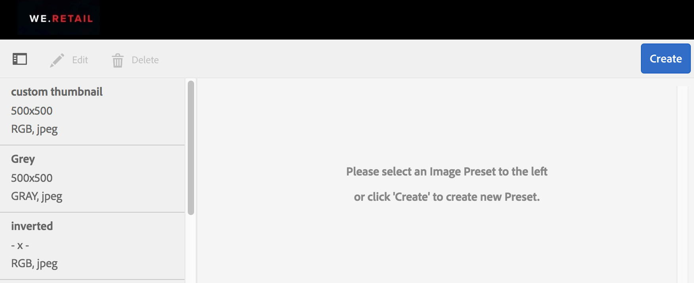
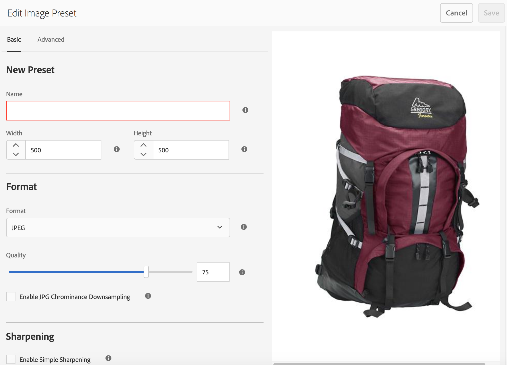
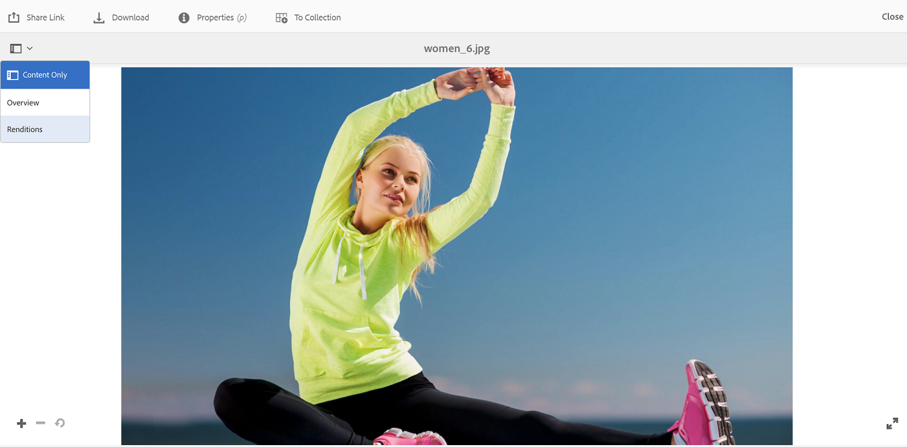
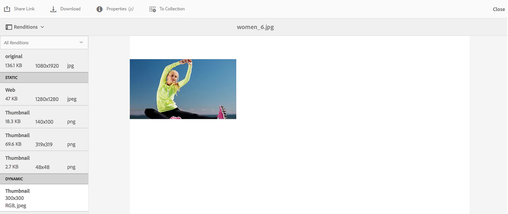
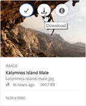
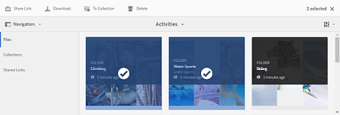
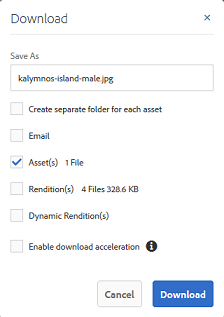
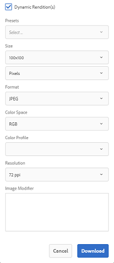

# 画像プリセットまたは動的レンディションの適用 {#apply-image-presets-or-dynamic-renditions}

画像プリセットは、マクロと同様、サイズとフォーマットに関するコマンドのコレクションを事前に定義し、名前を付けて保存したものです。画像プリセットを使用すると、サイズ、形式、プロパティが様々に異なる画像を AEM Assets Brand Portal で動的に配信できます。

画像プリセットは、プレビューしたりダウンロードしたりできる画像の動的レンディションを生成するために使用します。画像とそのレンディションをプレビューするときは、プリセットを選択することにより、管理者が設定した仕様で画像を再フォーマットできます。

To view dynamic renditions of an asset in Brand Portal, ensure that its Pyramid tiff rendition exists at the AEM author instance from where you publish to Brand Portal. アセットを公開すると、その PTIFF レンディションも Brand Portal に公開されます。Brand Portal から PTIFF レンディションを生成する方法はありません。

>[!NOTE]
>
>画像とそのレンディションをダウンロードするときは、既存のプリセットから選択することはできません。その代わりに、カスタム画像プリセットのプロパティを指定できます。詳しくは、[画像をダウンロードする際の画像プリセットの適用](../using/brand-portal-image-presets.md#main-pars-text-1403412644)を参照してください。

画像プリセットの作成時に必要となるパラメーターについて詳しくは、[画像プリセットの管理](https://docs.adobe.com/docs/en/AEM/6-0/administer/integration/dynamic-media/image-presets.html)を参照してください。

## 画像プリセットの作成 {#create-an-image-preset}

管理者は、アセットの詳細ページに動的レンディションとして表示される画像プリセットを作成できます。画像プリセットを一から作成することも、既存の画像プリセットに新しい名前を付けて保存することもできます。画像プリセットを作成するときは、画像配信のサイズと、フォーマットコマンドを選択します。画像が表示用に配信されるときには、選択したコマンドに応じて画像の外観が最適化されます。なお、Brand Portal で画像プリセットを作成できるのは、管理者のみです。

なお、Brand Portal で画像プリセットを作成できるのは、管理者のみです。

>[!NOTE]
>
>Dynamic renditions of an image are created using its Pyramid TIFF. If the Pyramid TIFF is not available for any asset, dynamic renditions for that asset cannot be fetched in Brand portal.
If AEM (Author) instance is running on Dynamic Media Hybrid mode, then Pyramid TIFF renditions of image assets are created and saved in AEM repository. ****&#x200B;これに対し、AEM（作成者）インスタンスがダイナミックメディアシーン7モードで実行されている場合 ****、画像アセットのピラミッドTIFFレンディションがScene 7サーバに存在します。
When such assets are published to brand portal, image presets are applied and dynamic renditions are displayed.

1. 上部の AEM ツールバーでアドビのロゴをクリックして、管理ツールにアクセスします。

1. From the administrative tools panel, click **[!UICONTROL Image Presets]**.

   

1. In the image presets page, click **[!UICONTROL Create]**.

   

1. **[!UICONTROL 画像プリセットを編集]**&#x200B;ページで、「**[!UICONTROL 基本]」または「**&#x200B;詳細&#x200B;**」のどちらか該当するタブに、名前などの値を入力します。**&#x200B;オプションの概要については、[画像プリセットオプション](https://docs.adobe.com/docs/en/AEM/6-0/administer/integration/dynamic-media/image-presets.html#Image%20preset%20options)で説明しています。プリセットは左側のウィンドウに表示され、他のアセットにすぐに使用できます。

   

   >[!NOTE]
   >
   >**[!UICONTROL 画像プリセットを編集]ページを使用して、既存の画像プリセットのプロパティを編集することもできます。** To edit an image preset, select it from the image presets page, and click **[!UICONTROL Edit]**.

1. Click **[!UICONTROL Save]**. 画像プリセットが作成され、画像プリセットページに表示されます。
1. To delete an image preset, select it from the image presets page and click **[!UICONTROL Delete]**. 確認ページで「**[!UICONTROL 削除]」をクリックして、削除することを確認します。**&#x200B;指定した画像プリセットが、画像プリセットページから削除されます。

## 画像をプレビューする際の画像プリセットの適用      {#apply-image-presets-when-previewing-images}

画像とそのレンディションをプレビューするときは、既存のプリセットから選択することで、管理者が設定した仕様で画像を再フォーマットできます。

1. From the Brand Portal interface, click an image to open it.
1. Click the overlay icon on the left, and choose **[!UICONTROL Renditions]**.

   

1. From the **[!UICONTROL Renditions]** list, select the appropriate dynamic rendition, for example, **[!UICONTROL Thumbnail]**. 選択した動的レンディションに基づいて、プレビュー画像がレンダリングされます。

   

## 画像をダウンロードする際の画像プリセットの適用 {#apply-image-presets-when-downloading-images}

Brand Portalから画像とそのレンディションをダウンロードする場合、既存の画像プリセットから選択することはできません。 ただし、再フォーマットする画像に基づいて、画像プリセットのプロパティをカスタマイズできます。

1. From the Brand Portal interface, do one of the following:

   * ダウンロードする画像の上にマウスポインターを置きます。使用できるクイックアクションサムネールから、**[!UICONTROL ダウンロード]アイコンをクリックします。**
   

   * ダウンロードする画像を選択します。上部のツールバーで「**[!UICONTROL ダウンロード]」アイコンをクリックします。**
   

1. **[!UICONTROL ダウンロード]ダイアログボックスで、アセットとそのレンディションを一緒にダウンロードするかどうかに応じて、必要なオプションを選択します。**

   

1. アセットの動的レンディションをダウンロードするには、「**[!UICONTROL 動的レンディション]」オプションを選択します。**
1. 画像プリセットのプロパティを、画像とそのレンディションをダウンロード時に動的に再フォーマットしたい設定に基づいてカスタマイズします。サイズ、フォーマット、カラースペース、解像度および画像の修飾子を指定します。

   

1. Click **[!UICONTROL Download]**. カスタムの動的レンディションが、ダウンロード対象として選択した画像とレンディションと一緒に ZIP ファイルにダウンロードされます。ただし、ダウンロードするアセットが 1 つだけの場合は、迅速なダウンロードをおこなうために ZIP ファイルは作成されません。
