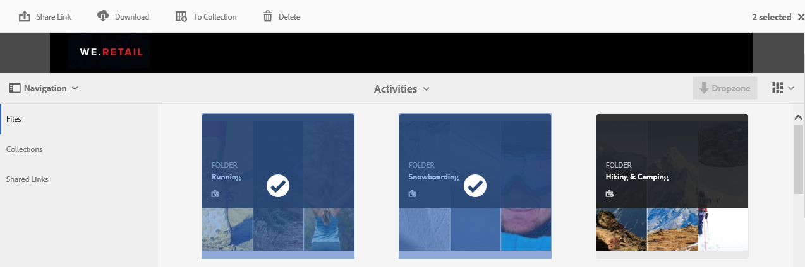
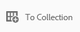
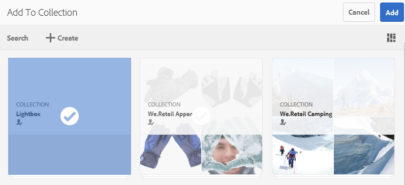
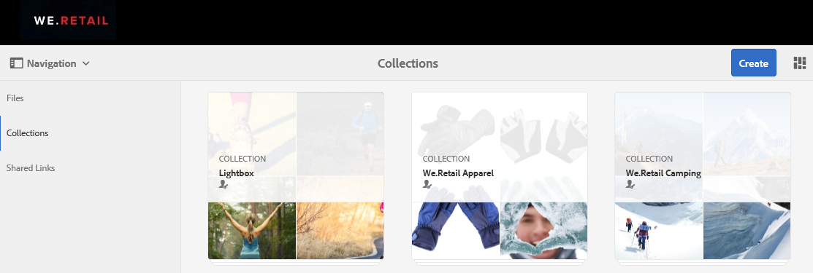
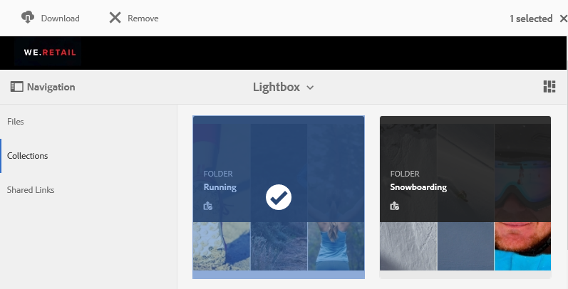

# Lightbox コレクションの管理 {#manage-the-lightbox-collection}

**[!UICONTROL Lightbox]** は、アセットに容易にアクセスするための特別なタイプのコレクションです。Brand Portal に初めてログインすると、各ユーザー専用の **[!UICONTROL Lightbox]** が自動的に作成されます。**[!UICONTROL Lightbox]** コレクションは削除できません。

## Lightbox へのアセットの追加 {#add-assets-to-lightbox}

**[!UICONTROL Lightbox]** にアセットを追加するには、以下の手順を実行します。

1. **[!UICONTROL Lightbox]** に追加するアセットの場所に移動し、アセットを選択します。

   

1. 上部のツールバーの「コレクションに追加」アイコンをクリックします。

   

1. **[!UICONTROL コレクションに追加]**&#x200B;ページでは、**[!UICONTROL Lightbox]** コレクションがデフォルトで選択されています。

   「**[!UICONTROL 追加]**」をクリックします。選択したアセットが **[!UICONTROL Lightbox]** に追加されます。

   

1. **[!UICONTROL Lightbox]** に追加されているアセットを表示するには、左側のパネルの「**[!UICONTROL コレクション]**」をクリックし、**[!UICONTROL Lightbox]** コレクションをクリックします。

   

   **[!UICONTROL Lightbox]** に追加されているアセットが **[!UICONTROL Lightbox]** ページに表示されます。

   

## Lightbox からのアセットの削除 {#remove-assets-from-lightbox}

1. [!UICONTROL Lightbox] のアセットをレビューするには、左パネルの「**[!UICONTROL コレクション]**」をクリックし、次に [!UICONTROL Lightbox] コレクションをクリックします。

   

1. コレクションから削除するフォルダーを選択し、上部のツールバーの「**[!UICONTROL 削除]**」をクリックします。

   

1. 警告メッセージボックスで「**[!UICONTROL 削除]**」をクリックして、削除することを確認します。

そのフォルダーが **[!UICONTROL Lightbox]** コレクションから削除されます。
