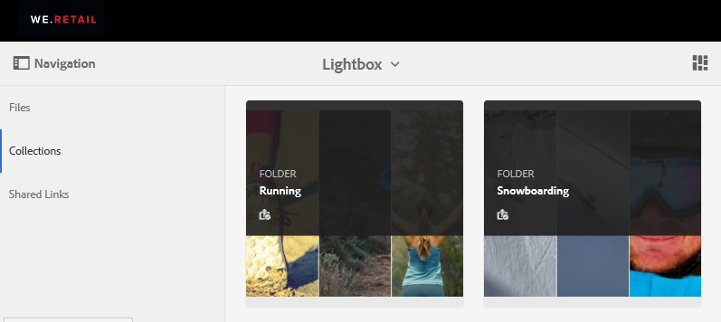

# Lightbox コレクションの管理 {#manage-the-lightbox-collection}

[!UICONTROL Lightbox は、アセットに容易にアクセスするための特別なタイプのコレクションです。]Each user has an exclusive [!UICONTROL Lightbox] that is automatically created when they log in to Brand Portal for the first time. [!UICONTROL ライトボックス] コレクションは削除できません。

## Lightbox へのアセットの追加 {#add-assets-to-lightbox}

[!UICONTROL ライトボックス]にアセットを追加するには、次の手順を実行します。

1. [!UICONTROL ライトボックス]に追加するアセットの場所に移動し、アセットを選択します。

   

2. 上部のツールバーの「コレクションに追加」アイコンをクリックします。

   

3. **[!UICONTROL コレクションに追加]ページでは、Lightbox コレクションがデフォルトで選択されています。**

   Click **[!UICONTROL Add]**. The selected assets are added to the [!UICONTROL Lightbox].

   

4. [!UICONTROL ライトボックス]に追加されたアセットを確認するには、左側のナビゲーションバーの **[!UICONTROL 「コレクション」]** をクリックし、 **[!UICONTROL ライトボックス]** コレクションをクリックします。

   

   [!UICONTROL ライトボックス] に追加されたアセットが [!UICONTROL ライトボックス] ページに表示されます。

   

## Lightbox からのアセットの削除 {#remove-assets-from-lightbox}

1. [!UICONTROL ライトボックス]のアセットを確認するには、左側のナビゲーションバーの **[!UICONTROL 「コレクション」]** をクリックし、 [!UICONTROL ライトボックス] コレクションをクリックします。

   

2. コレクションから削除するフォルダーを選択し、上部のツールバーの「**[!UICONTROL 削除]」をクリックします。**

   

3. From the warning message box, click **[!UICONTROL Remove]** to confirm removal.

The folder is deleted from the [!UICONTROL Lightbox] collection.
