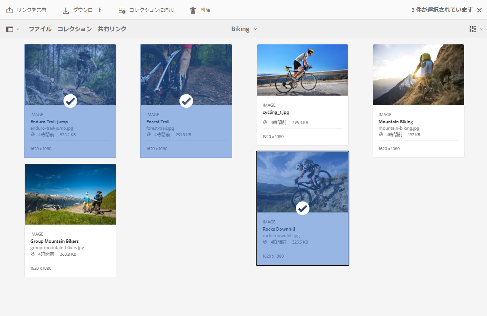
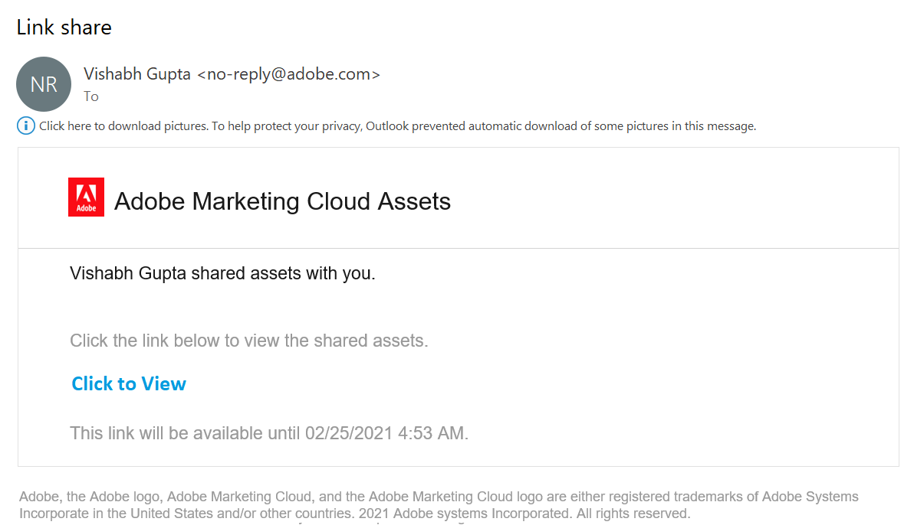
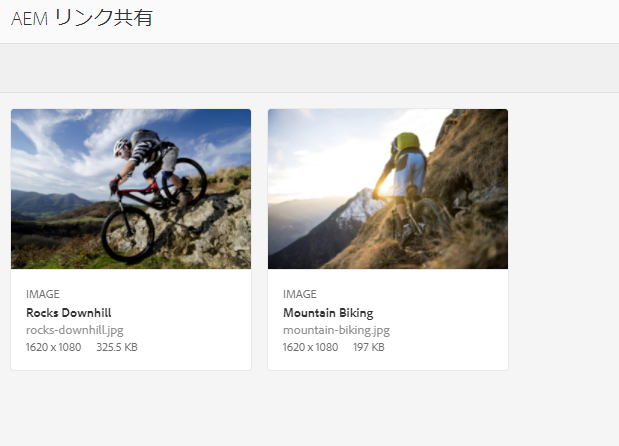
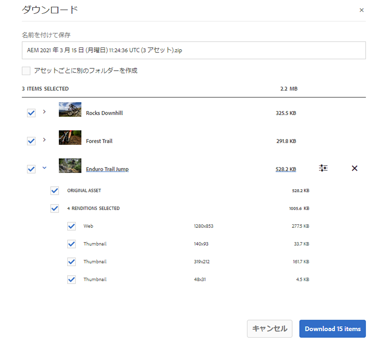
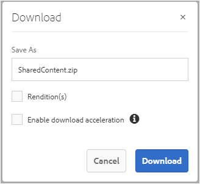
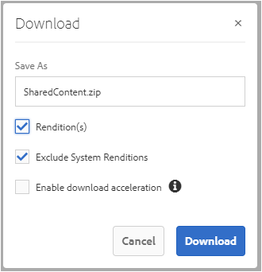
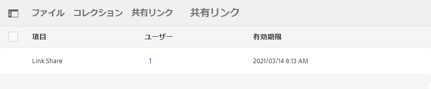
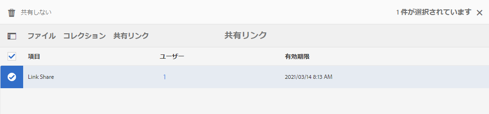

# アセットをリンクとして共有 {#share-assets-as-a-link}

Adobe Experience Manager Assets Brand Portal 管理者は、許可された内部ユーザーや外部関係者（パートナーやベンダーなど）との間で複数のアセットのリンクを共有できます。編集者は、管理者によって共有されたアセットのみを閲覧および共有できます。

リンクを通じたアセット共有は、アセットを外部の関係者が利用できるようにする便利な方法です。リンクを共有すれば、Brand Portal にログインしなくてもアセットにアクセスできます。

<!-- Link sharing access is restricted to editors and administrators. 
-->

詳しくは、[ユーザー、グループ、ユーザーの役割の管理](../using/brand-portal-adding-users.md#manage-user-roles)を参照してください。

>[!NOTE]
>
>Brand Portal のリンク共有機能では、Zip ファイルのダウンロードが最大 5 GB まで可能です。

アセットをリンクとして共有する手順を次に示します。

1. Brand Portal テナントにログインします。デフォルトで「**[!UICONTROL ファイル]**」ビューが開き、公開中のアセットとフォルダーがすべて表示されます。

1. 共有するアセットまたはフォルダーを選択するか、**[!UICONTROL コレクション]**&#x200B;表示に移動して、作成したコレクションを共有します。

   

1. 上部のツールバーで&#x200B;**[!UICONTROL リンクを共有]**&#x200B;アイコンをクリックします。

   **[!UICONTROL リンク共有]**&#x200B;ダイアログボックスが表示されます。

   

   * 「電子メールアドレス」ボックスに、リンクを共有するユーザーの電子メール ID を入力します。リンクを複数のユーザーと共有できます。ユーザーが組織のメンバーの場合は、ドロップダウンリストに表示される候補の中から電子メール ID を選択します。外部ユーザーの場合は、電子メール ID を入力し、**[!UICONTROL Enter]** キーを押します。電子メール ID がユーザーの一覧に追加されます。

      

   * 「**[!UICONTROL 件名]**」ボックスに、共有するアセットの件名を入力します。
   * 必要に応じて、「**[!UICONTROL メッセージ]**」ボックスにメッセージを入力します。
   * 「**[!UICONTROL 有効期限]**」フィールドに、日付選択を使用して、リンクの有効期限を指定します。デフォルトの有効期限は、リンクを共有した日から 7 日間です。
   * 「**[!UICONTROL 元のファイルのダウンロードを許可]**」チェックボックスをオンにして、受信者が元のレンディションをダウンロードできるようにします。

   リンク共有されるアセットは、「**[!UICONTROL 有効期限]**」フィールドに指定した日時を過ぎると有効期限が切れます。有効期限が切れたアセットの動作と、Brand Portal のユーザーの役割に応じて許容される操作の変更点については、[アセットのデジタル著作権の管理](../using/manage-digital-rights-of-assets.md#asset-expiration)を参照してください。

   >[!NOTE]
   >
   >リンクのデフォルトの有効期間は 7 日間です。リンクは、**[!UICONTROL リンク共有]**&#x200B;ダイアログボックスを使用してユーザーに電子メールで送信する必要があります。リンクを別途コピーして共有することはできません。

1. 「**[!UICONTROL 共有]**」をクリックします。リンクをユーザーと共有することを確認するメッセージが表示されます。共有リンクを含んだ電子メールがユーザーに届きます。

   

   >[!NOTE]
   >
   >管理者は、[ブランディング](../using/brand-portal-branding.md)機能を使用してロゴ、説明、フッターをカスタマイズするなど、電子メールメッセージをカスタマイズできます。

## 共有リンクからのアセットのダウンロード {#download-assets-from-shared-links}

電子メール内のリンクをクリックして、共有アセットにアクセスします。AEM リンク共有ページが開きます。

共有アセットをダウンロードするには：

1. アセットまたはフォルダーをクリックしたあと、ツールバーの&#x200B;**[!UICONTROL ダウンロード]**&#x200B;アイコンをクリックします。

   

   >[!NOTE]
   >
   >現時点では、特定のファイル形式のアセットについてのみ、プレビューとサムネールを生成できます。サポートされているファイル形式について詳しくは、[プレビューおよびサムネールをサポートするアセット形式](#preview-thumbnail-support)を参照してください。

1. **[!UICONTROL ダウンロード]**&#x200B;ダイアログボックスが開きます。

   

1. デフォルトでは「**[!UICONTROL ダウンロード設定]**」の「**[!UICONTROL 高速ダウンロード]**」設定が有効になっています。そのため、IBM Aspera Connect を使用してダウンロードを続行するための確認ボックスが表示されます。

   「**[!UICONTROL 高速ダウンロード]**」を引き続き使用するには、「**[!UICONTROL 許可]**」をクリックします。

   選択したすべてのレンディションが、アセットごとに別個のフォルダーを含んだ zip フォルダーにダウンロードされます。

   >[!NOTE]
   >
   >フォルダー、コレクション、20 個を超えるアセットのいずれかをダウンロード対象として選択した場合、**[!UICONTROL ダウンロード]**&#x200B;ダイアログはスキップされ、ユーザーからアクセスできるすべてのアセットレンディション（動的レンディションを除く）が zip フォルダーにダウンロードされます。zip フォルダー内には、アセットごとに別個のフォルダーが作成されます。

   >[!NOTE]
   >
   >アセットをリンクとして共有したユーザーが、[オリジナルレンディションへのアクセスを管理者によって許可](../using/brand-portal-adding-users.md#manage-group-roles-and-privileges)されていない場合、共有リンクを使用してオリジナルレンディションのダウンロードをおこなうことはできません。

>[!NOTE]
>
>Brand Portal では、ファイルサイズが 5 GB を超えるアセットのダウンロードは制限されています。

<!--
1. The **[!UICONTROL Download]** dialog box appears.

   

    * To speed up the download of asset files shared as the link, select **[!UICONTROL Enable download acceleration]** option and [follow the wizard](../using/accelerated-download.md#download-workflow-using-file-accelerator). To know more about the fast download of assets on Brand Portal refer [Guide to accelerate downloads from Brand Portal](../using/accelerated-download.md).
    
1. To download the renditions of assets in addition to the assets from the shared link, select **[!UICONTROL Rendition(s)]** option. When you do so, **[!UICONTROL Exclude System Renditions]** option appears that is selected by default. This prevents the download of out-of-the-box renditions along with approved assets or their custom renditions.

   However, to allow auto-generated renditions to download along with custom renditions, deselect the **[!UICONTROL Exclude System Renditions]** option.

   >[!NOTE]
   >
   >Original renditions are not downloaded using the shared link if the user who shared the assets as a link is not [authorized by the administrator to have access to the original renditions](../using/brand-portal-adding-users.md#manage-group-roles-and-privileges).

   

1. Click **[!UICONTROL Download]**. The assets (and renditions if selected) are downloaded as a ZIP file to your local folder. However, no zip file is created if a single asset is downloaded without any of the renditions, thereby ensuring speedy download.

>[!NOTE]
>
>Brand Portal restricts downloading assets larger than 5GB per file size.
-->

## プレビューおよびサムネールをサポートするアセット形式 {#preview-thumbnail-support}

以下の表に、Brand Portal における様々なアセット形式のサムネールおよびプレビューのサポート状況を示します。

| アセット形式 | サムネールのサポート | プレビューのサポート |
|--------------|-------------------|-----------------|
| PNG | ✓ | ✓ |
| GIF | ✓ | ✓ |
| TIFF | ✓ | ✕ |
| JPEG | ✓ | ✓ |
| BMP | ✓ | ✕ |
| PNM* | 該当なし | 該当なし |
| PGM* | 該当なし | 該当なし |
| PBM* | 該当なし | 該当なし |
| PPM* | 該当なし | 該当なし |
| PSD | ✓ | ✕ |
| EPS | 該当なし | ✕ |
| DNG | ✓ | ✕ |
| PICT | ✓ | ✕ |
| PSB* | ✓ | ✕ |
| JPG | ✓ | ✓ |
| AI | ✓ | ✕ |
| DOC | ✕ | ✕ |
| DOCX | ✕ | ✕ |
| ODT* | ✕ | ✕ |
| PDF | ✓ | ✕ |
| HTML | ✕ | ✕ |
| RTF | ✕ | ✕ |
| TXT | ✓ | ✕ |
| XLS | ✕ | ✕ |
| XLSX | ✕ | ✕ |
| ODS | ✕ | ✕ |
| PPT | ✓ | ✕ |
| PPTX | ✕ | ✕ |
| ODP | ✕ | ✕ |
| INDD | ✓ | ✕ |
| PS | ✕ | ✕ |
| QXP | ✕ | ✕ |
| EPUB | ✓ | ✕ |
| AAC | ✕ | ✕ |
| MIDI | ✕ | ✕ |
| 3GP | ✕ | ✕ |
| MP3 | ✕ | ✕ |
| MP4 | ✕ | ✕ |
| OGA | ✕ | ✕ |
| OGG | ✕ | ✕ |
| RA | ✕ | ✕ |
| WAV | ✕ | ✕ |
| WMA | ✕ | ✕ |
| DVI | ✕ | ✕ |
| FLV | ✕ | ✕ |
| M4V | ✕ | ✕ |
| MPG | ✕ | ✕ |
| OGV | ✕ | ✕ |
| MOV | ✕ | ✕ |
| WMV | ✕ | ✕ |
| SWF | ✕ | ✕ |
| TGZ | 該当なし | ✕ |
| JAR | ✓ | ✕ |
| RAR | 該当なし | ✕ |
| TAR | 該当なし | ✕ |
| ZIP | ✓ | ✕ |

以下に、この表で使用する記号の意味を示します。

| 記号 | 意味 |
|---|---|
| ✓ | この機能はサポートされています。 |
| ✕ | この機能はサポートされていません |
| 該当なし | この機能は適用されません |
| * | この機能を AEM オーサーインスタンスで使用するには、このファイル形式用のアドオンサポートが必要です。ただし、アセットが Brand Portal に公開された後、Brand Portal で使用する際には不要です |

## リンクとして共有されているアセットの共有解除 {#unshare-assets-shared-as-a-link}

リンクとして共有されているアセットの共有を解除するには、以下の手順を実行します。

1. Brand Portal にログインすると、デフォルトで&#x200B;**[!UICONTROL ファイル]**&#x200B;表示が開きます。リンクとして共有したアセットを表示するには、**[!UICONTROL 共有リンク]**&#x200B;表示に移動します。

1. 表示された一覧で、共有されているリンクを確認します。

   

1. この一覧からリンクの共有を解除するには、リンクを選択し、上部のツールバーの「**[!UICONTROL 共有しない]**」アイコンをクリックします。

   

   >[!NOTE]
   >
   >共有されているリンクの表示は、ユーザーごとに異なります。この機能は、テナントのすべてのユーザーが共有するすべてのリンクを表示するものではありません。

1. 警告メッセージボックスで「**[!UICONTROL 続行]**」をクリックして、共有を解除することを確認します。指定したリンク項目が、共有リンクの一覧から削除されます。
