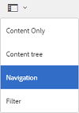
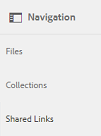
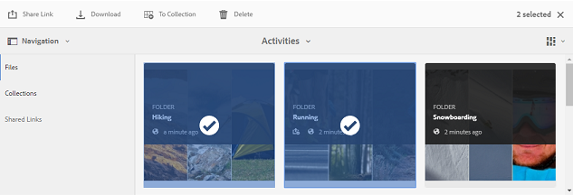
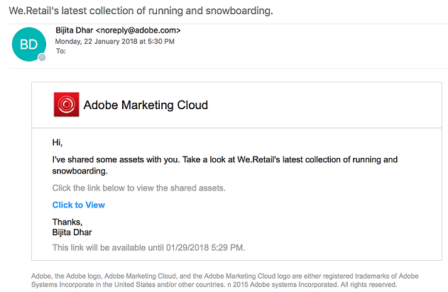
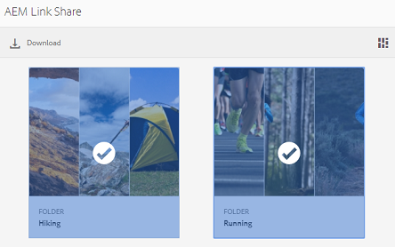
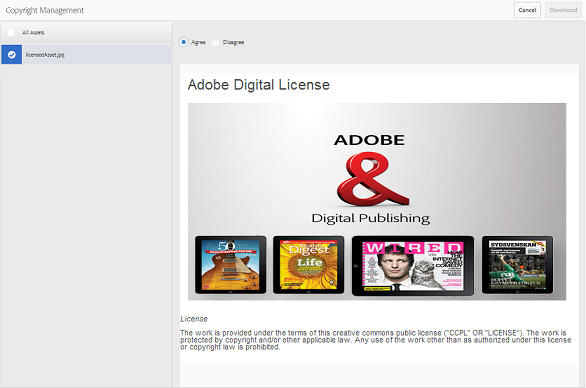

# アセットをリンクとして共有 {#share-assets-as-a-link}

AEM Assets Brand Portal 管理者は、内部のユーザーや外部の関係者（パートナーやベンダーを含む）との間で複数のアセットのリンクを共有できます。エディターは、管理者によって共有されたアセットのみを閲覧および共有できます。

リンクを使用してアセットを共有することは、外部パーティに対して、アセットにアクセスするためにブランドポータルにログインする必要がないという便利な方法です。

リンク共有を利用したアクセスは、エディターと管理者に制限されています。For more information, see [Managing users, groups, and user roles](../using/brand-portal-adding-users.md#manage-user-roles).

>[!NOTE]
>
>ブランドポータルでリンク共有機能を使用すると、5GBまでのzipダウンロードが可能になります。

アセットをリンクとして共有するには、次の手順に従います。

1. Click the overlay icon on the left, and choose **[!UICONTROL Navigation]**.

   

2. From the siderail on the left, click **[!UICONTROL Files]** to share folders or images. To share collections, click **[!UICONTROL Collections]**.

   

3. リンクとして共有するフォルダーやコレクションを選択します。

   

4. From the toolbar at the top, click the **[!UICONTROL Share Link]** icon.

   **[!UICONTROL リンクの共有]** ダイアログボックスが表示されます。

   

   >[!NOTE]
   >
   >**[!UICONTROL 「共有リンク」]** フィールドには、自動的に作成されたアセットリンクが表示されます。このリンクのデフォルトの有効期限は 7 日間です。リンクをコピーして、別途ユーザーと共有できます。また、**[!UICONTROL リンク共有]ダイアログボックスからもリンクを共有できます。**

5. 「電子メールアドレス」ボックスに、リンクを共有するユーザーの電子メール ID を入力します。リンクを複数のユーザーと共有できます。

   ユーザーが組織のメンバーの場合は、ドロップダウンリストに表示される候補の中から電子メール ID を選択します。If the user is external, type the complete email ID and press **[!UICONTROL Enter]**; the email ID is added to the list of users.

   

6. **[!UICONTROL 「件名」]** ボックスに、共有するアセットの件名を入力します。
7. **[!UICONTROL 「メッセージ]** 」ボックスに、必要に応じてメッセージを入力します。
8. **[!UICONTROL 「有効期限]** 」フィールドで、日付ピッカーを使用してリンクの有効期限の日時を指定します。デフォルトの有効期限は、リンクを共有した日から 7 日間です。

   The assets shared through the link expire after crossing the date and time specified in the **[!UICONTROL Expiration]** field. For information about the behavior of expired assets and changes in the permissible activities based on user roles in Brand Portal, see [Manage digital rights of assets](../using/manage-digital-rights-of-assets.md#asset-expiration).

9. Click **[!UICONTROL Share]**. リンクをユーザーと共有することを確認するメッセージが表示されます。リンクを含む電子メールがユーザーに届きます。

   

   >[!NOTE]
   >
   >管理者は、 [ブランド](../using/brand-portal-branding.md) 機能を使用してロゴ、説明、フッターをカスタマイズするなど、電子メールメッセージをカスタマイズできます。

## 共有リンクからアセットをダウンロードする {#download-assets-from-shared-links}

電子メールのリンクをクリックし、共有アセットを表示します。AEM リンク共有ページが開きます。

共有アセットをダウンロードするには：

1. Click the assets and then click **[!UICONTROL Download]** icon from the toolbar.

   

   >[!NOTE]
   >
   >現在、ファイル形式に応じて、特定のアセットのプレビューとサムネールのみを生成できます。サポートされているファイル形式について詳しくは、[プレビューおよびサムネールをサポートするアセット形式](#preview-thumbnail-support)を参照してください。

   >[!NOTE]
   >
   >ダウンロードするアセットに、ライセンスが必要なアセットが含まれている場合は、**[!UICONTROL 著作権管理]ページにリダイレクトされます。** In this page, select the licensed assets, click **[!UICONTROL Agree]**, and then click **[!UICONTROL Download]**. 「同意しない」を選択した場合は、ライセンスが不要なアセットのみがダウンロードされます。\
   >License-protected assets have [license agreement attached](https://helpx.adobe.com/experience-manager/6-5/assets/using/drm.html#DigitalRightsManagementinAssets) to them, which is done by setting asset's [metadata property](https://helpx.adobe.com/experience-manager/6-5/assets/using/drm.html#DigitalRightsManagementinAssets) in [!DNL AEM Assets].

   

   [!UICONTROL ダウンロード] ダイアログボックスが表示されます。
   

   * To speed up the download of asset files shared as the link, select **[!UICONTROL Enable download acceleration]** option and [follow the wizard](../using/accelerated-download.md#download-workflow-using-file-accelerator). To know more about the fast download of assets on Brand Portal refer [Guide to accelerate downloads from Brand Portal](../using/accelerated-download.md).
[!UACROL
2. To download the renditions of assets in addition to the assets from the shared link, select **[!UICONTROL Rendition(s)]** option. When you do so, **Exclude System Renditions]** option appears that is selected by default. これによって、承認済みのアセットレンディションやカスタムレンディションとともに、既製のレンディションがダウンロードされるのを防ぎます。

   However, to allow auto-generated renditions to download along with custom renditions, deselect the **[!UICONTROL Exclude System Renditions]** option.

   >[!NOTE]
   >
   >Original renditions are not downloaded using the shared link if the user who shared the assets as a link is not [authorized by the administrator to have access to the original renditions](../using/brand-portal-adding-users.md#manage-group-roles-and-privileges).

   

3. **[!UICONTROL 「ダウンロード]**」をタップまたはクリックします。アセット（および選択されている場合はレンディション）が ZIP ファイルとしてローカルフォルダーにダウンロードされます。ただし、レンディションなしで 1 つのアセットをダウンロードした場合、zip ファイルは作成されないので、すばやくダウンロードを行うことができます。

>[!NOTE]
>
>Brand Portal では、ファイルサイズが 5 GB を超えるアセットのダウンロードは制限されています。

## プレビューおよびサムネールをサポートするアセット形式 {#preview-thumbnail-support}

以下の表に、Brand Portal における様々なアセット形式のサムネールおよびプレビューのサポート状況を示します。

| アセット形式 | サムネールのサポート | プレビューのサポート |
|--------------|-------------------|-----------------|
| PNG | ✓ | ✓ |
| GIF | ✓ | ✓ |
| TIFF | ✓ | ✕ |
| JPEG | ✓ | ✓ |
| BMP | ✓ | ✕ |
| PNM* | NA | 該当なし |
| PGM* | 該当なし | 該当なし |
| PBM* | 該当なし | 該当なし |
| PPM* | 該当なし | 該当なし |
| PSD | ✓ | ✕ |
| EPS | 該当なし | ✕ |
| DNG | ✓ | ✕ |
| PICT | ✓ | ✕ |
| PSB* | ✓ | ✕ |
| JPG | ✓ | ✓ |
| AI | ✓ | ✕ |
| DOC | ✕ | ✕ |
| DOCX | ✕ | ✕ |
| ODT* | ✕ | ✕ |
| PDF | ✓ | ✕ |
| HTML | ✕ | ✕ |
| RTF | ✕ | ✕ |
| TXT | ✓ | ✕ |
| XLS | ✕ | ✕ |
| XLSX | ✕ | ✕ |
| ODS | ✕ | ✕ |
| PPT | ✓ | ✕ |
| PPTX | ✕ | ✕ |
| ODP | ✕ | ✕ |
| INDD | ✓ | ✕ |
| PS | ✕ | ✕ |
| QXP | ✕ | ✕ |
| EPUB | ✓ | ✕ |
| AAC | ✕ | ✕ |
| MIDI | ✕ | ✕ |
| 3GP | ✕ | ✕ |
| MP3 | ✕ | ✕ |
| MP4 | ✕ | ✕ |
| OGA | ✕ | ✕ |
| OGG | ✕ | ✕ |
| RA | ✕ | ✕ |
| WAV | ✕ | ✕ |
| WMA | ✕ | ✕ |
| DVI | ✕ | ✕ |
| FLV | ✕ | ✕ |
| M4V | ✕ | ✕ |
| MPG | ✕ | ✕ |
| OGV | ✕ | ✕ |
| MOV | ✕ | ✕ |
| WMV | ✕ | ✕ |
| SWF | ✕ | ✕ |
| TGZ | 該当なし | ✕ |
| JAR | ✓ | ✕ |
| RAR | 該当なし | ✕ |
| TAR | 該当なし | ✕ |
| ZIP | ✓ | ✕ |

以下に、この表で使用する記号の意味を示します。

| 記号 | 意味 |
|---|---|
| ✓ | このファイル形式は、この機能をサポートしています |
| ✕ | この機能はサポートされていません。 |
| NA | この機能は適用されません。 |
| * | この機能を AEM オーサーインスタンスで使用するには、このファイル形式用のアドオンサポートが必要です。ただし、アセットが Brand Portal に公開された後、Brand Portal で使用する際には不要です。 |

## リンクとして共有されているアセットの共有解除 {#unshare-assets-shared-as-a-link}

リンクとして共有されているアセットの共有を解除するには、以下の手順を実行します。

1. To view the assets you shared as links, click the overlay icon on the left, and choose **[!UICONTROL Navigation]**.

   

2. From the siderail, click **[!UICONTROL Shared Links]**.

   

3. 表示された一覧で、共有されているリンクを確認します。
4. To unshare a link from the list, select it and click the bin icon next to the link entry, or the **[!UICONTROL Unshare]** icon from the toolbar at the top.

   

   >[!NOTE]
   >
   >共有されているリンクの表示は、ユーザーごとに異なります。この機能は、テナントのすべてのユーザーが共有するすべてのリンクを表示するものではありません。

5. In the warning message box, click **[!UICONTROL Continue]** to confirm unshare. 指定したリンク項目が、共有リンクの一覧から削除されます。
