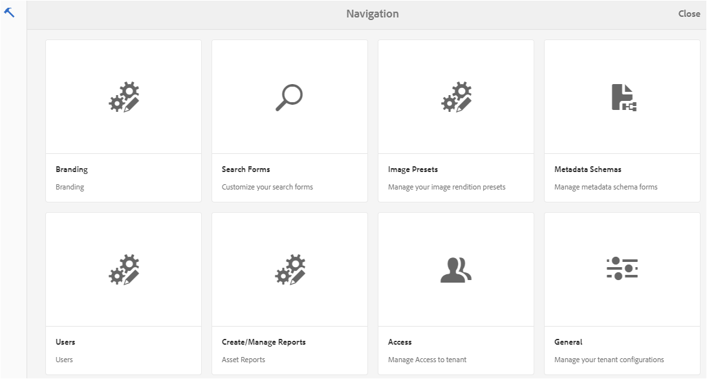
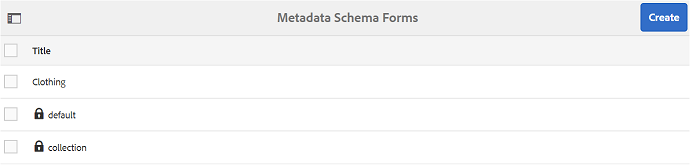
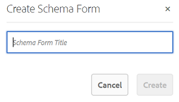
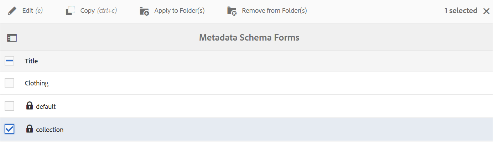
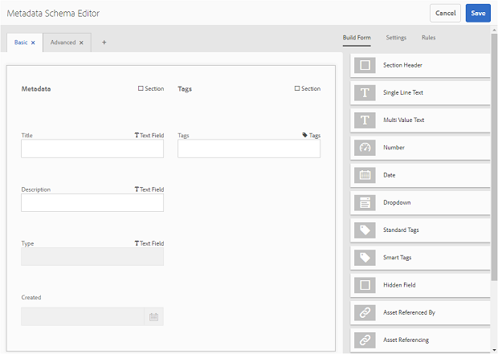
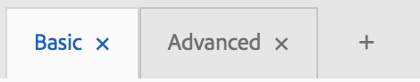
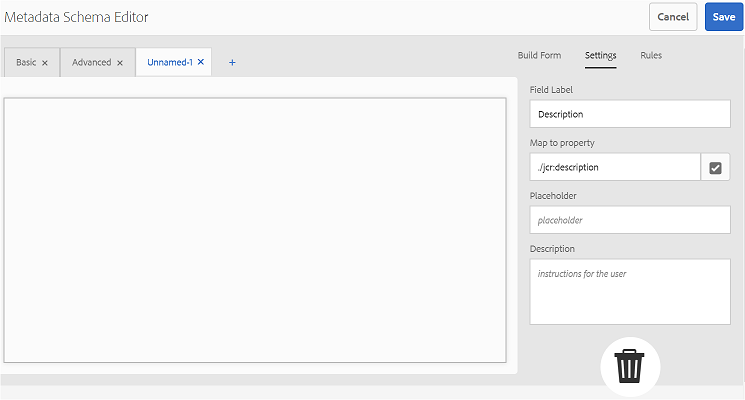
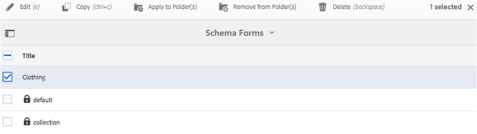
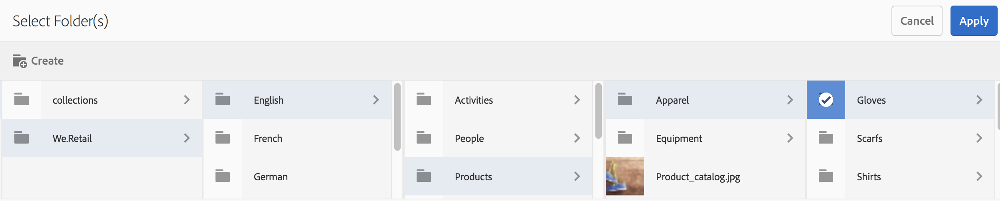
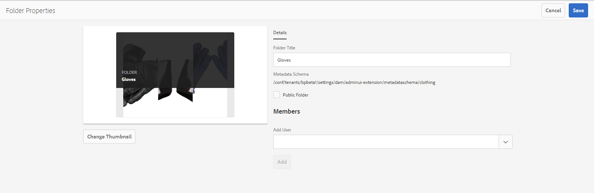

# メタデータスキーマフォームの使用 {#use-the-metadata-schema-form}

メタデータスキーマは、プロパティページのレイアウトと、特定のスキーマを使用するアセット用に表示されるメタデータプロパティを記述します。アセットにどのスキーマを適用するかによって、そのアセットのプロパティページに表示されるメタデータフィールドが決まります。

The **Properties** page for each asset includes default metadata properties depending upon the MIME type of the asset. 管理者は、メタデータスキーマエディターを使用して既存のスキーマを変更したり、カスタムメタデータスキーマを追加したりできます。[!DNL AEM] アセット [!DNL Brand Portal] は、さまざまなMIMEタイプのアセットのデフォルトのフォームを提供します。ただし、このようなアセット用にカスタムフォームを追加することもできます。

## メタデータスキーマフォームの追加 {#add-a-metadata-schema-form}

新しいメタデータスキーマフォームを作成するには、以下の手順を実行します。

1. From the [!DNL AEM] toolbar at the top, click the Adobe logo to access administrative tools.

   

2. 管理ツールパネルの「**メタデータスキーマ**」をクリックします。

   

3. **メタデータスキーマフォームページ** で、 **「作成**」をクリックします。

   

4. In the **Create Schema Form** dialog box, specify the title of the Schema form, and then click **Create** to complete the form creation process.

   

## メタデータスキーマフォームの編集 {#edit-a-metadata-schema-form}

新しく追加したメタデータスキーマフォームまたは既存のメタデータスキーマフォームを編集できます。メタデータスキーマフォームには、タブやタブ内のフォーム項目など、親から派生したコンテンツが含まれます。これらのフォーム項目をメタデータノード内のフィールドにマップしたり、フォーム項目を設定したりできます。

新しいタブまたはフォーム項目をメタデータスキーマフォームに追加できます。（親から）派生したタブおよびフォーム項目はロック状態です。子レベルではこれらを変更できません。

メタデータスキーマフォームを編集するには、以下の手順を実行します。

1. From the [!DNL AEM] toolbar at the top, click the Adobe logo to access administrative tools.

   

2. 管理ツールパネルの「**メタデータスキーマ**」をクリックします。
3. **メタデータスキーマフォームページ** から、プロパティ（ **例えば、コレクション**）を編集するスキーマフォームを選択します。

   

   >[!NOTE]
   >
   >編集されていないテンプレートの前には&#x200B;**ロック**&#x200B;記号が表示されます。テンプレートをカスタマイズすると、そのテンプレートの前にある&#x200B;**ロック**&#x200B;記号が消えます。

4. 上部のツールバーの「**編集**」をクリックします。

   **メタデータスキーマエディター**&#x200B;ページが開き、左側には「**基本**」タブが、右側には「**フォームを作成**」タブが開きます。

5. **メタデータスキーマエディター** ページで、«フォーム ******の種類** »タブのコンポーネントの種類リストから1つまたは複数のコンポーネントを **ドラッグ** して、アセットのプロパティページをカスタマイズします。

   

6. To configure a component, select it and modify its properties in the **Settings** tab.

### 「フォームを作成」タブのコンポーネント{#components-in-the-build-form-tab}

**「フォームのビルド** 」タブには、スキーマフォームで使用できる項目が一覧表示されます。**「設定** 」タブには、「フォーム **の作成」** タブで選択した各項目の属性が表示されます。The following table lists the form items available in the **Build Form** tab:

| コンポーネント名 | 説明 |
|---------------------|--------------------------------------------------------------------------------------------------------------------------------------------------------------------------------------------------------------------------------------------------------------------------------------------|
| セクションヘッダー | 共通コンポーネントのリストに対してセクションヘッダーを追加します。 |
| 1 行のテキスト | 1 行のテキストプロパティを追加します。これは文字列として保存されます。 |
| 複数ValueText | 複数値のtextプロパティを追加します。これは文字列の配列として保存されます。 |
| 番号 | 数値コンポーネントを追加します。 |
| 日付 | 日付コンポーネントを追加します。 |
| ドロップダウン | ドロップダウンリストを追加します。 |
| 標準タグ | タグを追加します。**注意:** 管理者は、パス値を変更する必要が生じる場合があります（ `/etc/tags/mac/<tenant_id>/<custom_tag_namespace>`例えば、メタデータスキーマフォームを公開する [!DNL AEM]場合、パスにテナント情報が含ま `/etc/tags/<custom_tag_namespace>`れていない場合など）。 |
| スマートタグ | [!DNL AEM] スマートタグを購入して設定した場合は、自動検出されたタグが自動検出されます。 |
| 非表示のフィールド | 非表示のフィールドを追加します。このフィールドは、アセットの保存時に POST パラメーターとして送信されます。 |
| アセットの参照元 | このアセットが参照しているアセットのリストを表示するには、このコンポーネントを追加します。 |
| アセットの参照 | このアセットを参照しているアセットのリストを表示するには、このコンポーネントを追加します。 |
| アセット評価 | Average rating of an asset added from [!DNL AEM] Assets before it is published to [!DNL Brand Portal]. |
| コンテキストメタデータ | アセットのプロパティページにある他のメタデータタブの表示を制御するために追加します。 |

>[!NOTE]
>
>Do not use **Product References** as it is not functional.

#### メタデータコンポーネントの編集 {#edit-the-metadata-component}

フォームのメタデータコンポーネントのプロパティを編集するには、コンポーネントをクリックし、「**設定**」タブでプロパティを編集します。

* **フィールドラベル**:アセットのプロパティページに表示されるメタデータプロパティの名前。

* **プロパティにマッピング**：このプロパティの値には、CRX リポジトリに保存される場所にあるアセットノードへの相対パスまたは名前を指定します。この値は、パスがアセットのノード以下にあることを示すように、「**./**」から始めます。

このプロパティの有効な値は次のとおりです。

-- `./jcr:content/metadata/dc:title`: Stores the value at the asset's metadata node as the property `dc:title`.

-- `./jcr:created`: Displays the jcr property at the asset's node. 表示プロパティ上でこれらのプロパティを設定する場合は、これらのプロパティは保護されているので、「編集を無効にする」としてマークすることをお勧めします。そうしない場合、アセットのプロパティを保存したときに、「アセットの変更に失敗しました」というエラーが発生します。

* **プレースホルダー**：メタデータプロパティに関する関連情報をユーザーに示すには、このプロパティを使用します。
* **必須**：プロパティページでメタデータプロパティを必須としてマークするには、このプロパティを使用します。
* **編集を無効にする**：プロパティページでメタデータプロパティを編集不可にするには、このプロパティを使用します。
* **空白のフィールドを読み取り専用として表示**：プロパティページでメタデータプロパティに値がなくても表示するには、このプロパティをオンにします。デフォルトでは、メタデータプロパティに値がない場合、プロパティページには表示されません。
* **説明**：メタデータコンポーネントの短い説明を追加するには、このプロパティを使用します。
* **削除アイコン**:スキーマフォームからコンポーネントを削除するには、このアイコンをクリックします。

>[!NOTE]
>
>アセットのメタデータエディターフォームでは、すべてのメタデータフィールドが読み取り専用です。Since metadata of the asset must be edited in [!DNL AEM] Assets before an asset is published to [!DNL Brand Portal].

#### スキーマフォームでのタブの追加または削除 {#add-or-delete-a-tab-in-the-schema-form}

The default schema form includes the **Basic** and **Advanced** tabs. スキーマエディターで、タブを追加または削除できます。

* To add a new tab on a schema form, click **+**. デフォルトでは、新しいタブには「名称未設定-1"という名前が付けられています。この名前は、「**設定**」タブから編集できます。

* タブを削除するには **、"x**」をクリックします。「**保存**」をクリックして、変更を保存します。

## フォルダーへのメタデータスキーマの適用 {#apply-a-metadata-schema-to-a-folder}

[!DNL Brand Portal] では、選択した特定の情報のみをアセットの&#x200B;**プロパティ**&#x200B;ページに表示するように、メタデータスキーマをカスタマイズして制御できます。**プロパティ**&#x200B;ページに表示するメタデータを制御するには、メタデータスキーマフォームから必要なメタデータを削除し、そのメタデータスキーマフォームを特定のフォルダーに適用します。

フォルダーにメタデータスキーマフォームを適用するには、以下の手順を実行します。

1. From the [!DNL AEM] toolbar at the top, click the Adobe logo to access administrative tools.

   

2. 管理ツールパネルの「**メタデータスキーマ**」をクリックします。

3. **メタデータスキーマフォームページ** から、アセットに適用するスキーマフォーム（ **例えば、衣服**）を選択します。

   

4. From the toolbar at the top, click **Apply to Folder(s)**.

5. **フォルダーを選択**&#x200B;ページで、**clothing** メタデータスキーマを適用するフォルダー（例：**Gloves**）に移動します。

   

6. 「**適用**」をクリックして、フォルダーにメタデータスキーマフォームを適用します。

   **clothing** メタデータスキーマフォームで使用できるメタデータが **Gloves** フォルダーに適用され、そのフォルダーの&#x200B;**プロパティ**&#x200B;ページに表示されます。

   

>[!NOTE]
>
>ネストされたスキーマを含むスキーマを、ビデオファイルを含むフォルダーに適用すると、そのビデオファイルのメタデータプロパティが適切にレンダリングされない場合があります。メタデータプロパティを適切にレンダリングするには、ネストされたスキーマを削除し、フォルダーに親スキーマのみを適用します。

## メタデータスキーマフォームの削除 {#delete-a-metadata-schema-form}

[!DNL Brand Portal] では、カスタムのスキーマフォームのみを削除できます。デフォルトのスキーマフォームまたはテンプレートを削除することはできません。ただし、これらのフォームでのカスタムの変更内容は削除できます。

フォームを削除するには、フォームを選択して&#x200B;**削除**&#x200B;アイコンをクリックします。

>[!NOTE]
>
>デフォルトフォームに加えたカスタムの変更を削除すると、**ロック**&#x200B;記号がメタデータスキーマインターフェイスのフォーム名の前に再度表示され、フォームがデフォルトの状態に戻ったことが示されます。

## MIME タイプ用のスキーマフォーム {#schema-forms-for-mime-types}

### MIME タイプ用の新しいフォームの追加 {#adding-new-forms-for-mime-types}

デフォルトのフォームに加えて、様々な MIME タイプのアセット用のカスタムフォームを追加したり、適切なフォームタイプの下に新しいフォームを作成したりできます。**例えば、画像/png** サブタイプの新しいテンプレートを追加するには、「画像」フォームの下にフォームを作成します。スキーマフォームのタイトルはサブタイプ名です。この場合、タイトルは"png"です。

#### 様々な MIME タイプ用の既存のスキーマテンプレートの使用 {#using-an-existing-schema-template-for-various-mime-types}

You can use an existing template for a different MIME type. For example, use the **image/jpeg** form for assets of MIME type **image/png**.

In this case, create a new node at `/etc/dam/metadataeditor/mimetypemappings` in the CRX repository. そのノードの名前を指定し、次のプロパティを定義します。

| **名前** | **種類** | **値** |
|---|---|---|
| exposedmimetype | String | image/jpeg |
| mimetypes | String[] | image/png |

* **exposedmdimetype**:マップする既存フォームの名前
* **MIMEタイプ**: **exposedimimetype** 属性で定義されているフォームを使用するMIMEタイプのリスト

[!DNL Brand Portal] に、次のMIMEタイプとスキーマフォームをマッピングします。

| **スキーマフォーム** | **MIME タイプ** |
|---|---|
| image/jpeg | image/pjpeg |
| image/tiff | image/x-tiff |
| application/pdf | application/postscript |
| application/x-ImageSet | Multipart/Related; type=application/x-ImageSet |
| application/x-SpinSet | Multipart/Related; type=application/x-SpinSet |
| application/x-MixedMediaSet | Multipart/Related; type=application/x-MixedMediaSet |
| video/quicktime | video/x-quicktime |
| video/mpeg4 | video/mp4 |
| video/avi | video/avi, video/msvideo, video/x-msvideo |
| video/wmv | video/x-ms-wmv |
| video/flv | video/x-flv |

以下に、デフォルトのメタデータプロパティの一覧を示します。

* jcr:content/metadata/cq:tags
* jcr:content/metadata/dc:format
* jcr:content/metadata/dam:status
* jcr:content/metadata/videoCodec
* jcr:content/metadata/audioCodec
* jcr:content/metadata/dc:title
* jcr:content/metadata/dc:description
* jcr:content/metadata/xmpMM:InstanceID
* jcr:content/metadata/xmpMM:DocumentID
* jcr:content/metadata/dam:sha1
* jcr:content/metadata/dam:solutionContext
* jcr:content/metadata/videoBitrate
* jcr:content/metadata/audioBitrate
* jcr:content/usages/usedBy
* jcr:content/jcr:lastModified
* jcr:content/metadata/prism:expirationDate
* jcr:content/onTime
* jcr:content/offTime
* jcr:content/metadata/dam:size
* jcr:content/metadata/tiff:ImageWidth
* jcr:content/metadata/tiff:ImageLength
