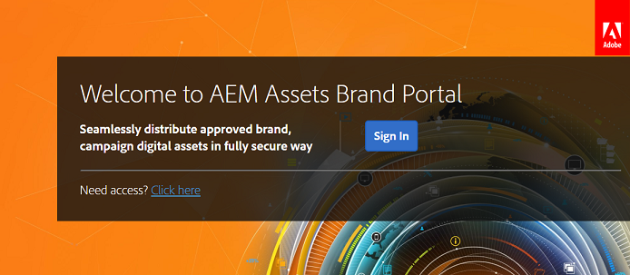

# 初回のログイン操作 {#first-time-login-experience}

初回のログイン操作は、管理者を含む、すべての新規Experience ManagerAssets Brand Portalユーザーに共通です。 管理者が組織の Brand Portal アカウントにユーザーを追加すると、そのユーザーは自動的に追加されるので、招待に同意する必要はありません。追加されたユーザーには、組織の Brand Portal アカウントへのリンクが記載された「ようこそ」の電子メールが届きます。

Brand Portal に初めてログインするユーザーが実行する手順は以下のとおりです。

1. 「ようこそ」の電子メールを開いて、「**[!UICONTROL 使用を開始]**」をクリックします。

1. 新規登録ページで、詳細（名前、パスワード、国／地域など）を指定します。
   >[!NOTE]
   >
   >既存の Adobe Marketing Cloud ユーザーには、新規登録ページではなく、ログインページが表示されます。Adobe Marketing Cloud にログインするには、Adobe ID とパスワードを入力します。

   >[!NOTE]
   >
   >組織で Enterprise ID を使用している場合は、新規登録ページは表示されずに、エンタープライズログインページにリダイレクトされます。詳しくは、[Enterprise ID、ログイン、およびアカウントヘルプ](https://helpx.adobe.com/jp/enterprise/kb/enterprise-id-faq.html)を参照してください。

1. 「**[!UICONTROL 続行]**」をクリックして、組織の Brand Portal ページに進みます。
1. Brand Portal ログインページの「**[!UICONTROL ログイン]**」をクリックして、Brand Portal にログインします。

   

   >[!NOTE]
   >
   >Brand Portalにログインするには、1 つ以上のExperience ManagerAssets 製品プロファイルの権利が必要です。
