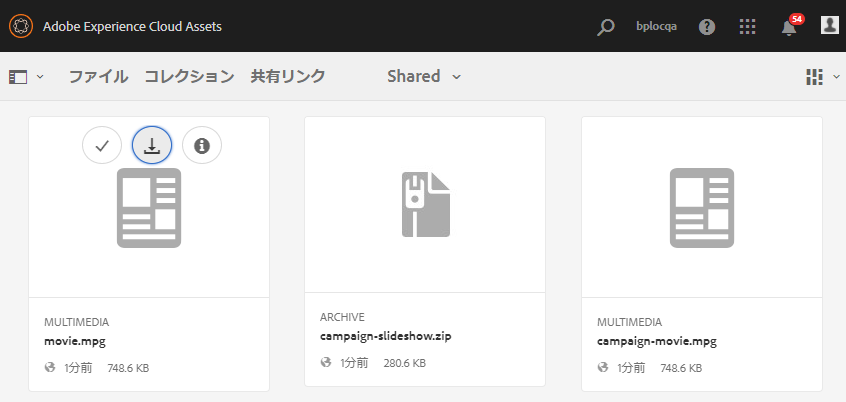
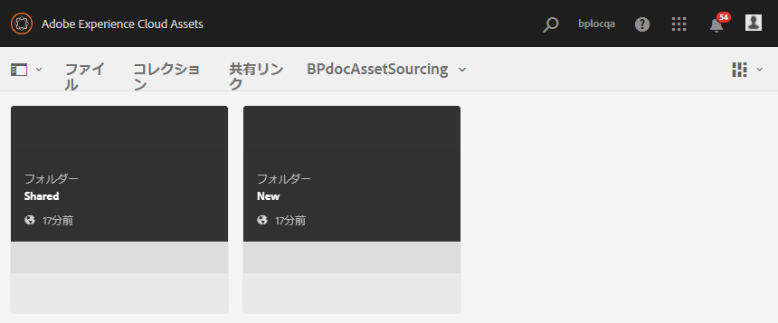
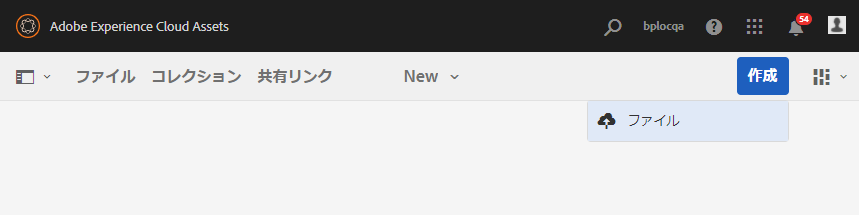
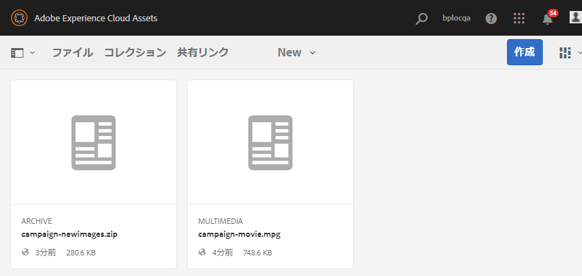
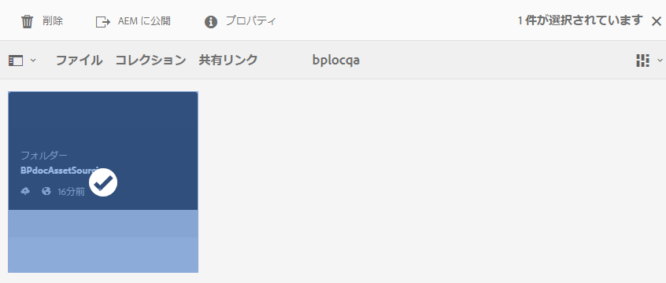
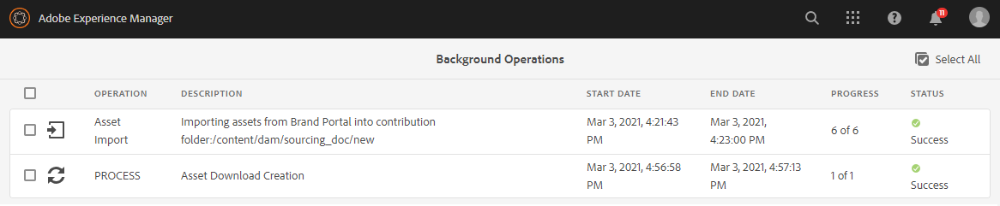

# 投稿フォルダーのExperience Managerアセットへの公開 {#using-asset-souring-in-bp}

適切な権限を持つ Brand Portal ユーザーは、複数のアセットや、複数のアセットを含むフォルダーを投稿フォルダーにアップロードできます。ただし、Brand Portal ユーザーは **NEW** フォルダーにのみアセットをアップロードできます。す。**SHARED** フォルダーは、ベースラインアセット（参照用コンテンツ）を配布するためのものです。投稿用の新しいアセットを作成する際に Brand Portal ユーザーが使用できます。

投稿フォルダーへのアクセス権を持つ Brand Portal ユーザーは、次のアクティビティを実行できます。

* [アセット要件のダウンロード](#download-asset-requirements)
* [投稿フォルダーへの新しいアセットのアップロード](#uplad-new-assets-to-contribution-folder)
* [投稿フォルダーのExperience Managerアセットへの公開](#publish-contribution-folder-to-aem)

## アセット要件のダウンロード {#download-asset-requirements}

Brand Portalのユーザーは、投稿フォルダーがExperience Managerの Assets ユーザーによって共有されるたびに、電子メール/パルス通知を自動的に受け取り、基準アセット（参照コンテンツ）を **SHARED** フォルダーからダウンロードして、アセット要件を理解できます。

Brand Portal ユーザーは、アセット要件をダウンロードするために、次のアクティビティを実行します。

* **概要をダウンロード**：投稿フォルダーに添付されている概要（アセット要件ドキュメント）をダウンロードします。アセットのタイプ、目的、サポートする形式、最大アセットサイズなどのアセット関連情報が含まれます。
* **ベースラインアセットをダウンロード**：必要なアセットのタイプを理解するために使用できるベースラインアセットをダウンロードします。Brand Portal ユーザーは、これらのアセットを参照用に使用して、投稿用の新しいアセットを作成します。

新しく共有された投稿フォルダーと共に、Brand Portal ユーザーに対して許可された既存のすべてのフォルダーが Brand Portal ダッシュボードに反映されます。この例では、Brand Portal ユーザーのみが新しく作成された投稿フォルダーへのアクセス権を持ち、他の既存のフォルダーはユーザーと共有されていません。

**アセット要件をダウンロードするには：**

1. Brand Portal インスタンスにログインします。
1. Brand Portal ダッシュボードから投稿フォルダーを選択します。
1. 「**[!UICONTROL プロパティ]**」をクリックします。投稿フォルダーの詳細を表示したプロパティーウィンドウが開きます。

   

   

1. 「**[!UICONTROL 概要をダウンロード]**」オプションをクリックして、アセット要件ドキュメントをローカルマシンにダウンロードします。

   

1. Brand Portal ダッシュボードに戻ります。
1. クリックして投稿フォルダーを開くと、投稿フォルダー内に **[!UICONTROL SHARED]** と **[!UICONTROL NEW]** の 2 つのサブフォルダーが表示されます。SHARED フォルダーには、管理者によって共有されたすべてのベースラインアセット（参照用コンテンツ）が含まれます。
1. すべてのベースラインアセットを含む **[!UICONTROL SHARED]** フォルダーをローカルマシンにダウンロードできます。
または、**[!UICONTROL SHARED]** フォルダーを開き、**ダウンロード**&#x200B;アイコンをクリックして、個別のファイル／フォルダーをダウンロードできます。

   

   

概要（アセット要件ドキュメント）を確認し、ベースラインアセットを参照して、アセット要件を理解します。これで、投稿用の新しいアセットを作成して、投稿フォルダーにアップロードできます。

## 投稿フォルダーへのアセットのアップロード {#uplad-new-assets-to-contribution-folder}

Brand Portal ユーザーは、アセット要件を確認した後、投稿用の新しいアセットを作成して投稿フォルダー内の NEW フォルダーにアップロードできます。

>[!NOTE]
>
>Brand Portal ユーザーは、アセットを NEW フォルダーにのみアップロードできます。
>
>Brand Portal テナントの最大アップロード数は **10** GBです。これは累積的にすべての投稿フォルダーに適用されます。

>[!NOTE]
>
>他のBrand Portalユーザーが投稿できるように、投稿フォルダーをExperience Managerー Assets に公開してからアップロード領域を解放することをお勧めします。
>
>Brand Portalテナントのアップロード制限を **10** GB を超えて拡張する必要がある場合は、カスタマーサポートに連絡して、要件を指定してください。

**新しいアセットをアップロードするには：**

1. Brand Portal インスタンスにログインします。
新しく共有された投稿フォルダーと共に、Brand Portal ユーザーに対して許可された既存のすべてのフォルダーが Brand Portal ダッシュボードに反映されます。

1. 投稿フォルダーを選択し、クリックして開きます。投稿フォルダーには、**[!UICONTROL SHARED]** と **[!UICONTROL NEW]** の 2 つのサブフォルダーが含まれます。

1. **[!UICONTROL NEW]** フォルダーをクリックします。

   

1. **[!UICONTROL 作成]**／**[!UICONTROL ファイル]**&#x200B;をクリックして、複数のアセットを含む個別のファイルまたはフォルダー（.zip）をアップロードします。

   

1. アセット（ファイルまたはフォルダー）を参照し、**[!UICONTROL NEW]** フォルダーへとアップロードします。

   

すべてのアセットまたはフォルダーを NEW フォルダーにアップロードしたら、投稿フォルダーをExperience ManagerAssets に公開します。

## 投稿フォルダーのExperience Managerアセットへの公開 {#publish-contribution-folder-to-aem}

Brand Portalユーザーは、投稿フォルダーをExperience Managerアセットに公開できます。投稿オーサーインスタンスにアクセスする必要はありません。

必ずアセット要件を確認してから、投稿フォルダー内の **NEW** フォルダーに新しく作成されたアセットをアップロードします。

**投稿フォルダーを公開するには：**

1. Brand Portal インスタンスにログインします。

1. Brand Portal ダッシュボードから投稿フォルダーを選択します。
1. 「**[!UICONTROL AEM に公開]**」をクリックします。

   

   

公開ワークフローの様々な段階で、電子メール／パルス通知が Brand Portal ユーザーおよび管理者に送信されます。

1. **キューに登録済み** - Brand Portal で公開ワークフローがトリガーされると、Brand Portal ユーザーおよび Brand Portal 管理者に通知が送信されます。

1. **完了**  — 投稿フォルダーがBrand Portal Assets へ正常に公開されると、Brand PortalユーザーおよびExperience Manager管理者に通知が送信されます。

新しく作成したアセットをExperience ManagerAssets に公開した後、Brand Portalユーザーは NEW フォルダーから削除できます。 一方、Brand Portal 管理者は、NEW フォルダーと SHARED フォルダーの両方からアセットを削除できます。

投稿フォルダー作成の目的を達成したら、Brand Portal 管理者は投稿フォルダーを削除して、他のユーザーが使用できるようアップロード領域を解放できます。

## ジョブステータスの公開 {#publishing-job-status}

管理者は、Brand PortalからExperience Managerアセットに公開されたアセット投稿フォルダーのステータスを表示するために使用できるレポートを 2 つ用意しています。

* Brand Portal で、**[!UICONTROL ツール]**／**[!UICONTROL アセット投稿のステータス]**&#x200B;に移動します。このレポートには、公開ワークフローの様々な段階におけるすべての公開ジョブのステータスが表示されます。

   

* Experience Managerアセット（オンプレミスまたはマネージドサービス）で、**[!UICONTROL Assets]** / **[!UICONTROL ジョブ]** に移動します。 このレポートには、すべての公開ジョブの最終状態（成功またはエラー）が表示されます。

   

* Experience ManagerアセットをCloud Serviceーとして開き、**[!UICONTROL Assets]** > **[!UICONTROL Jobs]** に移動します。

   または、グローバルナビゲーションから&#x200B;**[!UICONTROL ジョブ]**&#x200B;に直接移動できます。

   このレポートは、Brand PortalからExperience ManagerアセットへのCloud Serviceとしてのアセットの読み込みを含む、すべての公開ジョブの最終状態（成功またはエラー）を反映します。

   

<!--
>[!NOTE]
>
>Currently, no report is generated in AEM Assets as a Cloud Service for the Asset Sourcing workflow. 
-->
