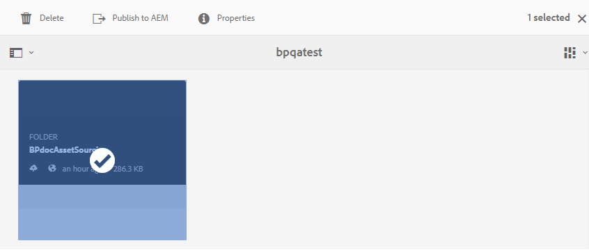

# AEM Assets へのコントリビューションフォルダーの公開 {#publish-contribution-folder-to-aem}

Brand Portal ユーザーは、AEM オーサーインスタンスにアクセスすることなく、コントリビューションフォルダーを AEM Assets に公開できます。

必ず[アセット要件](brand-portal-download-asset-requirements.md)を確認してから、コントリビューションフォルダー内の **NEW** フォルダーに新しく作成されたアセットをアップロードします。[コントリビューションフォルダーへのアセットのアップロード](brand-portal-upload-assets-to-contribution-folder.md)を参照してください。

**コントリビューションフォルダーを公開するには：**

1. Brand Portal インスタンスにログインします。
1. Brand Portal ダッシュボードからコントリビューションフォルダーを選択します。
1. 「**[!UICONTROL AEM に公開]**」（）をクリックします。
   

公開ワークフローの様々なステージで、電子メール／パルス通知が Brand Portal および AEM、管理者およびユーザーに送信されます。
1. **待機中** - Brand Portal で公開ワークフローがトリガーされると、コントリビューションフォルダーが Brand Portal から AEM に公開されます。
1. **処理中** - AEM Assets がコントリビューションフォルダーの読み込みを開始しています。
1. **完了** - 公開アクションが完了すると、コントリビューションフォルダーは AEM Assets に正常に読み込まれています。

