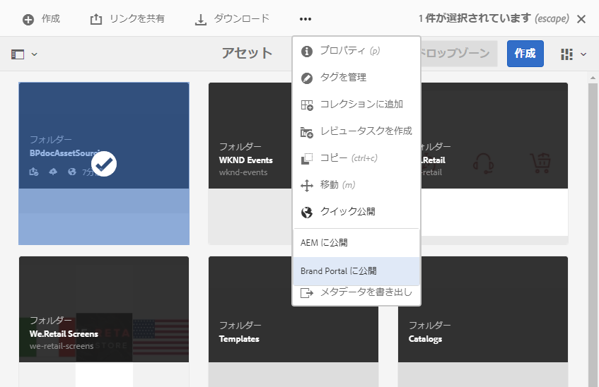

# Brand Portal への投稿フォルダーの公開 {#publish-contribution-folder-to-brand-portal}

[投稿フォルダーが設定されると](brand-portal-configure-contribution-folder-properties.md)、AEM ユーザー（管理者／管理者以外のユーザー）は、AEM Assets から Brand Portal に投稿フォルダーを公開できます。投稿フォルダーへのアクセス権を持つ Brand Portal ユーザー／グループは、公開アクションの完了時に電子メール／パルス通知を受け取ります。

**投稿フォルダーを公開するには：**

1. AEM オーサーインスタンスにログインします。デフォルト URL は http://localhost:4502/aem/start.html です。
1. **[!UICONTROL アセット／ファイル]**&#x200B;に移動して、Brand Portal に公開する投稿フォルダーを探します。
1. 投稿フォルダーを選択して、**[!UICONTROL クイック公開／Brand Portal に公開]**&#x200B;をクリックします。

   

   
投稿フォルダーが Brand Portal に公開されると、成功メッセージを受け取ります。

投稿フォルダーに割り当てられた Brand Portal ユーザーに電子メール／パルス通知が送信されます。Brand Portal ユーザーは、投稿フォルダーにアクセスして投稿を開始できます。[投稿フォルダーへのアセットのアップロード](brand-portal-upload-assets-to-contribution-folder.md)を参照してください。