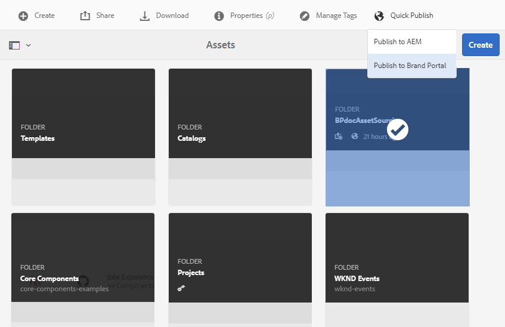

# Publish contribution folder to Brand Portal {#publish-contribution-folder-to-brand-portal}

貢献度フォ [ルダーを設定すると](brand-portal-configure-contribution-folder-properties.md)、AEMユーザー（管理者または非管理者ユーザー）はAEM AssetsからBrand portalに貢献度フォルダーを発行できます。 貢献度フォルダーにアクセスする権限を持つBrand portalユーザー/グループは、発行アクションの完了時に電子メール/パルス通知を受け取ります。

**貢献度フォルダーを発行するには：**

1. AEM作成者インスタンスにログインします。
デフォルトURL:http:// localhost:4502/aem/start.html
1. アセット/ **[!UICONTROL ファイルに移動し]** 、Brand portalに公開する貢献度フォルダーを探します。
1. 貢献度フォルダーを選択し、クイッ **[!UICONTROL ク投稿管理/ブランドポータルに投稿をクリックしま]**す。
   
貢献度フォルダーがBrand Portalに発行されると、成功メッセージが表示されます。

電子メール/パルス通知が、貢献度フォルダーに割り当てられたBrand Portalのユーザー/グループに送信されます。 Brand portalユーザーは、貢献度フォルダーにアクセスして貢献度を開始できます。 詳しくは、アセットを貢 [献度フォルダーにアップロードを参照してくださ](brand-portal-upload-assets-to-contribution-folder.md)い。