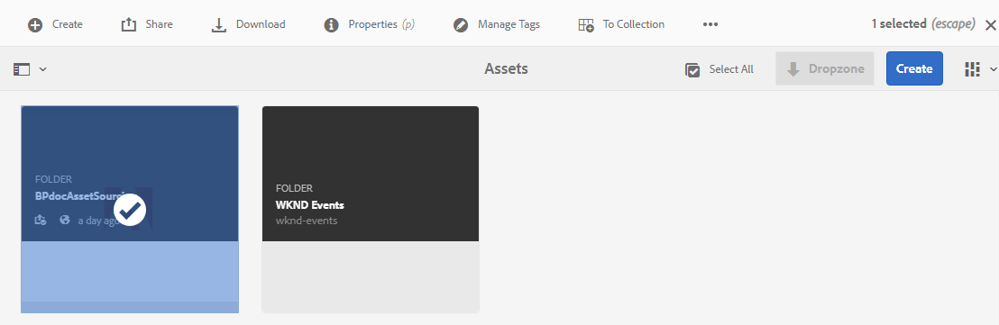
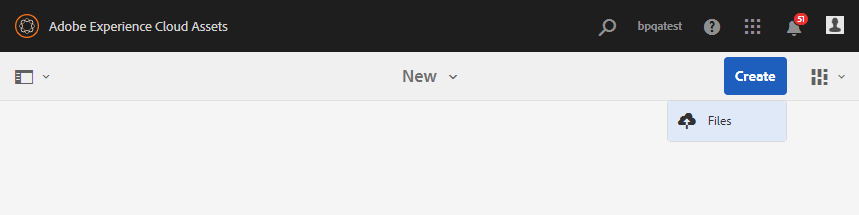

# AEM Assets{#configure-contribution-folder}で貢献度フォルダーを構成

共同アセットソーシングの場合、AEM ユーザー（管理者および権限を持つ非管理者ユーザー）は&#x200B;**アセット投稿**&#x200B;タイプの新しいフォルダーを作成できます。作成した新しいフォルダーは、Brand Portal ユーザーがアセット送信に利用できます。これにより、新しく作成された&#x200B;**投稿**&#x200B;フォルダー内に **SHARED** および **NEW** という 2 つのサブフォルダーを追加作成するワークフローが自動的にトリガーされます。

次に、AEM ユーザーはアセット要件を定義します。それには、投稿フォルダーに追加する必要があるアセットのタイプに関する概要と一連のベースラインアセットを **SHARED** フォルダーにアップロードして、Brand Portal ユーザーが必要な情報を確実に入手できるようにします。その後、管理者は、アクティブな Brand Portal ユーザーに投稿フォルダーへのアクセスを許可してから、新しく作成した投稿フォルダーを Brand Portal に公開することができます。

次のビデオでは、AEM Assets での投稿フォルダーの設定方法を説明しています。

>[!VIDEO](https://video.tv.adobe.com/v/30547)

AEM ユーザーは、投稿フォルダーを設定する際に、次のアクティビティを実行します。

* [投稿フォルダーの作成](#create-contribution-folder)
* [アセット要件のアップロードと寄稿者の割り当て](#configure-contribution-folder-properties)
* [ベースラインアセットのアップロード](#uplad-new-assets-to-contribution-folder)
* [AEM AssetsからBrand Portalに貢献度フォルダーを公開する](#publish-contribution-folder-to-brand-portal)

## 投稿フォルダーの作成 {#create-contribution-folder}

AEM 管理者と、新しいフォルダーを作成する権限を持つ非管理者ユーザーは、AEM Assets に投稿フォルダーを作成できます。投稿フォルダーを作成するには、アセット投稿タイプの新しいフォルダーを作成します。作成した新しいフォルダーは Brand Portal ユーザーによるアセット送信に利用できるようになります。これにより、投稿フォルダー内に SHARED および NEW という 2 つのサブフォルダーを追加作成するワークフローが自動的にトリガーされます。

>[!NOTE]
>
>フォルダー内に複数の貢献度フォルダーを作成できます。貢献度フォルダーは、別の貢献度フォルダー内に作成しないでください。

**投稿フォルダーを作成するには：**
1. AEM Assetsインスタンスにログインします。

1. **[!UICONTROL Assets]**／**[!UICONTROL ファイル]**&#x200B;に移動します。AEM Assets リポジトリの既存のすべてのフォルダーがリストされます。

1. 「**[!UICONTROL 作成]**」をクリックして、新規フォルダーを作成します。「**[!UICONTROL フォルダーを作成]**」ダイアログが開きます。

1. フォルダーの「**[!UICONTROL タイトル]**」および「**[!UICONTROL 名前]**」を入力し、「**[!UICONTROL アセット投稿]**」チェックボックスをオンにします。フォルダーの名前には、スペースを含まない小文字のアルファベットを使用することをお勧めします。

1. 「**[!UICONTROL 作成]**」をクリックします。AEM Assets リポジトリに、投稿フォルダーがリストされます。

   >[!NOTE]
   >
   >管理者以外のユーザーは、アセット投稿フォルダーを作成および共有できますが、変更または削除することはできません。

   

1. クリックして投稿フォルダーを開くと、投稿フォルダー内に **[!UICONTROL SHARED]** と **[!UICONTROL NEW]** の 2 つのサブフォルダーが自動的に作成されているのがわかります。

   

貢献度フォルダーの作成時に、貢献度フォルダーのプロパティを設定することもできます。

## 投稿フォルダーのプロパティの設定 {#configure-contribution-folder-properties}

AEM 管理者は、投稿フォルダーのプロパティを設定する際に、次のアクティビティを実行します。

* **説明を追加**：投稿フォルダーの大まかな説明を提供します。
* **概要をアップロード**：アセット関連情報を含むアセット要件ドキュメントをアップロードします。
* **寄追加稿者**:Brand 追加 Portalユーザーに貢献度フォルダーへのアクセス権を付与します。

アセット要件は、管理者によって提供された詳細を参照して、投稿者（Brand Portal ユーザー）が投稿フォルダーのニーズおよび要件を理解できるようにします。管理者は、投稿フォルダーに追加する必要があるアセットのタイプおよびアセット関連情報（目的、画像のタイプ、最大サイズなど）に関する概要を含むアセット要件ドキュメントをアップロードします。

**投稿フォルダーのプロパティを設定するには：**

1. AEM Assetsインスタンスにログインします。

1. **[!UICONTROL アセット／ファイル]**&#x200B;に移動して、投稿フォルダーを探します。
1. 貢献度フォルダーを選択し、「**[!UICONTROL プロパティ]**」をクリックして、フォルダーのプロパティーウィンドウを開きます。

   

   

1. 「**[!UICONTROL アセット投稿]**」タブに移動します。
1. 投稿フォルダーの大まかな&#x200B;**[!UICONTROL 説明]**&#x200B;を入力します。
1. **[!UICONTROL 概要をアップロード]**&#x200B;をクリックし、ローカルマシンから参照して&#x200B;**アセット要件ドキュメント**&#x200B;をアップロードします。

   

1. 「**[!UICONTROL 追加ユーザー]**」フィールドに、貢献度フォルダーを共有するBrand Portalユーザーを追加します。 これらのユーザーは、ブランドポータルインターフェイスを使用して、コンテンツにアクセスし、貢献度フォルダーにアップロードできます。
1. 「**[!UICONTROL 保存]**」をクリックします。

   

>[!NOTE]
>
>検索結果は、AEM Assets に設定された Brand Portal ユーザーリストに基づきます。Brand Portal ユーザーリストを更新しておくようにします。

## 投稿フォルダーへのアセットのアップロード {#uplad-new-assets-to-contribution-folder}

Brand Portal のユーザーは、アセット要件をダウンロードして、投稿の必要性を理解できます。
また、投稿用の新しいアセットを作成して、投稿フォルダー内の NEW フォルダーにアップロードできます。

>[!NOTE]
>
>Brand Portal ユーザーは、アセットを NEW フォルダーにのみアップロードできます。
>
>Brand Portal テナントの最大アップロード数は **10** GBです。これは累積的にすべての投稿フォルダーに適用されます。

新しく作成したアセットを AEM Assets に公開した後、Brand Portal のユーザーは、NEW フォルダーからそれらのアセットを削除できます。一方、Brand Portal 管理者は、NEW フォルダーと SHARED フォルダーの両方からアセットを削除できます。

投稿フォルダー作成の目的を達成したら、Brand Portal 管理者は投稿フォルダーを削除して、他のユーザーが使用できるようアップロード領域を解放できます。

>[!NOTE]
>
>投稿フォルダーを AEM Assets に公開した後、アップロード領域を解放し、他の Brand Portal ユーザーが投稿に使用できるようにすることをお勧めします。
>
>Brand Portal テナントのアップロード制限を拡張して **10** GB を超えるようにする必要がある場合は、Adobe サポートに連絡して、要件を指定してください。

**新しいアセットをアップロードするには：**

1. Brand Portal インスタンスにログインします。新しく共有された投稿フォルダーと共に、Brand Portal ユーザーに対して許可された既存のすべてのフォルダーが Brand Portal ダッシュボードに反映されます。

1. 投稿フォルダーを選択し、クリックして開きます。投稿フォルダーには、**[!UICONTROL SHARED]** と **[!UICONTROL NEW]** の 2 つのサブフォルダーが含まれます。

1. **[!UICONTROL NEW]** フォルダーをクリックします。

   

1. **[!UICONTROL 作成]**／**[!UICONTROL ファイル]**&#x200B;をクリックして、複数のアセットを含む個別のファイルまたはフォルダー（.zip）をアップロードします。

   

1. アセット（ファイルまたはフォルダー）を参照し、**[!UICONTROL NEW]** フォルダーへとアップロードします。

   

すべてのアセットまたはフォルダーを NEW フォルダーにアップロードしたら、投稿フォルダーを AEM Assets に公開します。

## Brand Portal への投稿フォルダーの公開 {#publish-contribution-folder-to-brand-portal}

投稿フォルダーが設定されると、AEM ユーザー（管理者／管理者以外のユーザー）は、AEM Assets から Brand Portal に投稿フォルダーを公開できます。貢献度フォルダーへのアクセス権限を持つBrand Portalユーザーは、発行アクションの完了時に電子メール/パルス通知を受け取ります。

**投稿フォルダーを公開するには：**

1. AEM Assetsインスタンスにログインします。

1. **[!UICONTROL アセット／ファイル]**&#x200B;に移動して、Brand Portal に公開する投稿フォルダーを探します。
1. 貢献度フォルダーを選択し、**[!UICONTROL クイック投稿]**/**[!UICONTROL ブランドポータルに投稿]**&#x200B;をクリックします。

   

   
投稿フォルダーが Brand Portal に公開されると、成功メッセージを受け取ります。

投稿フォルダーに割り当てられた Brand Portal ユーザーに電子メール／パルス通知が送信されます。Brand Portal ユーザーは、投稿フォルダーにアクセスして投稿を開始できます。詳しくは、[アセットを貢献度フォルダーにアップロードし、AEM Assets](brand-portal-publish-contribution-folder-to-aem-assets.md)に公開するを参照してください。
