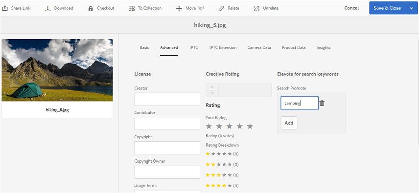

# Brand Portal へのタグの公開 {#publish-tags-to-brand-portal}

AEM Assets から Brand Portal にタグを公開する方法を学習します。

タグはアセットの整理に役立ちます。また、アセットにタグを関連付けると検索性が向上します。タグはアセットに関連付けられるキーワードやラベル（メタデータ）のようなもので、検索結果の中から目的のアセットをすばやく見つけるために役立ちます。AEM Assets でアセットにタグを割り当てる方法については、[タグを使用したアセットの構成](https://helpx.adobe.com/experience-manager/6-5/assets/using/organize-assets.html#Usetagstoorganizeassets)を参照してください。

タグ付きのアセットおよびコレクションが Brand Portal に公開されると、AEM 内でそのアセットおよびコレクションに関連付けられたタグが  to Brand Portal. 公開されたタグは、そのタグに関連付けられているアセットを検索で探す際に役立ちます。

>[!NOTE]
>
>ただし、タグが関連付けられているアセット（およびコレクション）を公開する前に、そのタグを Brand Portal に独占的に公開することを推奨します。こうすることで、アセット（およびコレクション）を Brand Portal に公開する処理を高速化できます。

## タグの管理 {#manage-tags}

You can use the pre-existing tags to attach to an asset or create new tags from AEM Tags console (**[!UICONTROL Tools | Tagging | AEM Tags]**). どちらのシナリオでも、まずタグを Brand Portal に公開してから、タグを適切なアセットに関連付ける必要があります。

AEM でタグを作成し、そのタグを Brand Portal に公開し、適切なアセット（またはコレクション）に関連付けるには、次のようにします。

1. タグを作成します。****
Sign in to AEM Author instance with administrative privileges, and access **[!UICONTROL AEM Tags]** console from global navigation:

   1. Select **[!UICONTROL Tools]**

   2. Select **[!UICONTROL General]**

   3. Select **[!UICONTROL Tagging]**

2. 「**[!UICONTROL 作成]**」を選択し、「**タグを作成[!UICONTROL 」オプションを選択します。]**
3. 以下を指定します。

   * **[!UICONTROL タイトル]**
      *（必須）*&#x200B;タグの表示タイトル。
   * **[!UICONTROL 名前]**
      *（必須）*&#x200B;タグの名前。指定しない場合、有効なノード名が「タイトル」から作成されます。See [TagID](https://helpx.adobe.com/experience-manager/6-5/sites/developing/using/framework.html#TagID).
   * **説明**
      *（オプション）*&#x200B;タグの説明。
   * **タグのパス** タグの JCR パス。

4. 「**[!UICONTROL 送信]」を選択すると、タグが作成されます。**

   Once you have created a tag on AEM instance, the tag will be available to be attached to an asset (using Properties section or Manage Tags section of that asset).

5. タグを Brand Portal に公開します&#x200B;****。

   Go to **[!UICONTROL AEM Tags]** console ([!UICONTROL Tools | Tagging | AEM Tags]), select the desired tag and Publish to Brand Portal.

6. タグをアセット（またはコレクション）に関連付けます&#x200B;****。

   アセット（またはコレクション）を選択し、そのアセットの「プロパティ」セクションまたは「タグを管理」セクションを使用して、目的のタグを関連付けます。To know more about how to assign tags to assets in AEM Assets, refer [use tags to organize assets](https://helpx.adobe.com/experience-manager/6-5/assets/using/organize-assets.html#Usetagstoorganizeassets).

7. アセット（またはコレクション）を Brand Portal に公開します&#x200B;****。\
   アセット（またはコレクション）を Brand Portal に公開すると、関連付けられているタグも Brand Portal 上で利用できるようになります。

   Brand Portal 内でそれぞれのアセット（またはコレクション）に関連付けられているタグを確認するには、Brand Portal にログインしてアセットを選択し、「プロパティ」セクションを見ます。このセクションに、関連付けられているタグが表示されます。

## 昇格を検索 {#search-promote}

AEM Assets Brand Portal では、キーワードタグに基づいて特定のアセットを検索結果の一番上に持ってくることができます。

アセットを昇格させる検索キーワードを設定するには、次のようにします。

1. AEM オーサーインスタンスでアセットの&#x200B;**[!UICONTROL プロパティ]ページを開きます。**
2. 「**[!UICONTROL 詳細]」タブに移動します。**
3. 「**検索キーワードに採用**」セクション内の「**[!UICONTROL 昇格を検索]」で「**&#x200B;追加&#x200B;**」を選択して、検索キーワードまたはタグを追加します。**

   

4. 変更内容を保存します。
5. アセットを Brand Portal に公開します。
6. Brand Portal にログインします。アセットの「****&#x200B;プロパティ]」セクションの「**[!UICONTROL 詳細]」タブを表示します。[!UICONTROL **&#x200B;なお、アセットのプロパティには「**[!UICONTROL 昇格を検索]」のキーワードも表示されます。**
