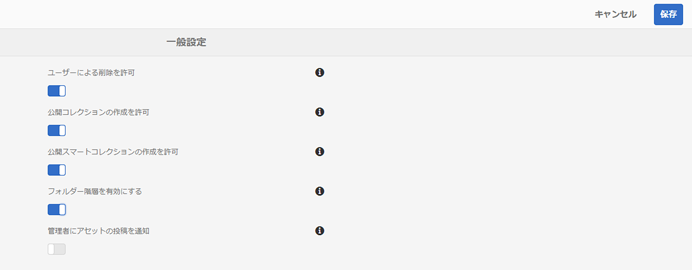

# リリースノート {#release-notes}

Adobe Experience Manager Assets Brand Portal 2023.02.0 リリースの新機能、機能強化、修正された重大な問題および既知の問題について説明します。

## リリース情報 {#release-information}

| 製品 | Adobe Experience Manager Assets Brand Portal |
|---|---|
| バージョン | 2023.02.0 |
| 日付 | 2023年2月 |

## 概要 {#overview}

Adobe Experience Manager（AEM）Assets Brand Portal では、承認されたクリエイティブアセットを容易に取得、制御し、それらのアセットを、デバイスの種類を問わず、外部の関係者や内部のビジネスユーザーに安全に配布できます。アセットの共有を効率化し、アセットの市場投入までの時間を短縮し、コンプライアンス違反や不正アクセスのリスクを軽減できます。Brand Portal では、アセットの参照、検索、プレビュー、ダウンロードおよび会社で承認された形式でのエクスポートを、いつでも、どこでも実行できます。

## 2023.02.0 の新機能 {#whats-new-in-2023.02.0}

### 修正された重大な問題 {#critical-issues-fixed}

#### バグの修正 {#bug-fixes}

このリリースでは、次の重要な問題が修正されています。
* Brand Portal でプロファイル画像を更新できません。
* コンテンツツリーパネルはサイズ変更できません。 ファイル名がコンテンツツリーのデフォルトの幅より長い場合、コンテンツツリーを水平および垂直にドラッグすることはできません。 その結果、長いファイル名は読み取れなくなります。
* 検索フォーム内で 2 回使用されているのと同じプロパティの述語で、一致しない検索結果が表示される。
* 一部の言語では、中間ログインページのテキストがローカライズされていません。

### 機能強化 {#enhancements}

このリリースで強化された機能は次のとおりです。
* PDF アセットのプレビューが改善された、最新の PDF ビューアを利用できるようになりました。
* 管理者向けのアセットソーシング通知を有効または無効にできるようになりました。 「[!UICONTROL 一般設定]」に移動してから、[!UICONTROL `Notify Administrator of asset contribution`] を有効または無効にします。

   

* アクセスのリクエストが無効になっている場合、権限のないユーザーは Brand Portal へのアクセスをリクエストできません。
* Brand Portal 用にプロビジョニングされた組織のみが、プロファイルピッカーリストに表示されます。

### 既知の問題 {#known-issues}

このリリースには、次の既知の問題が含まれています。

* アセットソーシングレポートのコンテンツの部分的なローカリゼーション。
* ユーザープロファイルの一部のフィールドは、ユーザープロファイルでは編集できません。

## 以前のリリース

### 2022年10月リリース {#oct-2022}

**修正された重大な問題**

このリリースでは、次の重大な問題が修正されています。
* 大きなファイルを Brand Portal からサードパーティ製ツールにコピーする際、応答時間が遅い。
* 「レンディション数」チェックボックスを選択すると、個々のレンディションを選択するためのチェックボックスが無効になる。
* 検索の応答時間が遅い。

>[!IMPORTANT]
>
>AEM Assets Brand Portal の Pulse 通知は、2022年12月1日（PT）以降停止されます。Pulse 通知の代わりに、次のイベントに関するメール通知を引き続き受信できます。
>* リンクを介したアセットの共有
>* アクセスワークフローのリクエスト
>* 投稿フォルダーの共有
>* AEM への書き出しの開始
>* AEM への書き出しが完了しました
>

### 2022年8月リリース {#aug-2022}

**修正された重大な問題**

このリリースでは、次の重大な問題が修正されています。
* NUI で Experience Manager 内のアセットを処理できない場合は、Brand Portal に表示されるアセットのインポートステータスが不正確になります。
* プレビューアクションが失敗した場合でも、失敗を知らせる通知はありません。
* 各アセットの totalUploadedSize プロパティの不正確な値が修正されました。
* アセットに使用できるレンディションが多数ある場合に&#x200B;**すべての項目をダウンロード**&#x200B;すると、Brand Portal でダウンロードされる .ZIP ファイルが無効です。
* Brand Portal ユーザーインターフェイスで、一部の文字列の翻訳が切り詰められます。

### 2022年5月リリース {#may-2022}

**新機能**

Brand Portal では、12 時間ごとに自動ジョブを実行して、AEM に公開されているすべての Brand Portal アセットを削除するようになりました。その結果、投稿フォルダー内のアセットを手動で削除して、フォルダーサイズをしきい値の制限以下に保つ必要はありません。

**修正された重大な問題**

このリリースでは、次の重要な問題が修正されています。

* カラータグが付いたアセットを含むフォルダーまたはコレクションをダウンロードすると、XML ファイルもダウンロードされる。
* レンディションを含むビデオをダウンロードすると、Brand Portal によって無効な .ZIP ファイルが作成される。
* AEM オーサーでプリセットとアセットを作成し、Brand Portal に公開してから、アセットのダウンロード中に動的レンディションを選択すると、ダウンロードした .ZIP ファイルを抽出できなくなる。
* Brand Portal で使用可能な特定のフォルダーからビデオアセットをダウンロードする際の問題。
* メールを使用して投稿フォルダーの URL を共有すると、閲覧者と編集者の役割を持つユーザーがパンくずリストを使用して親フォルダーにアクセスする際に問題が発生する。
* 公開されたレポートをソーシングすると、誤ったジョブ開始時刻が表示される。

### 2022年2月リリース {#feb-2022}

**新機能**

* ゲストユーザーのセッションタイムアウトのしきい値が 2 時間から 15 分に短縮されました。
* ユーザーがAdobe Document Cloud ビューアから PDF ページを表示できるようになったため、複数ページの PDF に対する追加の「**[!UICONTROL ページの表示]**」オプションは削除されました。
* ユーザーがフォルダーを検索、移動または開くことができません。「`Failed to load data`」というエラーメッセージがユーザーインターフェイスに表示されます。
* Brand Portal に公開されているアセットの静的レンディションの一部が&#x200B;**[!UICONTROL レンディション]**&#x200B;パネルに一覧表示されません。
* **[!UICONTROL レンディション]**&#x200B;パネルには、アセットのスマート切り抜きレンディションが一覧表示されますが、ユーザーがスマート切り抜きレンディションをプレビューまたはダウンロードできません。
* ダウンロードダイアログには、選択したアセットのスマート切り抜きレンディションが一覧表示されますが、ユーザーがスマート切り抜きレンディションをダウンロードできません。
* 管理者以外のユーザーは、アセットのダウンロード時に元のアセットレンディションのみ取得します。システムレンディションとカスタムレンディションはダウンロードされません。
* 検索フィルターを適用してアセットをダウンロードする際に、ダウンロードダイアログで「`Download`」ボタンが無効になっているので、ユーザーがアセットをダウンロードできません。
* `Smart Tags` および（または）`Color Tags` が有効な場合、ダウンロードダイアログに `json` ファイルがレンディションとして一覧表示され、アーカイブされた zip フォルダーにこれらの `json` ファイルがダウンロードされます。
* 共有リンクが Brand Portal のログインページにリダイレクトされるので、匿名ユーザーが共有リンクを使用してアセットをダウンロードできません。
* アクティブな同時使用ユーザー数の正しい値がシステムに表示されません。

<!--
### New Features {#new-features}

This release includes the following new features:

* AEM Assets as a Cloud Service is now entitled to have a pre-configured Brand Portal instance. The Cloud Manager user can activate Brand Portal on the AEM Assets as a Cloud Service instance.

* Asset Sourcing feature is now available on AEM Assets as a Cloud Service. It allows the Brand Portal users to upload assets to the permitted contribution folders and publish the contribution folder from Brand Portal to AEM Assets as a Cloud Service instance. 

* An additional **[!UICONTROL Asset Download]** setting has been introduced under the **[!UICONTROL Download Settings]**. It creates a separate folder for each asset while downloading the folders, collections, or bulk download of assets. 
-->
<!-- 
* The **[!UICONTROL Download]** dialog is revamped in a list view with additional options to exclude the renditions which are not required, apply the same set of rules for similar asset types, and download the selected asset renditions.
-->

<!--
* The new **[!UICONTROL Download]** dialog now appears with all the renditions of the selected assets or folders containing assets in a list view, wherein the Brand Portal users can apply same set of renditions for similar asset types and download the selected asset renditions. 
-->

<!-- 
* Navigation to the **[!UICONTROL Files]**, **[!UICONTROL Collections]**, and **[!UICONTROL Shared Links]** is now possible from all the Brand Portal pages in one-click.  

* The **[!UICONTROL Renditions]** panel in the asset details page now allows the Brand Portal users to select the original asset and (or) specific asset renditions, and directly download them from the **[!UICONTROL Renditions]** panel without having to open the **[!UICONTROL Download]** dialog.
-->

<!--
Brand Portal users can exclude specific renditions which are not required and directly download the original asset and its renditions from the **[!UICONTROL Renditions]** panel on the asset details page. 
-->

<!-- 
* In addition to the existing **[!UICONTROL Download]** configurations, the Brand Portal administrators can also [configure permissions for different group of users]() to view and (or) download the original asset and its renditions from the asset details page. These configurations will define who can access and (or) download the asset renditions.
-->

<!--
### Enhancements {#enhancements}

Brand Portal 2021.08.0 is an internal release that introduces Business profiles for enterprise and teams customers to give organizations better control over their assets. 

This release includes the following enhancements:

* The users now have organization-specific entitlement on the new and migrated organizations. If a user is entitled to multiple organizations, the user has to select the organization at the time of login.

* The new users that are added in Admin Console must **Join Team** to get entitled to the organization. 

>[!NOTE]
>
>Business profiles are currently applicable for the new organizations that are created after August 16, 2021. 
>
>Until your organization is migrated, you can continue to use Adobe ID, Enterprise ID, or Federated ID types to access the organization.   
-->

<!-- 
* For folder download, a separate folder is created for each asset using share link irrespective of the **[!UICONTROL Download Settings]**. 
* The Brand Portal **[!UICONTROL Usage Report]** has been modified to reflect only the active Brand Portal users.
-->

<!--
* The threshold of session timeout for the guest users has been reduced from 2 hours to 15 minutes.
* The additional **[!UICONTROL View pages]** option has been removed for multi-page PDFs as the user can now view the PDF pages from the Adobe Document Cloud Viewer.

* The users are unable to search, navigate, or open folders. The user interface reflects the error message: `Failed to load data`. 
* The **[!UICONTROL Renditions]** panel does not list all the static renditions of the assets that are published to Brand Portal.
* The **[!UICONTROL Renditions]** panel lists the smart crop renditions of the asset, however, the user cannot preview or download the smart crop renditions.
* The download dialog lists the smart crop renditions of the selected asset, however, the user cannot download the smart crop renditions. 
* A non-admin user is getting only the original asset rendition when downloading an asset. The system and custom renditions are not downloaded.  
* When applying search filter to download an asset, the `Download` button is disabled in the download dialog and does not allows the user to download the asset.
* If `Smart Tags` and (or) `Color Tags` are enabled, the download dialog lists the `json` files as renditions and downloads these `json` files in the archived zip folder.
* The anonymous users are unable to download assets using a shared link because the link redirects to the Brand Portal login page. 
* The system is not reflecting the correct value for the number of active concurrent users.
-->

<!--
### New features {#new-features}

Brand Portal now executes automatic jobs every twelve hours to delete all Brand Portal assets that are published to AEM. As a result, you do not need to delete the assets in the Contribution folder manually to keep the folder size below the threshold limit. See [What's new in Experience Manager Assets Brand Portal](whats-new.md).
-->

<!--
This release includes fixes to the following critical issues:

* When you download a folder or a collection that includes assets with color tags, an XML file gets downloaded as well.

* When you download a video that includes renditions, Brand Portal creates an invalid .ZIP file.

* When you create presets and assets on AEM author and publish them to Brand Portal and then select dynamic renditions while downloading the assets, you cannot extract the downloaded .ZIP file.

* Issues while downloading video assets from certain folders available on Brand Portal.

* When you share the Contribution folder’s URL using an email, Viewer and Editor roles face issues while accessing its parent folder using the breadcrumb.

* Sourcing published report displays an incorrect job start time.
>
 
<!--
* Asset Sourcing email notifications are not delivered for some organizations. 

* Video files with extension `.mov` are not running on Brand Portal. 

* In the **[!UICONTROL Smart Collections]** dropdown list, only ten saved collections are visible. 
-->
<!--
* *_deleted tenants are listed as valid tenant which fails during the execution of TenantCustomizers/TenantUpdates where tenant id is returned as /etc/tenants/`<nodename>`.
-->

<!--
In case only the original assets are downloaded, the asset reflects its own extension and does not open until the extension is manually changed to zip. 
* The user interface of the collection folder does not respond on clicking the navigation arrow. 
* **[!UICONTROL Create]** button is visible in the **[!UICONTROL Column]** view even when the folders are empty.
* **[!UICONTROL Omni search]** fails with a 414 error message (Request-URI Too Long) if the dispatcher is bypassed while accessing the Brand Portal instance.
* An empty zip folder is downloaded if the asset contains a comma (`,`) in the file name.
* The viewer users get the option to add users to the collection they have created. 
* Inconsistent behavior is experienced when an asset (thumbnail or web rendition) is downloaded using share link.

See [what's new in Brand Portal 2021.02.0](whats-new.md).
-->

<!--
### Known Issues {#known-issues}

This release includes the following known issue:

* Search on the **[!UICONTROL Asset Reports]** shows processing on the product interface with no search result.
* The video DM encodes are not visible to the non-admin users on the asset details page.
* The alignment of the size of individual asset renditions and total download size is distorted in the Download dialog.
-->

<!--
* Download Settings configuration to configure asset download from Brand Portal. Fast download, custom renditions, and system renditions are the available configurations. 
-->

<!--
* Document Viewer has been introduced to enhance the PDF viewing experience. New options are available for viewing the PDF files in Brand Portal.

* Advances in the asset download process which improves the Brand Portal user experience while [downloading assets from Brand Portal](brand-portal-download-assets.md). Brand Portal administrators can configure **[!UICONTROL Fast Download]**, **[!UICONTROL Custom Renditions]**, and **[!UICONTROL System Renditions]** from the **[!UICONTROL Download]** settings. 

For details, see [what's new in Brand Portal 6.4.7](whats-new.md). 

### Critical Issues Fixed {#critical-issues-fixed-647}

This release includes fixes to the following critical issues:

* The viewer users are not permitted to share link for collections but the option to share is visible to them on the product interface.

* The **[!UICONTROL Download]** button on the options bar does not list all the licensed assets of the selected folder.

* The search takes longer to show the results for certain keywords.

* The **[!UICONTROL Agree]** and **[!UICONTROL Disagree]** check boxes does not appear on bulk selection of licensed and unlicensed assets during download.

* Filter-based search shows processing on the product interface with no search result. 

* The assets do not download from share link if the shared folder contains numerous and large assets.

### Known Issues {#known-issues-647}

This release includes the following known issues:

* If multiple assets are selected, license text does not appear on clicking Terms and Conditions on the license agreement page during download using share link.   

-->

## 言語 {#languages}

Brand Portal ユーザーインターフェイスは次の言語で使用できます。

* 英語
* ドイツ語
* フランス語
* スペイン語
* イタリア語
* ポルトガル語（ブラジル）
* 日本語
* 簡体字中国語
* 韓国語

## 認定プラットフォーム {#certified-platforms}

このリリースの Brand Portal を実行できる認定プラットフォームを確認するには、[技術要件](https://experienceleague.adobe.com/docs/experience-manager-65/deploying/introduction/technical-requirements.html?lang=ja)の「**オーサリングユーザーインターフェイス向けにサポートされているブラウザー**」節に記載されている表の「**UI のサポート**」列を参照してください。

## リンク {#links}

* [Adobe Experience Manager 製品ページ（adobe.com）](https://business.adobe.com/jp/products/experience-manager/adobe-experience-manager.html)
* [Assets Brand Portal のドキュメント](https://experienceleague.adobe.com/docs/experience-manager-brand-portal/using/home.html?lang=ja)

## 製品のアクセスとサポート（制限付きサイト） {#product-access-and-support-restricted-sites}

以下のサイトは既存ユーザーのみが参照できます。アクセス権を必要とするお客様は、アドビのアカウントマネージャーにご連絡ください。

<!--
* [https://daycare.day.com](https://daycare.day.com) 
-->

<!--
* [Customer Support]()
-->
