# レポートの操作 {#work-with-reports}

The reporting capability is instrumental in assessing Brand Portal usage, and knowing how internal and external users interact with approved assets. 管理者は Brand Portal 使用状況Usage レポートを表示できます。このレポートは、アセットレポートページでいつでも利用することができます。ただし、ユーザーログイン数、ダウンロードされたアセット、期限切れのアセット、公開されたアセット、およびリンクから共有されたアセットに関するレポートは、アセットレポートページから生成および表示できます。これらのレポートは、アセット導入を分析するために役立ちます。これらのレポートを利用して、承認されたアセットが組織の内外でどのくらい採用されたかを測定するための重要な成功指標を導き出すことができます。

レポート管理インターフェイスは直観的な設計になっており、保存済みレポートにアクセスするためのきめ細かいオプションとコントロールを備えています。レポートの表示、ダウンロード、削除はアセットレポートページでおこないます。このページには、過去今までに生成されたすべてのレポートが表示されます。

## レポートの表示 {#view-reports}

レポートを表示するには、以下の手順に従います。

1. 上部のツールバーの AEM ロゴをタップまたはクリックして、管理ツールにアクセスします。

   

2. From the administrative tools panel, click **[!UICONTROL Create/Manage Reports]** to open **[!UICONTROL Asset Reports]** page.

   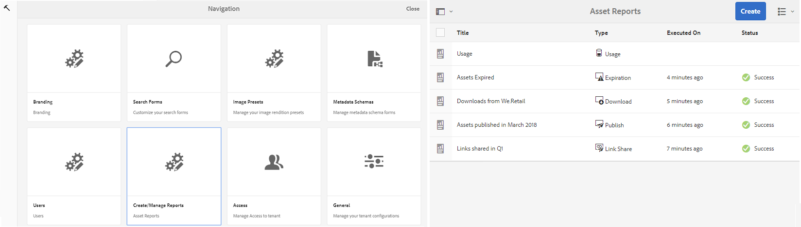

3. アセットレポートページから、**[!UICONTROL 使用状況]レポートなどの生成済みレポートにアクセスします。**

   >[!NOTE]
   >
   >使用状況レポートは、デフォルトで Brand Portal に存在します。使用状況レポートは作成も削除もできません。ただし、ダウンロードレポート、有効期限レポート、公開レポート、リンク共有レポートおよびユーザーログインレポートは、作成、ダウンロードおよび削除できます。

   レポートを表示するには、レポートのリンクをタップまたはクリックします。または、レポートを選択し、ツールバーの「表示」アイコンをタップまたはクリックします。

   [!UICONTROL 使用状況レポート]には、現在の Brand Portal ユーザーの数、すべてのアセットの占有ストレージスペースおよび Brand Portal 内の合計アセット数に関する情報が表示されます。また、それぞれの情報指標で許可されている容量も表示されます。

   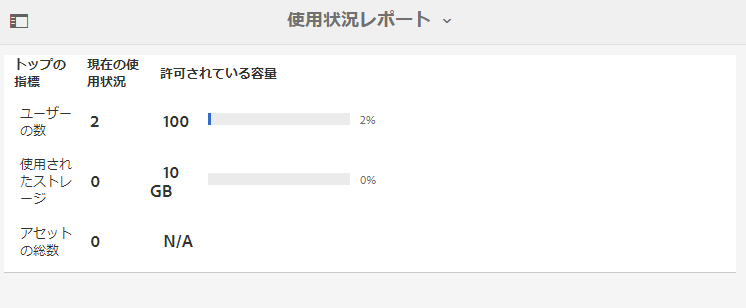

   [!UICONTROL ユーザーログイン]レポートには、Brand Portal にログインしたユーザーについての情報が表示されます。The report shows display names, email IDs, personas (admin, viewer, editor, guest), groups, last login, activity status, and login count of each user from Brand Portal 6.4.2 deployment until the time of report generation.

   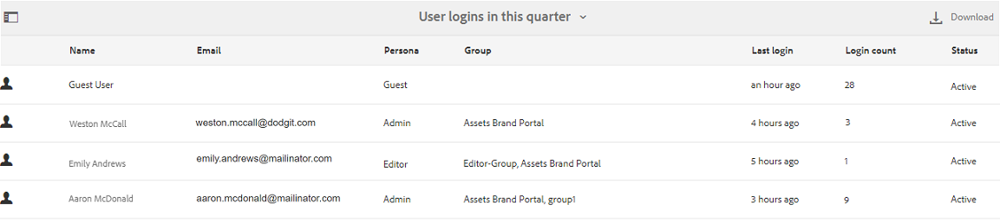

   [!UICONTROL ダウンロード]レポートには、特定の期間内にダウンロードされたすべてのアセットと、それらの詳細情報が表示されます。

   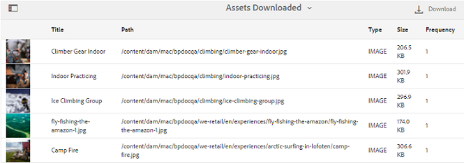

   >[!NOTE]
   >
   >The assets [!UICONTROL Download] report displays only the assets that were individually selected and downloaded from Brand Portal. アセットを含んだフォルダーがダウンロードされた場合、そのフォルダーやフォルダー内のアセットはレポートに表示されません。

   [!UICONTROL 有効期限]レポートには、特定の期間内に有効期限が切れたすべてのアセットと、それらの詳細情報が表示されます。

   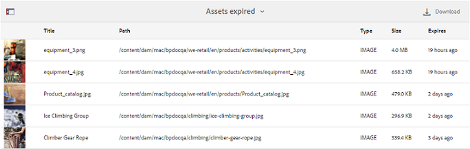

   [!UICONTROL 公開]レポートには、特定の期間内に AEM から Brand Portal に公開されたすべてのアセットと、それらに関する情報が表示されます。

   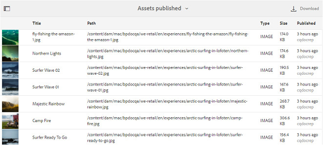

   >[!NOTE]
   >
   >コンテンツフラグメントを Brand Portal に公開することはできないため、公開レポートにはコンテンツフラグメントに関する情報は表示されません。

   [!UICONTROL リンク共有レポート]には、特定の期間内に Brand Portal インターフェイスのリンクから共有されたすべてのアセットが一覧表示されます。また、レポートには、リンク経由でアセットが共有された時間とアセットを共有したユーザー、リンクの有効期限、そのテナント（およびアセットリンクが共有されたユーザー）の共有リンクの数も表示されます。リンク共有レポートの列はカスタマイズできません。

   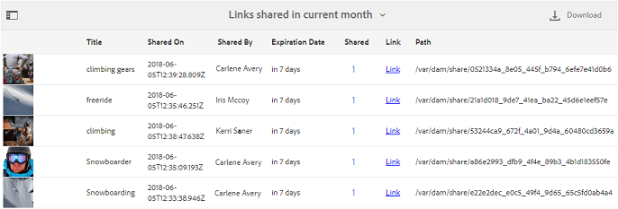

   >[!NOTE]
   >
   >リンク共有レポートには、リンク経由で共有されたアセットにアクセスしたユーザーや、リンクからアセットをダウンロードしたユーザーは表示されません。
   >
   >
   >共有リンクからのダウンロードを追跡するには、**[!UICONTROL レポートを作成]**&#x200B;ページで「**リンク共有ダウンロードのみ]」オプションを選択した後、ダウンロードレポートを生成する必要があります。[!UICONTROL **&#x200B;ただし、この場合、ユーザー（ダウンロードしたユーザー）は匿名です。

## レポートの生成 {#generate-reports}

管理者は、以下の標準レポートを生成および管理できます。レポートはいったん生成されると、後で[アクセス](../using/brand-portal-reports.md#main-pars-header)できるように保存されます。

* ユーザーログイン
* ダウンロード
* 有効期限
* 公開
* リンク共有

ダウンロード、有効期限および公開レポートの列は、カスタマイズして表示できます。レポートを生成するには、以下の手順に従います。

1. 上部のツールバーの AEM ロゴをタップまたはクリックして、管理ツールにアクセスします。

   

2. 管理ツールパネルの「**[!UICONTROL レポートを作成 / 管理]」をタップまたはクリックして、アセットレポートページを開きます。**

   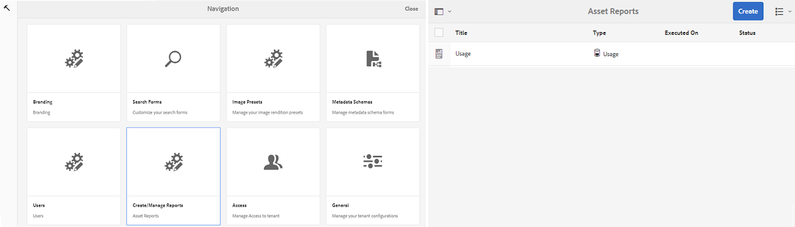

3. In the Asset Reports page, tap/click **[!UICONTROL Create]**.
4. From the **[!UICONTROL Create Report]** page, select a report to create, and tap/click **[!UICONTROL Next]**.

   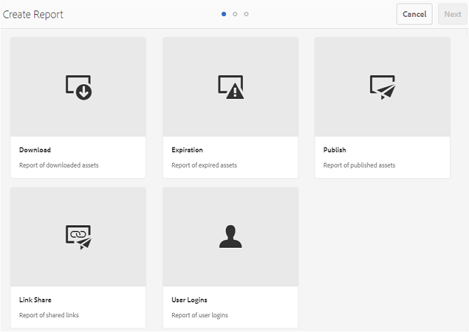

5. レポートの詳細を設定します。[!UICONTROL ダウンロード]、[!UICONTROL 有効期限]および[!UICONTROL 公開]レポートのタイトル、説明、フォルダー構造（レポートで統計を実行、生成する場所）および期間を指定します。

   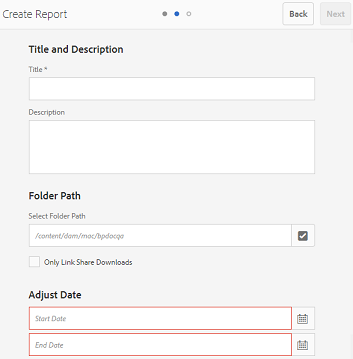

   一方、[!UICONTROL リンク共有レポート]には、タイトル、説明および期間パラメーターのみ必要です。

   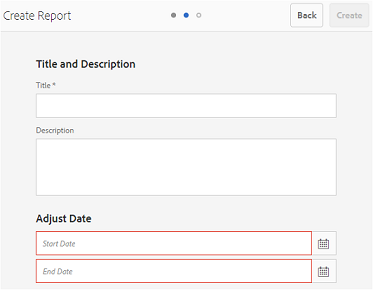

   >[!NOTE]
   >
   >レポートタイトル中の特殊文字 # および % は、レポート生成時にハイフン（-）に置き換えられます。

6. Tap/click **[!UICONTROL Next]**, to configure the columns of Download, Expiration, and Publish reports.
7. 必要に応じて、適切なチェックボックスをオンまたはオフにします。For example, to view names of users (who downloaded assets) in [!UICONTROL Download] report, select **[!UICONTROL Downloaded By]**. 次の画像は、ダウンロードレポートのデフォルト列の選択を示しています。

   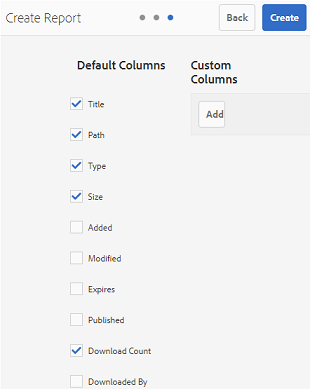

   また、これらのレポートにカスタム列を追加して、独自の要件に応じてさらに多くのデータを表示できます。

   ダウンロードレポート、公開レポートまたは有効期限レポートにカスタム列を追加するには、以下の手順に従います。

   1. カスタム列を表示するには、「**[!UICONTROL カスタム列]」の「**[!UICONTROL 追加]」をタップまたはクリックします。
   2. 「**[!UICONTROL 列名]」フィールドで列名を指定します。**
   3. プロパティピッカーを使用して、列と対応付ける必要があるプロパティを選択します。

      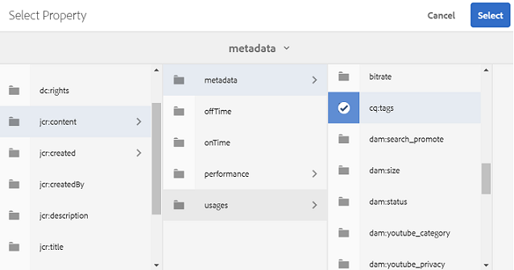または、プロパティパスフィールドにパスを入力します。

      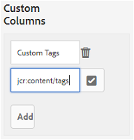

      カスタム列をさらに追加するには、「**追加**」をタップまたはクリックし、手順 2 および 3 を繰り返します。

8. Tap/click **[!UICONTROL Create]**. レポートの生成が開始されたことを通知するメッセージが表示されます。

## ダウンロードレポート {#download-reports}

レポートを保存し、.csv ファイルとしてダウンロードするには、以下のいずれかの手順を実行します。

* アセットレポートページでレポートを選択し、上部のツールバーの「**[!UICONTROL ダウンロード]」をタップまたはクリックします。**

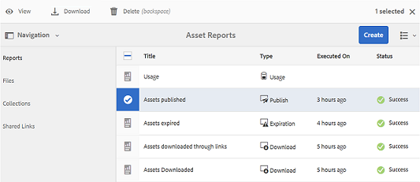

* アセットレポートページから、レポートを開きます。レポートページ上部の「**[!UICONTROL ダウンロード]」オプションを選択します。**

## レポートの削除 {#delete-reports}

既存のレポートを削除するには、**[!UICONTROL アセットレポート]**&#x200B;ページからレポートを選択し、上部のツールバーの「**削除]」をタップまたはクリックします。[!UICONTROL **

>[!NOTE]
>
>[!UICONTROL 使用状況]レポートを削除することはできません。
