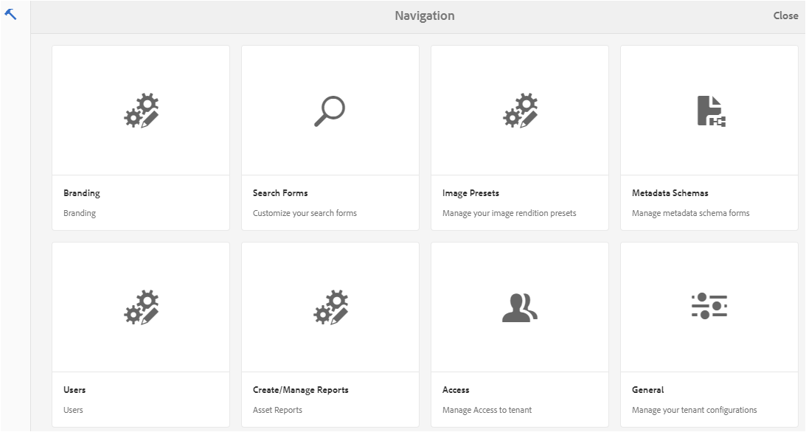
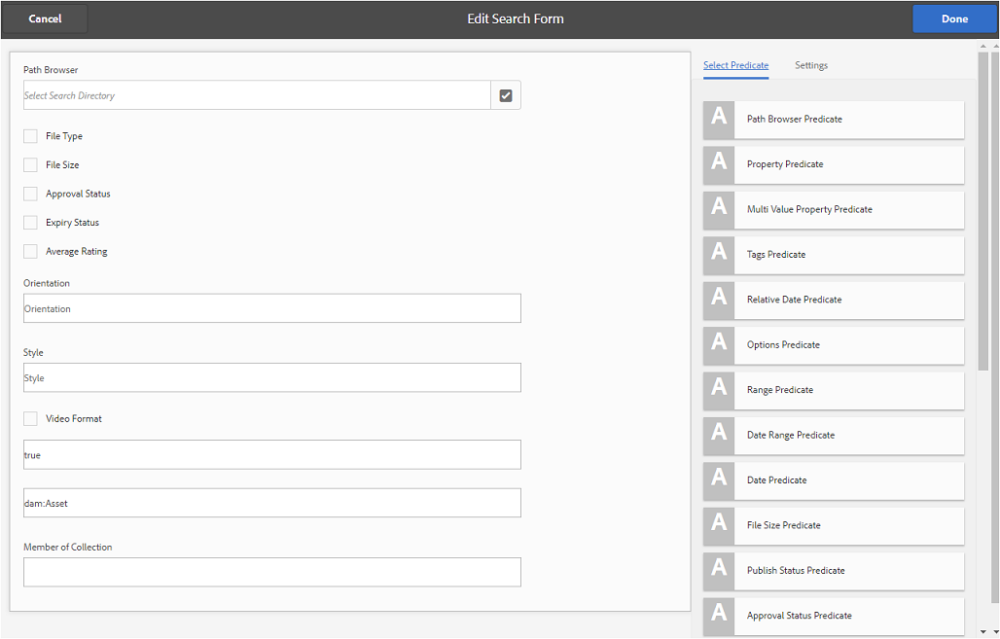
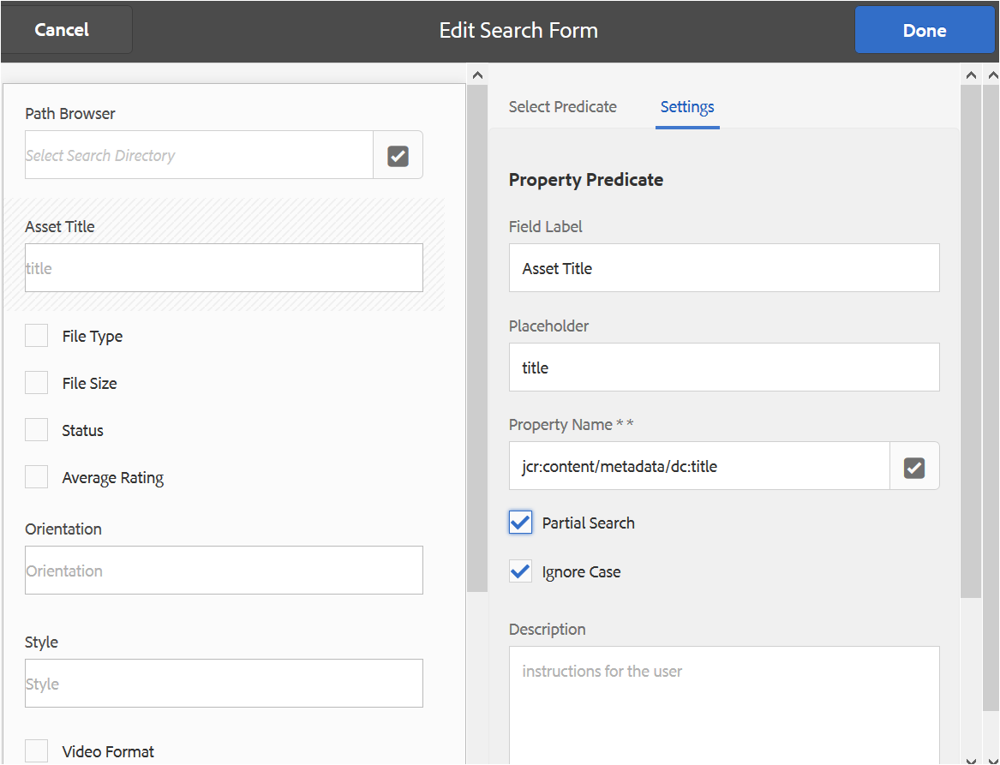
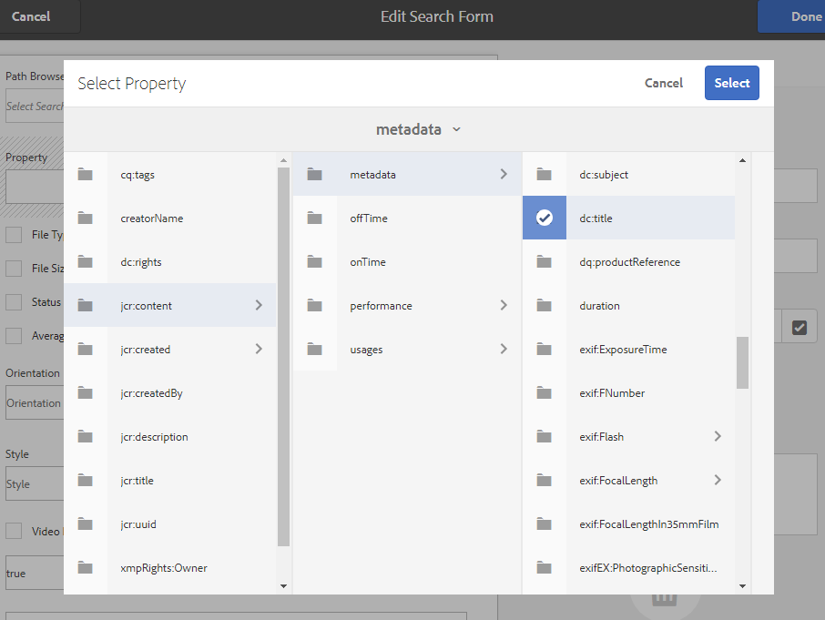
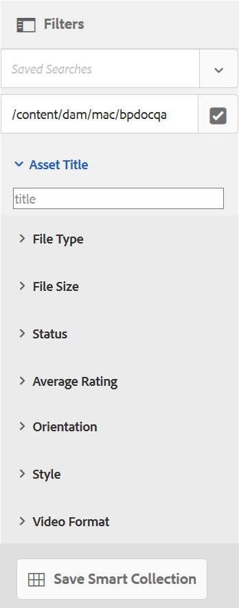
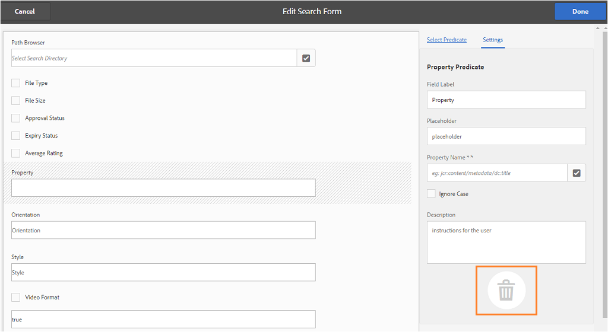

# カスタム検索ファセットの使用 {#use-custom-search-facets}

Administrators can add search predicates to the [!UICONTROL Filters] panel to customize search and make the search functionality versatile.

Brand Portal supports [faceted search](../using/brand-portal-searching.md#search-using-facets-in-filters-panel) for granular searches of approved brand assets, which is possible due to [**Filters** panel](../using/brand-portal-searching.md#search-using-facets-in-filters-panel). Search facets are made available on Filters panel through **[!UICONTROL Search Form]** in the admin tools. デフォルトの検索フォームはアセット管理検索レールという名前で、管理ツールの検索フォームページにあります。しかし、管理者はデフォルトのフィルターパネルをカスタマイズできます。デフォルトの検索フォーム（アセット管理検索レール）を編集し、検索用述語を追加、修正、削除することで、検索機能をカスタマイズできます。

You can use various search predicates to customize the **[!UICONTROL Filters]** panel. 例えば、この述語で指定した単一のプロパティに一致するアセットを検索するには、プロパティの述語を追加します。特定のプロパティに指定した1つ以上の値に一致するアセットを検索するために、options Predicateを追加します。日付範囲の述語を追加して、指定した日付範囲内で作成されたアセットを検索します。

>[!NOTE]
>
>AEM allows organizations to [publish the customized search forms from AEM Author](../using/publish-schema-search-facets-presets.md#publish-search-facets-to-brand-portal) to Brand Portal, instead of re-creating the same form on Brand Portal.

## 検索用述語の追加 {#add-a-search-predicate}

**[!UICONTROL フィルター]パネルに検索用述語を追加するには、次のようにします。**

1. 管理ツールにアクセスするには、上部のツールバーからAEMロゴをクリックします。

   

2. From the administrative tools panel, click **[!UICONTROL Search Forms]**.

   

3. In the **[!UICONTROL Search Forms]** page, select **[!UICONTROL Assets Admin Search Rail]**.

   

4. 上部に表示されるツールバーの「**[!UICONTROL 編集]」をクリックして、「検索フォームを編集」を開きます。**

   

5. In the [!UICONTROL Edit Search Form] page, drag a predicate from the [!UICONTROL Select Predicate] tab to the main pane. For example, drag **[!UICONTROL Property Predicate]**.

   メインウィンドウに「**[!UICONTROL プロパティ]**」フィールドが表示され、右側の「**設定[!UICONTROL 」タブにプロパティの述語が表示されます。]**

   

   >[!NOTE]
   >
   >「**[!UICONTROL 設定]」タブのヘッダーラベルは、選択した述語のタイプを示します。**

6. 「**[!UICONTROL 設定]」タブで、そのプロパティの述語のラベル、プレースホルダーテキストおよび説明を入力します。**

   * Select **[!UICONTROL Partial Search]**, if you want to allow partial phrase search (and wildcard search) of assets-based on the specified property value. 述語はデフォルトでフルテキスト検索をサポートしています。
   * Select **[!UICONTROL Ignore Case]**, if you want the asset search based on property value to be non-case sensitive. 検索フィルターでのプロパティ値の検索では、デフォルトで大文字と小文字が区別されます。
   >[!NOTE]
   >
   >「**[!UICONTROL 部分検索]**」チェックボックスを選択すると、デフォルトで「[!UICONTROL 大文字と小文字を区別しない]」がオンになります。

7. [!UICONTROL 「プロパティ名」] フィールドで、プロパティピッカーを開き、検索の実行に基づいてプロパティを選択します。または、プロパティの名前を入力します。例えば、enter [!UICONTROL `  jcr :content/metadata/dc:title`] また [!UICONTROL `./jcr:content/metadata/dc:title`]は.

   

8. 「**[!UICONTROL 完了]」をクリックして、設定を保存します。**
9. [!UICONTROL アセット] ユーザーインターフェイスで、オーバーレイアイコンをクリックし、 **[!UICONTROL 「フィルター」]** を選択して **[!UICONTROL フィルター]** パネルに移動します。**[!UICONTROL プロパティ]** の述語がパネルに追加されます。

   

10. 「**[!UICONTROL プロパティ]」テキストボックスに、検索するアセットのタイトルを入力します。**&#x200B;例えば、"Adobe"とします。検索を実行すると、「アドビ」と一致するタイトルを持つアセットが検索結果に表示されます。

## 検索用述語の一覧 {#list-of-search-predicates}

**[!UICONTROL プロパティ]** の述語を追加する方法と同様に、次の述語を **[!UICONTROL フィルター]** パネルに追加できます。

| **述語名** | **説明** | **プロパティ** |
|-------|-------|----------|
| [!UICONTROL パスブラウザー] | 特定の場所にあるアセットを検索するための検索用述語。**注意:***ログインユーザーの場合、フィルターのパスブラウザーには、ユーザーと共有されているフォルダー（およびその祖先）のコンテンツ構造のみが表示されます。* 管理者は、パスブラウザーを使用して目的のフォルダーまでナビゲートすることで、あらゆるフォルダー内のアセットを検索できます。  管理者以外のユーザーは、パスブラウザーでフォルダに移動して、フォルダ内のアセットを（アクセス可能な）フォルダ内に検索できます。 | <ul><li>フィールドラベル</li><li>パス</li><li>説明</li></ul> |
| [!UICONTROL プロパティ] | 特定のメタデータプロパティに基づいてアセットを検索します。**注意:***部分検索を選択する場合、デフォルトでは「大文字と小文字を区別しない」が選択*&#x200B;されています。 | <ul><li>フィールドラベル</li><li>プレースホルダー</li><li>プロパティ名</li><li>部分検索</li><li>大文字と小文字を区別しない</li><li> 説明</li></ul> |
| [!UICONTROL 複数値プロパティ] | Similar to property predicate but allows multiple input values, separated by a delimiter (default is COMMA[,]) assets matching any of the input values are returned in results. | <ul><li>フィールドラベル</li><li>プレースホルダー</li><li>プロパティ名</li><li>区切り文字のサポート</li><li>大文字と小文字を区別しない</li><li>説明</li></ul> |
| [!UICONTROL タグ] | タグに基づいてアセットを検索するための検索用述語。「パス」プロパティを設定して、「タグ」リストに様々なタグを表示できます。*Note: Administrators might need to change the path value, for example, [!UICONTROL `/etc/tags/mac/<tenant_id>/<custom_tag_namespace>`], if they publish the search form from AEM, where the path does not include tenant information, for example, [!UICONTROL `/etc/tags/<custom_tag_namespace>`]. | <ul><li>フィールドラベル</li><li>プロパティ名</li><li>パス</li><li>説明</li></ul> |
| [!UICONTROL パス] | 特定の場所にあるアセットを検索するための検索用述語。 | <ul><li>フィールドラベル</li><li>パス</li><li>説明</li></ul> |  |
| [!UICONTROL 相対的な日付] | アセットの相対的な作成日に基づいてアセットを検索するための検索用述語。 | <ul><li>フィールドラベル</li><li>プロパティ名</li><li>相対的な日付</li></ul> |
| [!UICONTROL 範囲] | 指定したプロパティ値の範囲内に含まれるアセットを検索するための検索用述語。フィルターパネルで、範囲の最小プロパティと最大プロパティ値を指定できます。 | <ul><li>フィールドラベル</li><li>プロパティ名</li><li>説明</li></ul> |
| [!UICONTROL 日付の範囲] | 指定した日付プロパティの範囲内で作成されたアセットを検索するための検索用述語。フィルターパネルで、開始日と終了日を指定できます。 | <ul><li>フィールドラベル</li><li>プレースホルダー</li><li>プロパティ名</li><li>範囲テキスト (開始)</li><li>範囲テキスト (終了)</li><li>説明</li></ul> |
| [!UICONTROL 日付] | 日付プロパティに基づいて、スライダーを使用してアセットを検索するための検索用述語。 | <ul><li>フィールドラベル</li><li>プロパティ名</li><li>説明</li></ul> |
| [!UICONTROL ファイルサイズ] | サイズに基づいてアセットを検索するための検索用述語。 | <ul><li>フィールドラベル</li><li>プロパティ名</li><li>パス</li><li>説明</li></ul> |
| [!UICONTROL 最終変更アセット] | 最終変更日に基づいてアセットを検索するための検索用述語。 | <ul><li>フィールドラベル</li><li>プロパティ名</li><li>説明</li></ul> |
| [!UICONTROL 承認ステータス] | 承認メタデータプロパティに基づいてアセットを検索するための検索用述語。デフォルトのプロパティ名は **dam:status** です。 | <ul><li>フィールドラベル</li><li>プロパティ名</li><li>説明</li></ul> |
| [!UICONTROL チェックアウトステータス] | アセットが AEM Assets から公開されたときのチェックアウトステータスに基づいてアセットを検索するための検索用述語。 | <ul><li>フィールドラベル</li><li>プロパティ名</li><li>説明</li></ul> |
| [!UICONTROL チェックアウト実行者] | アセットをチェックアウトしたユーザーに基づいてアセットを検索するための検索用述語。 | <ul><li>フィールドラベル</li><li>プロパティ名</li><li>説明</li></ul> |
| [!UICONTROL 有効期限ステータス] | 有効期限ステータスに基づいてアセットを検索するための検索の述語。 | <ul><li>フィールドラベル</li><li>プロパティ名</li><li>説明</li></ul> |
| [!UICONTROL コレクションのメンバー] | アセットがコレクションの一部であるかどうかに基づいてアセットを検索するための検索用述語。 | 説明 |
| [!UICONTROL 非表示] | This predicate is not explicitly visible to the end users and is used for any hidden constraints typically for restricting search results type to **dam:Asset**. | <ul><li>フィールドラベル</li><li>プロパティ名</li><li>説明</li></ul> |

>[!NOTE]
>
>Do not use **[!UICONTROL Options Predicate]**, **[!UICONTROL Publish Status Predicate]**, and **[!UICONTROL Rating Predicate]** as these predicates are not functional in Brand Portal.

## 検索用述語の削除 {#delete-a-search-predicate}

検索用述語を削除するには、次の手順に従います。

1. アドビロゴをクリックして、管理ツールにアクセスします。

   

2. From the administrative tools panel, click **[!UICONTROL Search Forms]**.

   

3. In the **[!UICONTROL Search Forms]** page, select **[!UICONTROL Assets Admin Search Rail]**.

   

4. 上部に表示されるツールバーの「**[!UICONTROL 編集]」をクリックして、「検索フォームを編集」を開きます。**

   

5. In the [!UICONTROL Edit Search Form] page, from the main pane, select the predicate you want to delete. For example, select **[!UICONTROL Property Predicate]**.

   右側の「**[!UICONTROL 設定]」タブに、「プロパティの述語」に関するフィールドが表示されます。**

6. プロパティの述語を削除するには、ごみ箱アイコンをクリックします。**[!UICONTROL フィールドを削除]**&#x200B;ダイアログボックスで、「**削除[!UICONTROL 」をクリックして、削除することを確認します。]**

   メインウィンドウから「**[!UICONTROL プロパティの述語]**」フィールドが削除され、「**設定]」タブが空になります。[!UICONTROL **

   

7. To save the changes, click **[!UICONTROL Done]** in the toolbar.
8. **[!UICONTROL アセット]** ユーザーインターフェイスで、オーバーレイアイコンをクリックし、 **[!UICONTROL 「フィルター」]** を選択して **[!UICONTROL フィルター]** パネルに移動します。**[!UICONTROL プロパティ]** の述語がパネルから削除されます。

   
