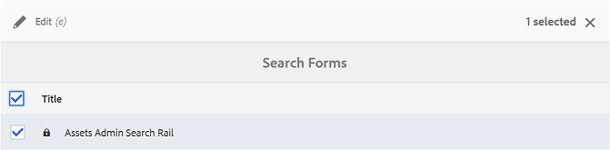

# カスタム検索ファセットの使用 {#use-custom-search-facets}

管理者は、[!UICONTROL フィルター]パネルに検索用述語を追加することで、検索をカスタマイズして、多目的な検索機能を設定できます。

Brand Portal では[ファセット検索](../using/brand-portal-searching.md#search-using-facets-in-filters-panel)をサポートしており、承認済みブランドアセットの詳細な検索が可能です。この検索は&#x200B;[**フィルター**&#x200B;パネル](../using/brand-portal-searching.md#search-using-facets-in-filters-panel)で実行できます。検索ファセットは管理ツールの&#x200B;**[!UICONTROL 検索フォーム]**&#x200B;を通じてフィルターパネルで使用可能になります。デフォルトの検索フォームはアセット管理検索パネルという名前で、管理ツールの検索フォームページにあります。しかし、管理者はデフォルトのフィルターパネルをカスタマイズできます。デフォルトの検索フォーム（アセット管理検索パネル）を編集し、検索用述語を追加、修正、削除することで、検索機能をカスタマイズできます。

様々な検索用述語を使用して、**[!UICONTROL フィルター]**&#x200B;パネルをカスタマイズできます。例えば、プロパティの述語を使用すると、この述語内でユーザーが指定した 1 つのプロパティと一致するアセットを検索できます。オプションの述語を追加すると、特定のプロパティについてユーザーが指定した 1 つ以上の値と一致するアセットを検索できます。日付範囲の述語を追加すると、指定した期間内に作成されたアセットを検索できます。

>[!NOTE]
>
>Experience Manager Assets では、[カスタマイズされた検索フォームを AEM オーサーインスタンスから Brand Portal に公開](../using/publish-schema-search-facets-presets.md#publish-search-facets-to-brand-portal)することができます。同じフォームを Brand Portal 上で作り直す必要はありません。

## 検索用述語の追加 {#add-a-search-predicate}

**[!UICONTROL フィルター]**&#x200B;パネルに検索用述語を追加するには、次のようにします。

1. 管理ツールにアクセスするには、上部のツールバーにある Experience Manager ロゴをクリックします。

   

1. 管理ツールパネルの「**[!UICONTROL 検索フォーム]**」をクリックします。

   

1. **[!UICONTROL 検索フォーム]**&#x200B;ページの「**[!UICONTROL アセット管理者の検索パネル]**」を選択します。

   

1. 上部に表示されるツールバーの「**[!UICONTROL 編集]**」をクリックして、検索フォームを編集ページを開きます。

   

1. [!UICONTROL 検索フォームを編集]ページで、「[!UICONTROL 述語を選択]」タブからメインウィンドウに述語をドラッグします。例えば、「**[!UICONTROL プロパティの述語]**」をドラッグします。

   メインウィンドウに「**[!UICONTROL プロパティ]**」フィールドが表示され、右側の「**[!UICONTROL 設定]**」タブにプロパティの述語が表示されます。

   

   >[!NOTE]
   >
   >「**[!UICONTROL 設定]**」タブのヘッダーラベルは、選択した述語のタイプを示します。

1. 「**[!UICONTROL 設定]**」タブで、そのプロパティの述語のラベル、プレースホルダーテキストおよび説明を入力します。

   * 指定したプロパティ値に基づく、アセットの部分フレーズ検索（およびワイルドカード検索）を可能にする場合は、「**[!UICONTROL 部分検索]**」を選択します。述語はデフォルトでフルテキスト検索をサポートしています。
   * プロパティ値に基づいたアセット検索で大文字と小文字を区別しない場合は、「**[!UICONTROL 大文字と小文字を区別しない]**」を選択します。検索フィルターでのプロパティ値の検索では、デフォルトで大文字と小文字が区別されます。

   >[!NOTE]
   >
   >「**[!UICONTROL 部分検索]**」チェックボックスを選択すると、デフォルトで「**[!UICONTROL 大文字と小文字を区別しない]**」がオンになります。

1. 「**[!UICONTROL プロパティ名]**」フィールドで、プロパティピッカーを開き、検索に使用するプロパティを選択します。または、プロパティの名前を入力します。例えば、`jcr :content/metadata/dc:title` や `./jcr:content/metadata/dc:title` を入力します。

   >[!NOTE]
   >
   >Brand Portal では、`dam:asset` の `jcrcontent/metadata` にあるすべての文字列プロパティ（`xmp` で始まるものを除く）にデフォルトでインデックスが作成されます。デフォルトでは、任意のタイプのその他すべてのカスタムプロパティはインデックス付けされません。
   >
   >プロパティの述語を作成する際は、インデックスが作成された任意のプロパティを使用できます。インデックスが作成されていないプロパティが設定されている場合、インデックスが作成されていないプロパティに対して検索クエリを実行しても検索結果が得られない可能性があります。

   

1. 「**[!UICONTROL 完了]**」をクリックして、設定を保存します。
1. [!UICONTROL アセット]ユーザーインターフェイスで、オーバーレイアイコンをクリックし、「**[!UICONTROL フィルター]**」を選択して&#x200B;**[!UICONTROL フィルター]**&#x200B;パネルに移動します。**[!UICONTROL プロパティ]**&#x200B;の述語がパネルに追加されています。

   

1. 「**[!UICONTROL プロパティ]**」テキストボックスに、検索するアセットのタイトルを入力します。例えば、「Adobe」と入力します。検索を実行すると、「Adobe」と一致するタイトルを持つアセットが検索結果に表示されます。

## 検索用述語の一覧 {#list-of-search-predicates}

**[!UICONTROL プロパティ]**&#x200B;の述語を追加する場合と同様の手順で、**[!UICONTROL フィルター]**&#x200B;パネルに、次の述語を追加できます。

| **述語名** | **説明** | **プロパティ** |
|-------|-------|----------|
| **[!UICONTROL パスブラウザー]** | 特定の場所にあるアセットを検索するための検索用述語。**注意：** *ログインしているユーザーの場合、フィルター上のパスブラウザーには、そのユーザーに共有されているフォルダー（とその上位層）のコンテンツ構造のみ表示されます。*  管理者は、パスブラウザーを使用して目的のフォルダーまでナビゲートすることで、あらゆるフォルダー内のアセットを検索できます。 それに対して、管理者以外のユーザーは、パスブラウザーで目的のフォルダーまでナビゲートすることは同じですが、自身がアクセス可能なフォルダー内のアセットのみ検索できます。 | <ul><li>フィールドラベル</li><li>パス</li><li>説明</li></ul> |
| **[!UICONTROL プロパティ]** | 特定のメタデータプロパティに基づいてアセットを検索します。**注意：** *「部分検索」を選択すると、デフォルトで「大文字と小文字を区別しない」がオンになります。* | <ul><li>フィールドラベル</li><li>プレースホルダー</li><li>プロパティ名</li><li>部分検索</li><li>大文字と小文字を区別しない</li><li> 説明</li></ul> |
| **[!UICONTROL 複数値プロパティ]** | プロパティの述語と似ていますが、複数の入力値を区切り文字（デフォルトはコンマ [,]）で区切って使用でき、いずれかの入力値と一致するアセットが結果に返されます。 | <ul><li>フィールドラベル</li><li>プレースホルダー</li><li>プロパティ名</li><li>区切り文字のサポート</li><li>大文字と小文字を区別しない</li><li>説明</li></ul> |
| **[!UICONTROL タグ]** | タグに基づいてアセットを検索するための検索用述語。「パス」プロパティを設定して、「タグ」リストに様々なタグを表示できます。注意：パスにテナント情報が含まれていない（例：[!UICONTROL `/etc/tags/<custom_tag_namespace>`]）検索フォームを AEM から公開する場合、管理者は、パス値（例：[!UICONTROL `/etc/tags/mac/<tenant_id>/<custom_tag_namespace>`]）を変更しなければならないことがあります。 | <ul><li>フィールドラベル</li><li>プロパティ名</li><li>パス</li><li>説明</li></ul> |
| **[!UICONTROL パス]** | 特定の場所にあるアセットを検索するための検索用述語。 | <ul><li>フィールドラベル</li><li>パス</li><li>説明</li></ul> |                                                     |
| **[!UICONTROL 相対的な日付]** | アセットの相対的な作成日に基づいてアセットを検索するための検索用述語。 | <ul><li>フィールドラベル</li><li>プロパティ名</li><li>相対的な日付</li></ul> |
| **[!UICONTROL 範囲]** | 指定したプロパティ値の範囲内に含まれるアセットを検索するための検索用述語。フィルターパネルで、範囲の最小プロパティ値と最大プロパティ値を指定できます。 | <ul><li>フィールドラベル</li><li>プロパティ名</li><li>説明</li></ul> |
| **[!UICONTROL 日付の範囲]** | 指定した日付プロパティの範囲内で作成されたアセットを検索するための検索用述語。フィルターパネルで、開始日と終了日を指定できます。 | <ul><li>フィールドラベル</li><li>プレースホルダー</li><li>プロパティ名</li><li>範囲テキスト（開始）</li><li>範囲テキスト（終了）</li><li>説明</li></ul> |
| **[!UICONTROL 日付]** | 日付プロパティに基づいて、スライダーを使用してアセットを検索するための検索用述語。 | <ul><li>フィールドラベル</li><li>プロパティ名</li><li>説明</li></ul> |
| **[!UICONTROL ファイルサイズ]** | サイズに基づいてアセットを検索するための検索用述語。 | <ul><li>フィールドラベル</li><li>プロパティ名</li><li>パス</li><li>説明</li></ul> |
| **[!UICONTROL 最終変更アセット]** | 最終変更日に基づいてアセットを検索するための検索用述語。 | <ul><li>フィールドラベル</li><li>プロパティ名</li><li>説明</li></ul> |
| **[!UICONTROL 承認ステータス]** | 承認メタデータプロパティに基づいてアセットを検索するための検索用述語。デフォルトのプロパティ名は **dam:status** です。 | <ul><li>フィールドラベル</li><li>プロパティ名</li><li>説明</li></ul> |
| **[!UICONTROL チェックアウトステータス]** | アセットが AEM Assets から公開されたときのチェックアウトステータスに基づいてアセットを検索するための検索用述語。 | <ul><li>フィールドラベル</li><li>プロパティ名</li><li>説明</li></ul> |
| **[!UICONTROL チェックアウト実行者]** | アセットをチェックアウトしたユーザーに基づいてアセットを検索するための検索用述語。 | <ul><li>フィールドラベル</li><li>プロパティ名</li><li>説明</li></ul> |
| **[!UICONTROL 有効期限ステータス]** | 有効期限ステータスに基づいてアセットを検索するための検索用述語。 | <ul><li>フィールドラベル</li><li>プロパティ名</li><li>説明</li></ul> |
| **[!UICONTROL コレクションのメンバー]** | アセットがコレクションの一部であるかどうかに基づいてアセットを検索するための検索用述語。 | 説明 |
| **[!UICONTROL 非表示]** | この述語は、エンドユーザーには明示的に表示されません。これは、一般的に検索結果のタイプを **dam:Asset** に制限するための非表示制約に使用されます。 | <ul><li>フィールドラベル</li><li>プロパティ名</li><li>説明</li></ul> |

>[!NOTE]
>
>* 「**[!UICONTROL オプションの述語]**」、「**[!UICONTROL 公開ステータスの述語]**」および「**[!UICONTROL 評価の述語]**」を使用しないでください。これらの述語は Brand Portal では機能しません。
>* フォルダータイプの述語 `(nt:folder type)` は Brand Portal ではサポートされていないので、パフォーマンスの問題が発生する可能性があります。公開済みのカスタム検索フォームに存在する場合は、検索フォームを編集することで削除できます。

## 検索用述語の削除 {#delete-a-search-predicate}

検索用述語を削除するには、次の手順に従います。

1. アドビロゴをクリックして、管理ツールにアクセスします。

   

1. 管理ツールパネルの「**[!UICONTROL 検索フォーム]**」をクリックします。

   

1. **[!UICONTROL 検索フォーム]**&#x200B;ページの「**[!UICONTROL アセット管理者の検索パネル]**」を選択します。

   

1. 上部に表示されるツールバーの「**[!UICONTROL 編集]**」をクリックして、検索フォームを編集ページを開きます。

   

1. [!UICONTROL 検索フォームを編集]ページで、削除する述語をメインウィンドウから選択します。例えば、「**[!UICONTROL プロパティの述語]**」を選択します。

   右側の「**[!UICONTROL 設定]**」タブに、「プロパティの述語」に関するフィールドが表示されます。

1. プロパティの述語を削除するには、ごみ箱アイコンをクリックします。**[!UICONTROL フィールドを削除]**&#x200B;ダイアログボックスで、「**[!UICONTROL 削除]**」をクリックして、削除することを確認します。

   メインウィンドウから「**[!UICONTROL プロパティの述語]**」フィールドが削除され、「**[!UICONTROL 設定]**」タブが空になります。

   

1. 変更を保存するには、ツールバーの「**[!UICONTROL 完了]**」をクリックします。
1. **[!UICONTROL アセット]**&#x200B;ユーザーインターフェイスで、オーバーレイアイコンをクリックし、「**[!UICONTROL フィルター]**」を選択して&#x200B;**[!UICONTROL フィルター]**&#x200B;パネルに移動します。指定した&#x200B;**[!UICONTROL プロパティ]**&#x200B;の述語が、パネルから削除されています。

   
