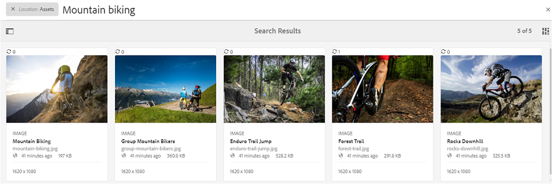

# Brand Portal でのアセットの検索 {#search-assets-on-brand-portal}

[!DNL Brand Portal] 検索機能を使用すると、自然検索を使用して関連するアセットをすばやく検索し、フィルターを使用するファセット検索を使用して、検索をさらに絞り込むことができます。You can also save your searches as smart [!UICONTROL collections] for the future.

## オムニサーチを使用したアセット検索 {#search-assets-using-omnisearch}

To search for assets on [!DNL Brand Portal]:

1. From the toolbar, click the **Search** icon, or press the "**/**" key to launch Omnisearch.

   

2. 検索ボックスに、検索するアセットのキーワードを入力します。

   

   >[!NOTE]
   >
   >オムニサーチで検索候補が表示されるには、3 文字以上入力する必要があります。

3. ドロップダウンリストに表示される関連候補の中から選択すれば、関連するアセットにすばやくアクセスできます。

   

   オムニサーチを使用したアセット検索

## フィルターパネルでのファセットを使用した検索 {#search-using-facets-in-filters-panel}

フィルターパネルの検索ファセットを使用すると、詳細な検索条件を指定して、検索効率を高めることができます。検索ファセットでは、複数のディメンション（述語）を使用して複雑な検索を実行します。より焦点を絞った検索のために、目的の詳細レベルまで簡単にドリルダウンできます。

例えば、画像を検索する場合、ビットマップとベクトル画像のどちらを検索するかを選択できます。「ファイルタイプ」検索ファセットで画像の MIME タイプを指定することで、さらに検索の範囲を絞り込むことができます。同様に、ドキュメントを検索する場合は、PDF や MS Word などの形式を指定できます。

![[ [!DNL Brand Portal]](assets/file-type-search.png "!DNLブランドポータル]")

フィルターパネルには、パスブラウザー、ファイルタイプ、ファイルサイズ、ステータス、回転角度などの、いくつかの標準的なファセットが用意されています。However, you can [add custom search facets](../using/brand-portal-search-facets.md) or remove specific search facets from the **Filters** panel by adding or removing predicates in the underlying Search Form. See the list of the available and usable [search predicates on Brand Portal](../using/brand-portal-search-facets.md#list-of-search-predicates).

To apply filters to your search, using the available [search facets](../using/brand-portal-search-facets.md):

1. Click the overlay icon and select **Filter**.

   

2. 左側の&#x200B;**フィルター**&#x200B;パネルから、適切なオプションを選択して、関連するフィルターを適用します。例えば、以下の標準のフィルターを使用します。

   * **パスブラウザー** を使用して、特定のディレクトリ内のアセットを検索できます。The default search path of the predicate for Path Browser is */content/dam/mac/&lt;tenant-id&gt;/*, which can be configured by editing the default search form.
   >[!NOTE]
   >
   >管理者以外のユーザーに対して、フィルターパネルのパスブラウザーには、共有されているフォルダ（およびその上位のフォルダ）のコンテンツ構造のみが表示されます。\
   >To admin users, Path Browser allows navigating to any folder in [!DNL Brand Portal].

   * **ファイルタイプ** :探しているアセットファイルのタイプ（画像、ドキュメント、マルチメディア、アーカイブ）を指定します。さらに、例えば画像の MIME タイプ（Tiff、ビットマップ、GIMP 画像）やドキュメントの形式（PDF、MS Word）を指定して、検索の範囲を絞り込むことができます。
   * **ファイルサイズ** :アセットのサイズに基づいてアセットを検索します。サイズ範囲の下限と上限を指定して検索を絞り込むことができます。また、検索の単位を指定できます。
   * **アセットのステータス（承認済み、要求済みの変更、拒否、保留、有効期限など）に基づいてアセットを検索するため** のステータス。
   * **平均レーティング** :アセットのレーティングに基づいてアセットを検索します。
   * **向き** :アセットの方向（水平、垂直、四角形）に基づいてアセットを検索します。
   * **スタイル**：アセットのスタイル（カラー、モノクロ）に基づいてアセットを検索します。
   * **ビデオ形式**：形式（DVI、Flash、MPEG4、MPEG、OGG Theora、QuickTime、Windows Media、WebM）に基づいてビデオアセットを検索します。
   フィルターパネルで[カスタム検索ファセット](../using/brand-portal-search-facets.md)を使用できるようにするには、基礎となる検索フォームを編集します。

   * **プロパティの述語**：検索フォームで使用すると、述語のマッピング先のメタデータプロパティに一致するアセットを検索できます。\
      例えば、プロパティのPredicateがマッピングされている `jcr:content /metadata/dc:title`場合、タイトルに基づいてアセットを検索できます。\
      Property Predicateでは、次のテキスト検索がサポートされています。

      **部分的な語句**
プロパティの述語で部分的な語句を使用したアセット検索を許可するには、検索フォームの「**部分検索**」チェックボックスを有効にします。\
      これにより、アセットメタデータで使用する語句を指定しなくても、目的のアセットを検索できます。\
      次のことができます。
*フィルターパネルのファセットで、検索したフレーズで発生する単語を指定します。**例えば、«上昇»** （およびプロパティのPredicateがプロパティにマッピングされている `dc:title` ）を検索すると、タイトルフレーズの **«クライミング»** という単語を含むすべてのアセットが返されます。
*検索語句で発生する単語の一部を指定し、ワイルドカード文字（*）とワイルドカード文字を入力します。
例えば、次の検索をおこないます。
      **inch*** は、タイトルフレーズで"loop"という文字で始まる単語を持つすべてのアセットを返します。
      *** theming** を指定すると、タイトルフレーズで"loop"という文字で終わる単語を含むすべてのアセットが返されます。
      *** inch*** を指定すると、タイトルフレーズで"loop"という文字を含むすべてのアセットが返されます。\
      **大文字と小文字を区別しないテキストの大**&#x200B;文字と小文字の区別のないプロパティの述語で大文字と小文字を区別しないようにする:検索フォームの「大文字 **と小文字を区別しない」** チェックボックスを有効にします。プロパティの述語のテキスト検索では、デフォルトで大文字と小文字が区別されます。
   >[!NOTE]
   >
   >「**部分検索**」チェックボックスを選択すると、デフォルトで「**大文字と小文字を区別しない**」がオンになります。

   

   適用したフィルターに基づく検索結果と、検索結果数が表示されます。

   

   アセットの検索結果と検索結果数

3. 検索結果から特定の項目に移動した後、ブラウザーの戻るボタンを使用して元の検索結果に簡単に戻ることができます。検索クエリーを再実行する必要はありません。

## 検索設定をスマートコレクションとして保存 {#save-your-searches-as-smart-collection}

検索設定をスマートコレクションとして保存しておくと、同じ検索をすぐに再実行することができ、同じ設定をし直す必要がなくなります。

検索設定をスマートコレクションとして保存するには、次のようにします。

1. Tap/ click **Save Smart Collection** and provide a name for the smart collection.

   すべてのユーザーがアクセスできるスマートコレクションにするには、「**公開**」を選択します。スマートコレクションが作成され、保存済みの検索の一覧に追加されたことを示すメッセージが表示されます。

   >[!NOTE]
   >
   >Non-admin users can be restricted from making smart [!UICONTROL collections] public, to avoid having a huge number of public smart [!UICONTROL collections] created by non-admin users on organization's [!DNL Brand Portal]. Organizations can disable the **Allow public smart[!UICONTROL collections]creation** configuration from **General** settings available in admin tools panel.

   

1. スマートコレクションを別の名前で保存し、「**公開**」チェックボックスをオンまたはオフにするには、「**スマートコレクションを編集**」をクリックします。

   

1. **スマートコレクションを編集**&#x200B;ダイアログボックスで、「**名前を付けて保存**」を選択し、スマートコレクションの名前を入力します。「**保存**」をクリックします。

   
