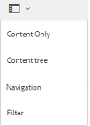

# Brand Portal でのアセットの検索 {#search-assets-on-brand-portal}

ブランドポータル検索機能を使用すると、オムニサーチを使用して関連するアセットをすばやく検索し、フィルターを使用して検索を絞り込むことができます。 検索設定をスマートコレクションとして保存しておき、後で呼び出すこともできます。

## オムニサーチを使用したアセット検索 {#search-assets-using-omnisearch}

To search for assets on Brand Portal:

1. From the toolbar, click the **[!UICONTROL Search]** icon, or press the "**[!UICONTROL /]**" key to launch Omnisearch.

   

1. 検索ボックスに、検索するアセットのキーワードを入力します。

   

   >[!NOTE]
   >
   >オムニサーチで検索候補が表示されるには、3 文字以上入力する必要があります。

1. ドロップダウンリストに表示される関連候補の中から選択すれば、関連するアセットにすばやくアクセスできます。

   

   *オムニサーチを使用したアセット検索*

To know about search behaviour with smart tagged assets, see [understand search results and behavior](https://helpx.adobe.com/experience-manager/6-5/assets/using/search-assets.html).

## フィルターパネルでのファセットを使用した検索 {#search-using-facets-in-filters-panel}

フィルターパネルの検索ファセットを使用すると、詳細な検索条件を指定して、検索効率を高めることができます。検索ファセットでは、複数のディメンション（述語）を使用して、より複雑な検索を実行できます。より焦点を絞った検索のために、目的の詳細レベルまで簡単にドリルダウンできます。

例えば、画像を検索する場合、ビットマップとベクトル画像のどちらを検索するかを選択できます。「ファイルタイプ」検索ファセットで画像の MIME タイプを指定することで、さらに検索の範囲を絞り込むことができます。同様に、ドキュメントを検索する場合は、PDF や MS Word などの形式を指定できます。

The [!UICONTROL Filters] panel includes a few standard facets, such as- [!UICONTROL Path Browser], [!UICONTROL File Type], [!UICONTROL File Size], [!UICONTROL Status], and [!UICONTROL Orientation]. ただし、[!UICONTROL フィルター]パネルに[カスタム検索ファセットを追加](../using/brand-portal-search-facets.md)したり、特定の検索ファセットを削除したりすることも可能です。そのためには、基礎となる検索フォームで述語を追加または削除します。詳しくは、[Brand Portal で利用可能な検索用述語の一覧](../using/brand-portal-search-facets.md#list-of-search-predicates)を参照してください。

利用可能な[検索ファセット](../using/brand-portal-search-facets.md)を使用して検索にフィルターを適用するには、次のようにします。

1. Click the overlay icon and select **[!UICONTROL Filter]**.

   

2. 左側の&#x200B;**[!UICONTROL フィルター]パネルから、適切なオプションを選択して、関連するフィルターを適用します。**&#x200B;例えば、以下の標準のフィルターを使用します。

   * **[!UICONTROL パスブラウザー]**：特定のディレクトリ内のアセットを検索します。The default search path of the predicate for Path Browser is **[!UICONTROL /content/dam/mac/&lt;tenant-id&gt;/]**, which can be configured by editing the default search form.
   >[!NOTE]
   >
   >To non-admin users, [!UICONTROL Path Browser] in [!UICONTROL Filter] panel shows only the content structure of the folders (and their ancestor folders) shared with them.\
   >管理者ユーザーは、パスブラウザーを使用してBrand portalの任意のフォルダーに移動できます。

   * **[!UICONTROL ファイルタイプ]**：検索するアセットファイルのタイプ（画像、ドキュメント、マルチメディア、アーカイブ）を指定します。さらに、例えば画像の MIME タイプ（Tiff、ビットマップ、GIMP 画像）やドキュメントの形式（PDF、MS Word）を指定して、検索の範囲を絞り込むことができます。
   * **[!UICONTROL ファイルサイズ]**：ファイルサイズに基づいてアセットを検索します。サイズ範囲の下限と上限を指定して検索を絞り込むことができます。また、検索の単位を指定できます。
   * **[!UICONTROL ステータス]**：承認のステータス（承認済み、リクエストされた変更、却下、保留）や有効期限などのアセットのステータスに基づいてアセットを検索します。
   * **[!UICONTROL 平均評価]**：アセットの評価に基づいてアセットを検索します。
   * **[!UICONTROL 回転角度]**：アセットの回転角度（水平方向、垂直方向、四角形）に基づいてアセットを検索します。
   * **[!UICONTROL スタイル]**：アセットのスタイル（カラー、モノクロ）に基づいてアセットを検索します。
   * **[!UICONTROL ビデオ形式]**：形式（DVI、Flash、MPEG4、MPEG、OGG Theora、QuickTime、Windows Media、WebM）に基づいてビデオアセットを検索します。
   フィルターパネルで[カスタム検索ファセット](../using/brand-portal-search-facets.md)を使用できるようにするには、基礎となる検索フォームを編集します。

   * **[!UICONTROL プロパティの述語]**：検索フォームで使用すると、述語のマッピング先のメタデータプロパティに一致するアセットを検索できます。\
      For example, if Property Predicate is mapped to [!UICONTROL `jcr:content /metadata/dc:title`], you can search assets based on their title.\
      The [!UICONTROL Property Predicate] supports text searches for:

      **部分的な語句**
プロパティの述語で部分的な語句を使用したアセット検索を許可するには、検索フォームの「**[!UICONTROL 部分検索]」チェックボックスを有効にします。**\
      これにより、アセットメタデータで使用する語句を指定しなくても、目的のアセットを検索できます。\
      次のことが可能です。
* フィルターパネルのファセットで、検索する語句に使用されている単語を指定します。例えば、「**climb**」という単語を検索する（およびプロパティの述語が [!UICONTROL `dc:title`] プロパティにマッピングされている）場合は、タイトルに「**climb**」という単語を含むアセットがすべて返されます。* 検索する語句で使用されている単語の一部を指定します。その際、ワイルドカード文字（*）で補完します。例えば、次の検索をおこないます。
      「**climb***」と指定すると、「climb」という文字列で始まる単語がタイトルフレーズで使用されているアセットがすべて返されます。
      「***climb**」と指定すると、「climb」という文字列で終わる単語がタイトルフレーズで使用されているアセットがすべて返されます。
      「***climb***」と指定すると、「climb」という文字列を含む単語がタイトルフレーズで使用されているアセットがすべて返されます。\
      **大文字と小文字を区別しないテキスト**
プロパティの述語で大文字と小文字を区別せずに検索するには、検索フォームの「**[!UICONTROL 大文字と小文字を区別しない]」チェックボックスをオンにします。**&#x200B;プロパティの述語のテキスト検索では、デフォルトで大文字と小文字が区別されます。
   >[!NOTE]
   >
   >「**[!UICONTROL 部分検索]**」チェックボックスを選択すると、デフォルトで「[!UICONTROL 大文字と小文字を区別しない]」がオンになります。

   

   適用したフィルターに基づく検索結果と、検索結果数が表示されます。

   

   アセットの検索結果と検索結果数

3. 検索結果から特定の項目に移動した後、ブラウザーの戻るボタンを使用して元の検索結果に簡単に戻ることができます。検索クエリーを再実行する必要はありません。

## 検索設定をスマートコレクションとして保存 {#save-your-searches-as-smart-collection}

検索設定をスマートコレクションとして保存しておくと、同じ検索をすぐに再実行することができ、同じ設定をし直す必要がなくなります。

検索設定をスマートコレクションとして保存するには、次のようにします。

1. 「**[!UICONTROL スマートコレクションを保存]」をタップまたはクリックし、スマートコレクションの名前を指定します。**

   To make the smart collection accessible to all users, select **[!UICONTROL Public]**. スマートコレクションが作成され、保存済みの検索の一覧に追加されたことを示すメッセージが表示されます。

   >[!NOTE]
   >
   >管理者以外のユーザーによるスマートコレクションの公開を制限できます。これにより、管理者以外のユーザーが組織の Brand Portal 上に多数の公開スマートコレクションを作成することを防止できます。管理ツールパネルの&#x200B;**[!UICONTROL 一般]設定で、「****[!UICONTROL 公開スマートコレクションの作成を許可]」設定を無効化できます。**

   

2. To save the smart collection in a different name, and select or clear the **[!UICONTROL Public]** checkbox, click **[!UICONTROL Edit Smart Collection]**.

   

3. **[!UICONTROL スマートコレクションを編集]**&#x200B;ダイアログボックスで、「**名前を付けて保存[!UICONTROL 」を選択し、スマートコレクションの名前を入力します。]** Click **[!UICONTROL Save]**.

   
