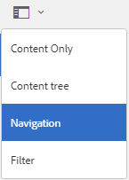
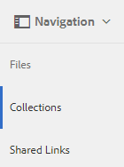
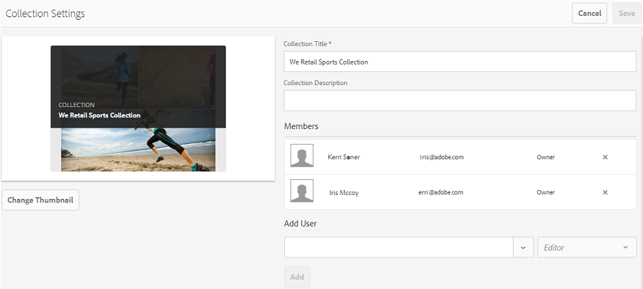
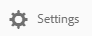
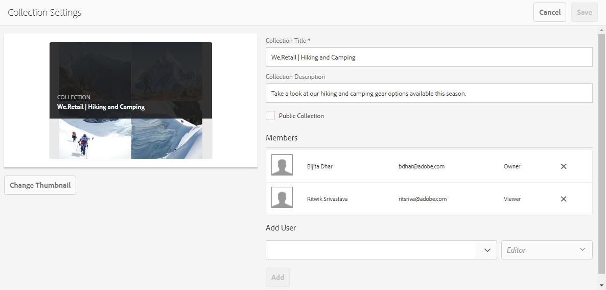

# Brand Portal でコレクションを共有する {#share-collections-bp}

AEM Assets Brand Portal 管理者は、コレクションやスマートコレクションを承認済みユーザーと共有したり、共有を解除したりできます。編集者は、自身が作成したコレクションおよび共有が認められているコレクションと公開コレクションのみを閲覧、共有できます。ただし、編集者は公開コレクションを非公開コレクションに変更できません。

>[!NOTE]
>
>編集者は公開コレクションを非公開コレクションに変更できないので、[!UICONTROL コレクション設定]ダイアログの「[!UICONTROL 公開コレクション]」チェックボックスは使用不可になります。

## コレクションの共有 {#share-collection}

コレクションを共有するには、次のようにします。

1. 左側のオーバーレイアイコンをクリックし、「**[!UICONTROL ナビゲーション]**」を選択します。

   

1. 左側のサイドレールで「**[!UICONTROL コレクション]**」をクリックします。

   

1. **[!UICONTROL コレクション]**&#x200B;コンソールで、以下のいずれかの手順を実行します。

   * 共有するコレクションの上にマウスポインターを置きます。そのコレクションで使用できるクイックアクションサムネールから、**[!UICONTROL 設定]**&#x200B;アイコンをクリックします。
   

   * 共有するコレクションを選択します。上部のツールバーの「**[!UICONTROL 設定]**」をクリックします。
   

1. [!UICONTROL コレクション設定]ダイアログボックスで、そのコレクションを共有するユーザーまたはグループを選択し、それぞれのグローバルな役割に一致するユーザーまたはグループの役割を選択します。例えば、グローバルな編集者には編集者の役割を割り当て、グローバルな閲覧者には閲覧者の役割を割り当てます。

   または、グループのメンバーシップや役割に関係なく、すべてのユーザーがコレクションを使用できるようにするには、「**[!UICONTROL 公開コレクション]**」チェックボックスをオンにして、そのコレクションを公開コレクションとして設定します。

   >[!NOTE]
   >
   >ただし、公開コレクションが大量に作成されてシステムの容量に影響しないように、管理者以外のユーザーによる公開コレクションの作成を制限できます。管理ツールパネルの[!UICONTROL 一般]設定で、「**[!UICONTROL 公開コレクションの作成を許可]**」設定を無効化できます。

   

   編集者は公開コレクションを非公開コレクションに変更できないので、[!UICONTROL コレクション設定]ダイアログの「[!UICONTROL 公開コレクション]」チェックボックスは使用不可になります。

   

1. 「**[!UICONTROL 追加]**」をクリックし、「**[!UICONTROL 保存]**」をクリックします。コレクションが、選択したユーザーと共有されます。

   >[!NOTE]
   >
   >コレクション内のアセットやフォルダーへのアクセスは、ユーザーの役割によって決まります。アセットへのアクセス権を持たないユーザーは、空のコレクションを共有します。また、コレクションに対して実行できるアクションも、ユーザーの役割によって決まります。

## コレクションの共有解除 {#unshare-a-collection}

コレクションの共有を解除するには、以下の手順を実行します。

1. [!UICONTROL コレクション]コンソールで、共有を解除するコレクションを選択します。

   ツールバーの「**[!UICONTROL 設定]**」をクリックします。

   

1. [!UICONTROL コレクション設定]ダイアログボックスの「[!UICONTROL メンバー]」で、ユーザーやグループの横にある **[!UICONTROL x]** 記号をクリックして、これらのユーザーやグループを、コレクションを共有しているユーザーの一覧から削除します。

   

1. 警告メッセージボックスの「**[!UICONTROL 確認]**」をクリックして、共有を解除することを確認します。

   「**[!UICONTROL 保存]**」をクリックします。

1. 共有リストから削除したユーザーの資格情報を使用して、Brand Portal にログインします。指定したコレクションが、**[!UICONTROL コレクション]**&#x200B;コンソールから削除されています。
