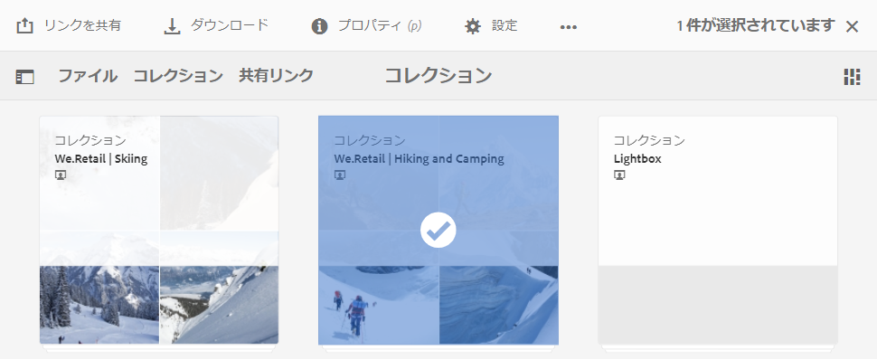

# コレクションの共有 {#share-collections}

コレクションは、Adobe Experience Manager Assets Brand Portal にまとめて保存される関連アセットのグループを表します。ユーザーは、[オムニサーチまたはファセット検索を適用して関連アセットをフィルター](brand-portal-searching.md)し一緒に保存することでスマートコレクションを作成し、アクセスしやすくしたり、さらに他の Brand Portal ユーザーと共有したりできます。

管理者は、承認された Brand Portal ユーザーとコレクションを共有および共有解除できます。編集者と閲覧者は、自身が作成したコレクション、共有が認められているコレクション、公開コレクションを閲覧および共有できます。

>[!NOTE]
>
>編集者は公開コレクションを非公開コレクションに変更できないので、**[!UICONTROL コレクション設定]**&#x200B;ダイアログの「**[!UICONTROL 公開コレクション]**」チェックボックスは使用不可になります。

## コレクションの共有 {#share-collection}

承認された Brand Portal ユーザーとコレクションを共有する手順は次のとおりです。

1. Brand Portal テナントにログインします。デフォルトで「**[!UICONTROL ファイル]**」ビューが開き、公開中のアセットとフォルダーがすべて表示されます。

1. 上部のクイックナビゲーションで「**[!UICONTROL コレクション]**」をクリックします。

1. **[!UICONTROL コレクション]**&#x200B;コンソールで、以下のいずれかの手順を実行します。

   * 共有するコレクションの上にマウスポインターを置きます。そのコレクションで使用できるクイックアクションサムネールから、**[!UICONTROL 設定]**&#x200B;アイコンをクリックします。

      

   * 共有するコレクションを選択します。上部のツールバーの「**[!UICONTROL 設定]**」をクリックします。

      

1. **[!UICONTROL コレクション設定]**&#x200B;ダイアログボックスで、そのコレクションの共有相手となるユーザーを選択し、それぞれのグローバルな役割に一致するユーザーの役割を選択します。例えば、グローバルな編集者には編集者の役割を割り当て、グローバルな閲覧者には閲覧者の役割を割り当てます。

   または、グループのメンバーシップや役割に関係なく、すべてのユーザーがコレクションを使用できるようにするには、「**[!UICONTROL 公開コレクション]**」チェックボックスをオンにして、そのコレクションを公開コレクションとして設定します。

   >[!NOTE]
   >
   >ただし、公開コレクションが大量に作成されてシステムの容量に影響しないように、管理者以外のユーザーによる公開コレクションの作成を制限できます。管理ツールパネルの&#x200B;**[!UICONTROL 一般]**&#x200B;設定で、「**[!UICONTROL 公開コレクションの作成を許可]**」設定を無効にすることができます。

   

   編集者は公開コレクションを非公開コレクションに変更できないので、**[!UICONTROL コレクション設定]**&#x200B;ダイアログの「**[!UICONTROL 公開コレクション]**」チェックボックスは使用不可になります。

   

1. 「**[!UICONTROL 追加]**」ボタンをクリックしてユーザーを追加した後で、「**[!UICONTROL 保存]**」をクリックします。そのコレクションが指定のユーザーと共有されます。

   >[!NOTE]
   >
   >コレクション内のアセットやフォルダーへのアクセスは、ユーザーの役割によって決まります。アセットへのアクセス権を持たないユーザーは、空のコレクションを共有します。また、コレクションに対して実行できるアクションも、ユーザーの役割によって決まります。

## コレクションの共有解除 {#unshare-a-collection}

コレクションの共有を解除するには、以下の手順を実行します。

1. **[!UICONTROL コレクション]**&#x200B;コンソールで、共有を解除するコレクションを選択します。

   上部のツールバーの「**[!UICONTROL 設定]**」をクリックします。

   

1. **[!UICONTROL コレクション設定]**&#x200B;ダイアログボックスの「**[!UICONTROL メンバー]**」セクションで、ユーザーの横にある **[!UICONTROL x]** 記号をクリックして、コレクションにアクセスできるユーザーのリストから指定ユーザーを削除します。

   

1. 警告メッセージが表示されます。「**[!UICONTROL 確認]**」をクリックして、コレクションの共有を解除します。

1. 「**[!UICONTROL 保存]**」をクリックして、変更内容を適用します。

   ユーザーが共有リストから削除されると、共有解除されたコレクションはユーザーの&#x200B;**[!UICONTROL コレクション]**&#x200B;コンソールから削除されます。

<!--
1. Click the overlay icon on the left, and choose **[!UICONTROL Navigation]**.

   

1. From the siderail on the left, click **[!UICONTROL Collections]**.

   

1. From the **[!UICONTROL Collections]** console, do one of the following:

    * Hover the pointer over the collection you want to share. From the quick action thumbnails available for the collection, click the **[!UICONTROL Settings]** icon.

   

    * Select the collection you want to share. From the toolbar at the top, click **[!UICONTROL Settings]**.
    
   

1. In the [!UICONTROL Collection Settings] dialog box, select the users or groups with whom you want to share the collection and select the role for a user or a group to match their global role. For example, assign the Editor role to a global editor, the Viewer role to a global viewer.

   Alternatively, to make the collection available to all users irrespective of their group membership and role, make it public by selecting the **[!UICONTROL Public Collection]** check-box.

   >[!NOTE]
   >
   >However, non-admin users can be restricted from creating public collections, to avoid having numerous public collections so that system space can be saved. Organizations can disable the **[!UICONTROL Allow public collections creation]** configuration from [!UICONTROL General] settings available in admin tools panel.

   

   Editors cannot change a public collection to a non-public collection and, therefore, do not have **[!UICONTROL Public Collection]** check-box available in **[!UICONTROL Collection Settings]** dialog.

   

1. Select **[!UICONTROL Add]**, and then **[!UICONTROL Save]**. The collection is shared with the chosen users.

   >[!NOTE]
   >
   >A user's role governs access to the assets and folders inside a collection. If a user does not have access to assets, an empty collection is shared with the user. Also, a user's role governs the actions available for collections.

## Unshare a collection {#unshare-a-collection}

To unshare a previously shared collection, do the following:

1. From the **[!UICONTROL Collections]** console, select the collection you want to unshare.

   In the toolbar, click **[!UICONTROL Settings]**.

   

1. On the **[!UICONTROL Collection Settings]** dialog box, under **[!UICONTROL Members]**, click the **[!UICONTROL x]** symbol next to users or groups to remove them from the list of users you shared the collection with.

   

1. In the warning message box, click **[!UICONTROL Confirm]** to confirm unshare.

   Click **[!UICONTROL Save]**.

1. Log in to Brand Portal with the credentials of the user you removed from the shared list. The collection is removed from the **[!UICONTROL Collections]** console.
-->
