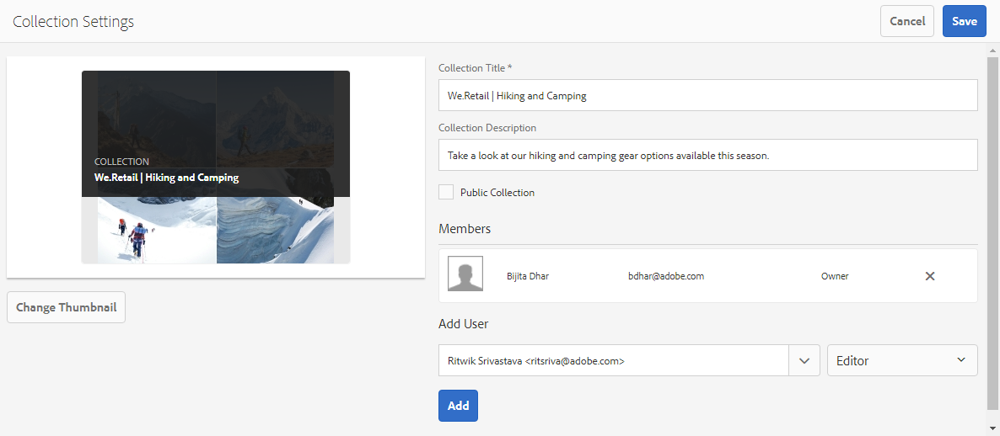

# ブランドポータルでコレクションを共有 {#share-collections-bp}

AEM Assets Brand Portal 管理者は、コレクションやスマートコレクションを承認済みユーザーと共有したり、共有を解除したりできます。エディターは、自身が作成したコレクションおよび共有が認められているコレクションと公開コレクションのみを閲覧、共有できます。ただし、エディターは公開コレクションを非公開コレクションに変更できません。

>[!NOTE]
>
>Editors cannot change a public collection to a non-public collection and, therefore, do not have **Public Collection** check box available in **Collection Settings** dialog.

## コレクションの共有 {#share-collection}

コレクションを共有するには、次のようにします。

1. 左側のオーバーレイアイコンをクリックし、「**ナビゲーション**」を選択します。

   

1. From the siderail on the left, click **Collections**.

   

1. **コレクション**&#x200B;コンソールで、以下のいずれかの手順を実行します。

   * 共有するコレクションの上にマウスポインターを置きます。そのコレクションで使用できるクイックアクションサムネールから、**設定**&#x200B;アイコンをクリックします。
   

   * 共有するコレクションを選択します。From the toolbar at the top, click **Settings**.
   

1. **コレクション設定** ダイアログボックスで、コレクションを共有するユーザーまたはグループを選択し、グローバルロールに一致するユーザーまたはグループの役割を選択します。例えば、グローバルなエディターにはエディターの役割を割り当て、グローバルな閲覧者には閲覧者の役割を割り当てます。

   Alternatively, to make the collection available to all users irrespective of their group membership and role, make it public by selecting the **Public Collection** check box.

   >[!NOTE]
   >
   >ただし、公開コレクションが大量に作成されてシステムの容量に影響しないように、管理者以外のユーザーによる公開コレクションの作成を制限できます。Organizations can disable the **Allow public collections creation** configuration from **General** settings available in admin tools panel.

   

   Editors cannot change a public collection to a non-public collection and, therefore, do not have **Public Collection** check box available in **Collection Settings** dialog.

   

1. **「追加**»をクリックし、?«保存?****&#x200B;コレクションが、選択したユーザーと共有されます。

   >[!NOTE]
   >
   >コレクション内のアセットやフォルダーへのアクセスは、ユーザーの役割によって決まります。ユーザーがアセットにアクセスできない場合、空のコレクションがユーザーと共有されます。また、コレクションに対して実行できるアクションも、ユーザーの役割によって決まります。

## コレクションの共有解除 {#unshare-a-collection}

コレクションの共有を解除するには、以下の手順を実行します。

1. **コレクション**&#x200B;コンソールで、共有を解除するコレクションを選択します。

   In the toolbar, click **Settings**.

   

1. **コレクション設定** ダイアログボックスの«メンバー»の下 **の«メンバー**»の下の **、コレクションを共有しているユーザーのリストから、ユーザーまたはグループの横のx** 記号をクリックします。

   

1. 警告メッセージボックスの「**確認**」をクリックして、共有を解除することを確認します。

   「**保存**」をクリックします。

1. 共有リストから削除したユーザーの資格情報を使用してブランドポータルにログインします。指定したコレクションが、**コレクション**&#x200B;コンソールから削除されています。
