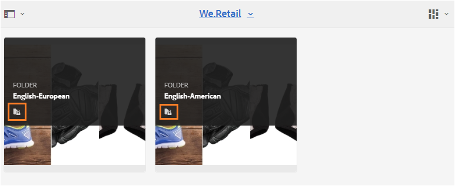

# Brand Portal でフォルダーを共有する {#share-folders}

Brand Portal は、アセットの取り込みをサポートしていません。したがって、事前設定済みの Experience Manager オーサーインスタンスから Brand Portal にアセットを公開する必要があります。

## Brand Portal でのフォルダー共有ワークフロー {#folder-sharing-workflow-in-brand-portal}

以下に、フォルダー共有のワークフローとユーザーアクセスを示します。

* Experience Manager Assets から Brand Portal に公開されるすべてのフォルダーは、レプリケーションの設定時に「公開」として指定されていない限り、デフォルトで Brand Portal 管理者にのみ表示されます。
* 管理者は、**[!UICONTROL フォルダーのプロパティ]**&#x200B;コンソールを使用して、一部の選択したユーザーやグループとのみフォルダーを共有します。フォルダーを共有しているこれらのユーザーとグループのみが、Brand Portal へのログイン後にフォルダーを表示できます。それ以外のユーザーにフォルダーは表示されません。
* 管理者は、**[!UICONTROL フォルダーのプロパティ]**&#x200B;コンソールの「**[!UICONTROL 公開フォルダー]**」チェックボックスを利用して、フォルダーを公開フォルダーとして設定できます。公開フォルダーはすべてのユーザーに表示されます。

* ユーザーの役割と権限に関係なく、ユーザーが Brand Portal にログインすると、すべての公開フォルダーが表示されます。また、そのユーザーと直接共有しているフォルダーや、そのユーザーの所属グループと直接共有しているフォルダーも表示されます。非公開フォルダーや、その他のユーザーと共有しているフォルダーは、すべてのユーザーには表示されません。

### Brand Portal 上でフォルダーをユーザーグループと共有する {#sharing-folders-with-user-groups-on-brand-portal}

フォルダーのアセットに対するアクセス権は、その親フォルダーに対するアクセス権に依存します。子フォルダーの設定には関係ありません。この動作は AEM 内の [ACL](https://experienceleague.adobe.com/docs/experience-manager-65/administering/security/security.html?lang=ja) によって制御されます。子フォルダーは親フォルダーの ACL を継承するためです。例えば、フォルダー A の中にフォルダー B があり、その中にフォルダー C がある場合、フォルダー A に対するアクセス権を持つユーザーグループ（またはユーザー）は、フォルダー B および C に対しても同じアクセス権を持ちます。フォルダー B は A の子フォルダーであるため A の ACL を継承し、フォルダー C はフォルダー B の子フォルダーであるため B の ACL を継承します。

同様に、フォルダー B のみに対するアクセス権を持つユーザーグループ（またはユーザー）は、フォルダー C に対して同じアクセス権を持ちますが、フォルダー A に対するアクセス権は持ちません。したがって、組織がコンテンツを整理する際には、広範囲に公開するアセットは子フォルダーに配置して、子からルートフォルダーへのアクセスを制限することをお勧めします。

### 公開フォルダーの公開 {#public-folder-publish}

Brand Portal のレプリケーションの設定時に「**[!UICONTROL 公開フォルダーの公開]**」オプションが選択されない限り、管理者以外のユーザー（エディターや閲覧者など）が、AEM Assets から Brand Portal に公開されたアセットにアクセスすることはできません。

「**[!UICONTROL 公開フォルダーの公開]**」オプションが無効になっている場合、管理者がこれらのアセットを管理者以外のユーザーと共有するには、共有機能を使用する必要があります。

>[!NOTE]
>
>「**[!UICONTROL 公開フォルダーの公開]**」を有効にするオプションは、AEM 6.3.2.1 以降で利用できます。

## 共有フォルダーへのアクセス {#access-to-shared-folders}

以下の表に、様々なユーザーの役割が持つアクセス権と、アセットを共有／共有解除する権限を示します。

|  | AEM Assets から Brand Portal に公開されたすべてのフォルダーへのアクセス | 共有フォルダーへのアクセス | フォルダーを共有／共有解除する権限 |
|---------------|-----------|-----------|------------|
| 管理者 | 可 | 可 | 可 |
| 編集者 | 不可* | 可。ただし、そのユーザーと共有されている場合、またはそのユーザーの所属グループと共有されている場合のみ。 | 可。ただし、そのユーザーと共有されているフォルダー、またはそのユーザーの所属グループと共有されているフォルダーのみ。 |
| 閲覧者 | 不可* | 可。ただし、そのユーザーと共有されている場合、またはそのユーザーの所属グループと共有されている場合のみ。 | 不可 |
| ゲストユーザー | 不可* | 可。ただし、そのユーザーと共有されている場合、またはそのユーザーの所属グループと共有されている場合のみ。 | 不可 |

>[!NOTE]
>
>AEM オーサーインスタンスと Brand Portal のレプリケーションを設定する際、「**[!UICONTROL 公開フォルダーの公開]**」オプションはデフォルトで無効になっています。このオプションが有効になっている場合は、Brand Portal に公開されているフォルダーが、デフォルトですべてのユーザー（管理者以外のユーザーも含む）にアクセス可能になります。

### 管理者以外のユーザーによる共有フォルダーへのアクセス {#non-admin-user-access-to-shared-folders}

管理者以外のユーザーは、Brand Portal 上でそのユーザーに共有されているフォルダーにのみアクセスできます。ただし、ポータルにログインしたときにこれらのフォルダーがどのように表示されるかは、「**[!UICONTROL フォルダー階層を有効化]**」の設定によって異なります。

**この設定が無効な場合**

管理者以外のユーザーが Brand Portal にログインすると、自身に共有されているすべてのフォルダーがランディングページに表示されます。

**この設定が有効な場合**

管理者以外のユーザーが Brand Portal にログインすると、ルートフォルダーから始まるフォルダーツリーと、それぞれの親フォルダー内に含まれる共有フォルダーが表示されます。

これらの親フォルダーは仮想フォルダーであり、これらに対してアクションを実行することはできません。仮想フォルダーは鍵のアイコン付きで表示されます。

**[!UICONTROL カード表示]**&#x200B;でこれらをカーソルで指したり選択したりしても、共有フォルダーとは異なり、アクションタスクは表示されません。**[!UICONTROL 列表示]**&#x200B;や&#x200B;**[!UICONTROL リスト表示]**&#x200B;で仮想フォルダーを選択すると「**[!UICONTROL 概要]**」ボタンが表示されます。

>[!NOTE]
>
>仮想フォルダーのデフォルトのサムネールは最初の共有フォルダーのサムネール画像になることに注意してください。

   

## フォルダーの共有 {#how-to-share-folders}

フォルダーを Brand Portal 上でユーザーと共有するには、次の手順を実行します。

1. 左側のオーバーレイアイコンをクリックし、「**[!UICONTROL ナビゲーション]**」を選択します。

   

1. 左側のサイドパネルの「**[!UICONTROL ファイル]**」を選択します。

   

1. Brand Portal インターフェイスで、共有するフォルダーを選択します。

   

1. 上部のツールバーの「**[!UICONTROL 共有]**」を選択します。

   

   [!UICONTROL フォルダーのプロパティ]コンソールが表示されます。

   

1. デフォルトの名前をユーザーに表示しないようにする場合は、**[!UICONTROL フォルダーのプロパティ]**&#x200B;コンソールで、「**[!UICONTROL フォルダーのタイトル]**」フィールドにフォルダーのタイトルを指定します。
1. 「**[!UICONTROL ユーザーを追加]**」リストで、フォルダーを共有するユーザーまたはグループを選択して、「**[!UICONTROL 追加]**」をクリックします。
フォルダーをゲストユーザーとのみ共有し、他のユーザーとは共有しない場合は、「**[!UICONTROL メンバー]**」ドロップダウンから「**[!UICONTROL 匿名ユーザー]**」を選択します。

   

   >[!NOTE]
   >
   >グループのメンバーシップや役割に関係なく、すべてのユーザーがフォルダーを使用できるようにするには、「**[!UICONTROL 公開フォルダー]**」チェックボックスをオンにして、そのフォルダーを公開フォルダーに設定します。

1. 必要であれば、「**[!UICONTROL サムネールを変更]**」をクリックしてフォルダーのサムネール画像を変更します。
1. 「**[!UICONTROL 保存]**」をクリックします。

1. 共有フォルダーにアクセスするには、フォルダーを共有するユーザーの資格情報を使用して Brand Portal にログインします。インターフェイスで共有フォルダーを確認します。

## フォルダーの共有解除 {#unshare-the-folders}

共有フォルダーの共有を解除するには、以下の手順に従います。

1. Brand Portal インターフェイスで、共有を解除するフォルダーを選択します。

   

1. 上部のツールバーの「**[!UICONTROL 共有]**」をクリックします。
1. **[!UICONTROL フォルダーのプロパティ]**&#x200B;コンソールの「**[!UICONTROL メンバー]**」で、ユーザーの横にある **[!UICONTROL x]** 記号をクリックして、このユーザーを、フォルダーを共有しているユーザーの一覧から削除します。

   

1. 警告メッセージボックスの「**[!UICONTROL 確認]**」をクリックして、共有を解除することを確認します。
「**[!UICONTROL 保存]**」をクリックします。

1. 共有リストから削除したユーザーの資格情報を使用して、Brand Portal にログインします。そのフォルダーは、そのユーザーの Brand Portal インターフェイスで利用できなくなっています。
