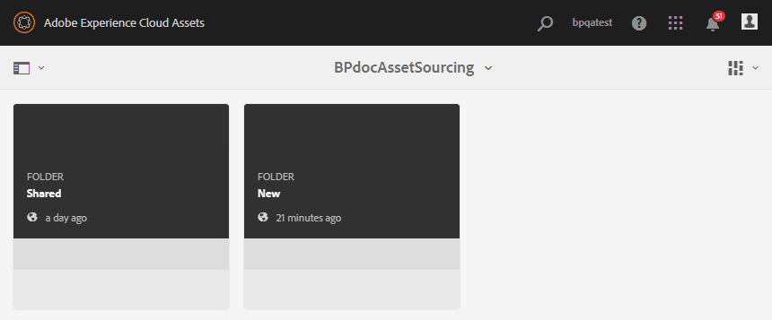
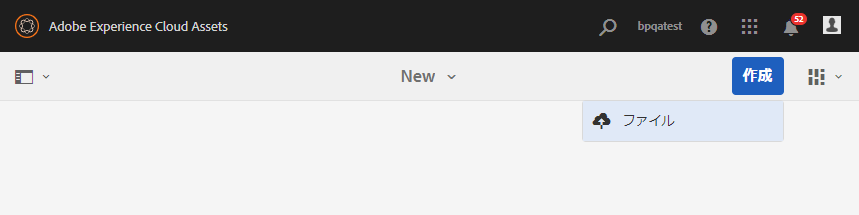
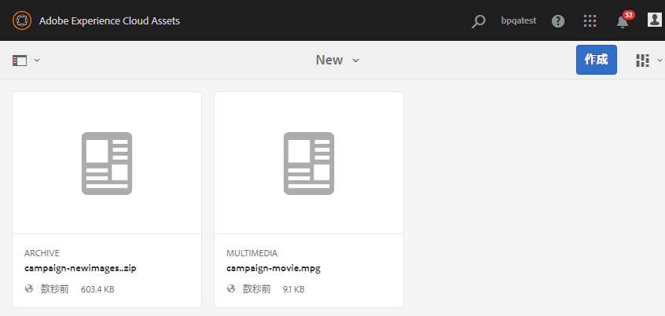

# 投稿フォルダーへのアセットのアップロード {#uplad-new-assets-to-contribution-folder}

Brand Portal ユーザーは、[アセット要件（投稿フォルダーに添付された概要ドキュメント）をダウンロード](brand-portal-download-asset-requirements.md)し、**SHARED** フォルダーからベースラインアセットをダウンロードして、投稿のニーズを理解します。Brand Portal ユーザーは、投稿用の新しいアセットを作成して、投稿フォルダー内の **NEW** フォルダーにアップロードできます。

>[!NOTE]
>
>Brand Portal ユーザーは、コンテンツ／アセットを **NEW** フォルダーにのみアップロードできます。アップロードしたアセットを削除する権限はありません。
>
>Brand Portal アカウント／テナントのアップロード上限は **10** GB です。

**新しいアセットをアップロードするには：**

1. Brand Portal インスタンスにログインします。新しく共有された投稿フォルダーと共に、Brand Portal ユーザーに対して許可された既存のすべてのフォルダーが Brand Portal ダッシュボードに反映されます。
1. クリックして投稿フォルダーを開くと、投稿フォルダー内に **[!UICONTROL SHARED]** と **[!UICONTROL NEW]** の 2 つのサブフォルダーが表示されます。
1. **[!UICONTROL NEW]** フォルダーをクリックします。
   
1. **[!UICONTROL 作成／ファイル]**をクリックして、複数のアセットを含む個別のファイルまたはフォルダー（.zip）をアップロードします。
   
1. **[!UICONTROL NEW]** フォルダーの新しいアセット（ファイル／フォルダー）を参照およびアップロードします。
   

アップロードが完了したら、Brand Portal ユーザーは、投稿フォルダーを AEM Assets に公開し直すことができます。[AEM Assets への投稿フォルダーの公開](brand-portal-publish-contribution-folder-to-aem-assets.md)を参照してください。