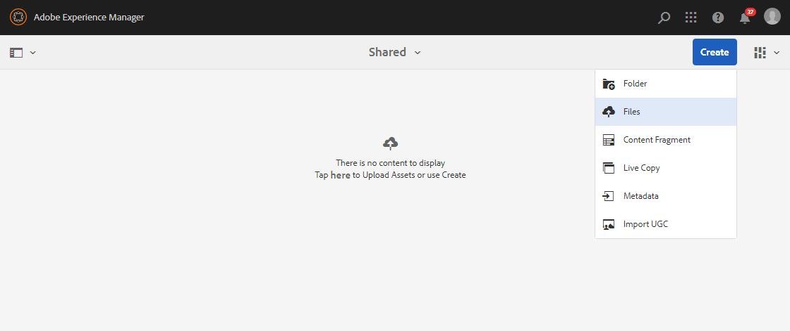
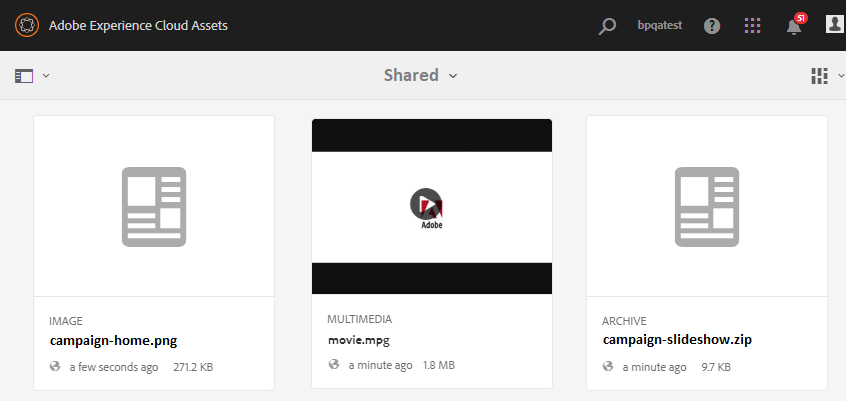

# ベースラインアセットのアップロード {#upload-baseline-assets}

AEM管理者は、ベースラインアセットを **SHARED** （共有）フォルダーにアップロードし、Brand portalユーザーが貢献度の分析に必要なアセットのタイプを把握できるようにします。 これらのアセットは、貢献度の新しいアセットを作成する際に、Brand portalユーザーが参照コンテンツとして使用できます。

**ベースラインアセットをアップロードするには：**

1. AEM作成者インスタンスにログインします。
デフォルトURL:http:// localhost:4502/aem/start.html
1. アセット/フ **[!UICONTROL ァイルに移動し]** 、ベースラインアセットをアップロードする貢献度フォルダーを探します。
1. クリックして貢献度フォルダーを開くと、貢献度フォルダー内に2つのサブ&#x200B;**[!UICONTROL フォルダー(]** SHARED **[!UICONTROL 、]** NEW)が表示されます。
1. 「 **[!UICONTROL SHARED]** folder」をクリックします。
1. 作成/フ **[!UICONTROL ァイルをクリックして]** 、個々のアセットを  アップロードします。
または、作成/フォ **[!UICONTROL ルダーをクリックして]** 、複数のアセットを含むフォルダー(.zip)をアップロードします。
   
1. SHAREDフォルダー内のベースラインアセット（ファイル/フォルダー）を参照してアップ **[!UICONTROL ロードし]** ます。
   

アップロードが完了すると、管理者は貢献度フォルダーをBrand portalに公開できます。 Brand Portalへの貢 [献度フォルダーの公開を参照してください](brand-portal-publish-contribution-folder-to-brand-portal.md)。