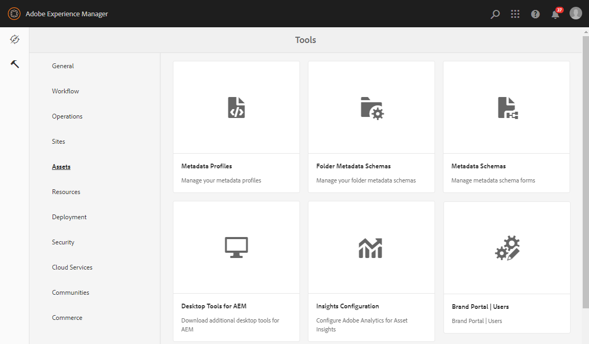

# Brand Portal ユーザーリストのアップロード {#upload-bp-user-list}

AEM 管理者は、AEM Assets のアクティブな Brand Portal ユーザーリストを含む Brand Portal ユーザー 設定（.csv）ファイルをアップロードできます。コントリビューションフォルダーは、ユーザーリストで定義されたアクティブな Brand Portal ユーザーのみ共有できます。また、管理者は、設定ファイルに新規ユーザーを追加して、変更したユーザーリストをアップロードできます。

管理者は、AEM Admin Console で新規ユーザーを追加できます。詳しくは、[ユーザーの管理](brand-portal-adding-users.md)を参照してください。Admin Console でユーザーを追加したら、これらのユーザーを Brand Portal ユーザー設定ファイルに追加して、コントリビューションフォルダーへのアクセス権を割り当てることができます。

**Brand Portal ユーザーリストをアップロードするには：**
1. AEM オーサーインスタンス（デフォルト URL：http:// localhost:4502/aem/start.html）にログインします。
1. **ツール**（）パネルで、**[!UICONTROL アセット／Brand Portal ユーザー]**に移動します。
   
1. Brand Portal 寄稿者をアップロードウィンドウが開きます。ローカルマシンから参照して、アクティブな Brand Portal ユーザーリストを含む&#x200B;**設定（.csv）ファイル**&#x200B;をアップロードします。
1. 「**[!UICONTROL 保存]**」をクリックします。
   

管理者は、コントリビューションフォルダーを設定する際に、このユーザーリストから特定のユーザー／グループに対してアクセス権を付与できます。

詳しくは、[コントリビューションフォルダーの設定](brand-portal-contribution-folder.md)を参照してください。
