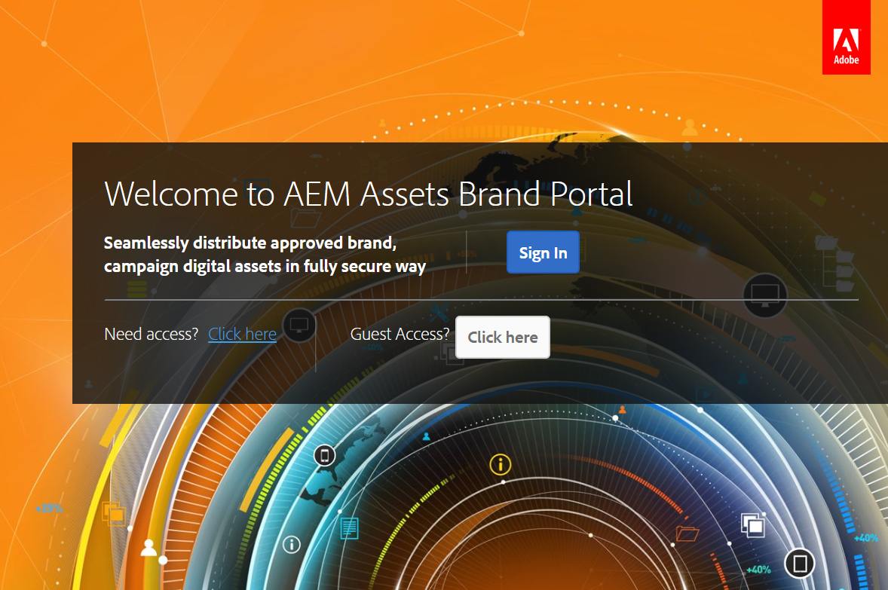
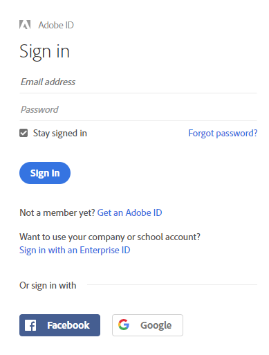
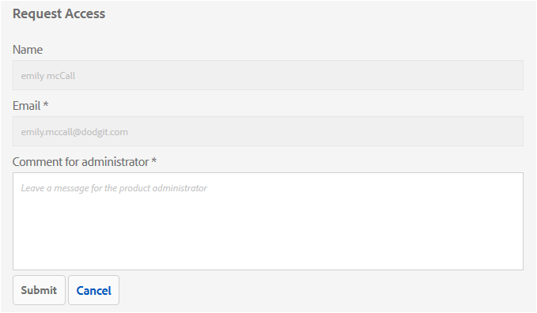
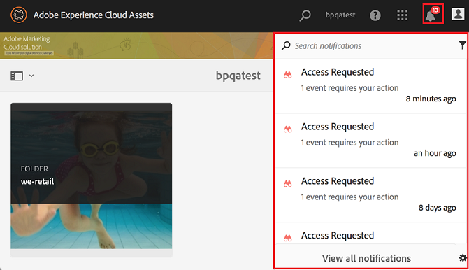
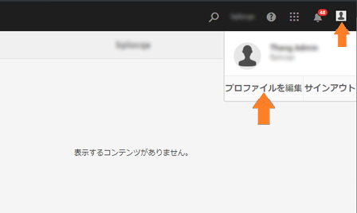
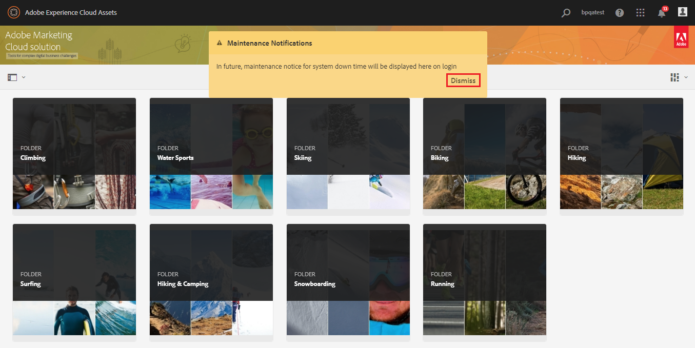

# AEM Assets Brand Portal の概要 {#overview-of-aem-assets-brand-portal}

マーケターは、関連するデジタルコンテンツの作成、管理および顧客への配信をすばやくおこなうために、チャネルパートナーや内部のビジネスユーザーとの共同作業を必要とする場合があります。関連するコンテンツをカスタマージャーニー全体にわたってタイミングよく配信することは、顧客のニーズやコンバージョン、エンゲージメント、ロイヤリティを促進するために不可欠です。

しかし問題は、広範囲に広がる内部チームやパートナー、リセラーとの間でブランドロゴやガイドライン、キャンペーンアセット、製品の写真を効率的かつ安全に共有できるソリューションを構築するのは容易ではないということです。

**Adobe Experience Manager（AEM）Assets Brand Portal** は、アセット配布およびアセットコントリビューション機能を提供することで、世界中に分散している Brand Portal ユーザーと効果的にコラボレーションするというマーケティング担当者のニーズに注力しています。

アセット配布により、承認されたクリエイティブアセットを容易に取得、制御し、それらのアセットを、様々なデバイスをまたいで、外部の関係者や内部のビジネスユーザーに安全に配布できます。一方、アセットコントリビューションにより、Brand Portal ユーザーは、オーサー環境にアクセスすることなく、Brand Portal にアセットをアップロードしたり、AEM Assets に公開したりできます。コントリビューション機能は、**Brand Portal でのアセットソーシング**&#x200B;と呼ばれます。これらにより、Brand Portal ユーザー（外部の代理店／チーム）からのアセット配布およびコントリビューションの全体的な Brand Portal エクスペリエンスを向上させ、アセットの市場投入までの時間を短縮し、コンプライアンス違反や不正アクセスのリスクを低減できます。[Brand Portal でのアセットソーシング](brand-portal-asset-sourcing.md)を参照してください。

ブラウザーベースのポータル環境では、アセットを簡単にアップロード、参照、検索、プレビュー、承認された形式で書き出すことができます。

## Configure AEM Assets with Brand Portal {#configure-brand-portal}

Adobe Experience Manager (AEM)Assetsは、Adobe I/Oを通じてBrand Portalで設定され、Brand Portalテナントの認証用にIMSトークンを取得します。

>[!NOTE]
>
>Adobe I/Oを介したBrand PortalでのAEM Assetsの設定は、AEM 6.3以降でサポートされています。

### AEM AssetsをBrand Portalで設定するための前提条件 {#prerequisites}

AEM AssetsをBrand Portalで設定するには、次が必要です。

* 最新のService Packを含むAEM Assets作成者インスタンスを起動および実行します。
* ブランドポータルテナントURL。
* Brand PortalテナントのIMS組織に対するシステム管理者権限を持つユーザー。

For more information, see [configuring AEM Assets with Brand Poral](../using/configure-aem-assets-with-brand-portal.md).

## Brand Portal でのユーザーのペルソナ {#Personas}

Brand Portal では次のユーザー役割をサポートしています。

* ゲストユーザー
* 閲覧者
* 編集者
* 管理者

次の表に、これらの役割を持つユーザーが実行できるタスクを示します。

|  | **参照** | **検索** | **ダウンロード** | **フォルダーの共有** | **コレクションの共有** | **アセットをリンクとして共有** | **管理ツールにアクセス** |
|--- |--- |--- |--- |--- |--- |--- |--- |
| **ゲストユーザー** | ✓* | ✓* | ✓* | x | x | x | x |
| **閲覧者** | ✓ | ✓ | ✓ | x | x | x | x |
| **編集者** | ✓ | ✓ | ✓ | ✓ | ✓ | ✓ | x |
| **管理者** | ✓ | ✓ | ✓ | ✓ | ✓ | ✓ | ✓ |

* ゲストユーザーは、公開フォルダーおよび公開コレクション内にあるアセットのみを参照、アクセス、および検索できます。

### ゲストユーザー {#guest-user}

認証なしで Brand Portal 上のアセットに対する制限付きのアクセス権を持つユーザーはすべてゲストユーザーです。ゲストセッションは、ユーザーに対し、公開フォルダーおよび公開コレクションへのアクセスを許可します。ゲストユーザーは、アセットの詳細を参照したり、公開フォルダーおよび公開コレクションのメンバーのアセットの完全なアセット表示をおこなったりできます。公開アセットを検索、ダウンロード、および [!UICONTROL Lightbox] コレクションに追加できます。

ただし、ゲストセッションでは、コレクションや保存済みの検索結果を作成したり、それらを共有したりすることはできません。ゲストセッション中のユーザーはフォルダーやコレクションの設定にアクセスしたり、アセットをリンクとして共有したりすることはできません。次に、ゲストユーザーが実行できるタスクの一覧を示します。

[公開アセットの参照および公開アセットへのアクセス](browse-assets-brand-portal.md)

[公開アセットの検索](brand-portal-searching.md)

[公開アセットのダウンロード](brand-portal-download-users.md)

[[!UICONTROL Lightbox]](brand-portal-light-box.md#add-assets-to-lightbox) へのアセットの追加

### 閲覧者 {#viewer}

Brand Portal の標準ユーザーは一般的に、閲覧者の役割を持ちます。この役割を持つユーザーは、承認されたフォルダー、コレクションおよびアセットにアクセスできます。また、アセット（元のアセットまたは特定のレンディション）を参照、プレビュー、ダウンロードおよび書き出したり、アカウント設定を指定したり、アセットを検索したりすることもできます。次に、閲覧者が実行できるタスクの一覧を示します。

[アセットの参照](browse-assets-brand-portal.md)

[アセットの検索](brand-portal-searching.md)

[アセットのダウンロード](brand-portal-download-users.md)

### 編集者{#editor}

編集者の役割を持つユーザーは、閲覧者が実行できるタスクをすべて実行できます。さらに、管理者によって共有されたファイルとフォルダーを表示できます。コンテンツ（ファイル、フォルダー、コレクション）を他のユーザーと共有することもできます。

編集者は、閲覧者が実行できるタスクに加えて、次のタスクを実行できます。

[フォルダーの共有](brand-portal-sharing-folders.md)

[コレクションの共有](brand-portal-share-collection.md)

[アセットをリンクとして共有](brand-portal-link-share.md)

### 管理者 {#administrator}

管理者には、[!UICONTROL Admin Console] でシステム管理者または Brand Portal 製品管理者としてマーキングされているユーザーが含まれます。管理者は、システム管理者とユーザーを追加／削除したり、プリセットを定義したりできます。また、ユーザーに電子メールを送信したり、ポータルの使用状況とストレージに関するレポートを表示したりできます。

管理者は、編集者が実行できるすべてのタスクに加えて、次のタスクを実行できます。

[ユーザー、グループ、ユーザーの役割の管理](brand-portal-adding-users.md)

[壁紙、ページヘッダーおよび電子メールのカスタマイズ](brand-portal-branding.md)

[カスタム検索ファセットの使用](brand-portal-search-facets.md)

[メタデータスキーマフォームの使用](brand-portal-metadata-schemas.md)

[画像プリセットまたは動的レンディションの適用](brand-portal-image-presets.md)

[レポートの操作](brand-portal-reports.md)

AEM Assets の作成者は、上記のタスクに加えて、次のタスクを実行できます。

[Brand PortalでのAEM Assetsの設定](../using/configure-aem-assets-with-brand-portal.md)

[Brand Portal へのフォルダーの公開](https://helpx.adobe.com/experience-manager/6-5/assets/using/brand-portal-publish-folder.html)

[Brand Portal へのコレクションの公開](https://helpx.adobe.com/experience-manager/6-5/assets/using/brand-portal-publish-collection.html)

## Brand Portal URL の代替エイリアス {#tenant-alias-for-portal-url}

Brand Portal 6.4.3 以降では、各組織はそれぞれの Brand Portal テナントの既存 URL に対して 1 つの代替（エイリアス）URL を持つことができます。エイリアス URL を作成するには、既存の URL に代替プレフィックスを含めます。\
カスタマイズできるのは Brand Portal URL のプレフィックスのみであり、URL 全体でないことに注意してください。例えば、**[!UICONTROL geomettrix.brand-portal.adobe.com]** という既存ドメインを持つ組織は、アドビに依頼することで **[!UICONTROL geomettrixinc.brand-portal.adobe.com]** という URL を作成できます。

ただし、AEM オーサーインスタンスを[設定](../using/configure-aem-assets-with-brand-portal.md)する際にはテナント ID URL のみを使用できます。テナントエイリアス（代替）URL は使用できません。

>[!NOTE]
>
>既存のポータル URL 中のテナント名のエイリアスを取得するには、各組織からアドビサポートへ新規テナント名の作成依頼を出す必要があります。このリクエストが処理される際は、まずそのエイリアスが使用可能かどうかの確認がおこなわれ、その後でエイリアスが作成されます。
>
>古いエイリアスを置き換えたり、古いエイリアスを削除するには、同じ手続きに従う必要があります。

## Brand Portal へのアクセス権の申請 {#request-access-to-brand-portal}

ユーザーは、Brand Portal へのアクセス権をログイン画面から申請できます。この申請は Brand Portal 管理者に送信され、この管理者が Adobe [!UICONTROL Admin Console] を通じてユーザーにアクセス権を付与します。アクセス権が付与されると、ユーザーに通知電子メールが届きます。

アクセス権を申請するには、以下の手順を実行します。

1. Brand Portal ログインページから、「**[!UICONTROL アクセスが必要ですか？]**」の横にある「**[!UICONTROL ここをクリックしてください]** です。ただし、ゲストセッションに入るには、「**[!UICONTROL ゲストとしてアクセスしますか？]**」の横にある「**[!UICONTROL ここをクリックしてください]**」を選択します。

   

   [!UICONTROL アクセスを申請]ページが開きます。

1. 組織の Brand Portal へのアクセスを申請するには、有効な [!UICONTROL Adobe ID]、[!UICONTROL Enterprise ID]、[!UICONTROL Federated ID] のいずれかが必要です。

   [!UICONTROL アクセスを申請]ページで、自分の ID を使用してログインするか（シナリオ 1）、[!UICONTROL Adobe ID] を作成します（シナリオ 2）。 
   ![[!UICONTROL アクセスの申請]](assets/bplogin_request_access_2.png)

   **シナリオ 1**
   1. [!UICONTROL Adobe ID]、[!UICONTROL Enterprise ID] または [!UICONTROL Federated ID] を持っている場合は、「**[!UICONTROL ログイン]**」をクリックします。
[!UICONTROL ログイン]ページが開きます。
   1. [!UICONTROL Adobe ID] 資格情報を入力し、「**[!UICONTROL ログイン]**」をクリックします。 
   

   [!UICONTROL アクセスを申請]ページにリダイレクトされます。 
   **シナリオ 2**
   1. [!UICONTROL Adobe ID] を持っていない場合は、[!UICONTROL アクセスを申請]ページの「**[!UICONTROL Adobe ID を取得]**」をクリックして、Adobe ID を作成します。
[!UICONTROL ログイン]ページが開きます。
   1. 「**[!UICONTROL Adobe ID を取得]**」をクリックします。
[!UICONTROL 新規登録]ページが開きます。
   1. 名前、電子メール ID およびパスワードを入力します。
   1. 「**[!UICONTROL 新規登録]**」をクリックします。 
   

   [!UICONTROL アクセスを申請]ページにリダイレクトされます。

1. アクセスの申請に使用する現在のユーザーの名前と電子メール ID が次のページに表示されます。管理者のコメントは空欄のまま、「**[!UICONTROL 送信]**」をクリックします。 

   

## 製品管理者によるアクセス権の付与 {#grant-access-to-brand-portal}

Brand Portal 製品管理者は Brand Portal の通知領域および自分のインボックス内の電子メールでアクセス申請を受け取ります。

製品管理者がアクセス権を付与するには、Brand Portal の通知領域に届いた通知をクリックし、「**[!UICONTROL アクセス権を付与]**」をクリックする必要があります。または、アクセス申請電子メールに記載されているリンクをたどって Adobe [!UICONTROL Admin Console] にアクセスし、該当する製品設定にユーザーを追加することもできます。

[Adobe [!UICONTROL Admin Console]](https://adminconsole.adobe.com/enterprise/overview) ホームページにリダイレクトされます。Adobe [!UICONTROL Admin Console] を使用してユーザーを作成し、そのユーザーを、Brand Portal にグループとして表示される製品プロファイル（旧称：製品設定）に割り当てます。[!UICONTROL Admin Console] でのユーザーの追加について詳しくは、[ユーザーの追加](brand-portal-adding-users.md#add-a-user)を参照してください（手順 4～7 に従って、ユーザーを追加します）。

## Brand Portal の言語 {#brand-portal-language}

Brand Portal の言語は、Adobe [!UICONTROL Experience Cloud 設定]で変更できます。

言語を変更するには：

1. 上部メニューから、[!UICONTROL ユーザー]／[!UICONTROL プロファイルを編集]を選択します。 
   

1. [!UICONTROL Experience Cloud 設定]ページで、[!UICONTROL 言語]ドロップダウンメニューから言語を選択します。

## Brand Portal のメンテナンス通知 {#brand-portal-maintenance-notification}

Brand Portal のメンテナンスのために停止が計画されている場合は、Brand Portal にログインすると、バナー通知が表示されます。以下に通知の例を示します。

この通知を解除すると、Brand Portal を引き続き使用できます。この通知は、新しいセッションのたびに表示されます。

## リリースおよびシステム情報 {#release-and-system-information}

* [新機能](whats-new.md)
* [リリースノート](brand-portal-release-notes.md)
* [サポートされているファイル形式](brand-portal-supported-formats.md)

## 関連リソース {#related-resources}

* [アドビカスタマーケア](https://helpx.adobe.com/marketing-cloud/contact-support.html)
* [AEM フォーラム](https://www.adobe.com/go/aod_forums_en)