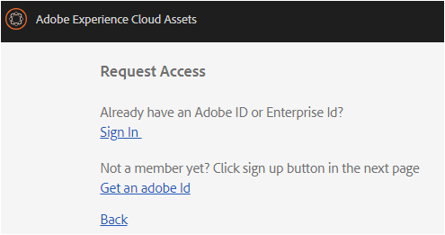

# AEM Assets Brand Portal の概要 {#overview-of-aem-assets-brand-portal}

マーケティング担当者として、チャネルパートナーや社内ビジネスユーザーと協力して、関連するデジタルコンテンツを迅速に作成、管理および配信することが必要になることがあります。関連するコンテンツをカスタマージャーニー全体にわたってタイミングよく配信することは、顧客のニーズやコンバージョン、エンゲージメント、ロイヤリティを促進するために不可欠です。

しかし問題は、広範囲に広がる内部チームやパートナー、リセラーとの間でブランドロゴやガイドライン、キャンペーンアセット、製品の写真を効率的かつ安全に共有できるソリューションを構築するのは容易ではないということです。

**[!DNL Adobe Experience Manager (AEM) Assets Brand Portal]** では、承認されたクリエイティブアセットを容易に取得、制御し、それらのアセットを、様々なデバイスをまたいで、外部の関係者や内部のビジネスユーザーに安全に配布できます。アセットの共有を効率化し、アセットの市場投入時間を短縮し、コンプライアンス違反や不正アクセスのリスクを低減できます。

ブラウザーベースのポータル環境を使用すると、承認された形式でアセットを簡単にアップロード、参照、検索、プレビューおよび書き出すことができます。

## ブランドポータルのユーザーの役割 {#Personas}

[!DNL Brand Portal] 次のユーザーロールをサポートします。

* ゲストユーザー
* 閲覧者
* エディター
* 管理者

次の表に、これらの役割を持つユーザーが実行できるタスクを示します。

|  | **参照** | **検索** | **ダウンロード** | **フォルダーの共有** | **コレクションの共有** | **アセットをリンクとして共有** | **管理ツールにアクセス** |
|--- |--- |--- |--- |--- |--- |--- |--- |
| **ゲストユーザー** | ✓* | ✓* | ✓* | x | x | x | x |
| **閲覧者** | ✓ | ✓ | ✓ | x | x | x | x |
| **エディター** | ✓ | ✓ | ✓ | ✓ | ✓ | ✓ | x |
| **管理者** | ✓ | ✓ | ✓ | ✓ | ✓ | ✓ | ✓ |

* ゲストユーザーは、公開フォルダーおよび公開コレクション内にあるアセットのみを参照、アクセス、および検索できます。

### ゲストユーザー {#guest-user}

Any user having limited access to assets on [!DNL Brand Portal] without undergoing authentication is a guest user. ゲストセッションでは、ユーザーは公開フォルダーやコレクションにアクセスできます。ユーザーは、アセットの詳細を参照し、公開フォルダーとコレクションのメンバーのアセットビューを完全に表示できます。You can search, download, and add public assets to [!UICONTROL lightbox collection].

ただし、ゲストセッションでは、コレクションや保存済みの検索結果を作成したり、それらを共有したりすることはできません。ゲストセッション中のユーザーはフォルダーやコレクションの設定にアクセスしたり、アセットを リンク. 以下に、ゲストユーザーが実行できるタスクのリストを示します。

[公開アセットの参照および公開アセットへのアクセス](browse-assets-brand-portal.md)

[公開アセットの検索](brand-portal-searching.md)

[公開アセットのダウンロード](brand-portal-download-users.md)

[アセットを[!UACROLライトボックス]](brand-portal-light-box.md#add-assets-to-lightbox)

### 閲覧者 {#viewer}

A standard user in [!DNL Brand Portal] is typically a user with the role of Viewer. この役割を持つユーザーは、承認されたフォルダー、コレクションおよびアセットにアクセスできます。また、アセット（元のアセットまたは特定のレンディション）を参照、プレビュー、ダウンロードおよび書き出したり、アカウント設定を指定したり、アセットを検索したりすることもできます。次に、閲覧者が実行できるタスクの一覧を示します。

[アセットの参照](browse-assets-brand-portal.md)

[アセットの検索](brand-portal-searching.md)

[アセットのダウンロード](brand-portal-download-users.md)

### エディター {#editor}

エディターの役割を持つユーザーは、閲覧者が実行できるタスクをすべて実行できます。さらに、管理者によって共有されたファイルとフォルダーを表示できます。コンテンツ（ファイル、フォルダー、コレクション）を他のユーザーと共有することもできます。

エディターは、閲覧者が実行できるタスクに加えて、次のタスクを実行できます。

[フォルダーの共有](brand-portal-sharing-folders.md)

[コレクションの共有](brand-portal-share-collection.md)

[アセットをリンクとして共有](brand-portal-link-share.md)

### 管理者 {#administrator}

An administrator includes a user marked as system administrator or [!DNL Brand Portal] product administrator in [!UICONTROL Admin Console]. 管理者は、システム管理者とユーザーを追加／削除したり、プリセットを定義したりできます。また、ユーザーに電子メールを送信したり、ポータルの使用状況とストレージに関するレポートを表示したりできます。

管理者は、エディターが実行できるすべてのタスクに加えて、次のタスクを実行できます。

[ユーザー、グループおよびユーザーの役割の管理](brand-portal-adding-users.md)

[壁紙、ページヘッダーおよび電子メールのカスタマイズ](brand-portal-branding.md)

[カスタム検索ファセットの使用](brand-portal-search-facets.md)

[メタデータスキーマフォームの使用](brand-portal-metadata-schemas.md)

[画像プリセットまたは動的レンディションの適用](brand-portal-image-presets.md)

[レポートの操作](brand-portal-reports.md)

In addition to the above tasks, an Author in [!DNL AEM Assets] can perform the following tasks:

[[!DNL AEM Assets]との統合DNLブランドポータル]](https://helpx.adobe.com/experience-manager/6-5/assets/using/brand-portal-configuring-integration.html)

[フォルダを[!DNLブランドポータル]](https://helpx.adobe.com/experience-manager/6-5/assets/using/brand-portal-publish-folder.html)

[コレクションを[!DNLブランドポータル]](https://helpx.adobe.com/experience-manager/6-5/assets/using/brand-portal-publish-collection.html)

## ブランドポータルURLの代替エイリアス {#tenant-alias-for-portal-url}

[!DNL Brand Portal] 6.4.3以降では、組織に [!DNL Brand Portal] は、テナントの既存のURLの代替（エイリアス） URLを1つ含めることができます。エイリアスURLは、URLに代替プレフィックスを付けることで作成できます。\
Note that only the prefix of the [!DNL Brand Portal] URL can be customized and not the entire URL. For example, an organization with existing domain **[!UICONTROL geomettrix.brand-portal.adobe.com]** can get **[!UICONTROL geomettrixinc.brand-portal.adobe.com]** created on request.

However, **[!DNL AEM] Author instance can be [configured](https://helpx.adobe.com/experience-manager/6-5/assets/using/brand-portal-configuring-integration.html) only with the tenant id URL and not with tenant alias (alternate) URL.

>[!NOTE]
>
>To get an alias for tenant name in existing portal URL, organizations need to contact **[!DNL Adobe support] with a new tenant alias creation request. この依頼が処理される際は、まずそのエイリアスが使用可能かどうかの確認がおこなわれ、その後でエイリアスが作成されます。
>
>古いエイリアスを置き換えたり、古いエイリアスを削除するには、同じ手続きに従う必要があります。

## Brand Portal へのアクセス権の申請 {#request-access-to-brand-portal}

Users can request access to [!DNL Brand Portal] from the login screen. These requests are sent to [!DNL Brand Portal] administrators, who grant access to users through the Adobe Admin Console. アクセス権が付与されると、ユーザーに通知電子メールが届きます。

アクセス権を申請するには、以下の手順を実行します。

1. [!DNL Brand Portal] ログインページから **、「** アクセス **が必要ですか?** です。However, to enter the guest session, select the **Click here** corresponding to **Guest Access?**.

   

   **アクセスを申請**&#x200B;ページが開きます。

2. To be able to request access to an organization’s [!DNL Brand Portal], you must have a valid [!UICONTROL Adobe ID], [!UICONTROL Enterprise ID], or [!UICONTROL Federated ID].

   **リクエストアクセス** ページで、ID（シナリオ1）を使用してサインインするか [!UICONTROL 、Adobe ID] （シナリオ2）を作成します。
   

   **シナリオ1**
   1. [!UICONTROL Adobe ID]、 [!UICONTROL Enterprise ID]または [!UICONTROL Federated ID]を持っている場合は、 **「サインイン**」をクリックします。
**「サインイン** 」ページが開きます。
   2. [!UICONTROL Adobe ID] 資格情報を入力し、 **「サインイン**」をクリックします。
      
   **リクエストアクセス** ページにリダイレクトされます。
   **シナリオ2**
   1. [!UICONTROL Adobe ID]を持っていない場合は、「リクエストアクセス」ページから「 **Adobe ID** を取得」 **をクリック** します。
**「サインイン** 」ページが開きます。
   2. Click **Get an Adobe ID**.
**入会** ページが開きます。
   3. 姓と名、電子メールID、パスワードを入力します。**「サインアップ**」をクリックします。
      
   **リクエストアクセス** ページにリダイレクトされます。

3. 次のページには、アクセスのリクエストに使用する名前と電子メールIDが表示されます。管理者のコメントは空欄のまま、「**送信**」をクリックします。

   

## 製品管理者がアクセス権を付与 {#grant-access-to-brand-portal}

[!DNL Brand Portal] 製品管理者は [!DNL Brand Portal] 、通知領域内および受信者のインボックスにある電子メールにアクセスできます。

アクセス権を付与するには、製品管理者が通知領域で [!DNL Brand Portal] 関連する通知をクリックし、「アクセス権を付与」をクリック ****します。
Alternatively, product administrators can follow the link provided in the access request email to visit [!DNL Adobe Admin Console] and add the user to the relevant product configuration.

[[!DNL Adobe Admin Console]](https://adminconsole.adobe.com/enterprise/overview) ホームページ。[!DNL Adobe Admin Console] ユーザーを作成し、それらを製品プロファイル（以前の製品設定）に割り当て、グループとして表示 [!DNL Brand Portal]します。For more information about adding users in [!DNL Admin Console], see [Add a user](brand-portal-adding-users.md#add-a-user) (follow Steps 4-7 in the procedure to add a user).

## Brand Portal のメンテナンス通知 {#brand-portal-maintenance-notification}

Before [!DNL Brand Portal] is scheduled to go down for maintenance, a notification is displayed as a banner after you log in to [!DNL Brand Portal]. 以下に通知の例を示します。

You can dismiss this notification and continue using [!DNL Brand Portal]. この通知は、新しいセッションごとに表示されます。

## リリースおよびシステム情報 {#release-and-system-information}

<!--* [What's new](../using/whats-new.md)-->
* [リリースノート](brand-portal-release-notes.md)
* [サポートされているファイル形式](brand-portal-supported-formats.md)

## 関連リソース {#related-resources}

* [アドビカスタマーケア](https://helpx.adobe.com/marketing-cloud/contact-support.html)
* [AEM フォーラム](https://www.adobe.com/go/aod_forums_en)