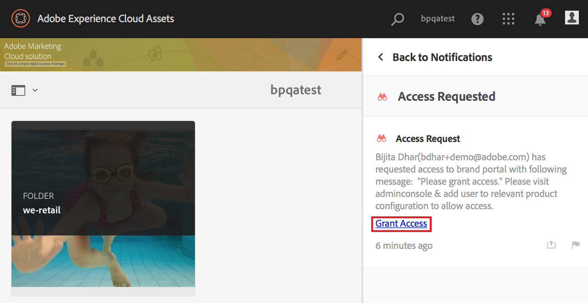

# AEM Assets Brand Portal の概要 {#overview-of-aem-assets-brand-portal}

マーケターは、関連するデジタルコンテンツの作成、管理および顧客への配信をすばやくおこなうために、チャネルパートナーや内部のビジネスユーザーとの共同作業を必要とする場合があります。関連するコンテンツをカスタマージャーニー全体にわたってタイミングよく配信することは、顧客のニーズやコンバージョン、エンゲージメント、ロイヤリティを促進するために不可欠です。

しかし問題は、広範囲に広がる内部チームやパートナー、リセラーとの間でブランドロゴやガイドライン、キャンペーンアセット、製品の写真を効率的かつ安全に共有できるソリューションを構築するのは容易ではないということです。

**Adobe Experience Manager（AEM）Assets Brand Portal では、承認されたクリエイティブアセットを容易に取得、制御し、それらのアセットを、様々なデバイスをまたいで、外部の関係者や内部のビジネスユーザーに安全に配布できます。**&#x200B;アセットの共有を効率化し、アセットの市場投入までの時間を短縮し、コンプライアンス違反や不正アクセスのリスクを低減できます。

ブラウザーベースのポータル環境では、アセットを簡単にアップロード、参照、検索、プレビュー、承認された形式で書き出すことができます。

## Brand Portal でのユーザーのペルソナ {#Personas}

Brand Portal supports the following user roles:

* ゲストユーザー
* 閲覧者
* エディター
* 管理者

次の表に、これらの役割を持つユーザーが実行できるタスクを示します。

|  | **参照** | **検索** | **ダウンロード** | **フォルダーの共有** | **コレクションの共有** | **アセットをリンクとして共有** | **管理ツールにアクセス** |
|--- |--- |--- |--- |--- |--- |--- |--- |
| **ゲストユーザー** | ✓* | ✓* | ✓* | x | x | x | x |
| **閲覧者** | ✓ | ✓ | ✓ | x | x | x | x |
| **エディター** | ✓ | ✓ | ✓ | ✓ | ✓ | ✓ | x |
| **管理者** | ✓ | ✓ | ✓ | ✓ | ✓ | ✓ | ✓ |

* ゲストユーザーは、公開フォルダーおよび公開コレクション内にあるアセットのみを参照、アクセス、および検索できます。

### ゲストユーザー {#guest-user}

認証なしで Brand Portal 上のアセットに対する制限付きのアクセス権を持つユーザーはすべてゲストユーザーです。ゲストセッションは、ユーザーに対し、公開フォルダーおよび公開コレクションへのアクセスを許可します。ゲストユーザーは、アセットの詳細を参照したり、公開フォルダーおよび公開コレクションのメンバーのアセットの完全なアセット表示をおこなったりできます。You can search, download, and add public assets to [!UICONTROL Lightbox] collection.

ただし、ゲストセッションでは、コレクションや保存済みの検索結果を作成したり、それらを共有したりすることはできません。ゲストセッション中のユーザーはフォルダーやコレクションの設定にアクセスしたり、アセットをリンクとして共有したりすることはできません。次に、ゲストユーザーが実行できるタスクの一覧を示します。

[公開アセットの参照および公開アセットへのアクセス](browse-assets-brand-portal.md)

[公開アセットの検索](brand-portal-searching.md)

[公開アセットのダウンロード](brand-portal-download-users.md)

[[!UICONTROL Lightbox]にアセットを追加](brand-portal-light-box.md#add-assets-to-lightbox)

### 閲覧者 {#viewer}

Brand Portal の標準ユーザーは一般的に、閲覧者の役割を持ちます。この役割を持つユーザーは、承認されたフォルダー、コレクションおよびアセットにアクセスできます。また、アセット（元のアセットまたは特定のレンディション）を参照、プレビュー、ダウンロードおよび書き出したり、アカウント設定を指定したり、アセットを検索したりすることもできます。次に、閲覧者が実行できるタスクの一覧を示します。

[アセットの参照](browse-assets-brand-portal.md)

[アセットの検索](brand-portal-searching.md)

[アセットのダウンロード](brand-portal-download-users.md)

### エディター {#editor}

エディターの役割を持つユーザーは、閲覧者が実行できるタスクをすべて実行できます。さらに、管理者によって共有されたファイルとフォルダーを表示できます。コンテンツ（ファイル、フォルダー、コレクション）を他のユーザーと共有することもできます。

エディターは、閲覧者が実行できるタスクに加えて、次のタスクを実行できます。

[フォルダーの共有](brand-portal-sharing-folders.md)

[コレクションの共有](brand-portal-share-collection.md)

[アセットをリンクとして共有](brand-portal-link-share.md)

### 管理者 {#administrator}

An administrator includes a user marked as system administrator or Brand Portal product administrator in [!UICONTROL Admin Console]. 管理者は、システム管理者とユーザーを追加／削除したり、プリセットを定義したりできます。また、ユーザーに電子メールを送信したり、ポータルの使用状況とストレージに関するレポートを表示したりできます。

管理者は、エディターが実行できる次の追加のタスクをすべて実行できます。

[ユーザー、グループ、ユーザーの役割の管理](brand-portal-adding-users.md)

[壁紙、ページヘッダーおよび電子メールのカスタマイズ](brand-portal-branding.md)

[カスタム検索ファセットの使用](brand-portal-search-facets.md)

[メタデータスキーマフォームの使用](brand-portal-metadata-schemas.md)

[画像プリセットまたは動的レンディションの適用](brand-portal-image-presets.md)

[レポートの操作](brand-portal-reports.md)

AEM Assets の作成者は、上記のタスクに加えて、次のタスクを実行できます。

[AEM Assets と Brand Portal の統合の設定](https://helpx.adobe.com/experience-manager/6-5/assets/using/brand-portal-configuring-integration.html)

[Brand Portal へのフォルダーの公開](https://helpx.adobe.com/experience-manager/6-5/assets/using/brand-portal-publish-folder.html)

[Brand Portal へのコレクションの公開](https://helpx.adobe.com/experience-manager/6-5/assets/using/brand-portal-publish-collection.html)

## Brand Portal URL の代替エイリアス {#tenant-alias-for-portal-url}

Brand Portal 6.4.3以降では、組織はBrand portalテナントの既存のURLに対して1つの代替（エイリアス）URLを持つことができます。 エイリアス URL を作成するには、既存の URL に代替プレフィックスを含めます。\
カスタマイズできるのは Brand Portal URL のプレフィックスのみであり、URL 全体でないことに注意してください。例えば、**[!UICONTROL geomettrix.brand-portal.adobe.com]** という既存ドメインを持つ組織は、アドビに依頼することで **[!UICONTROL geomettrixinc.brand-portal.adobe.com]** という URL を作成できます。

ただし、AEM オーサーインスタンスを[設定](https://helpx.adobe.com/experience-manager/6-5/assets/using/brand-portal-configuring-integration.html)する際にはテナント ID URL のみを使用できます。テナントエイリアス（代替）URL は使用できません。

>[!NOTE]
>
>既存のポータル URL 中のテナント名のエイリアスを取得するには、各組織からアドビサポートへ新規テナント名の作成依頼を出す必要があります。このリクエストが処理される際は、まずそのエイリアスが使用可能かどうかの確認がおこなわれ、その後でエイリアスが作成されます。
>
>古いエイリアスを置き換えたり、古いエイリアスを削除するには、同じ手続きに従う必要があります。

## Brand Portal へのアクセス権の申請 {#request-access-to-brand-portal}

ユーザーは、Brand Portal へのアクセス権をログイン画面から申請できます。These requests are sent to Brand Portal administrators, who grant access to users through the Adobe [!UICONTROL Admin Console]. アクセス権が付与されると、ユーザーに通知電子メールが届きます。

アクセス権を申請するには、以下の手順を実行します。

1. From the Brand Portal login page, select **[!UICONTROL Click here]** corresponding to **[!UICONTROL Need Access?]** が表示されるまでカーソルを行の左側に移動して、行を選択します。However, to enter the guest session, select the **[!UICONTROL Click here]** corresponding to **[!UICONTROL Guest Access?]**.

   

   [!UICONTROL アクセスを申請]ページが開きます。

2. To request access to an organization’s Brand Portal, you must have a valid [!UICONTROL Adobe ID], [!UICONTROL Enterprise ID], or [!UICONTROL Federated ID].

   [!UICONTROL アクセスを申請]ページで、自分の ID を使用してログインするか（シナリオ 1）、[!UICONTROL Adobe ID] を作成します（シナリオ 2）。
   ![[!UICONTROL アクセスの申請]](assets/bplogin_request_access_2.png)

   **シナリオ 1**
   1. [!UICONTROL Adobe ID、]Enterprise ID [!UICONTROL 、]Federated IDをお持ちの場合は、「サインイン [!UICONTROL 」をクリ]****ックします。
[!UICONTROL ログイン]ページが開きます。
   2. [!UICONTROL Adobe ID資格情報を入力し、] 「サインイン」をク **[!UICONTROL リックします]**。 
   

   [!UICONTROL アクセスを申請]ページにリダイレクトされます。
   **シナリオ 2**
   1. [!UICONTROL Adobe ID] を持っていない場合は、**[!UICONTROL アクセスを申請]ページの「**[!UICONTROL Adobe ID を取得]」をクリックして、Adobe ID を作成します。
[!UICONTROL ログイン]ページが開きます。
   2. Click **[!UICONTROL Get an Adobe ID]**.
[!UICONTROL 新規登録]ページが開きます。
   3. 名前、電子メール ID およびパスワードを入力します。
   4. Select Sign up.**** 
   

   [!UICONTROL アクセスを申請]ページにリダイレクトされます。

3. アクセスの申請に使用する現在のユーザーの名前と電子メール ID が次のページに表示されます。Leave a comment for the administrator, and click **[!UICONTROL Submit]**.

   

## 製品管理者によるアクセス権の付与 {#grant-access-to-brand-portal}

Brand portal製品管理者は、Brand portal通知領域と受信トレイの電子メールを通じてアクセス要求を受け取ります。

To grant access, product administrators need to click the relevant notification in Brand Portal notification area and then click **[!UICONTROL Grant Access]**.
Alternatively, product administrators can follow the link provided in the access request email to visit Adobe [!UICONTROL Admin Console] and add the user to the relevant product configuration.

You are redirected to the [Adobe [!UICONTROL Admin Console]](https://adminconsole.adobe.com/enterprise/overview) home page. Use Adobe [!UICONTROL Admin Console] to create users and assign them to product profiles (formerly known as product configurations), which show as groups in Brand Portal. For more information about adding users in [!UICONTROL Admin Console], see [Add a user](brand-portal-adding-users.md#add-a-user) (follow Steps 4-7 in the procedure to add a user).

## Brand Portal languages {#brand-portal-language}

You can change Brand Portal language from Adobe [!UICONTROL Experience Cloud Settings].

To change the language:

1. Select [!UICONTROL User] &gt; [!UICONTROL Edit Profile] from the top menu.
   

2. On [!UICONTROL Experience Cloud Settings] page, select a language from the [!UICONTROL Language] drop-down menu.

## Brand Portal のメンテナンス通知 {#brand-portal-maintenance-notification}

Brand Portal のメンテナンスのために停止が計画されている場合は、Brand Portal にログインすると、バナー通知が表示されます。以下に通知の例を示します。

この通知を解除すると、Brand Portal を引き続き使用できます。この通知は、新しいセッションのたびに表示されます。

## リリースおよびシステム情報 {#release-and-system-information}

<!--* [What's new](../using/whats-new.md)-->
* [リリースノート](brand-portal-release-notes.md)
* [サポートされているファイル形式](brand-portal-supported-formats.md)

## 関連リソース {#related-resources}

* [アドビカスタマーケア](https://helpx.adobe.com/marketing-cloud/contact-support.html)
* [AEM フォーラム](https://www.adobe.com/go/aod_forums_en)